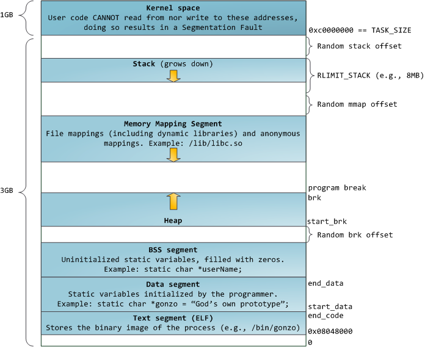

> **windows命令行 (可以不用搭理这里，在Linux玩就行)**
>
> Windows C/C++编译器： https://sourceforge.net/projects/mingw/files/
>
> 
>
> 配置环境变量 PATH: ${MinGW安装目录}/MinGW/bin
>
> 


> c与c++
>
>   `C语言`是一门通用计算机编程语言，广泛应用于`底层开发`。
>
>   `c`语言是`面向过程`的语言，`c++`是`面向对象`的语言，C++对c进行扩展。
>
>   c是c++的子集,c++是c的超集，所以大部分c语言程序都可以不加修改的拿到c++下使用。


# 补充：C 基础知识

1. \#include <\*\*> 和 \#include "\*\*"的区别
   - \#include <\*\*> 引入系统库
   - \#include "\*\*" 引入相对路径的库(自己的库)
2. \#include 和 java import的区别
   - \#include 引用可以继承（子可以使用爷爷的东西，而不用引入爷爷）
# 1、开发工具准备

1. windows下使用 [<font size=5>**VS2017**</font>](http://c.biancheng.net/view/456.html)
   - 
2. mac下使用 `XCode`

# 2、基本数据类型

1. **`signed`**----有符号，可修饰char、int。Int是默认有符号的。
2. **`unsigned`**-----无符号，修饰int 、char
>
>
>
| 整型           | 字节 | 取值范围                        | 占位 |
| :------------- | ---- | ------------------------------- | ---- |
| int            | 4    | -2,147,483,648 到 2,147,483,647 | %d   |
| unsigned int   | 4    | 0 到 4,294,967,295              | %u   |
| short          | 2    | -32,768 到 32,767               | %hd  |
| unsigned short | 2    | 0 到 65,535                     | %hu  |
| long           | 4    | -2,147,483,648 到 2,147,483,647 | %ld  |
| unsigned long  | 4    | 0 到 4,294,967,295              | %lu  |
| char           | 1    | -128 到 127                     | %c   |
| unsigned char  | 1    | 0 到 255                        | %c   |

> 为了得到某个类型或某个变量在特定平台上的准确大小，使用 `sizeof` 运算符。
>
> 表达式 `sizeof(type)` 得到对象或类型的存储字节大小。

long int 其实就是长整型 = long 可以省去int  
在标准中,规定 int至少和short一样长，long至少和int一样长。

> 为什么会存在long?
>
> long和int在早期16位电脑时候 int 2字节，long 4字节，而计算机发展到现在，一般32、64下，long和int一样。和java类比的话，java的long就是 long long 8字节

> 格式化还有：
- 8进制　　　　　`%o`
- 16进制　　　　小写： `%x`    大写：`%X`
- (0x)+16进制前面　　　`%#x`


| 浮点型      | 字节 | 精度     | 占位 |
| ----------- | ---- | -------- | ---- |
| float       | 4    | 6位小数  | %f   |
| double      | 8    | 15位小数 | %lf  |
| long double | 8    | 19位小数 | %Lf  |


C99标准以前，C语言里面是没有bool，C++里面才有，  
`C99标准`里面定义了bool类型，需要引入头文件`stdbool.h`  
bool类型有只有两个值：true =1 、false=0。  
因此实际上bool就是一个int  
所以在c/c++中 `if 遵循一个规则， 非0为true，非空为true；`  
`NULL 其实也就是被define为了 0`


# 3、格式化

引入：#include <stdio.h>

1. printf
2. sprintf：`将格式化的数据写入第一个参数`
    ```c
    char str[100];
    sprintf(str, "img/png_%d.png", 1);
    printf("%s", str); // img/png_1.png
    
    //使用 0 补到3个字符
    sprintf(str, "img/png_%03d.png", 1);
    printf("%s", str); // img/png_001.png
    ```


# 4、数组与内存布局

## 4.1、数组  ： 连续的内存  `在栈中`

```c
//java
int[] a

//c
//必须声明时候确定大小
int a[10]  
//或者 直接初始化 
int a[] = {1,2,3}

//大小
printf("%d",sizeof(a)/sizeof(int));
```

> 栈内存限制  `linux下使用命令：ulimit -a/-S` 查看  
> 但是直接分配这么大不行，因为堆栈可能保存参数，返回地址等等信息


## 4.2、动态内存申请
1. **malloc**
   - 没有初始化内存的内容,一般调用函数`memset`来初始化这部分的内存空间.
   ```
   //当数据无法确定 或者 比较庞大 需要使用动态内存申请 在堆中
   int *di1 = (int*)malloc(1 * 1024 * 1024);
   //动态申请内存应该紧跟 memset 初始化内存
   memset(di1, 0, 1 * 1024 * 1024);
   ...
   //一定要free 并养成好习惯 将指针置为 null
   //标准写法为：
   if (di1) {
       free(di1);
       di1 = 0; // NULL 也是 0定义的
   }
   ```
2. **calloc**
   - 申请内存并将初始化内存数据为NULL.（`相当于 malloc + memset`）
   ```
   // 申请内存并将内存初始化为 null 
   int *di2 = (int*)calloc(10, sizeof(int));
   ...
   if (di2) {
      free(di2);
      di2 = 0;
   }
   ```
3. **realloc**
   - 对malloc申请的内存进行大小的调整.
   ```
   char *a = (char*)malloc(10);
   realloc(a,20);
   ...
   if (a) {
      free(a);
      a = 0;
   }   
   ```
4. 特别的：**alloca**
   - 在栈申请内存,因此无需释放.
   ```
   int *p = (int *)alloca(sizeof(int) * 10);
   ```

注意：分配完内存后一定要 <font color=red size=5>free</font> 掉

## 4.3、内存布局
1. **物理内存**
   - 物理内存指通过物理内存条而获得的内存空间
2. **虚拟内存**
   - 一种内存管理技术
   - 电脑中所运行的程序均需经由内存执行，若执行的程序占用内存很大，则会导致内存消耗殆尽。
   - `虚拟内存技术还会匀出一部分硬盘空间来充当内存使用。`

<div align="center">

</div>
>
<div align="center">

</div>


代码段：
存放程序执行代码（cpu要执行的指令）

> `栈是向低地址扩展数据结构`  
> `堆是向高地址扩展数据结构`

进程分配内存主要由两个系统调用完成：**`brk`和`mmap`** 。

1. brk：将_edata(指带堆位置的指针)往高地址推；
2. mmap：找一块空闲的虚拟内存。


通过glibc (C标准库)中提供的malloc函数完成内存申请

malloc小于128k的内存，使用brk分配内存，将_edata往高地址推,大于128k则使用mmap

<div align="center">

</div>

