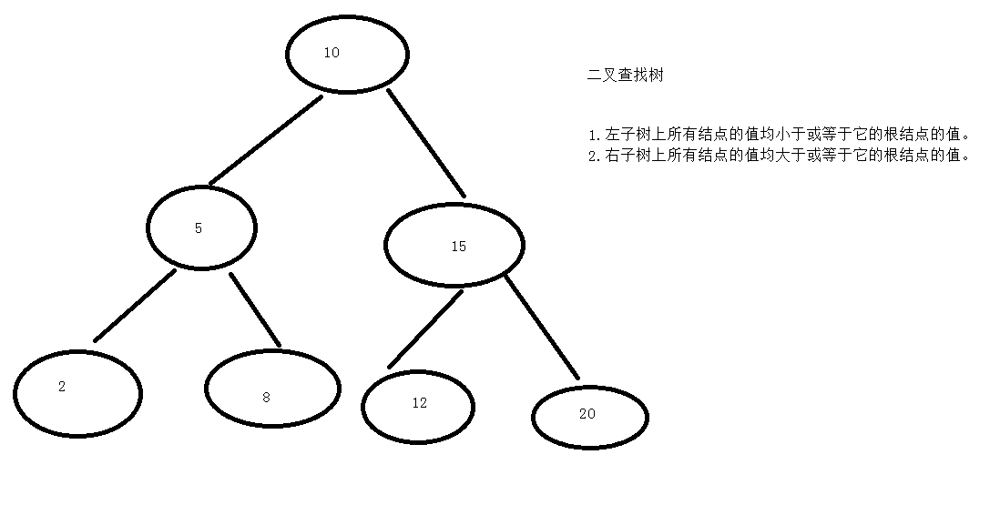
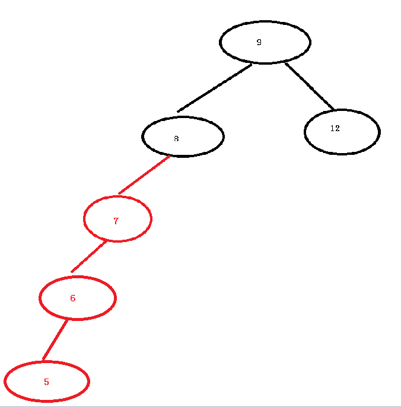
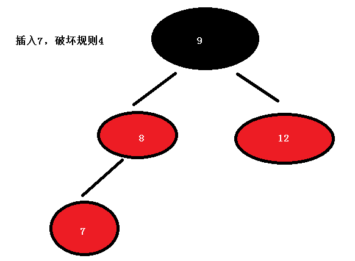
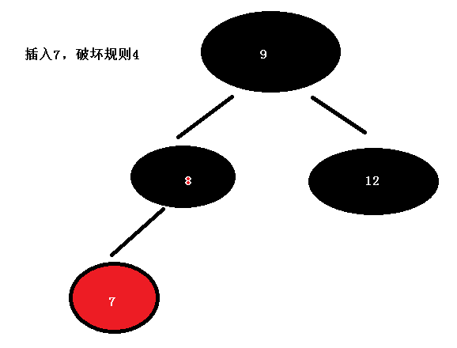
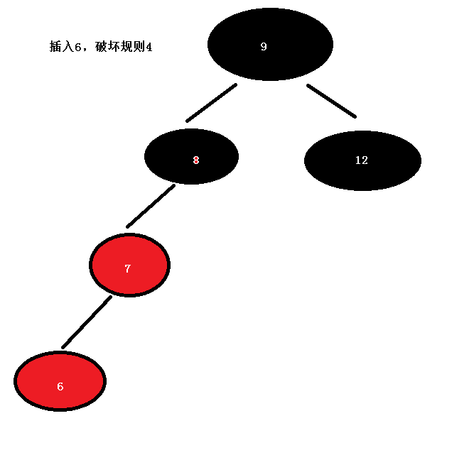
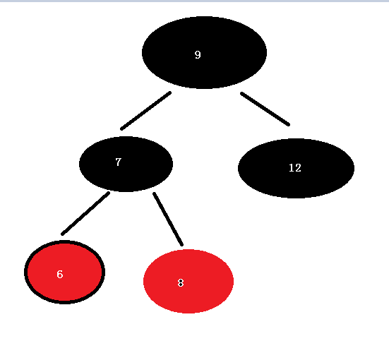
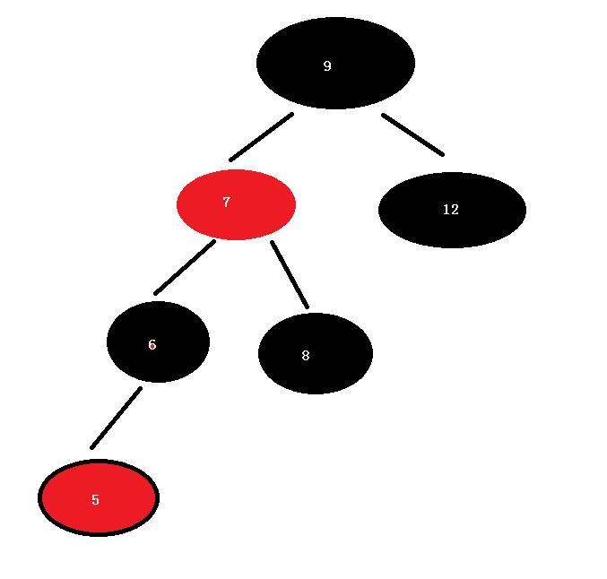

# 1、容器

> 容器，就是用来存放东西的盒子。
>
> 常用的数据结构包括：数组array,  链表list，  树tree，  栈stack，  队列queue，  散列表hash table,  集合set、映射表map 等等。容器便是容纳这些数据结构的。这些数据结构分为序列式与关联式两种，容器也分为序列式容器和关联式容器。
>
> STL 标准模板库，核心包括容器、算法、迭代器。

## 1.1、序列式容器/顺序容器

> 元素排列次序与元素无关，由元素添加到容器的顺序决定

| 容器           | 说明                                             |
| -------------- | ------------------------------------------------ |
| vector         | 支持快速随机访问                                 |
| list           | 支持快速插入、删除                               |
| deque          | 双端队列  允许两端都可以进行入队和出队操作的队列 |
| stack          | 后进先出LIFO(Last In First Out)堆栈              |
| queue          | 先进先出FIFO(First Input First Output)队列       |
| priority_queue | 有优先级管理的queue                              |

### 向量(vector)

> 连续存储的元素

### 列表 (list)

> 由节点组成的双向链表，每个结点包含着一个元素

### 双端队列(deque)

> 连续存储的指向不同元素的指针所组成的数组

**以上三种容器操作基本一样**

**基本操作:**

```c++
#include <vector>
using namespace std;

vector<int> vec_1;
//1个元素
vector<int> vec_2(1);
//6个值为 1 的元素
vector<int> vec_3(6,1);
//使用容器初始化
vector<int> vec_4(vec_3);

//通过下标操作元素
int i = vec_3[1];
int j = vec_3.at(1);
//首尾元素
vec_3.front()
vec_3.back()

//插入元素 
//vector不支持 push_front list,deque可以
vec_1.push_back(1);
//删除元素 vector不支持 pop_front
vec_1.pop_back();

//释放
//可以单个清除，也可以清除一段区间里的元素
vec_3.erase(vec_3.begin(),vec_3.end())
//清理容器 即erase所有
vec_3.clear(); 

//容量大小
vec_3.capacity();
//在容器中，其内存占用的空间是只增不减的，
//clear释放元素，却不能减小vector占用的内存
//所以可以对vector 收缩到合适的大小 
vector< int >().swap(vec_3);  

//在vec是全局变量时候
//建立临时vector temp对象，swap调用之后对象vec占用的空间就等于默认构造的对象的大小
//temp就具有vec的大小，而temp随即就会被析构，从而其占用的空间也被释放。
```

**迭代器**

```c++
//获得指向首元素的迭代器  模板类，不是指针，当做指针来使用
vector<int>::iterator it = vec.begin();
//遍历元素
for (; it < vec.end(); it++)
{
	cout << *it << endl;
}
//begin和end   分别获得 指向容器第一个元素和最后一个元素下一个位置的迭代器
//rbegin和rend 分别获得 指向容器最后一个元素和第一个元素前一个位置的迭代器

//注意循环中操作元素对迭代器的影响
vector<int>::iterator it = vec.begin();
for (; it < vec.end(); )
{
    //删除值为2的元素 
	if (*it == 2) {
		it=vec.erase(it); // it= 在vs上必须写 在as和xcode上可以不用写
	}
	else {
		it++;
	}
}
```

### 栈(stack)

> 后进先出的值的排列

```c++
stack<int> s;
//入栈
s.push(1);
s.push(2);
//弹栈
s.pop();
//栈顶
cout << s.top() << endl;
```

### 队列(queue)

> 先进先出的值的排列

```c++
queue<int> q;
q.push(1);
q.push(2);
//移除最后一个
q.pop();
//获得第一个
q.front();
//最后一个元素
cout << q.back() << endl;
```

### 优先队列(priority_queue )

> 元素的次序是由所存储的数据的某个值排列的一种队列

```c++
//最大的在队首
priority_queue<int>;
//在vector之上实现的
priority_queue<int, vector<int>, less<int> >; 
//vector 承载底层数据结构堆的容器
//less 表示数字大的优先级高，而 greater 表示数字小的优先级高
//less  	 让优先队列总是把最大的元素放在队首
//greater    让优先队列总是把最小的元素放在队首

//less和greater都是一个模板结构体 也可以自定义

class Student {
public:
	int grade;
	Student(int grade):grade(grade) {
	}
};
struct cmp {
	bool operator ()(Student* s1, Student* s2) {
        // > 从小到大
        // < 从大到小 
		return s1->grade > s2->grade;
	}
	bool operator ()(Student s1, Student s2) {
		return s1.grade > s2.grade;
	}
};
priority_queue<Student*, vector<Student*>, cmp > q1;
q1.push(new Student(2));
q1.push(new Student(1));
q1.push(new Student(3));
cout << q1.top()->grade << endl;
```

## 1.2、关联式容器

> 关联容器和大部分顺序容器操作一致
>
> 关联容器中的元素是按关键字来保存和访问的 支持高效的关键字查找与访问

### 集合(set)

> 由节点组成的红黑树，每个节点都包含着一个元素,元素不可重复

```c++
set<string> a;  
set<string> a1={"fengxin","666"};
a.insert("fengxin");  // 插入一个元素
a.erase("123");	//删除
```

### 键值对(map)

> 由{键，值}对组成的集合

```c++
map<int, string> m;
map<int, string> m1 = { { 1,"Lance" },{ 2,"David" } };
//插入元素
m1.insert({ 3,"Jett" });
//pair=键值对
pair<int, string> p(4, "dongnao");
m1.insert(p);
//insetrt 返回 map<int, string>::iterator : bool 键值对
//如果 插入已经存在的 key，则会插入失败   
//multimap：允许重复key
//使用m1[3] = "xx" 能够覆盖


//通过【key】操作元素
m1[5] = "yihan";
cout << m1[5].c_str() << endl; 
//通过key查找元素
map<int, string>::iterator it = m1.find(3);
cout << (*it).second.c_str()<< endl;
// 删除 
m1.erase(5);
//遍历
for (it = m1.begin(); it != m1.end(); it++)
{
	pair<int, string> item = *it;
	cout << item.first << ":" << item.second.c_str() << endl;
}

//其他map================================

```

> unordered_map c++11取代hash_map（哈希表实现，无序）
>
> 哈希表实现查找速度会比RB树实现快,但rb整体更节省内存
>
> 需要无序容器，高频快速查找删除，数据量较大用unordered_map；
>
> 需要有序容器，查找删除频率稳定，在意内存时用map。


### 红黑树


> 二叉树



> 二分查找：
>
> 查找 2 ：
>
> 1、查看根节点为10
>
> 2、由于2小于10，因此查找左孩子，节点为5
>
> 3、同时2小与5，继续查看左边，找到2节点
>
> 查找最大次数为树的高度

> 如果有下面的二叉查找树，插入7、6、5......
>
> 这样几乎成为线性，查找性能大幅下降




> 为了解决这种不平衡，红黑树就诞生了。
>
> https://zh.wikipedia.org/wiki/%E7%BA%A2%E9%BB%91%E6%A0%91
>
> 红黑树(Red Black Tree)又称为 RB树,是一种相对平衡二叉树 。
>
> 1.节点是红色或黑色。
>
> 2.根节点是黑色。
>
> 3.每个叶子节点(空节点)都是黑色的。
>
> 4 每个红色节点的两个子节点都是黑色。(从每个叶子到根的所有路径上不能有两个连续的红色节点)
>
> 5.从任一节点到其每个叶子的所有路径都包含相同数目的黑色节点。




> 1. 插入新节点总是红色节点
> 2. 如果插入节点的父节点是黑色, 能维持性质
> 3. 如果插入节点的父节点是红色, 破坏了性质。插入算法就是通过重新着色或旋转, 来维持性质

> 插入 7 后,破坏了规则，那么需要根据不同的状况进行不同的策略使其平衡并符合规则。
>
> 7的父节点8 与叔父节点 12 都是红色，则我们可以将8、12两个重绘为黑色并重绘祖父节点9为红色。
>
> 这里9是根节点，为了满足规则1，又把它重绘为黑色 .
>
> 经过调整：



> 现在满足5个规则，因此7插入完成。
>
> 接下来插入 6



> 现在新节点 6 是 父节点 7的左节点，而6的叔父节点 缺少，父节点 7 又是祖父节点8的左子节点 ，
>
> 这种情形下，我们进行针对6节点的祖父节点8的一次右旋转
>
> 右旋转：
>
> 顺时针旋转红黑树的两个节点，使得父节点被自己的左孩子取代，而自己成为自己的右孩子。
>
> 左旋转则倒过来


> 再切换 7 和 8 的颜色



> 再插入5，5和6都是红色，将 父节点 6 和叔父节点 8 绘为黑色，祖父7设为红色，最终




# 2、类型转换

>除了能使用c语言的强制类型转换外,还有：转换操作符 （新式转换）

## const_cast

>修改类型的const或volatile属性

```c++
const char *a;
char *b = const_cast<char*>(a);
	
char *a;
const char *b = const_cast<const char*>(a);
```

## static_cast

>1. 基础类型之间互转。如：float转成int、int转成unsigned int等
>2. 指针与void之间互转。如：float\*转成void\*、Bean\*转成void\*、函数指针转成void\*等
>3. 子类指针/引用与 父类指针/引用 转换。

```c++
class Parent {
public:
	void test() {
		cout << "p" << endl;
	}
};
class Child :public Parent{
public:
	 void test() {
		cout << "c" << endl;
	}
};
Parent  *p = new Parent;
Child  *c = static_cast<Child*>(p);
//输出c
c->test();

//Parent test加上 virtual 输出 p
```

## dynamic_cast

> 主要 将基类指针、引用 安全地转为派生类.
>
> 在运行期对可疑的转型操作进行安全检查，仅对多态有效

```c++
//基类至少有一个虚函数
//对指针转换失败的得到NULL，对引用失败  抛出bad_cast异常 
Parent  *p = new Parent;
Child  *c = dynamic_cast<Child*>(p);
if (!c) {
	cout << "转换失败" << endl;
}


Parent  *p = new Child;
Child  *c = dynamic_cast<Child*>(p);
if (c) {
	cout << "转换成功" << endl;
}
```

## reinterpret_cast

> 对指针、引用进行原始转换

```c++
float i = 10;

//&i float指针，指向一个地址，转换为int类型，j就是这个地址
int j = reinterpret_cast<int>(&i);
cout  << hex << &i << endl;
cout  << hex  << j << endl;

cout<<hex<<i<<endl; //输出十六进制数
cout<<oct<<i<<endl; //输出八进制数
cout<<dec<<i<<endl; //输出十进制数
```

## char*与int转换

```c++
//char* 转int float
int i = atoi("1");
float f = atof("1.1f");
cout << i << endl;
cout << f << endl;
	
//int 转 char*
char c[10];
//10进制
itoa(100, c,10);
cout << c << endl;

//int 转 char*
char c1[10];
sprintf(c1, "%d", 100);
cout << c1 << endl;
```


# 3、异常

```c++
void test1()
{
	throw "测试!";
}

void test2()
{
	throw exception("测试");
}

try {
	test1();
}
catch (const char *m) {
	cout << m << endl;
}
try {
	test2();
}
catch (exception  &e) {
	cout << e.what() << endl;
}

//自定义
class MyException : public exception
{
public:
   virtual char const* what() const
    {
        return "myexception";
    }
};

//随便抛出一个对象都可以
```


# 4、文件与流操作

> C 语言的文件读写操作
>
> 头文件:stdio.h
>
> 函数原型：FILE * fopen(const char * path, const char * mode);
>
> path:  操作的文件路径
>
> mode:模式

| 模式 | 描述                                                         |
| ---- | ------------------------------------------------------------ |
| r    | 打开一个已有的文本文件，允许读取文件。                       |
| w    | 打开一个文本文件，允许写入文件。如果文件不存在，则会创建一个新文件。在这里，您的程序会从文件的开头写入内容。如果文件存在，则该会被截断为零长度，重新写入。 |
| a    | 打开一个文本文件，以追加模式写入文件。如果文件不存在，则会创建一个新文件。在这里，您的程序会在已有的文件内容中追加内容。 |
| r+   | 打开一个文本文件，允许读写文件。                             |
| w+   | 打开一个文本文件，允许读写文件。如果文件已存在，则文件会被截断为零长度，如果文件不存在，则会创建一个新文件。 |
| a+   | 打开一个文本文件，允许读写文件。如果文件不存在，则会创建一个新文件。读取会从文件的开头开始，写入则只能是追加模式。 |

```C++
//========================================================================
FILE *f = fopen("xxxx\\t.txt","w");
//写入单个字符
fputc('a', f);
fclose(f);


FILE *f = fopen("xxxx\\t.txt","w");
char *txt = "123456";
//写入以 null 结尾的字符数组
fputs(txt, f);
//格式化并输出
fprintf(f,"%s",txt);
fclose(f);

//========================================================================
fgetc(f); //读取一个字符

char buff[255];
FILE *f = fopen("xxxx\\t.txt", "r");
//读取 遇到第一个空格字符停止
fscanf(f, "%s", buff);
printf("1: %s\n", buff);

//最大读取 255-1 个字符
fgets(buff, 255, f);
printf("2: %s\n", buff);
fclose(f);

//二进制 I/O 函数
size_t fread(void *ptr, size_t size_of_elements, 
             size_t number_of_elements, FILE *a_file);       
size_t fwrite(const void *ptr, size_t size_of_elements, 
             size_t number_of_elements, FILE *a_file);
//1、写入/读取数据缓存区
//2、每个数据项的大小
//3、多少个数据项
//4、流
//如：图片、视频等以二进制操作:
//写入buffer 有 1024个字节
fwrite(buffer,1024,1,f);
```


> C++ 文件读写操作
>
> \<iostream\> 和 \<fstream\>

| 数据类型 | 描述                                               |
| -------- | -------------------------------------------------- |
| ofstream | 输出文件流，创建文件并向文件写入信息。             |
| ifstream | 输入文件流，从文件读取信息。                       |
| fstream  | 文件流，且同时具有 ofstream 和 ifstream 两种功能。 |

```c++
char data[100];
// 以写模式打开文件
ofstream outfile;
outfile.open("XXX\\f.txt");
cout << "输入你的名字: ";
//cin 接收终端的输入
cin >> data;
// 向文件写入用户输入的数据
outfile << data << endl;
// 关闭打开的文件
outfile.close();

// 以读模式打开文件
ifstream infile;
infile.open("XXX\\f.txt");

cout << "读取文件" << endl;
infile >> data;
cout << data << endl;

// 关闭
infile.close();
```

