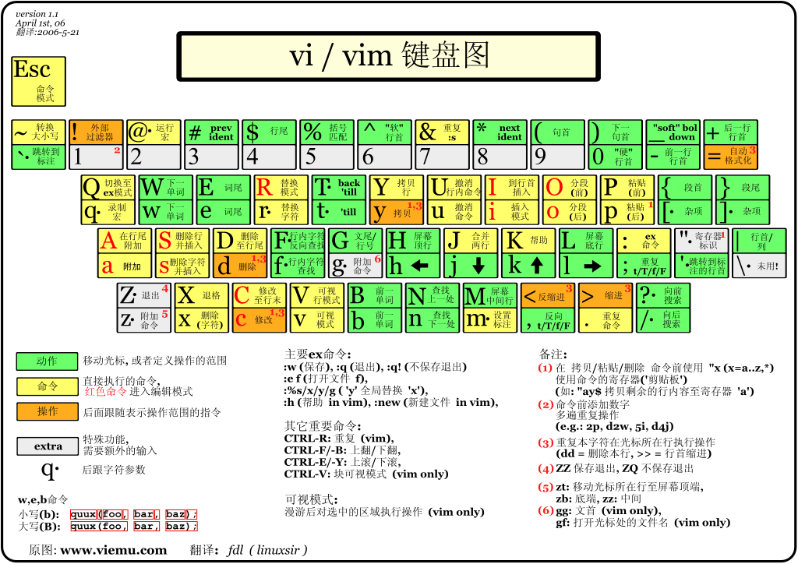

# Linux 文件权限、VIM、防火墙

> [CentOS vs Ubuntu: Which one is better for a server](https://thishosting.rocks/centos-vs-ubuntu-server/)
>
> https://linux.cn/article-8141-1.html


## SSH连接

> 无论是mac还是windows的同学都可以选择下载自己喜欢的远程登陆客户端工具，通过ssh协议连接到远程主机。
>
> 客户端的使用非常方便。但也有很多同学喜欢使用命令行的方式来进行连接(比如我自己)
>
> 使用root登陆1.1.1.1：(默认端口为22)
>
> `ssh root@1.1.1.1`
>
> 也可以使用-p指定 ssh主机配置的端口
>
> ssh -p 222 root@1.1.1.1


## 环境变量

> 和Windows不同，Linux环境变量配置需要使用 `export` 声明。如：
>
> `export PATH=${PATH}:java/bin:android/platform-tools`
>
> 分隔符Linux上是 `:` windows 上是 `;`
>
> 如果直接在终端中输入命令，则设置PATH环境变量的值，但其作用范围仅限于当前会话。即临时环境变量


**profile、bashrc、bash_profile **

> 在Linux中配置环境变量，可以但**不限于**使用上述三个文件。
>
> 首先读入`/etc/profile`，读取当前用户目录内的`~/.bash_profile`;最后，根据用户帐号读取`~/.bashrc`。
>
> `/etc/` 是系统全局环境变量设定;`~/`是用户私有环境变量设定。
>
> 在修改配置文件后，可使用`source /etc/profile`刷新。


## 权限

> Linux系统从诞生就被设计为多用户系统，不同的用户处于不同的地位，拥有不同的权限。为了保护系统安全，Linux系统对不同的用户访问同一文件的权限做了不同的规定。

```shell
#在Linux中可以通过 `ls -l`  显示文件的属性以及文件所属的用户和组
total 1063044

drwxrwxr-x 13 root       root            4096 Jun  7 16:12 android-ndk-r17b
-rw-r--r--  1 root       root       709381607 Jun 13 03:20 android-ndk-r17b-linux-x86_64.zip
-rw-r--r--  1 root       root         8799579 Feb 25 05:35 apache-maven-3.5.3-bin.tar.gz
drwxr-xr-x  9 root       root            4096 Aug 15 17:58 apache-tomcat-8.5.32
-rw-r--r--  1 root       root         9584807 Jun 21 04:26 apache-tomcat-8.5.32.tar.gz
-rw-r--r--  1 root       root             693 Jul 22 14:22 build.sh
-rwxr-xr-x  1 root       root           62299 Aug 24 07:35 certbot-auto
drwxr-xr-x  3 root       root            4096 Jun  6 21:29 down
drwxr-xr-x  3 root       root            4096 Jun  4 17:59 downfile
-rw-r--r--  1 root       root         2703579 Aug 15 17:19 dubbo-2.6.2.zip
-rw-r--r--  1 root       root        32099475 Aug 15 17:34 dubbo-admin-2.6.war
drwxr-xr-x  4 root       root            4096 Aug  6 11:39 ffmpeg
-rw-r--r--  1 root       root       294240052 Oct 25  2014 gitlab_7.4.2-omnibus-1_amd64.deb
drwxr-xr-x  9 root       root            4096 May 27 10:42 hexo-theme-material
```


> 上面的`android-ndk-r17b` 显示的第一列表示文件类型与权限。`'d'`在Linux中代表该文件是一个文件目录
>
> 在Linux中第一个字符代表这个文件是目录、文件或者链接等等

| 类型   | 描述                                                         |
| ------ | ------------------------------------------------------------ |
| d      | 目录                                                         |
| -      | 文件                                                         |
| l      | 链接(link file) :ln -s \[raw\]\[out\]                           |
| b      | 块设备(I/O随机存取设备)，如：硬盘                            |
| c      | 字符设备文件( I/O传输过程中以字符为单位进行传输的设备 )，如：鼠标，键盘... |
| ...... | ......                                                       |

> 然后是三个为一组的`rwx`, 其中`r`表示可读，`w` 表示可写， `x`表示可执行


> 对于每个文件来说，它都有一个特定的所有者，也就是对该文件具有所有权的用户。同时在Linux中用户都是按组来进行分类的，一个用户属于一个或多个组。
>
> 文件所有者之外的用户又分为文件所有者的同组用户和其他用户。可以使用以下命令查看当前使用的用户信息：

| 命令          | 说明                           |
| ------------- | ------------------------------ |
| whoami        | 查看当前登陆的用户             |
| groups \[用户\] | 查看指定用户分组，以及组内成员 |
| groups        | 查看当前登陆用户所属的分组     |


### 更改文件所属

```shell
#chgrp : 更改文件属组
#-R 递归更改目录文件
chgrp [-R] 属组名 文件名

-rw-r--r-- 1 root root   53 Aug 15 21:25 main.c

#更改main.c 属于git 组的用户
chgrp git main.c
-rw-r--r-- 1 root git    53 Aug 15 21:25 main.c

################################################################################################

#chown： 更改文件属于的用户与分组
chown [-R] 属组名 文件名
chown [-R] 属主名:属组名 文件名
#修改 main.c 属于 git组的git用户
chown git:git main.c
-rw-r--r-- 1 git  git    53 Aug 15 21:25 main.c
```


### 更改文件权限

> 三组rwx分别代表：所属用户(user)、所属分组(group)、其他(other)
>
> Linux文件权限使用`chmod`能够修改这三组权限。有两种设置方法。一种是数字，一种是符号。

 **使用数字修改权限**

> r 可读：4
>
> w 可写：2
>
> x 可执行 : 1

```shell
#设置文件权限
chmod 177 main.c
#之前使用 chown 将main.c 修改为属于git用户
#此处修改git用户对main.c的权限不可读写
```

**使用符号改变权限**

> 三组rwx可以分别由： u(ser)、g(roup)、o(ther) 来代表，另外a则代表all

```shell
#设置权限为 --x --x --x
chmod u=x,g=rx,o=r main.c
#chmod +x = chmod a+x
# + : 增加权限
# - : 减去权限
```


> chmod +x xx ： 添加执行权限
>
> chmod +r xx  :  添加读取权限
>
> chmod +w xx ：添加可写权限


### su和sudo

> su : 在已登陆的终端(命令行)会话中登陆到另一个用户。即   切换用户。
>
> su \[切换的用户名\]  未输入用户名,默认切换到root用户

```shell
#在上面的操作中已经将main.c设置为对git不可读写
#切换到git用户
su git
#cat 文本输出命令
cat main.c
#输出： 没有权限读取main.c
cat: main.c: Permission denied
```

> su 和 su - 
>
> 两者的区别是，前者只切换了身份，而后者相当于重新登陆。su - 重新登陆后目录切换到用户配置的工作目录。

**su **

```shell
# 切换到/root/test目录
root@iZj6c3nmby8r3jqrqwiommZ:~# cd test/
# 切换到git用户
root@iZj6c3nmby8r3jqrqwiommZ:~/test# su git
$ su 
Password: 
root@iZj6c3nmby8r3jqrqwiommZ:~/test# 
#当前仍然处于/root/test目录
```

**su - **

```shell
# 切换到git用户
root@iZj6c3nmby8r3jqrqwiommZ:~/test# su git
$ su -
Password: 
root@iZj6c3nmby8r3jqrqwiommZ:~# 
#当前处于/root目录
```


> sudo:  用户普通用户使用root权限来执行命令(不切换用户)。即临时提升用户权限为root权限

```shell
sudo cat main.c
#输入当前用户的密码
```


## 包管理器

> 软件包管理系统,用于管理系统中安装的工具。
>
> Mac： brew
>
> Ubuntu： apt
>
> Centos： yum


## VI/VIM

所有的 类 Unix  系统都会自带 vi 文本编辑器，目前我们使用比较多的是 vim 编辑器。

Vim是从 vi 发展出来的一个文本编辑器。 具有程序编辑的能力，可以主动的以字体颜色辨别语法的正确性，方便程序设计。



分为三种模式，分别是**命令模式**，**输入模式**和**底线命令模式**


**命令模式**

用户刚刚启动 vi/vim，便进入了命令模式。

此状态下敲击键盘动作会被Vim识别为命令，而非输入字符。比如我们此时按下i，并不会输入一个字符，i被当作了一个命令。

常用的命令：

- **i** 切换到输入模式，以输入字符。

- **x** 删除当前光标所在处的字符。

- **:** 切换到底线命令模式，以在最底一行输入命令。

  

**输入模式**

在输入模式中，可以使用以下按键：

- `字符按键以及Shift组合`，输入字符

- `ENTER`，回车键，换行

- `BACK SPACE`，退格键，删除光标前一个字符

- `DEL`，删除键，删除光标后一个字符

- `方向键`，在文本中移动光标

- `HOME/END`，移动光标到行首/行尾

- `Page Up/Page Down`，上/下翻页

- `Insert`，切换光标为输入/替换模式，光标将变成竖线/下划线

- `ESC`，退出输入模式，切换到命令模式

  

**底线命令模式**

在`命令模式`下按下:（英文冒号）就进入了底线命令模式。

- `q` 退出程序
- `w` 保存文件
- `wq` 保存并退出
- `q! wq!`  !:表示强制


## iptables防火墙

**Ubuntu：**

1、Ubuntu 默认有装iptables，可通过which iptables确认

2、Ubuntu默认没有iptables配置文件，可通过iptables-save > /etc/iptables.up.rules生成

3、读取配置并生效可以通过  iptables-restore < /etc/iptables.up.rules 

4、vim  /etc/network/interfaces 增加

```shell
pre-up iptables-restore < /etc/iptables.up.rules #启动时应用防火墙  
post-down iptables-save > /etc/iptables.up.rules #关闭时保存防火墙设置,以便下次启动时使用 
```


**iptables-save > /etc/iptables.up.rules**  内容类似：

```shell
# Generated by iptables-save v1.6.0 on Mon Aug 27 12:34:05 2018
*filter
# DROP 表示关闭、ACCPET表示允许
:INPUT DROP [11:722]
:FORWARD ACCEPT [0:0]
:OUTPUT ACCEPT [29:2664]
#开发 22和80801 端口
-A INPUT -p tcp -m tcp --dport 22 -j ACCEPT
-A INPUT -p tcp -m tcp --dport 8080 -j ACCEPT
COMMIT
# Completed on Mon Aug 27 12:34:05 2018                                          
```

**Centos：**

https://help.aliyun.com/knowledge_detail/41319.html?spm=5176.10695662.1996646101.searchclickresult.244b37a1gIVpgh


**常用操作：**

```shell
#查看当前防火墙配置并显示规则行号
iptables -L --line-numbers
#开启 8080 端口
iptables -A INPUT -p tcp -m tcp --dport 8080 -j ACCEPT
#关闭 8888 端口
iptables -A INPUT -p tcp -m tcp --dport 8888 -j DROP
#删除 1 号 规则（行号）
iptables -D INPUT 1
```

