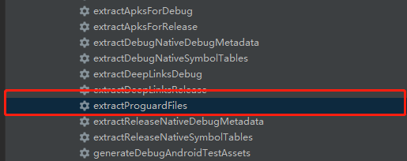
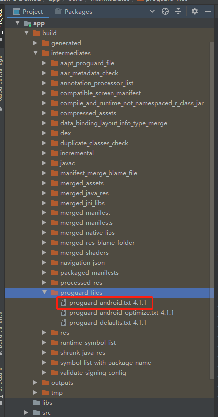
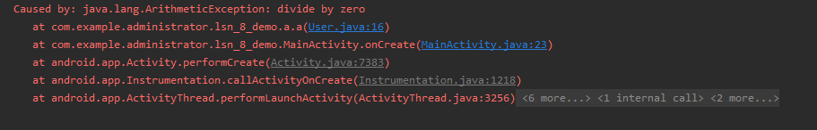
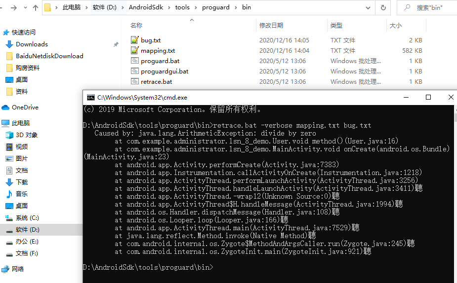

# 1.常见的反编译工具

1. [apktool](https://github.com/iBotPeaches/Apktool/releases)：主要用于资源文件的获取
   - `java -jar apktool_2.4.0.jar d app-debug.apk -o dir`
2. [dex2jar](https://github.com/pxb1988/dex2jar/releases)：将apk中的dex文件编译成jar文件
   - `d2j-dex2jar.bat app-debug.apk -o app-debug.jar`
3. [jd-gui](https://github.com/java-decompiler/jd-gui/releases)：查看反编译后的jar中的class
4. [jadx](https://github.com/skylot/jadx/releases)：直接查看资源与代码
5. enjarify：将apk反编译成java源码
   - `enjarify *.apk -o out.jar`

# 2.PROGUARD的使用与配置

Proguard是一个代码优化和混淆工具。

能够提供对Java类文件的压缩、优化、混淆，和预校验。压缩的步骤是检测并移除未使用的类、字段、方法和属性。优化的步骤是分析和优化方法的字节码。
混淆的步骤是使用短的毫无意义的名称重命名剩余的类、字段和方法。压缩、优化、混淆使得代码更小，更高效。

## 2.1开启proguard：

```
buildTypes {
        release {
            minifyEnabled false
            proguardFiles getDefaultProguardFile('proguard-android.txt'), 'proguard-rules.pro'
        }
        debug {
            minifyEnabled true
            println "path=${getDefaultProguardFile('proguard-android.txt')}"
            proguardFiles getDefaultProguardFile('proguard-android.txt'), 'proguard-rules.pro'
        }
    }
    
path=E:\BaiduNetdiskDownload\Lsn_8_Demo2\app\build\intermediates\proguard-files\proguard-android.txt-4.1.1
```

在Gradle中执行指令`extractProguardFiles`获取到混淆的默认文件进行参考





## 2.2.常用配置

```
 -keepattributes SourceFile,LineNumberTable (方便找寻错误)

-keep 指定类和类成员（变量和方法）不被混淆。
	-keep class com.dongnao.proxy.guard.test.Bug
	（保护了类名）
	
	-keep class com.dongnao.proxy.guard.test.Bug{
   		public static void *();
	}
	（保护了 public static void的没有参数的函数）
	
	-keep class com.dongnao.proxy.guard.test.Bug{
   		*；
	}
	(保护所有)
	
-keepclassmembers 指定类成员不被混淆(就是-keep的缩小版，不管类名了)。
	-keepclassmembers
	class com.dongnao.proxy.guard.test.Bug
	（都被混淆了）
	
-keepclasseswithmembers 指定类和类成员不被混淆，前提是指定的类成员存在。
	-keepclasseswithmembers class 	com.dongnao.proxy.guard.test.Bug
	(保护类名，但是没指定成员，所以函数名被混淆)
	
	-keepclasseswithmembers class   	com.dongnao.proxy.guard.test.Bug{
		native <methods>;
	}
	(如果类中有native方法，就不参加混淆)
```

## 2.3.混淆后的代码错误栈恢复方法

1. `outputs/mapping/debug/mapping.txt`文件中保存了混淆前后的对应关系
2. 把错误信息保存到文件（复制错误信息到bug.txt文件中编码UTF-8）
3. 使用工具 `sdk目录/tools/groguard/bin/retrace.bat`
   - 项目工程的配置文件中先配置  `-keepattributes SourceFile,LineNumberTable`
   - 执行  `retrace.bat  -verbose mapping.txt  bug.txt`





# 3.加密算法

实际中，一般是通过RSA加密AES的密钥，传输到接收方，接收方解密得到AES密钥，然后发送方和接收方用AES密钥来通信。

通用应用方案
   - JDK的支持
   - MessageDigest 单向加密
   - KeyGenerator   对称
   - KeyPairGenerator   非对称


## （不重要）3.1.安全哈希算法（Secure Hash Algorithm）SHA-1

同类算法：SHA1  SHA224  SHA256  SHA384  SHA512  MD5  HmacMD5 HmacSHA1  HmacSHA224  HmacSHA256  HmacSHA384  HmacSHA512   PBKDF2

注意：
  - 只要是哈希函数，就存在碰撞
  - 所谓碰撞的意思是，有两个不同的数据，他们的哈希值相同（SHA1值相同）

## 3.2.RSA算法(非对称加密)

```
public class RSA {
    public static String ALGORITHM="RSA";

    //指定key的位数
    public static int KEYSIZE=1024;//65536

    //指定公钥存放的文件
    public static String PUBLIC_KEY_FILE="public_key.dat";

    //指定私钥存放的文件
    public static String PRIVATE_KEY_FILE="private_key.dat";


    public static void generateKeyPair() throws Exception{
        SecureRandom sr=new SecureRandom();
        //需要一个KeyPairGenerator来生成钥对
        KeyPairGenerator keyPairGenerator=KeyPairGenerator.getInstance(ALGORITHM);
        keyPairGenerator.initialize(KEYSIZE,sr);
        //生成
        KeyPair keyPair=keyPairGenerator.generateKeyPair();

        Key publicKey=keyPair.getPublic();
        Key privateKey=keyPair.getPrivate();

        ObjectOutputStream objectOutputStream1 = new ObjectOutputStream(new FileOutputStream(PUBLIC_KEY_FILE));
        ObjectOutputStream objectOutputStream2 = new ObjectOutputStream(new FileOutputStream(PRIVATE_KEY_FILE));

        objectOutputStream1.writeObject(publicKey);
        objectOutputStream2.writeObject(privateKey);
        objectOutputStream2.close();
        objectOutputStream1.close();

    }

    /**
     * 加密
     */
    public static String encrypt(String source) throws Exception{
        generateKeyPair();
        //取出公钥
        ObjectInputStream ois=new ObjectInputStream(new FileInputStream(PUBLIC_KEY_FILE));
        Key key=(Key)ois.readObject();
        ois.close();
        //开始使用
        Cipher cipher=Cipher.getInstance(ALGORITHM);
        cipher.init(Cipher.ENCRYPT_MODE,key);
        byte[] b=source.getBytes();
        byte[] b1=cipher.doFinal(b);
        //转一下base64
        BASE64Encoder encoder=new BASE64Encoder();
        return encoder.encode(b1);

    }
    /**
     * 解密
     */
    public static String decrypt(String source) throws Exception{

        //取出公钥
        ObjectInputStream ois=new ObjectInputStream(new FileInputStream(PRIVATE_KEY_FILE));
        Key key=(Key)ois.readObject();
        ois.close();
        //开始使用
        Cipher cipher=Cipher.getInstance(ALGORITHM);
        cipher.init(Cipher.DECRYPT_MODE,key);
        BASE64Decoder decoder=new BASE64Decoder();
        byte[] b=decoder.decodeBuffer(source);
        byte[] b1=cipher.doFinal(b);

        return new String(b1);

    }
    @Test
    public void test() throws Exception{
        String content="jett12121212121212121";
        String password=encrypt(content);
        System.out.println("密文"+password);

        //到了服务器以后
        String target=decrypt(password);
        System.out.println("明文"+target);
    }
}
```

## 3.3.AES算法（高级加密标准）对称加密

```
public class AES {
    public static String ALGORITHM="AES";

    public static byte[] encrypt(String content,String password) throws Exception{
        KeyGenerator kgen = KeyGenerator.getInstance(ALGORITHM);
        //用用户密码作为随机数初始化
        kgen.init(128,new SecureRandom(password.getBytes()));
        //得到一个密钥
        SecretKey secretKey=kgen.generateKey();
        //对钥密进行基本的编码
        byte[] enCodeFormat = secretKey.getEncoded();
        //转换成AES专用的密钥
        SecretKeySpec key=new SecretKeySpec(enCodeFormat,ALGORITHM);
        //创建一个密码器
        Cipher cipher=Cipher.getInstance(ALGORITHM);


        byte[] byteContent=content.getBytes();
        //开始加密了
        cipher.init(Cipher.ENCRYPT_MODE,key);
        byte[] result=cipher.doFinal(byteContent);

        return result;

    }

    public static byte[] decrypt(byte[] content,String password) throws Exception{
        //创建AES的key生产者
        KeyGenerator kgen=KeyGenerator.getInstance(ALGORITHM);
        //利用用户密码作为随机数初始化
        kgen.init(128,new SecureRandom(password.getBytes()));
        //根据用户密码，生成一个密钥  (所有对称算法通用的)
        SecretKey secretKey=kgen.generateKey();
        //对密钥进行基本的编码
        byte[] enCodeFormat=secretKey.getEncoded();
        //转换成AES专用的密钥 RoundKey
        SecretKeySpec key=new SecretKeySpec(enCodeFormat,ALGORITHM);
        //创建一个密码器
        Cipher cipher=Cipher.getInstance(ALGORITHM);

        //解密
        cipher.init(Cipher.DECRYPT_MODE,key);
        byte[] result=cipher.doFinal(content);
        return result;
    }
    @Test
    public void test() throws Exception{
        String content="jett53425234523452345234523452345234";
        String password="123";

        byte[] encryptByte=encrypt(content,password);
        System.out.println("加密的数据："+new String(encryptByte));

        byte[] decrypt=decrypt(encryptByte,password);
        System.out.println("解密后的效果:"+new String(decrypt));

    }

}
```