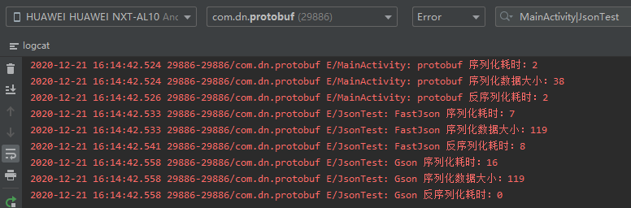
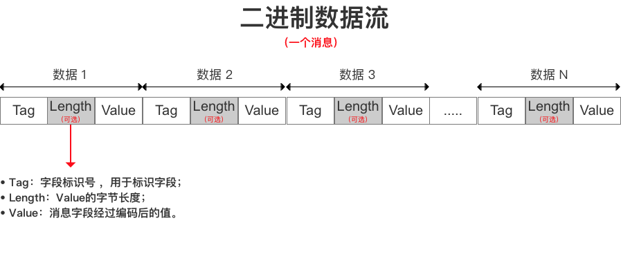
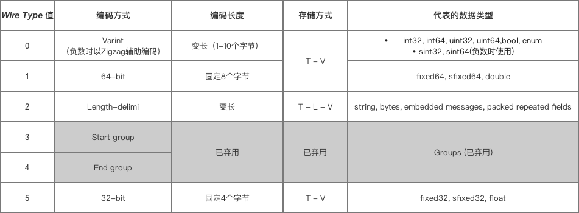
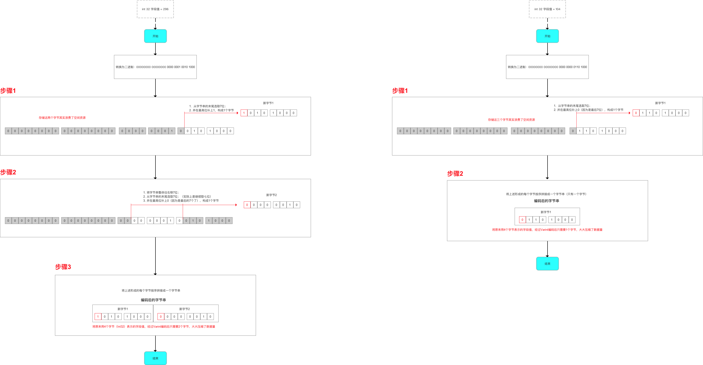
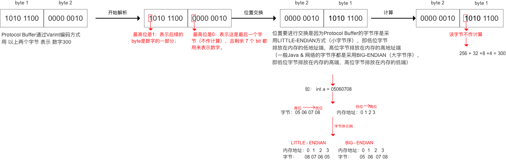
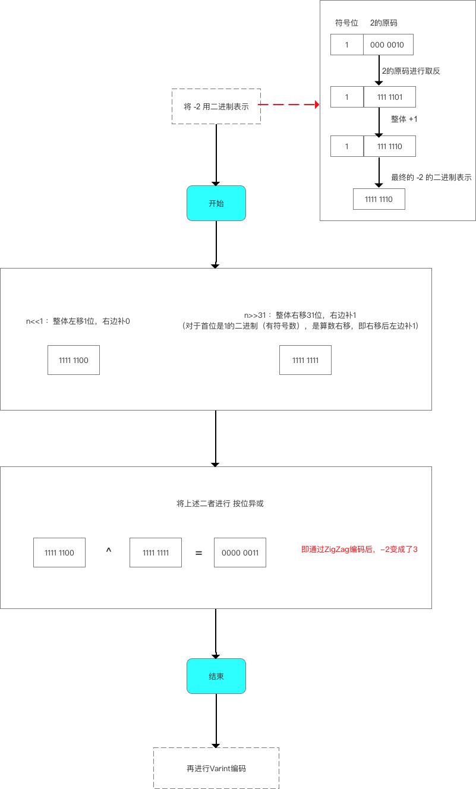
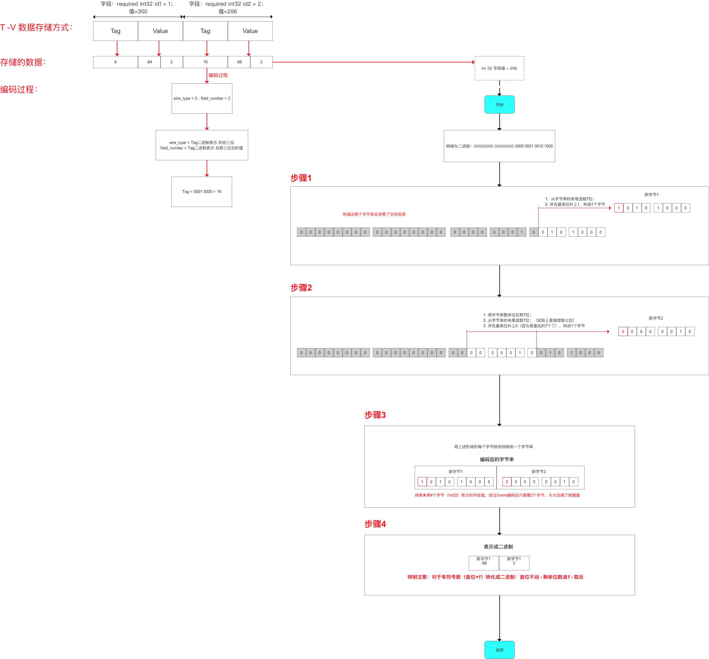
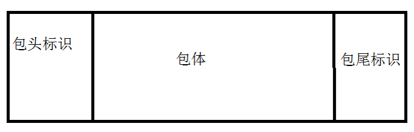

# 1.什么是Protobuf

[github地址](https://github.com/google/protobuf)

[维基百科](https://zh.wikipedia.org/wiki/Protocol_Buffers)

google开源项目。序列化数据结构的方案，通常用于编写需要数据交换或者需要存储数据的程序。这套方案包含一种用于描述数据结构的接口描述语言（Interface
Description Language）和一个生成器，用于生成描述该数据结构的不同编程语言的源代码。

# 2.序列化与反序列化

- 序列化 ： 将数据结构或对象转换成二进制串的过程
- 反序列化：将在序列化过程中所生成的二进制串转换成数据结构或者对象的过程

# 3.特点

## 3.1.优点



1. 性能
   - 体积小：序列化后，数据大小可缩小3-10倍
   - 序列化速度快：比XML和JSON快20-100倍
   - 传输速度快：因为体积小，传输起来带宽和速度会有优化
2. 使用
   - 使用简单：proto编译器自动进行序列化和反序列化
   - 维护成本低：多平台仅需维护一套对象协议文件(.proto)
   - 向后兼容性(扩展性)好：不必破坏旧数据格式就可以直接对数据结构进行更新
   - 加密性好：Http传输内容抓包只能看到字节
3. 使用范围
   - 跨平台
   - 跨语言
   - 可扩展性好

## 3.2.缺点

1. 功能：不适合用于对基于文本的标记文档（如HTML）建模，因为文本不适合描述数据结构
2. 其他
   - 通用性较差：json、xml已成为多种行业标准的编写工具，而Protobuf只是Google公司内部的工具
   - 自解耦性差：以二进制数据流方式存储（不可读），需要通过.proto文件才能了解到数据结构

# 4.应用场景

1. 传输数据量大 & 网络环境不稳定 的数据存储、RPC 数据交换 的需求场景 如 即时IM （QQ、微信）的需求场景
2. 在 传输数据量较大的需求场景下，Protobuf比XML、Json 更小、更快、使用 & 维护更简单！

# 5.使用

1. [下载地址](https://github.com/protocolbuffers/protobuf/releases/tag/v3.14.0)
2. AS中就有使用protobuf：`Android Studio\lib\protobuf-java-3.4.0.jar`
3. [官方主页](https://developers.google.com/protocol-buffers/docs/javatutorial#compiling-your-protocol-buffers)
4. [语法指南](https://developers.google.com/protocol-buffers/docs/proto)

# 6.编译

`protoc -I=$SRC_DIR --java_out=$DST_DIR $SRC_DIR/Hello.proto`

- -I 编译源文件的目录
- --java_out 编译java代码输出目录

# 7.使用Gradle插件

1. [github插件地址](https://github.com/google/protobuf-gradle-plugin)
2. 修改项目根目录下build.gradle
   - dependencies下增加classpath 'com.google.protobuf:protobuf-gradle-plugin:0.8.8'
   - repositories下增加mavenCentral()

   ```
   buildscript {
        repositories {
            ...
            mavenCentral()
        }
        dependencies {
            ...
            classpath 'com.google.protobuf:protobuf-gradle-plugin:0.8.8'
        }
    }
   ```
3. 修改app目录下build.gradle
   - apply plugin: 'com.android.application'后加上apply plugin: 'com.google.protobuf'
   - 然后加入protobuf配置（与android{}同级）
   - 最后dependencies下加入implementation 'com.google.protobuf:protobuf-lite:3.0.0'

   ```
   apply plugin: 'com.android.application'
   
    apply plugin: 'com.google.protobuf'
   
    protobuf {
        protoc {
            artifact = 'com.google.protobuf:protoc:3.0.0'
        }
        plugins {
            javalite {
                artifact = 'com.google.protobuf:protoc-gen-javalite:3.0.0'
            }
        }
        generateProtoTasks {
            all().each { task ->
                task.builtins {
                    remove java
                }
                task.plugins {
                    javalite { }
                }
            }
        }
    }
    android {
       ....
    }
   
    dependencies {
        ...
        implementation 'com.google.protobuf:protobuf-lite:3.0.0'
        implementation 'com.google.code.gson:gson:2.8.2'
        implementation 'com.alibaba:fastjson:1.1.67.android'
    }
   ```
4. 编译后在`app/build/generated/source/proto/debug/javalite`目录下生成了test.proto中定义的包名目录java_package，并且生成了test.proto中定义的类java_outer_classname

# 8.Protobuf序列化原理

1. protobuf数据结构
   - TLV存储方式：TAG-Length-Value 标识-长度-字段值
     
   - 不需要分隔符 就能 分隔开字段，减少了 分隔符 的使用 各字段 存储得非常紧凑，存储空间利用率非常高 若 字段没有被设置字段值，那么该字段在序列化时的数据中是完全不存在的，即不需要编码
   
2. protobuf数据编码存储原理
   - 对数据进行编码 + 存储
     - 速度快：编解码方式简单（简单数学运算）
     - 数据体积小
       - 对于不同数据类型 采用不同的 序列化方式（编码方式 & 数据存储方式）
         
       - 将 消息里的每个字段 进行编码后，再利用T - L - V 存储方式 进行数据的存储，最终得到的是一个 二进制字节流：减少了分隔符的使用 & 数据存储得紧凑
   
3. Varint编码方式
   1. Varint编码过程
      1. 对于 int32 类型的数字，一般需要 4 个字节 来表示
      2. 但采用 Varint 方法，对于很小的 Int32 类型 数字（小于256），则可以用 1个字节 来表示
      3. 虽然大的数字会需要 5 个字节 来表示，但大多数情况下，消息都不会有很大的数字（google是经过数据统计的）
   2. Varint解码码过程
      
   3. 负数处理
      1. 如果采用 Varint编码方式 表示一个负数，那么一定需要 5 个 byte（因为负数的最高位是1，会被当做很大的整数去处理）
      2. Protocol Buffer 定义了 `sint32 / sint64` 类型表示负数，通过先采用 Zigzag 编码（将 有符号数 转换成 无符号数），再采用 Varint编码，从而用于减少编码后的字节数
   4. 总结
      - 对于int32 / int64 类型的字段值（正数），Protocol Buffer直接采用 Varint编码
      - 对于sint32 / sint64 类型的字段值（负数），Protocol Buffer会先采用 Zigzag 编码，再采用 Varint编码
   
4. Zigzag编码方式
   
   
5. T-V存储方式&编码原理
   1. TAG编码原理
      1. Tag  = (field_number << 3) | wire_type
      
      2. wire_type 0-5,3位足以表示
         1. wire type = 0、1、5，编码为 key + 数据，只有一个数据，可能占数个字节，数据在编码时自带终止标记
         
         2. wire type = 2，编码为 key + length + 数据，length指示了数据长度，可能有多个数据，顺序排在length后
         
         3. | **Type** |  **Meaning**  |                       **Used For**                       |
            | :------: | :-----------: | :------------------------------------------------------: |
            |    0     |    Varint     | int32, int64, uint32, uint64, sint32, sint64, bool, enum |
            |    1     |    64-bit     |                fixed64, sfixed64, double                 |
            |    2     | Length-delimi | string, bytes, embedded messages, packed repeated fields |
            |    3     |  Start group  |                   Groups (deprecated)                    |
            |    4     |   End group   |                   Groups (deprecated)                    |
            |    5     |    32-bit     |                 fixed32, sfixed32, float                 |
      
   2. Value采用Varint和Zigzag编码
   
   3. 示例DNTest分析整个编码流程
      ```
      syntax = "proto2";
      package test;
      
      option java_package = "com.dn.test";
      ption java_outer_classname = "DNTestProtos";
      
      message DNTest{
      //wire_type=0, field_number=1
      //Tag  = (field_number << 3) | wire_type
      // TAG=8
      required int32 id1 = 1;
      
       //wire_type=0, field_number=2
       //Tag  = (field_number << 3) | wire_type
       // TAG=16
       required int32 id2 = 2;
      }
      ```
   
      
   
6. 核心源码分析(`protobuf-3.14.0\java\core\src\main\java\com\google\protobuf\CodedOutputStream.java 1724行`)

```
@Override
public void writeUInt32NoTag(int value) throws IOException {
  try {
    while (true) {
      if ((value & ~0x7F) == 0) {
        buffer.put((byte) value);
        return;
      } else {
        buffer.put((byte) ((value & 0x7F) | 0x80));
        value >>>= 7;
      }
    }
  } catch (BufferOverflowException e) {
    throw new OutOfSpaceException(e);
  }
}
```

# 9.网络通信协议中使用

1. 通讯协议分层模型
   - TCP/IP模型（四层）
     - 应用层 `Protocol Buffer`
     - 传输层
     - 网络层
     - 数据链路层
   - OSI模型（七层）
     - 应用层
     - 表示层 `Protocol Buffer`
     - 会话层
     - 传输层
     - 网络层
     - 数据链路层
     - 物理层
2. 粘包和分包问题
   1. 要发送的数据大于TCP发送缓冲区剩余空间大小，将会发生分包。
   2. 待发送数据大于MSS（最大报文长度），TCP在传输前将进行分包。
   3. 要发送的数据小于TCP发送缓冲区的大小，TCP将多次写入缓冲区的数据一次发送出去，将会发生粘包。
   4. 接收数据端的应用层没有及时读取接收缓冲区中的数据，将发生粘包。
3. 自定义协议
   1. 定义数据包包头，包头众包含数据完整包的长度，接收端接收到数据后，通过读取包头的长度字段，便知道每一个数据包的实际长度了。
      
   2. 数据包之间设置边界
      

# 10.<font color=red>总结建议</font>

1. 尽量使用多用 optional或 repeated修饰符
   - 因为若optional 或 repeated 字段没有被设置字段值，那么该字段在序列化时的数据中是完全不存在的，即不需要进行编码
2. 字段标识号（Field_Number）尽量只使用 1-15，且不要跳动使用
   - 因为Tag里的Field_Number是需要占字节空间的。如果Field_Number>16时，Field_Number的编码就会占用2个字节，那么Tag在编码时也就会占用更多的字节；
     如果将字段标识号定义为连续递增的数值，将获得更好的编码和解码性能。
3. 若需要使用的字段值出现负数，请使用 sint32 / sint64，不要使用int32 / int64
   - 因为采用sint32 / sint64数据类型表示负数时，会先采用Zigzag编码再采用Varint编码，从而更加有效压缩数据
4. 对于repeated字段，尽量增加packed=true修饰
   - 因为加了packed=true修饰repeated字段采用连续数据存储方式，即T - L - V - V -V方式
