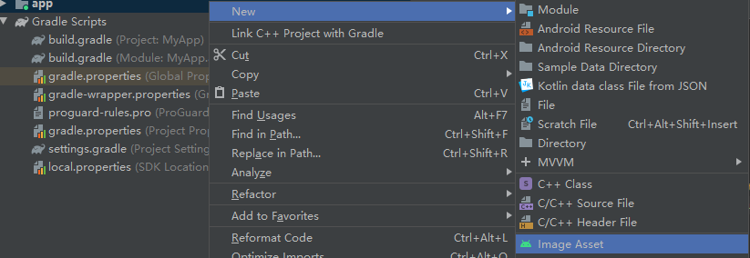
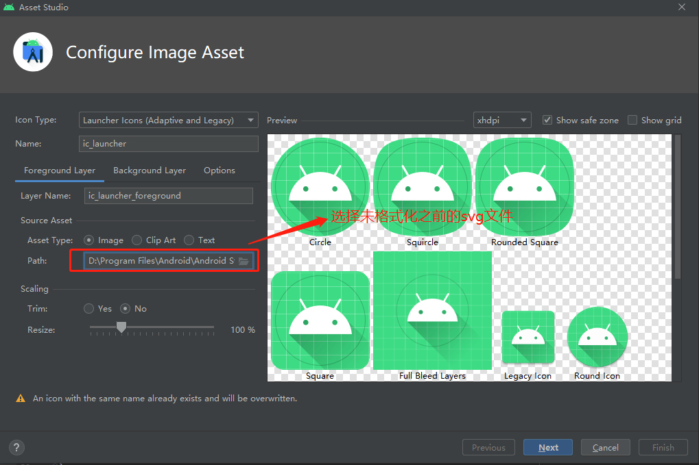

# 1.<font color=red>So库加载（源码）</font>

1. `System.java`
   - `loadLibrary(String libName)` -->  Runtime.getRuntime().loadLibrary(...)
2. `Runtime.java`
   - `loadLibrary(...)` --> `String filename = loader.findLibrary(libraryName);` --> `PathClassLoader.findLibrary(..)` --> `BaseDexClassLoader.findLibrary(..)`
3. `BaseClassLoader.java`
   - `findLibrary(..)` --> `pathList.findLibrary(name);`
4. `DexPathList.java`
   - `findLibrary(..)`
     - String fileName = System.mapLibraryName(libraryName); //`已经加载过的LibraryName就直接返回了`
     - `element.findNativeLibrary(fileName);`
5. `DexPathList$Element.java`
   - `findNativeLibrary(..)` --> `String entryName = new File(dir, name).getPath();// dir 通过构造函数传递过来`
     --> `public Element(File dir,..)`
6. `DexPathList.java`
   - this.nativeLibraryPathElements = makePathElements(`allNativeLibraryDirectories`, null,
                                                          suppressedExceptions);// 构建Elements -->
     ```
     // 循环遍历 allNativeLibraryDirectories 拿到每个 file
     String path = file.getPath();
     String split[] = path.split(zipSeparator, 2);
     zip = new File(split[0]);
     dir = new File(split[1]);
     // 传入Element的构造函数
     elements.add(new Element(dir, false, zip, dex));
     ```
   - `allNativeLibraryDirectories的构成`
     1. this.nativeLibraryDirectories = splitPaths(`libraryPath`, false); // `用户自己的native库目录`
     2.  this.systemNativeLibraryDirectories =
                splitPaths(System.getProperty("java.library.path"), true);// `系统的native库目录`
     3.  List<File> allNativeLibraryDirectories = new ArrayList<>(nativeLibraryDirectories); // `将用户的native库目录加入allNativeLibraryDirectories`
     4.  allNativeLibraryDirectories.addAll(systemNativeLibraryDirectories); // `将系统的native库目录加入allNativeLibraryDirectories`

- `libraryPath` 就是自己的库目录路径，是DexPathList的构造参数
- `DexPathList` 初始化在BaseClassLoader的构造方法中。`libraryPath` 是BaseClassLoader的构造参数
- BaseClassLoader也就是 `PathClassLoader` 查找PathClassLoader的创建位置就行

从App入口查找`PathClassLoader`的创建

1. `ActivityThread.java`
   - `handleBindApplication(..)` --> `data.info.makeApplication(data.restrictedBackupMode, null);`
2. `LoadedApk`
   1. `makeApplication(..)` --> `java.lang.ClassLoader cl = getClassLoader();`
   2. `getClassLoader()` --> `createOrUpdateClassLoaderLocked(..)` --> `mDefaultClassLoader = ApplicationLoaders.getDefault().getClassLoader(
                        "" /* codePath */, mApplicationInfo.targetSdkVersion, isBundledApp,
                        librarySearchPath, libraryPermittedPath, mBaseClassLoader,
                        null /* classLoaderName */);`
      - `final String librarySearchPath = TextUtils.join(File.pathSeparator, libPaths);` //`这是自己的so库搜索路径`
      - `final List<String> libPaths = new ArrayList<>(10);` --> `makePaths(mActivityThread, isBundledApp, mApplicationInfo, zipPaths, libPaths);`
        ```
        public static void makePaths(ActivityThread activityThread,
                                     boolean isBundledApp,
                                     ApplicationInfo aInfo,
                                     List<String> outZipPaths,
                                     List<String> outLibPaths) {   
            final String appDir = aInfo.sourceDir;
            final String libDir = aInfo.nativeLibraryDir;
            outZipPaths.clear();
            outZipPaths.add(appDir);
            ...
            if (outLibPaths != null) {
                outLibPaths.clear();
            }
            if (outLibPaths != null) {
                if (outLibPaths.isEmpty()) {
                    outLibPaths.add(libDir); // 加载自己So库的目录
                }
    
                // 加载自己的对应CPU架构的so库目录
                if (aInfo.primaryCpuAbi != null) {
                    // Add fake libs into the library search path if we target prior to N.
                    if (aInfo.targetSdkVersion < Build.VERSION_CODES.N) {
                        outLibPaths.add("/system/fake-libs" +
                            (VMRuntime.is64BitAbi(aInfo.primaryCpuAbi) ? "64" : ""));
                    }
                    for (String apk : outZipPaths) {
                        outLibPaths.add(apk + "!/lib/" + aInfo.primaryCpuAbi);
                    }
                }
                ...
            }                                          
        ```
3. `ApplicationLoaders.java`
   - `getClassLoader()` --> `getClassLoaderWithSharedLibraries` --> `getClassLoader()..` --> `ClassLoader classloader = ClassLoaderFactory.createClassLoader(..)
4. `ClassLoaderFactory.java`
   - `createClassLoader(..)` --> `return new PathClassLoader(dexPath, librarySearchPath, parent, arrayOfSharedLibraries);`

至此 `findLibrary` 找到了 so 库的名字由来了,加载还是在 native 层

1. `Runtime.java`
   - `loadLibrary0(..)`
     1. String filename = loader.findLibrary(libraryName);
     2.  String error = nativeLoad(filename, loader); // 加载还是在native层
2. `java_lang_Runtime.cc`
   - `Runtime_nativeLoad(...)`
     - JavaVMExt* vm = Runtime::Current()->GetJavaVM();
     - `bool success = vm->LoadNativeLibrary(env, filename.c_str(), javaLoader, &error_msg);`

# 2.<font color=red>apk瘦身</font>

1. 资源文件中的`string`：使用 `resConfig` 属性指定这些语言。系统会移除未指定语言的所有资源
   - [减少无用的国际化`string`](https://developer.android.google.cn/studio/build/shrink-code)
     ```
        android {
            defaultConfig {
                ...
                resConfig 'en' // 只保留英文 string.xml           
                resConfigs "en", "fr" // 保留英文和法文的 string.xml
            }
        }     
     ```
2. 图片优化
   1. 图片压缩优化
      - webp 看下一章
      - [svg](https://developer.android.google.cn/studio/write/vector-asset-studio.html)：
        - AS中转换svg根节点<svg>为<vector>  
             
           
        - [批量转换 svg](https://github.com/MegatronKing/SVG-Android/tree/master/svg-vector-cli/bat)
          1. 下载`svg2vector-cli-1.0.1.jar`
          2. 执行转换 `java -jar svg2vector-cli-1.0.0.jar -d . -o a -h 20 -w 20`
             - -d  指定 svg
             - -f 指定当个 svg
             - -h  设置转换后 svg 的高
             - -w 设置转换后 svg 的宽
             - -o 输出 android vector 图像目录
        - 最后记得在 app 级的 build.gradle 中配置
            ```
            android {
                ...
                defaultConfig {
                    ....
                    vectorDrawables.useSupportLibrary = true
                    ...
                }
                ...
            }        
            ```
   2. 减少重复图片
3. so库优化
   - 减少平台，只适配`armeabi-v7a`
4. 资源优化
   - 删除无用id
   - 混淆资源AndResGuard
   - 混淆
