# 1.常用的内存工具

top/procrank、meinfo、Procstats、DDMS、`MAT(MemoryAnalyzer)`、Finder-Activity（腾讯基于Mat封装的）、LeakCanary、LeakInspector.

工具很多，着重掌握原理方法。这里我们主要讲`AndroidProfile` 和 `MAT(MemoryAnalyzer)` 配合使用

# 2.Java虚拟机

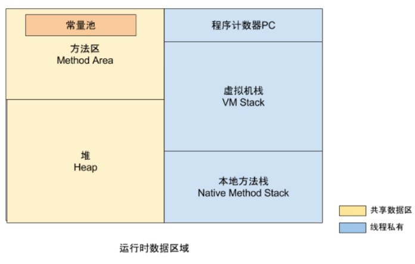

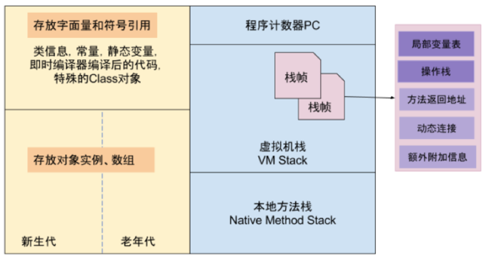

## 2.1.线程私有：

- 程序计数器PC：相当于一个执行代码的指示器，用来确认下一行执行的代码的地址。（每个线程都有一个，没有OOM的区）
- 虚拟机栈：我们平时说的栈就是这块区域（java虚拟机规范中定义了outofmemory和stackoverflow异常）
- 本地方法栈：java虚拟机规范中定义了outofmemory和stackoverflow异常

在`hotspotVM把虚拟机栈和本地方法栈合为一个栈区`

## 2.2.共享数据区

1. 方法区
   - ClassLoader加载类信息、常量、静态变量、编译后的代码运行时常量沲
   - 运行时常量池：字面量public satic final  java常量，符号引用，类，接口全名，方法名
   - `OOM`
2. java堆(`GC的主战场`)
   - 虚拟机能管理的最大的一块内存,`GC的主战场`
   - `OOM`
   - 对象实例,数组的内容

# 3.GC垃圾回收器

GC如何确定内存可以回收

## 3.1.引用计数算法

```
Object  o1=new Object(); 计数+1=1
Object  o2;
o2=o1;                 计数+1=2
o1=null;      计数为1    o1和o2都不会回收
```

例如：IOS6中的手动计数mrc与自动计数arc cocos2dx。

缺点：<font color=red size=5>**`互相引用容易出现计算数永不为0`**</font>

## 3.2.可达性分析算法

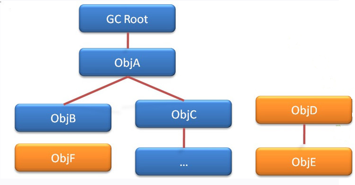

可作为GC ROOT的对象:`虚拟机栈正在运行使用的引用“静态属性”、“常量”、“JNI引用的对象”`

<font color=red size=5>GC是需要2次扫描才回收对象</font>，所以我们可以用finalize去救活丢失引用的对象  
例如：

```
static App a;
@Override
protected void() throws Throwable{
	super.finalize();
	a=this;
}
```

## 3.3.引用类型

1. 强引用：`Object obj=new Object();`
2. **软引用SoftReference**：内存不足时回收，存放一些重要性不是很强又不能随便让清除的对象，比如图片切换到后台不需要马上显示之类的。
3. **弱引用WeakReference**：第一次扫到了，就标记下来，第二次扫到直接回收。可以get到，可以跟着GC
   ```
    public void testWeakReference() throws InterruptedException {
        ReferenceQueue<Object> referenceQueuee=new ReferenceQueue<>();
        Object weakObject=new Object();
        //弱引用
        WeakReference weakReference=new WeakReference(weakObject,referenceQueuee);
        System.out.println("WeakReference:"+weakReference.get()); // java.lang.Object@484b61fc
        System.out.println("referenceQueuee:"+referenceQueuee.poll()); // null

        weakObject=null;
        System.gc();
        Thread.sleep(2000); 
        System.out.println("WeakReference:"+weakReference.get()); // null
        System.out.println("referenceQueuee:"+referenceQueuee.poll()); // java.lang.ref.WeakReference@45fe3ee3
    }
   ```
4. **虚引用PhantomReference**：幽灵 幻影引用   `get不到`，不对生存造成任何影响，用于跟踪GC的回收通知
   ```
    public void testPhantomReference() throws InterruptedException {
        //虚引用：功能，不会影响到对象的生命周期的，get不到，只适合跟踪GC
        // 但是能让程序员知道该对象什么时候被 回收了
        ReferenceQueue<Object> referenceQueuee=new ReferenceQueue<>();//gc回收完毕后会将对象信息放在引用队列中
        Object phantomObject=new Object();
        PhantomReference phantomReference=new PhantomReference(phantomObject,referenceQueuee);
        System.out.println("phantomObject:"+phantomReference.get());// null,
        System.out.println("phantomReference"+referenceQueuee.poll());// null

        phantomObject=null;
        System.gc();
        Thread.sleep(2000);
        System.out.println("referenceQueuee:"+referenceQueuee.poll());// java.lang.ref.PhantomReference@484b61fc
    }
   ```

# 4.内存泄露

产生的原因：`一个长生命周期的对象持有一个短生命周期对象的引用`。通俗讲就是该回收的对象，因为引用问题没有被回收，最终会产生OOM

## <font color=red>4.1.Android Profiler的使用</font>

分析app

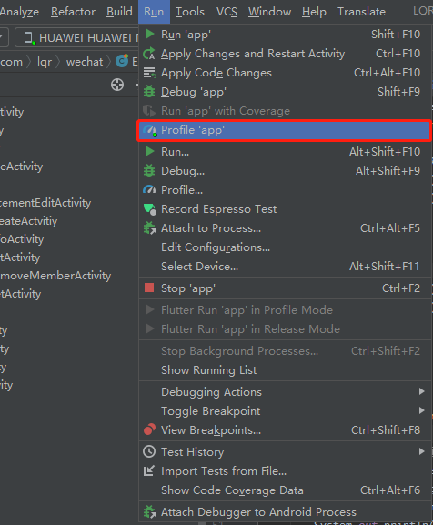


dump内存

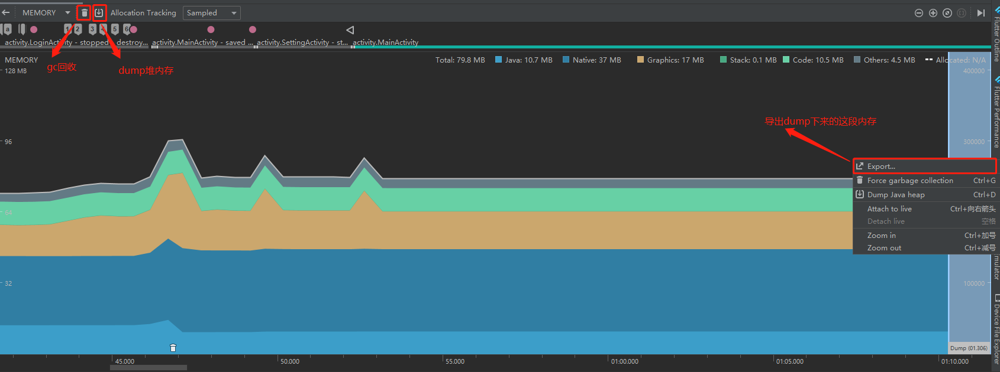

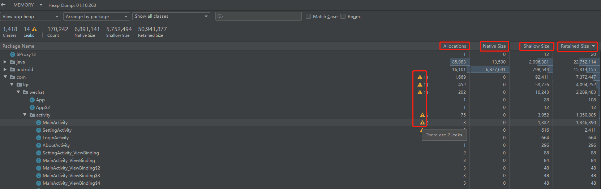

在图型用户界面上选择要分析的一段内存，右键export出来

- **Allocations**:  动态分配对象个数。
- **Deallocation**：解除分配的对象个数
- **Total count** :对象的总数
- **Native Size**：对象Native层所占大小
- **Shallow Size**：对象本身占用的内存大小 对象使用Java内存的大小，单位为byte
- **Retained Size**：对象占用的实际内存大小，大于等于Shallow Size
  > 是指实例**自身**占用的内存, 可以理解为保存该'数据结构'需要多少内存, 注意**不包括**它引用的其他实例  
  ```
    Shallow Size = \[类定义] + 父类fields所占空间 + 自身fields所占空间 + \[alignment]
  ```
  - `类定义`是指, 声明一个类本身所需的空间, 固定为8byte, 也就是说, 一个不包含任何fields的类的'空类', 也需要占8byte; 另外类定义空间不会重复计算, 就是说, 即使类继承其他类, 也只算8byte
  - `父类fields所占空间`, 对于继承了其他类的类来说, 父类声明的fields显然需要占用一定的空间
  - `自身fields所占空间`, 所有fields所占空间之和; fields分基本类型和引用, 基本类型所占空间和系统有关, 例如在32位系统中int=4byte, 64位系统中int=8byte; 引用固定占4byte, 例如String name;这个变量声明占4byte.
- **Retained Size**：GC回收能收走的内存大小
  > 实例A的`Retained Size`是指, 当实例A被回收时, 可以**同时被回收**的实例的Shallow Size之和
  - 所以进行内存分析时, 我们应该重点关注Retained Size较大的实例; 或者可以通过Retained Size判断出某A实例内部使用的实例是否被其他实例引用.
例如在Android中, 如果某个Bitmap实例的Retained Size很小, 证明它内部的byte数组被复用了, 有另一个Bitmap实例指向了同一个byte数组.


## 4.2.Mat工具的使用

[下载地址](https://www.eclipse.org/mat/downloads.php)

如果jdk版本不匹配，修改`MemoryAnalyzer.ini`文件,增加一句话，指定eclipse使用的jdk版本

```
-vm
C:\Program Files\Java\jdk-11.0.14\bin\javaw.exe
```

将AndroidProfile导出来的内存文件，转换为Mat工具可以使用的文件

1. 点击`sdk目录/platform-tools/hprof-conv.exe`
2. 在内存文件目录下打开终端命令输入，假设内存文件名为：1.hprof。`hprof-conv -z 1.hprof 1-mat.hprof`。
3. 打开软件   `File菜单下Open Heap Dump...`     打开转换好的文件
4. 在Overview中打开`Histogram`(使用直方图)
5. 在第一行过滤出需要分析的对象。或者使用`OQL`进行过滤
6. 分隔最短路径到GCRoot的那条线，排除软弱虚引用，只保留强引用对象。最后进行分析处理

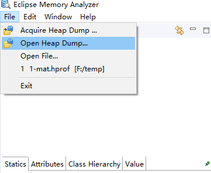

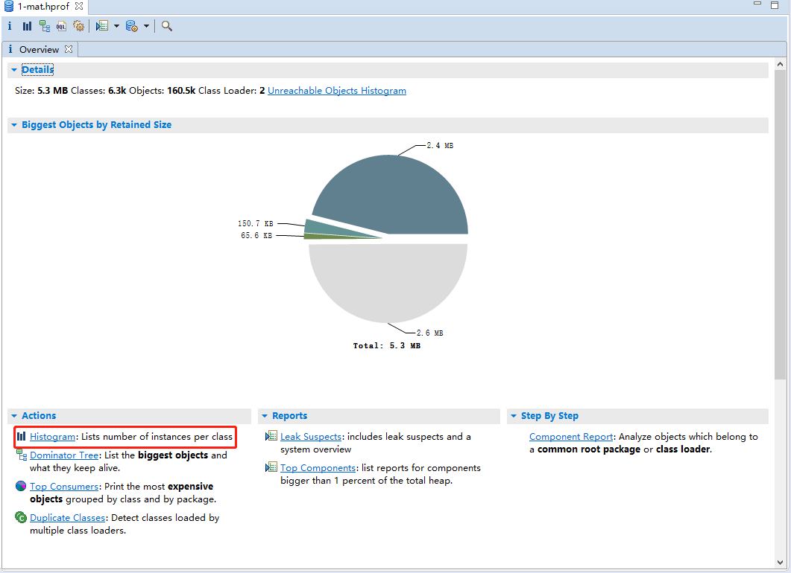

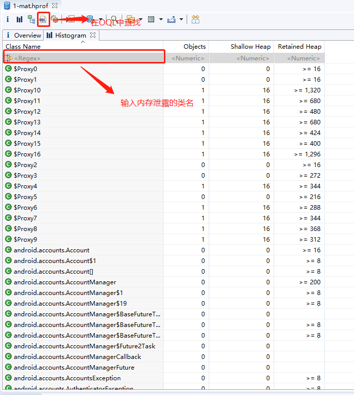

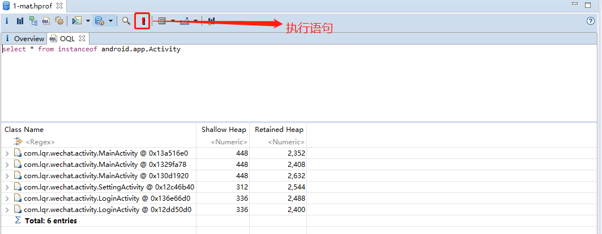

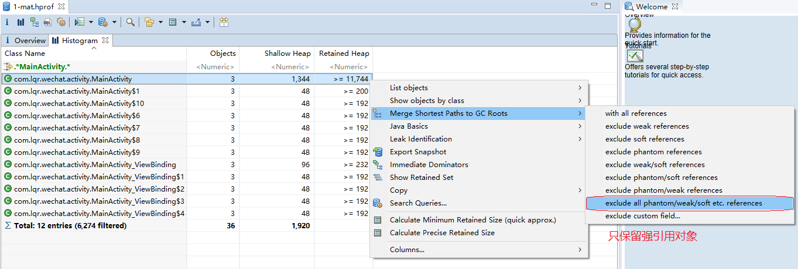

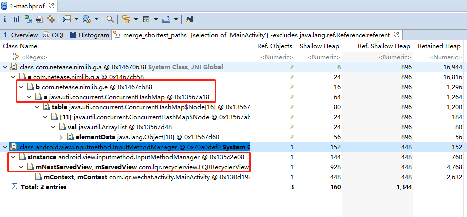

## 4.3.典型处理方案

Android源码引发的问题处理（同样可以用在第三方库）：

```

    @Override
    protected void onDestroy() {
        unRegisterBroadcastReceiver();
        super.onDestroy();
        method("mServedView");
        method("mNextServedView");
    }
    /**
     * 反射置空输入法中的属性
     */
    public void method(String attr){
        InputMethodManager im=(InputMethodManager)getSystemService(Context.INPUT_METHOD_SERVICE);
        try{
            Field mCurRootViewField = InputMethodManager.class.getDeclaredField(attr);
            mCurRootViewField.setAccessible(true);
            //取对象
            Object mCurRootView=mCurRootViewField.get(im);

            if (null!=mCurRootView) {
                Context context=((View)mCurRootView).getContext();
                if(context==this){
                    //破坏GC链
                    mCurRootViewField.set(im,null);
                }
            }
        }catch(Exception e){
            e.printStackTrace();
        }
    }
```

第三方SDK引发的问题处理

```
    @Override
    protected void onDestroy() {
        unRegisterBroadcastReceiver();
        super.onDestroy();
        
        NimAccountSDK.onlineStatusListen(
                mOnlineStatusObserver, false);
        NimUserInfoSDK.observeUserInfoUpdate(userInfoobserver,false);
        NimFriendSDK.observeFriendChangedNotify(changedNotifyObserver,false);
        NimTeamSDK.observeTeamRemove(teamobserver,false);
        NimSystemSDK.observeReceiveSystemMsg(systemMessageObserver,false);
        
        method("mServedView");
        method("mNextServedView");
    }
```


