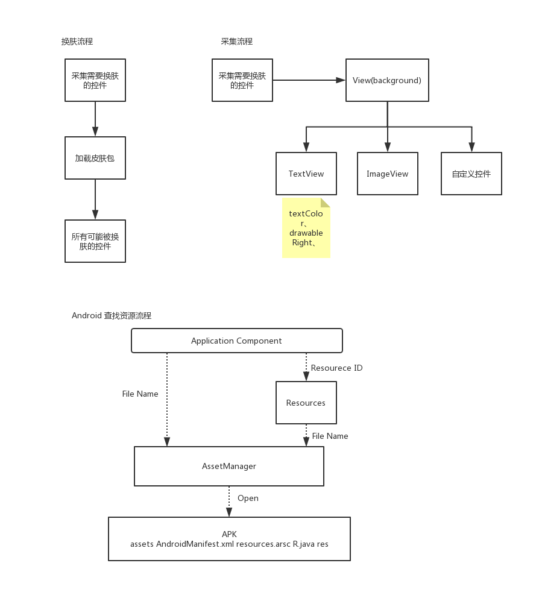
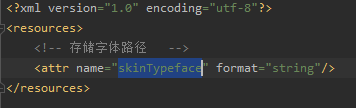
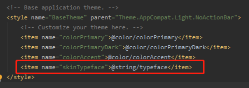
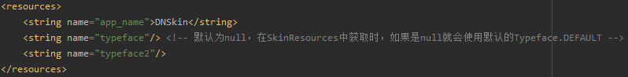
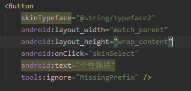
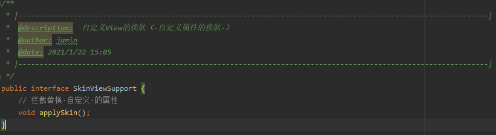
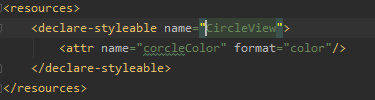
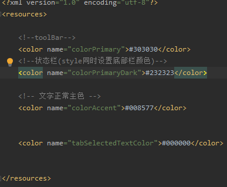

# 1.步骤流程图



# 2.手写关键代码分析,具体代码查看<font color=red>skin_core2</font>
1. <font color=red size=5>**拦截过滤xml中View的属性**</font>
   1. MyApplication.java
      ```
        @Override
        public void onCreate() {
            super.onCreate();
            SkinManager.init(this);
            
            //根据app上次退出的状态来判断是否需要设置夜间模式,提前在SharedPreference中存了一个是
            // 否是夜间模式的boolean值
            boolean isNightMode = NightModeConfig.getInstance().getNightMode(getApplicationContext());
            if (isNightMode) {
                AppCompatDelegate.setDefaultNightMode(AppCompatDelegate.MODE_NIGHT_YES);
            }else {
                AppCompatDelegate.setDefaultNightMode(AppCompatDelegate.MODE_NIGHT_NO);
            }      
        }      
      ```
   2. SkinManager.java
      - SkinManager.init(this);
      - instance = new SkinManager(application);
      ```
        private SkinManager(Application application) {
            this.application = application;
            //共享首选项 用于记录当前使用的皮肤
            SkinPreference.init(application);
            //资源管理类 用于从app/皮肤 中加载资源
            SkinResources.init(application);
            /**
             * 提供了一个应用生命周期回调的注册方法，
             *          * 用来对应用的生命周期进行集中管理，
             *  这个接口叫registerActivityLifecycleCallbacks，可以通过它注册
             *          * 自己的ActivityLifeCycleCallback，每一个Activity的生命周期都会回调到这里的对应方法。
             */
             application.registerActivityLifecycleCallbacks(new SkinActivityLifecycle());
    
             // 这一次加载的话是通知不到Observer的。因为没有Observer。
             // 但是Skin的Resources会在Activity的View创建之前建立好       
             loadSkin(SkinPreference.getInstance().getSkin());
        }
      ```
   3. SkinActivityLifecycle.java：为每个Activity的LayoutInflater设置自定义的`LayoutInlater.Factory2`
      ```
        HashMap<Activity,SkinLayoutFactory> factoryHashMap = new HashMap<>();
        
        @Override
        public void onActivityCreated(Activity activity, Bundle savedInstanceState) {
            /**
             *  更新状态栏(在之前修改了皮肤后，再次进入程序的时候自动更改状态栏)
             */
            SkinThemeUtils.updataStatusBarColor(activity);
    
            /**
             * 更新字体(在之前修改了皮肤后，再次进入程序的时候自动更改字体)
             */
            Typeface skinTypeface = SkinThemeUtils.getSkinTypeface(activity);
    
            LayoutInflater layoutInflater = LayoutInflater.from(activity);
            try {
                // 避免重复设置Factory报错      
                Field mFactorySet = LayoutInflater.class.getDeclaredField("mFactorySet");
                mFactorySet.setAccessible(true);
                mFactorySet.setBoolean(layoutInflater, false);
            } catch (Exception e) {
                e.printStackTrace();
            }
    
            //添加自定义创建View 工厂
            SkinLayoutFactory factory = new SkinLayoutFactory(activity,skinTypeface);
            layoutInflater.setFactory2(factory);
    
            //注册观察者
            SkinManager.getInstance().addObserver(factory);
            factoryHashMap.put(activity, factory);
        }
        
        @Override
        public void onActivityDestroyed(Activity activity) {
            SkinLayoutFactory factory = factoryHashMap.remove(activity);
            SkinManager.getInstance().deleteObserver(factory);
        }        
      ```
   4. **SkinLayoutFactory.java：view创建工厂**
      ```
        @Override
        public View onCreateView(View parent, String name, Context context, AttributeSet attrs) {
            // 反射 通过classLoader.loadClass获取View的Class
            View view = createViewFromTag(name, context, attrs);
            // 自定义View
            if(null ==  view){
                view = createView(name, context, attrs);
            }
    
            //筛选符合属性View
            skinAttribute.load(view, attrs);
    
            return view;
        }
        
        private View createViewFromTag(String name, Context context, AttributeSet attrs) {
            //包含自定义控件
            if (-1 != name.indexOf(".")) {
                return null;
            }
            //
            View view = null;
            for (int i = 0; i < mClassPrefixlist.length; i++) {
                view = createView(mClassPrefixlist[i] + name, context, attrs);
                if(null != view){
                    break;
                }
            }
            return view;
        }
    
        private View createView(String name, Context context, AttributeSet attrs) {
            Constructor<? extends View> constructor = mConstructor.get(name);
            if (constructor == null) {
                try {
                    //通过全类名获取class
                    Class<? extends View> aClass = context.getClassLoader().loadClass(name).asSubclass(View.class);
                    //获取构造方法
                    constructor = aClass.getConstructor(mConstructorSignature);
                    mConstructor.put(name, constructor);
                } catch (Exception e) {
                    e.printStackTrace();
                }
            }
            if (null != constructor) {
                try {
                    return constructor.newInstance(context, attrs);
                } catch (Exception e) {
                    e.printStackTrace();
                }
            }
            return null;
        }        
      ```
   5. **SkinAttribute.java：筛选View需要换肤的属性**
      1. skinAttribute.load(view, attrs);
         ```
            public void load(View view, AttributeSet attrs) {
                List<SkinPain> skinPains = new ArrayList<>();
                for (int i = 0; i < attrs.getAttributeCount(); i++) {
                    //获取属性名字
                    String attributeName = attrs.getAttributeName(i);
                    if (mAttributes.contains(attributeName)) {
                        //获取属性对应的值
                        String attributeValue = attrs.getAttributeValue(i);
                        if (attributeValue.startsWith("#")) {
                            continue;
                        }
        
                        int resId;
                        if (attributeValue.startsWith("?")) { // 系统级的?colorPrimary
                            int attrId = Integer.parseInt(attributeValue.substring(1));
                            // 获取真实的id <item name="colorPrimary">@color/colorPrimary</item>                  
                            resId = SkinThemeUtils.getResId(view.getContext(), new int[]{attrId})[0];
                        } else {
                            //@1234564
                            resId = Integer.parseInt(attributeValue.substring(1));
                        }
                        if (resId != 0) {
                            SkinPain skinPain = new SkinPain(attributeName, resId);
                            skinPains.add(skinPain);
                        }
                    }
                }
                if (!skinPains.isEmpty()) {
                    SkinView skinView = new SkinView(view, skinPains);
                    skinView.applySkin();
                    skinViews.add(skinView);
                }
            }         
         ```
         ```
            // <item name="colorPrimary">@color/colorPrimary</item> 
            //  <item name="skinTypeface">@string/typeface</item>
            // 比如skinTypeFace中要获取它的值 @string/typeface的resid
            // arrrs[0] 就是skinTypeface的资源值，ints[0]就是@string/typeface的资源值            
            public static int[] getResId(Context context, int[] attrs){
                int[] ints = new int[attrs.length];
                TypedArray typedArray = context.obtainStyledAttributes(attrs);
                for (int i = 0; i < typedArray.length(); i++) {
                    ints[i] =  typedArray.getResourceId(i, 0);
                }
                typedArray.recycle();
                return ints;
            }         
         ```
2. <font color=red size=5>**加载皮肤包，并修改皮肤、字体、状态栏、自定义View**</font>
   1. SkinManager.java extends `Observable`
      ```
        // application中调用的是通知不到 Observer的，因为Activity的创建要落后于Application
        public void loadSkin(String path) {
            if(TextUtils.isEmpty(path)){
                // 记录使用默认皮肤
                SkinPreference.getInstance().setSkin("");
                // 清空资源管理器，皮肤资源属性等
                SkinResources.getInstance().reset();
            }else{
                try {
                    AssetManager assetManager = AssetManager.class.newInstance();
                    Method addAssetPath = AssetManager.class.getDeclaredMethod("addAssetPath", String.class);
                    addAssetPath.invoke(assetManager,path);
    
                    Resources appResources = application.getResources();
                    Resources skinResources = new Resources(assetManager,appResources.getDisplayMetrics(),appResources.getConfiguration());
    
                    // 记录
                    SkinPreference.getInstance().setSkin(path);
                    // 获取皮肤包的包名
                    String packageName = application.getPackageManager().getPackageArchiveInfo(path, PackageManager.GET_ACTIVITIES).packageName;
    
                    // 将皮肤的Resources和包名存储到SkinResources中
                    SkinResources.getInstance().applySkin(skinResources,packageName);
                } catch (Exception e) {
                    e.printStackTrace();
                }
            }
            // 通知观察者
            setChanged();
    
            notifyObservers();
        }      
      ```
   2. SkinLayoutFactory.java implements LayoutInflater.Factory2,`Observer`
      ```
        // 手动修改替换皮肤时
        @Override
        public void update(Observable o, Object arg) {
            // 更状态栏和导航栏颜色
            SkinThemeUtils.updataStatusBarColor(activity);
            // 获取资源包中的字体      
            Typeface skinTypeface = SkinThemeUtils.getSkinTypeface(activity);
            skinAttribute.setTypeface(skinTypeface);
            //更换皮肤和字体
            skinAttribute.applySkin();
        }      
      ```
   3. **SkinAttribute.java：筛选View需要换肤的属性**
      ```
        /**
         * 换皮肤
         */
        public void applySkin() {
            for (SkinView mSkinView : skinViews) {
                mSkinView.applySkin(mTypeface);
            }
        }    
      ```
      - SkinView.java
        ```
        public void applySkin(Typeface typeface) {
            applyTypeface(typeface);
            applySkinSupport();
            for (SkinPain skinPair : skinPains) {
                Drawable left = null, top = null, right = null, bottom = null;
                switch (skinPair.attributeName) {
                    case "background":
                        Object background = SkinResources.getInstance().getBackground(
                                skinPair.resId);
                        //Color
                        if (background instanceof Integer) {
                            view.setBackgroundColor((Integer) background);
                        } else {
                            ViewCompat.setBackground(view, (Drawable) background);
                        }
                        //摸摸唱
                        break;
                    case "src":
                        background = SkinResources.getInstance().getBackground(skinPair
                                .resId);
                        if (background instanceof Integer) {
                            ((ImageView) view).setImageDrawable(new ColorDrawable((Integer)
                                    background));
                        } else {
                            ((ImageView) view).setImageDrawable((Drawable) background);
                        }
                        break;
                    case "textColor":
                        ((TextView) view).setTextColor(SkinResources.getInstance().getColorStateList
                                (skinPair.resId));
                        break;
                    case "drawableLeft":
                        left = SkinResources.getInstance().getDrawable(skinPair.resId);
                        break;
                    case "drawableTop":
                        top = SkinResources.getInstance().getDrawable(skinPair.resId);
                        break;
                    case "drawableRight":
                        right = SkinResources.getInstance().getDrawable(skinPair.resId);
                        break;
                    case "drawableBottom":
                        bottom = SkinResources.getInstance().getDrawable(skinPair.resId);
                        break;
                    case "skinTypeface" :
                        applyTypeface(SkinResources.getInstance().getTypeface(skinPair.resId));
                        break;
                    default:
                        break;
                }
                if (null != left || null != right || null != top || null != bottom) {
                    ((TextView) view).setCompoundDrawablesWithIntrinsicBounds(left, top, right,
                            bottom);
                }
            }
        }

        //自定义View
        private void applySkinSupport() {
            if(view instanceof SkinViewSupport){
                ((SkinViewSupport)view).applySkin();
            }
        }

        //字体换肤
        private void applyTypeface(Typeface typeface) {
            if(view instanceof TextView){
                ((TextView) view).setTypeface(typeface);
            }
        }        
        ```
   4. **SkinThemeUtils.java：替换状态栏,获取字体**
      ```
        //替换状态栏
        public static void updateStatusBarColor(Activity activity) {
            // 5.0以上才能修改
            if (Build.VERSION.SDK_INT < Build.VERSION_CODES.LOLLIPOP)
                return;
    
            // 获取statusBarColor与navigationBarColor  颜色值
            int[] statusBarId = getResId(activity, STATUSBAR_COLOR_ATTRS);
    
            // 如果statusBarColor 配置颜色值，就换肤
            if (statusBarId[0] != 0) {
                activity.getWindow().setStatusBarColor(SkinResources.getInstance().getColor(statusBarId[0]));
            }else{
                // 获取colorPrimaryDark
                int resId = getResId(activity,APPCOMPAT_COLOR_PRIMARY_DARK_ATTRS)[0];
                if(resId!= 0)
                    activity.getWindow().setStatusBarColor(SkinResources.getInstance().getColor(resId));
            }
            if(statusBarId[1] != 0)
                activity.getWindow().setNavigationBarColor(SkinResources.getInstance().getColor(statusBarId[1]));
        }
      ```
      ```
        public static Typeface getSkinTypeface(Activity activity) {
            //获取字体id
            int skinTypefaceId = getResId(activity, TYPEFACE_ATTRS)[0];
            return SkinResources.getInstance().getTypeface(skinTypefaceId);
        }  
      ```
# 3. <font color=red>字体替换</font>

1. 自定义属性：配置字体文件地址换肤时读取
   - `skin_core2`中values文件下新建`atrs.xml`文件，添加自定义属性`skinTypeface`
     - 
2. 指定全局字体
   - `app`中values的`style.xml`中设置个全局字体的默认路径
     - 
     - 
3. 指定控件字体
   - 

<font color=red size=5>**之前换肤后，再次进入程序时代码流程**</font>：
- SkinActivityLifecycle.java
  ```
    @Override
    public void onActivityCreated(Activity activity, Bundle savedInstanceState) {
        ...
        /**
         * 更新字体
         */
        Typeface skinTypeface = SkinThemeUtils.getSkinTypeface(activity);
        ...
        //添加自定义创建View 工厂
        SkinLayoutFactory factory = new SkinLayoutFactory(activity,skinTypeface);
        layoutInflater.setFactory2(factory);      
        ...
    }  
  ```
  - SkinThemeUtils.java
    ```
    private static int[] TYPEFACE_ATTRS = {
           R.attr.skinTypeface
    };
    
    public static Typeface getSkinTypeface(Activity activity) {
        //获取字体id
        int skinTypefaceId = getResId(activity, TYPEFACE_ATTRS)[0];
        return SkinResources.getInstance().getTypeface(skinTypefaceId);
    }    
    ```
  - SkinResources.java
    ```
    /**
     * Typeface   字体对象
     *
     * @param skinTypefaceId 属性id
     */
    public Typeface getTypeface(int skinTypefaceId) {
        String skinTypefacePath = getString(skinTypefaceId);
        if (TextUtils.isEmpty(skinTypefacePath)) {
            return Typeface.DEFAULT;
        }
        try {
            if (isDefaultSkin) {
                return Typeface.createFromAsset(mAppResources.getAssets(), skinTypefacePath);
            }
            return Typeface.createFromAsset(mSkinResources.getAssets(), skinTypefacePath);
        } catch (Exception e) {
        }
        return Typeface.DEFAULT;
    }    
    
    public int getIdentifier(int resId) {
        if (isDefaultSkin) {
            return resId;
        }
        //在皮肤包中不一定就是 当前程序的 id
        //获取对应id 在当前的名称 colorPrimary
        //R.drawable.ic_launcher
        String resName = mAppResources.getResourceEntryName(resId);//ic_launcher   /colorPrimaryDark
        String resType = mAppResources.getResourceTypeName(resId);//drawable
        int skinId = mSkinResources.getIdentifier(resName, resType, mSkinPkgName);
        return skinId;
    }    
    
    private String getString(int skinTypefaceId) {
        try {
            //使用默认皮肤
            if (isDefaultSkin) {
                //使用app 设置的属性值
                return mAppResources.getString(skinTypefaceId);
            }
            int skinId = getIdentifier(skinTypefaceId);
            if (skinId == 0) {
                //使用app 设置的属性值
                return mAppResources.getString(skinTypefaceId);
            }
            return mSkinResources.getString(skinId);
        } catch (Exception e) {

        }
        return null;
    }  
    ```
- SkinLayoutFactory.java
  ```
    public SkinLayoutFactory(Activity activity, Typeface skinTypeface) {
        this.activity = activity;
        skinAttribute = new SkinAttribute(skinTypeface);
    }  
  
    @Override
    public View onCreateView(View parent, String name, Context context, AttributeSet attrs) {
        ...

        //筛选符合属性View
        skinAttribute.load(view, attrs);

        return view;
    }  
  ```
- SkinAttribute.java
  ```
    private Typeface mTypeface;
    public  SkinAttribute(Typeface skinTypeface) {
        mTypeface = skinTypeface;
    }  
      
    public void load(View view, AttributeSet attrs) {
        ... 
        //  view instanceof TextView (替换所有TextView及其子View的字体)      
        if (!skinPains.isEmpty() || view instanceof TextView || view instanceof SkinViewSupport) {
            SkinView skinView = new SkinView(view, skinPains);
            skinView.applySkin(mTypeface);
            skinViews.add(skinView);
        }
    }    
  ```
  - SkinView.java
    ```
        public void applySkin(Typeface typeface) {
            applyTypeface(typeface); // 字体换肤
            ... 
            for (SkinPain skinPair : skinPains) {
                ...
                switch (skinPair.attributeName) {
                    ... 
                    case "skinTypeface" : // 某些View中自己设置了skinTypeface的属性，再次为其设置字体
                        applyTypeface(SkinResources.getInstance().getTypeface(skinPair.resId));
                        break;
                    default:
                        break;
                }
                ...
            }
        }

        //字体换肤
        private void applyTypeface(Typeface typeface) {
            if(view instanceof TextView){
                ((TextView) view).setTypeface(typeface);
            }
        }    
    ```
<font color=red size=5>**手动点击换肤的代码流程**</font>：
- SkinManager.java
  - SkinManager.getInstance().loadSkin()
    ```
    public void loadSkin(String path) {
        ...
        //采集的view   皮肤包
        setChanged();
        //通知观者者
        notifyObservers();
    }    
    ```
-  SkinLayoutFactory.java
   ```
    @Override
    public void update(Observable o, Object arg) {
        ...
        // 获取资源包设置的字体     
        Typeface skinTypeface = SkinThemeUtils.getSkinTypeface(activity);
        skinAttribute.setTypeface(skinTypeface);
        //更换皮肤
        skinAttribute.applySkin();
    }   
   ```
- SkinAttribute.java
  ```
    private Typeface mTypeface;
    
    public void setTypeface(Typeface skinTypeface) {
        this.mTypeface = skinTypeface;
    }
    /**
     * 换皮肤
     */
    public void applySkin() {
        for (SkinView mSkinView : skinViews) {
            mSkinView.applySkin(mTypeface);
        }
    }      
  ```
  - SkinView.java
    ```
        public void applySkin(Typeface typeface) {
            applyTypeface(typeface); // 字体换肤
            ... 
            for (SkinPain skinPair : skinPains) {
                ...
                switch (skinPair.attributeName) {
                    ... 
                    case "skinTypeface" : // 某些View中自己设置了skinTypeface的属性，再次为其设置字体
                        applyTypeface(SkinResources.getInstance().getTypeface(skinPair.resId));
                        break;
                    default:
                        break;
                }
                ...
            }
        }

        //字体换肤
        private void applyTypeface(Typeface typeface) {
            if(view instanceof TextView){
                ((TextView) view).setTypeface(typeface);
            }
        }    
    ```
# 4. <font color=red>自定义View</font>

- 自定义View实现指定接口`SkinViewSupport`
- 采集筛选包含SkinViewSupport实现类
- 换肤调用applySkin函数，让其在自己内部进行替换
- 
- 
- CircleView.java：自定义的View
  ```
  public class CircleView extends View implements SkinViewSupport {
    private int corcleColorResId; // 自定义的属性resid.不是值哦    
    ...
    public CircleView(Context context, @Nullable AttributeSet attrs, int defStyleAttr) {
        super(context, attrs, defStyleAttr);
        this.attrs = attrs;
        TypedArray typedArray = context.obtainStyledAttributes(attrs, R.styleable.CircleView);
        corcleColorResId = typedArray.getResourceId(R.styleable.CircleView_corcleColor, 0);
        typedArray.recycle();
        mTextPain = new Paint();
        mTextPain.setColor(getResources().getColor(corcleColorResId));      
        ...
    }
      
    @Override
    public void applySkin() {  // 自己修改自己的属性值
        if (corcleColorResId != 0) {
            int color = SkinResources.getInstance().getColor(corcleColorResId);
            setCorcleColor(color);
        }
    }   
    
    public void setCorcleColor(@ColorInt int color) {
        mTextPain.setColor(color);
        invalidate();
    }   
  ```
- SkinAttribute.java
  ```
    public void load(View view, AttributeSet attrs) {
        ... 
        //  view instanceof SkinViewSupport (替换所有想要替换的自定义View的属性)      
        if (!skinPains.isEmpty() || view instanceof TextView || view instanceof SkinViewSupport) {
            SkinView skinView = new SkinView(view, skinPains);
            skinView.applySkin(mTypeface);
            skinViews.add(skinView);
        }
    }    
  ```
  - SkinView.java
    ```
        public void applySkin(Typeface typeface) {
            applySkinSupport(); // 自定义View的皮肤替换
            ... 
            for (SkinPain skinPair : skinPains) {
                ...
                switch (skinPair.attributeName) {
                    ... 
                    case "skinTypeface" : // 某些View中自己设置了skinTypeface的属性，再次为其设置字体
                        applyTypeface(SkinResources.getInstance().getTypeface(skinPair.resId));
                        break;
                    default:
                        break;
                }
                ...
            }
        }

        //自定义View
        private void applySkinSupport() {
            if(view instanceof SkinViewSupport){
                ((SkinViewSupport)view).applySkin();
            }
        }  
    ```
# 5. <font color=red>内置换肤</font>

只是将皮肤包：apk文件，放到了`主moudle`中的`assets`文件夹下,加载这些都是类似的

# 6. <font color=red>内置的夜间/日间换肤</font>
1. 可以在values/styles.xml,修改`forceDarkAllowed`
  ```
    <!-- Base application theme. -->
    <style name="BaseTheme" parent="Theme.AppCompat.DayNight.NoActionBar">
        <!-- Customize your theme here. -->
        <item name="colorPrimary">@color/colorPrimary</item>
        <item name="colorPrimaryDark">@color/colorPrimaryDark</item>
        <item name="colorAccent">@color/colorAccent</item>
        <item name="skinTypeface">@string/typeface</item>
        <item name="android:forceDarkAllowed">true</item>
    </style>    
  ```
  - <font color=red>**这种方式不建议太丑了。**</font>
2. 修改values/styles.xml中的代码
  ```
    <!-- Base application theme. -->
    <style name="BaseTheme" parent="Theme.AppCompat.DayNight.NoActionBar">
        <!-- Customize your theme here. -->
        <item name="colorPrimary">@color/colorPrimary</item>
        <item name="colorPrimaryDark">@color/colorPrimaryDark</item>
        <item name="colorAccent">@color/colorAccent</item>
        <item name="skinTypeface">@string/typeface</item>
    </style>  
  ```
  - 将AppTheme的parent主题指定成了<font color=red size=5>**Theme.AppCompat.DayNight.NoActionBar**</font>，这是一种DayNight主题。因此，在普通情况下MaterialTest项目仍然会使用浅色主题，和之前并没有什么区别，
   但是一旦用户在系统设置中开启了深色主题，MaterialTest项目就会自动使用相应的深色主题。
3. Res目录下添加 `values-night` 文件目录
   - 
   - 
   - 虽说使用主题差异型的编程方式几乎可以帮你解决所有的适配问题，但是在DayNight主题下，我们最好还是尽量减少通过硬编码的方式来指定控件的颜色，而是应该更多地使用能够根据当前主题自动切换颜色的主题属性。比如说黑色的文字通常应该衬托在白色的背景下，反之白色的文字通常应该衬托在黑色的背景下，
  那么此时我们就可以使用主题属性来指定背景以及文字的颜色，示例写法如下：
     ```
        <FrameLayout xmlns:android="http://schemas.android.com/apk/res/android"
            android:layout_width="match_parent"
            android:layout_height="match_parent"
            android:background="?android:attr/colorBackground">
        
            <TextView
                android:layout_width="wrap_content"
                android:layout_height="wrap_content"
                android:layout_gravity="center"
                android:text="Hello world"
                android:textSize="40sp"
                android:textColor="?android:attr/textColorPrimary" />
        
        </FrameLayout>       
     ```
4. 替换
   - Application中全局替换
     ```
        //根据app上次退出的状态来判断是否需要设置夜间模式,提前在SharedPreference中存了一个是
        // 否是夜间模式的boolean值
        boolean isNightMode = NightModeConfig.getInstance().getNightMode(getApplicationContext());
        if (isNightMode) {
            AppCompatDelegate.setDefaultNightMode(AppCompatDelegate.MODE_NIGHT_YES);
        }else {
            AppCompatDelegate.setDefaultNightMode(AppCompatDelegate.MODE_NIGHT_NO);
        }     
     ```
   - 选择夜间模式
     ```
        public void night(View view) {
            //获取当前的模式，设置相反的模式，这里只使用了，夜间和非夜间模式
            int currentMode = getResources().getConfiguration().uiMode & Configuration.UI_MODE_NIGHT_MASK;
            if (currentMode != Configuration.UI_MODE_NIGHT_YES) {
                //保存夜间模式状态,Application中可以根据这个值判断是否设置夜间模式
                AppCompatDelegate.setDefaultNightMode(AppCompatDelegate.MODE_NIGHT_YES);  //  应用程序中所有处于started状态的Activity都会被重新创建
    
                //ThemeConfig主题配置，这里只是保存了是否是夜间模式的boolean值
                NightModeConfig.getInstance().setNightMode(getApplicationContext(),true);
                Toast.makeText(SkinActivity.this, "切换成功，请从其它界面返回回来查看", Toast.LENGTH_SHORT).show();
                //recreate();//需要recreate才能生效（华为Android 10不行）
            }
        }     
     ```
   - 选择日间模式
     ```
        public void day(View view) {
            //获取当前的模式，设置相反的模式，这里只使用了，夜间和非夜间模式
            int currentMode = getResources().getConfiguration().uiMode & Configuration.UI_MODE_NIGHT_MASK;
            if (currentMode == Configuration.UI_MODE_NIGHT_YES) {
                //保存夜间模式状态,Application中可以根据这个值判断是否设置夜间模式
                AppCompatDelegate.setDefaultNightMode(AppCompatDelegate.MODE_NIGHT_NO); //  应用程序中所有处于started状态的Activity都会被重新创建
    
                //ThemeConfig主题配置，这里只是保存了是否是夜间模式的boolean值
                NightModeConfig.getInstance().setNightMode(getApplicationContext(),false);
                Toast.makeText(SkinActivity.this, "切换成功，请从其它界面返回回来查看", Toast.LENGTH_SHORT).show();
                //recreate();//需要recreate才能生效（华为Android 10不行）
            }
        }     
     ```
- AppCompatDelegate.setDefaultNightMode()方法接收一个mode参数
   - MODE_NIGHT_FOLLOW_SYSTEM：默认模式，表示让当前应用程序跟随系统设置来决定使用浅色主题还是深色主题。
   - MODE_NIGHT_YES：脱离系统设置，强制让当前应用程序使用深色主题。
   - MODE_NIGHT_NO：脱离系统设置，强制让当前应用程序使用浅色主题。
   - MODE_NIGHT_AUTO_BATTERY：根据手机的电池状态来决定使用浅色主题还是深色主题，如果开启了节点模式，则使用深色主题。

<font color=red size=5>注意</font>：  
　　**需要注意的是，当调用setDefaultNightMode()方法并成功切换主题时，<font color=red size=5>应用程序中所有处于started状态的Activity都会被重新创建
（不在started状态的Activity则会在恢复started状态时再重新创建）**</font>。这很好理解，因为Activity不重新创建Activity怎么切换主题呢？

可是如果你当前所处的界面不想被重新创建，比如一个正在播放视频的界面。这个时候可以在Activity的configChanges属性当中配置uiMode来让当前Activity避免被重新创建，如下所示：

```
<activity
    android:name=".MainActivity"
    android:configChanges="uiMode" />
```

现在当应用程序的主题发生变化时，MainActivity并不会重新创建，而是会触发onConfigurationChanged()方法的回调，你可以在回调当中手动做一些逻辑处理。

```
override fun onConfigurationChanged(newConfig: Configuration) {
    val currentNightMode = newConfig.uiMode and Configuration.UI_MODE_NIGHT_MASK
    when (currentNightMode) {
        Configuration.UI_MODE_NIGHT_NO -> {} // 夜间模式未启用，使用浅色主题
        Configuration.UI_MODE_NIGHT_YES -> {} // 夜间模式启用，使用深色主题
    }
}
```