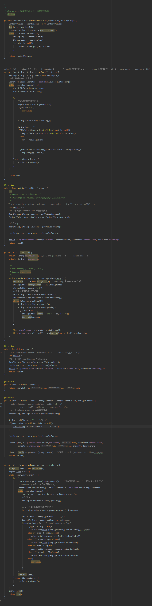
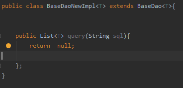
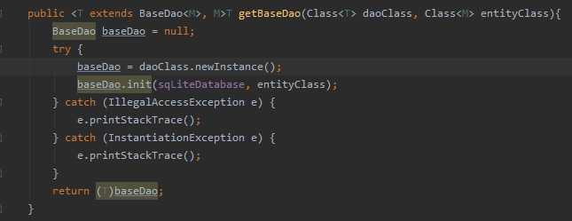

# 1. SQL中limit的用法

```
select * from tableName limit i,n
# tableName：表名
# i：为查询结果的索引值(默认从0开始)，当i=0时可省略i
# n：为查询结果返回的数量
# i与n之间使用英文逗号","隔开

# 
limit n 等同于 limit 0,n
```


# 2. BaseDao实现删、改、查

<div style="text-align:center;">


</div>


# 3. QQ之实现数据库分库（多用户）

每个用户对应一个数据库，方便管理。
<div style="text-align:center;">


</div>

# 3.BaseDao扩展

1. BaseDaoNewImpl.java
   - 
2. BaseDaoFactory.java
   - 
