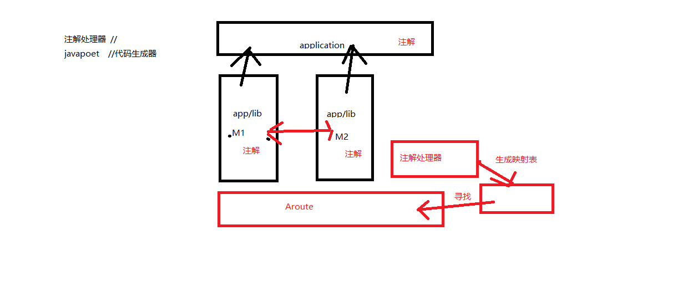

# 1.模块化、组件化、插件化
1. 模块化
   - 根据不同的关注点，将一个项目的可以共享的部分抽取出来，形成独立的Module，这就是模块化。模块化不只包含公共部分，当然也可以
   是业务模块。比如：图片加载模块。
2. <font color=red size=5>**组件化**</font>
   - 组件化是建立在模块化思想上的一次演进，一个变种。组件化本来就是模块化的概念。核心是模块角色的可转化换性，<font color=red>**在打包时，是library；
   调试时，是application。**</font>组件化的单位是组件。
3. 插件化
   - 严格意义来讲，其实也算是模块化的观念。将一个完整的工程，按业务划分为不同的插件，来化整为零，相互配合。`插件化的单位是apk(一个完成的应用)。`
   可以实现apk 的动态加载，动态更新，比组件化更灵活。

# 2.<font color=red>Gradle组件化配置</font>
1. gradle简介和对应文件说明
   - 简介: gradle 是一个构建工具。负责管理项目依赖，组织项目结构，完成项目构建的工作。基于Groovy语言
   （Groovy是一种基于JVM的敏捷开发语言，可以简单的理解为强类型语言java的弱类型版本）。
   - build.gradle：构建脚本文件，主要的构建配置都在这里写
   - gradle文件夹：存放gradle wrapper 执行配置和工具的文件夹
   - gradlew：gradle wrapper 执行脚本文件，用来在没有安装 gradle 的情况下执行 gradle 命令。当然，第一次执行时会下载 gradle。
   - gradlew.bat：gradle wrapper 执行脚本文件的 windows 版
   - settings.gradle：项目配置，指明根项目名字和引入的 module
2. <font color=red size = 5>**组件化配置**</font>
   1. 项目根目录下新建`config.gradle`文件
      ```
        ext{ //extend
            // false：组件模式
            // true：集成模式
            isModule = true
            android = [
                    compileSdkVersion: 29,
                    minSdkVersion:16,
                    targetSdkVersion:29,
                    versionCode:1,
                    versionName:"1.0"
            ]
        
            appId = [
                    app:"com.dn_alan.myapplication",
                    module1:"com.dn_alan.module1",
                    module2:"com.dn_alan.module2"
            ]
        
            supportLibrary = "28.0.0"
            dependencies = [
                    "appcompat-v7":"com.android.support:appcompat-v7:$supportLibrary"  // key为什么要加引号是因为有特殊字符-
            ]
        }     
      ```
   2. 项目的 `build.gradle` 中依赖config.gradle
      ```
      //相当于引入头文件 将 config中的内容引入进来
      apply from: "config.gradle"
      buildscript {
          repositories {
              ...    
          }
          dependencies {
              ...    
          }    
      }
      ...     
      ```
   3. `app`级的build.gradle中配置
      ```
        apply plugin: 'com.android.application'
        
        //赋值与引用
        def cfg = rootProject.ext.android
        def appId = rootProject.ext.appId
        android {
            compileSdkVersion cfg.compileSdkVersion
            defaultConfig {
                applicationId appId["app"] // 也可以appid.app
                minSdkVersion cfg.minSdkVersion
                targetSdkVersion cfg.targetSdkVersion
                versionCode cfg.versionCode
                versionName cfg.versionName
                testInstrumentationRunner "android.support.test.runner.AndroidJUnitRunner"
        
                javaCompileOptions {
                    annotationProcessorOptions {
                        arguments = [moduleName: project.getName()]
                    }
                }
            }
            ...
        }
        
        dependencies {
            ...
            annotationProcessor project(':router_compiler')
            implementation project(':base')

            if (isModule){ // 如果是打包的情况下，就依赖module1和moudle2
                implementation project(':module2')
                implementation project(':module1')
            }        
        }      
      ```
   4. `moudle2`的build.gradle中的配置
      ```
        //根据isModule标签动态的切换 集成/组件模式
        if (isModule){
            apply plugin: 'com.android.library'
        }else{
            apply plugin: 'com.android.application'
        }
        
        def cfg = rootProject.ext.android
        def appId = rootProject.ext.appId
        
        android {
            compileSdkVersion cfg.compileSdkVersion
        
            defaultConfig {
                minSdkVersion cfg.minSdkVersion
                targetSdkVersion cfg.targetSdkVersion
                versionCode cfg.versionCode
                versionName cfg.versionName
        
                testInstrumentationRunner "android.support.test.runner.AndroidJUnitRunner"
        
                javaCompileOptions {
                    annotationProcessorOptions {
                        arguments = [ moduleName : project.getName() ]
                    }
                }
        
                //添加一条 boolean类型的变量
                buildConfigField("boolean","isModule",String.valueOf(isModule))
        
                //组件模式下,设置moudle的appid
                if (!isModule){
                    applicationId appId['module2']
                }
        
                //资源配置
                sourceSets{
                    main{
                        //在组件模式下 使用不同的manifest文件
                        if(!isModule){
                            manifest.srcFile 'src/main/module/AndroidManifest.xml'
                            java.srcDirs 'src/main/module/java','src/main/java'
        
                        }else{
                            manifest.srcFile 'src/main/AndroidManifest.xml'
                        }
                    }
                }
        
            }
        
            buildTypes {
                ...
            }
        
        }
        
        dependencies {
            ...        
            annotationProcessor project(':router_compiler')
            implementation project(':base')
        }      
      ```

# 3. Arouter路由原理



