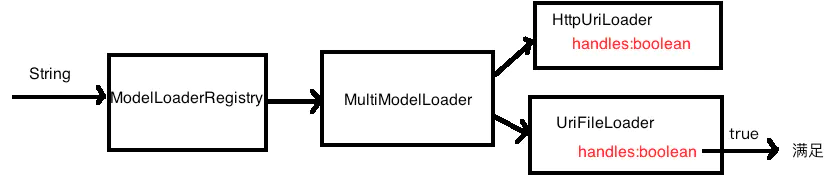
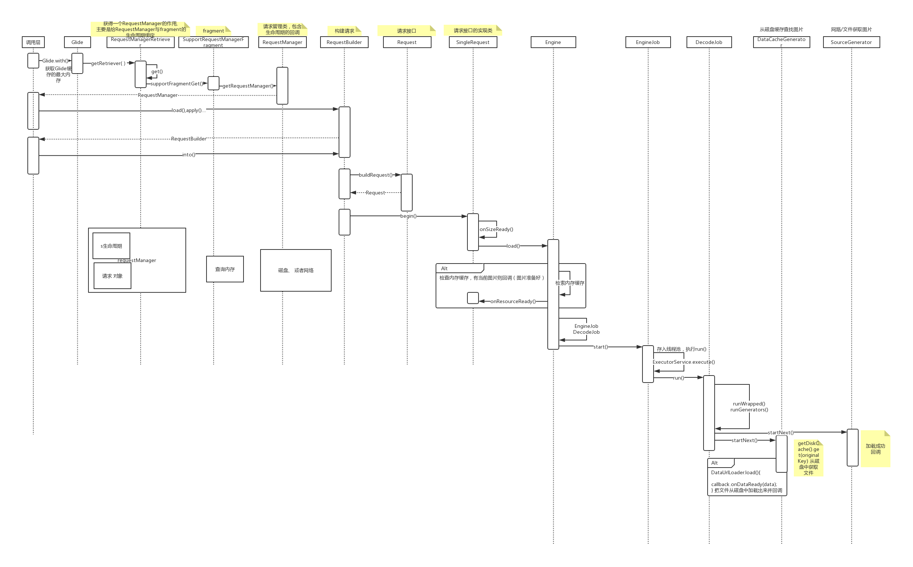

[<font size=5>**Glide预习资料 注册ModelLoader**</font>](https://www.jianshu.com/p/2645f9e69cde)

# 1.`ModelLoader`

**Glide通过ModelLoader完成图片的加载过程封装。**

```
/**
 * Model 表示的是数据的来源
 * Data 加载成功后的数据类型(inputStream, byte[])
 * @param <Model>
 * @param <Data>
 */
public interface ModelLoader<Model, Data> {

    interface ModelLoaderFactory<Model, Data>{
        ModelLoader<Model, Data> build(ModelLoaderRegistry registry);
    }

    class  LoadData<Data>{
        //缓存的key
        final Key key;

        public DataFetcher<Data> fetcher;

        public LoadData(Key key, DataFetcher<Data> fetcher) {
            this.fetcher = fetcher;
            this.key = key;
        }
    }

    /**
     * 判断处理对应model的数据
     * @return
     */
    boolean handles(Model model);

    /**
     * 创建加载的数据方式
     * @param model
     */
    LoadData<Data> buildData(Model model);
}
```

使用Glide,图片可能存在于文件、网络等地方。其中`Model则代表了加载来源模型:Uri、File等；`,`Data则代表加载模型后的数据:InputSream、byte[]等`。
通过 **`buildLoadData`** 函数创建LoadData。LoadData中的DataFetcher如下:

```
/**
 * 负责数据获取
 */
public interface DataFetcher<Data> {
    interface DataFetcherCallBack<Data> {
        // 数据加载完成
        void onFetcherReady(Data data);

        //加载失败
        void onLoadFailed(Exception e);
    }

    void loadData(DataFetcherCallBack<Data> callBack);

    void cancel();
}
```

来看一个实现:

```
public class HttpUriLoader implements ModelLoader<Uri, InputStream> {
    @Override
    public boolean handles(Uri uri) {
//        Uri.fromFile("")
        String scheme = uri.getScheme();
        return scheme.equalsIgnoreCase("http") || scheme.equalsIgnoreCase("https");
    }

    //创建加载的数据方式
    @Override
    public LoadData<InputStream> buildData(Uri uri) {

        return new LoadData<InputStream>(new Objectkey(uri), new HttpUriFetcher(uri));
    }

    public static class  Factory implements ModelLoader.ModelLoaderFactory<Uri, InputStream>{

        @Override
        public ModelLoader<Uri, InputStream> build(ModelLoaderRegistry registry) {
            return new HttpUriLoader();
        }
    }
}
```

对应的HttpUriFetcher：

```
public class HttpUriFetcher implements DataFetcher<InputStream> {

    private final Uri uri;
    //如果请求被取消
    private boolean isCanceled;

    public HttpUriFetcher(Uri uri) {
        this.uri = uri;
    }

    @Override
    public void loadData(DataFetcherCallBack callBack) {
        HttpURLConnection connection = null;
        InputStream is = null;
        try {
            URL url = new URL(uri.toString());
            connection = (HttpURLConnection) url.openConnection();
            connection.connect();
            is = connection.getInputStream();
            int responseCode = connection.getResponseCode();
            if (isCanceled) {
                return;
            }
            if (responseCode == HttpURLConnection.HTTP_OK) {
                callBack.onFetcherReady(is);
            } else {
                callBack.onLoadFailed(new RuntimeException(connection.getResponseMessage()));
            }
        } catch (Exception e) {
            e.printStackTrace();
        } finally {
            if (null != is) {
                try {
                    is.close();
                } catch (IOException e) {
                    e.printStackTrace();
                }
            }
            if (null != connection) {
                connection.disconnect();
            }
        }
    }

    @Override
    public void cancel() {
        isCanceled = true;
    }
}
```

HttpUriLoader与之对应的HttpUriFetcher负责从网络获得图片，当使用Uri并且Uri满足
```
String scheme = uri.getScheme();
scheme.equalsIgnoreCase("http") || scheme.equalsIgnoreCase("https");
```

HttpUriLoader则可以加载图片，如何加载就不赘述了。

看起来还不错,但是我们总需要支持其他来源的图片(如:文件),而不仅仅只能从网络获得。所以可能会有多个Loader与Fetcher实现，并且为了更加灵活的拔插，定义一个注册机让我们对所有支持的来源进行注册、组装。

# 2.`ModelLoaderRegistry`

ModelLoaderRegistry负责注册所有支持的ModelLoader

```
package com.shu_da_shi.myapplication.glide.load.model;


import java.util.ArrayList;
import java.util.List;

public class ModelLoaderRegistry {

    private List<Entry<?, ?>> entries = new ArrayList<>();

    public synchronized <Model, Data> void add(Class<Model> modelClass,
                                               Class<Data> dataClass, ModelLoader.ModelLoaderFactory<Model, Data> factory) {
        entries.add(new Entry<>(modelClass, dataClass, factory));
    }

    /**
     * 获得 对用 model 与data类型的modelloader
     *
     * @return
     */
    public <Model, Data> ModelLoader<Model, Data> build(Class<Model> modelClass, Class<Data> dataClass) {
        List<ModelLoader<Model, Data>> loaders = new ArrayList<>();
        for (Entry<?, ?> entry : entries) {
            //是我们需要的Model与Data类型的Loader
            if (entry.handles(modelClass, dataClass)) {
                loaders.add((ModelLoader<Model, Data>) entry.factory.build(this));
            }
        }

        //找到多个匹配的loader
        if (loaders.size() > 1) {
            return new MultiModelLoader<>(loaders);
        } else if (loaders.size() == 1) {
            return loaders.get(0);
        }
        throw new RuntimeException("No Have:" + modelClass.getName() + " Model Match " +
                dataClass.getName() + " Data");
    }

    /**
     *  获得符合model类型的loader集合
     */
    public <Model> List<ModelLoader<Model, ?>> getModelLoaders(Class<Model> modelClass) {
        List<ModelLoader<Model, ?>> loaders = new ArrayList<>();
        for (Entry<?, ?> entry : entries) {
            if (entry.handles(modelClass)) {
                loaders.add((ModelLoader<Model, ?>) entry.factory.build(this));
            }
        }
        return loaders;
    }

    private static class Entry<Model, Data> {
        Class<Model> modelClass;
        Class<Data> dataClass;
        ModelLoader.ModelLoaderFactory<Model, Data> factory;

        public Entry(Class<Model> modelClass, Class<Data> dataClass, ModelLoader.ModelLoaderFactory<Model, Data> factory) {
            this.modelClass = modelClass;
            this.dataClass = dataClass;
            this.factory = factory;
        }

        boolean handles(Class<?> modelClass, Class<?> dataClass) {
            //A.isAssignableFrom(B) B和A是同一个类型 或者 B是A的子类
            return this.modelClass.isAssignableFrom(modelClass) &&
                    this.dataClass.isAssignableFrom(dataClass);
        }

        boolean handles(Class<?> modelClass) {
            //A.isAssignableFrom(B) B和A是同一个类型 或者 B是A的子类
            return this.modelClass.isAssignableFrom(modelClass);
        }
    }

}
```

使用之前调用add函数对需要组装的Loader进行注册

```
 modelLoaderRegistry.add(String.class, InputStream.class, new StringModelLoader.Factory());
        modelLoaderRegistry.add(Uri.class, InputStream.class, new HttpUriLoader.Factory());
        modelLoaderRegistry.add(Uri.class, InputStream.class, new FileUriLoader.Factory(context.getContentResolver()));
```

当需要加载一个String类型的来源则会查找到StringModelLoader。但是一个String它可能属于文件地址也可能属于一个网络地址，所以StringModelLoader.Factory在创建StringModelLoader的时候是:

```
public class StringModelLoader implements ModelLoader<String, InputStream>{
    private final ModelLoader<Uri, InputStream> loader;

    public StringModelLoader(ModelLoader<Uri, InputStream> loader) {
        this.loader = loader;
    }

    @Override
    public boolean handles(String s) {
        return true;
    }

    @Override
    public LoadData<InputStream> buildData(String model) {
        Uri uri;
        if(model.startsWith("/")){
            uri = Uri.fromFile(new File(model));
        } else {
            uri = Uri.parse(model);
        }
        return  this.loader.buildData(uri);
    }


    public static class  Factory implements ModelLoader.ModelLoaderFactory<String, InputStream>{

        @Override
        public ModelLoader<String, InputStream> build(ModelLoaderRegistry registry) {
            return new StringModelLoader(registry.build(Uri.class, InputStream.class));
        }
    }
}
```

首先StringModelLoader装饰了一个ModelLoader<Uri,Data>类型的Loader，这个Loader来自Factory中的`modelLoaderRegistry.build(Uri.class, InputStream.class)`,回头查看`ModelLoaderRegistry#build`函数。

它会根据Uri与InputStream类型创建一个`MultiModelLoader`对象。

```
public class MultiModelLoader<Model, Data> implements ModelLoader<Model, Data> {
    private final List<ModelLoader<Model, Data>> modelLoaders;

    public MultiModelLoader(List<ModelLoader<Model, Data>> modelLoaders) {
        this.modelLoaders = modelLoaders;
    }

    @Override
    public boolean handles(Model model) {
        for (ModelLoader<Model, Data> modelLoader : modelLoaders) {
            if(modelLoader.handles(model)){
                return true;
            }
        }
        return false;
    }

    @Override
    public LoadData<Data> buildData(Model model) {
        for (int i = 0; i < modelLoaders.size(); i++) {
            ModelLoader<Model, Data> modelDataModelLoader = modelLoaders.get(i);
            if(modelDataModelLoader.handles(model)){
                LoadData<Data> dataLoadData = modelDataModelLoader.buildData(model);
                return dataLoadData;
            }
        }
        return null;
    }
}
```

这个MultiModelLoader中存在一个集合，只要集合中存在一个Loader能够处理对应的Model，那么这个MultiModelLoader就可以处理对应的Model。

所以当需要处理String类型的来源的时候，会创建一个MultiModelLoader，这个MultiModelLoader中包含了一个HttpUriLoader与一个FileUriLoader。当字符串是以http或者https开头则能由HttpUriLoader处理，否则交给FileUriLoader来加载。

<div align="center">

</div>

定位到Loader，通过buildData获得一个LoadData，使用其中的Fetcher就可以加载到一个泛型Data类型的数据，比如InputStream。然后通过注册的解码器解码InputStream获得Bitmap(解码器的注册相对于Loader更简单)。

# 3.<font color=red>Glide加载原理</font>

可以跟着下面的图去源码(`4.9.0`)中寻找

<div align="center">

</div>
