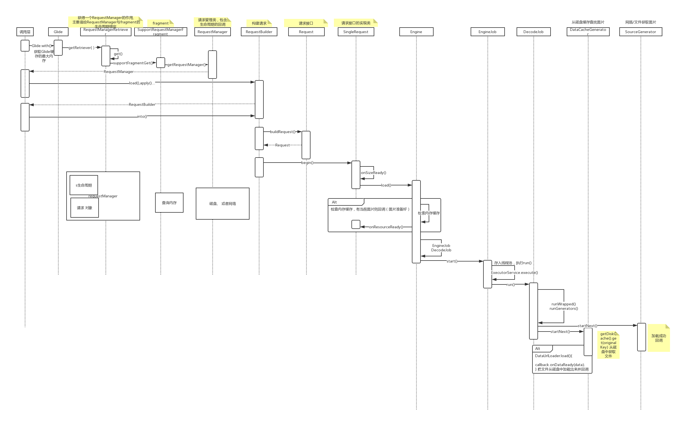
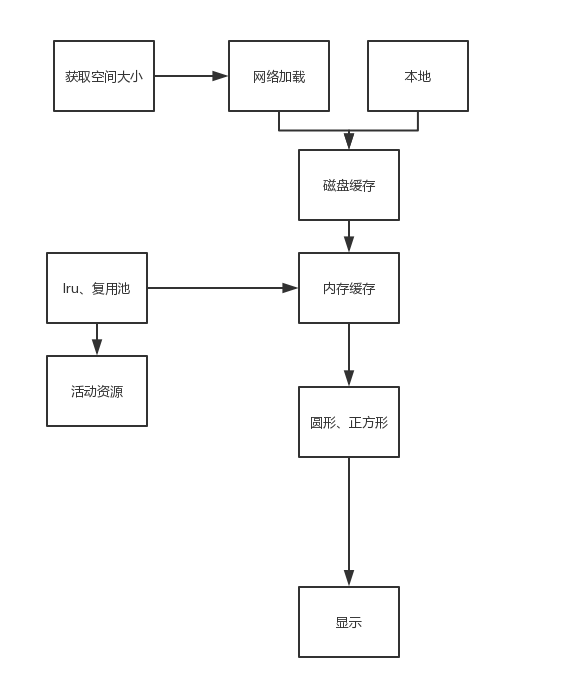

# 1.Glide完整的加载原理
再来复习遍Glide 的加载原理

# 2.Glide声明周期
Glide的声明周期是和Fragment绑定的(`SupportRequestManagerFragment`)。RequestManager 实现 LifeCycle的接口，
SupportRequestManagerFragment有LifeCycle接口的集合。将RequestManager添加进入集合中。在SupportRequestManagerFragment对应
生命周期方法中，循环遍历集合通知监听者。

# 3.Glide框架总结

流程：
1. `活动资源(计数的，弱引用集合)`中查找。
2. 内存缓存(`Lru`)中查看。
   - `内存中查找到后主动移除，并加入活动资源中`
   - `内存缓存中被动移除的资源放到复用池中。加载时图片时优先使用复用池中的内存。`
3. 磁盘缓存
4. 网络下载
   - 下载后，`保存到磁盘缓存和活动资源中`

