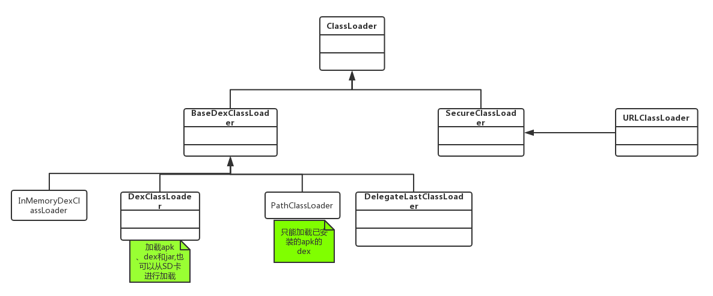
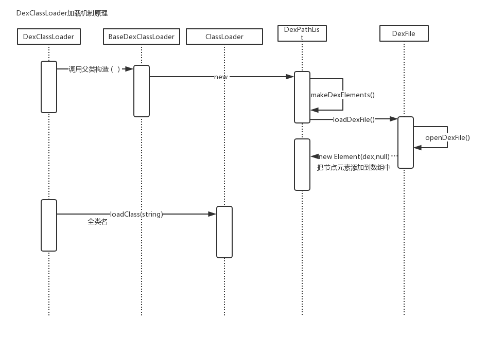

# 1.CalssLoader

    

>

    

# 2.插桩Service、动态广播实现

1. 宿主apk模块
   - ProxyService：占坑的Service。
   - ProxyBroadCast：占坑的BroadCast,因为是动态广播所以不需要在Manifest中注册
2. library接口
   - PayInterfaceService
     - 插件Service需要实现的接口
     - ProxyService中反射创建插件Service时，强转为的对象
   - PayInterfaceBroadcast
     - 插件BroadCast需要实现的接口
     - ProxyBroadCast中反射创建插件BroadCast时，强转为的对象

3. 插件apk模块
   - startActivity：重新最终还是跳转到ProxyActivity去显示。
   - startService、registerBroadCast，最终还是在ProxyActivity去启动和注册的

