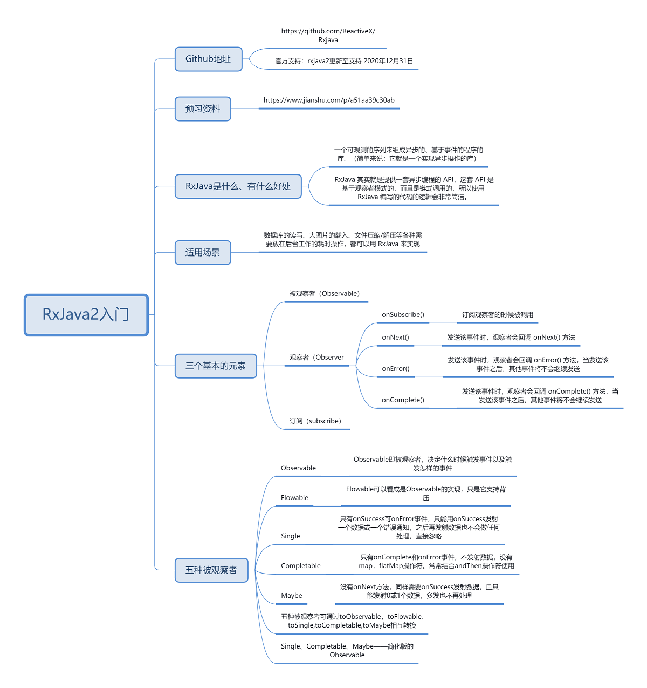
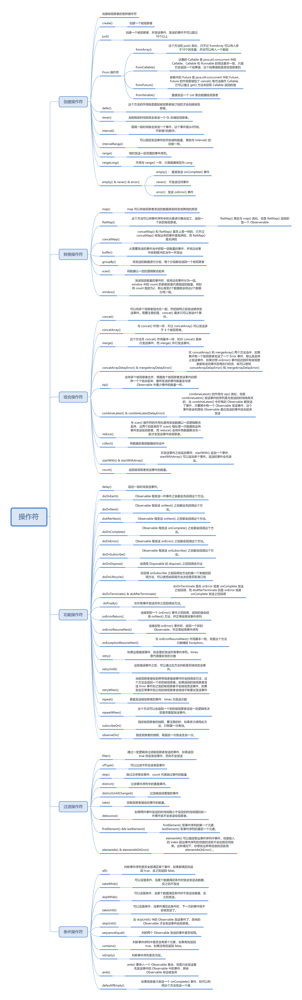
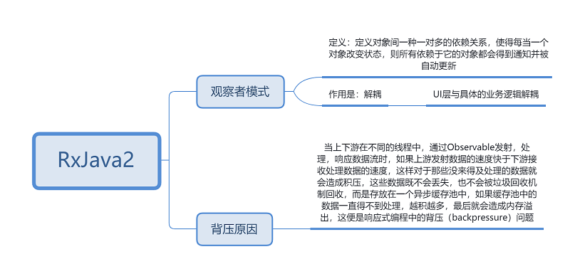

> [Rxjava Gihub地址](https://github.com/ReactiveX/Rxjava)
>
> [动脑资料](https://www.jianshu.com/p/a51aa39c30ab)
>
> [Carson_Ho的RxJava系列](https://www.jianshu.com/nb/14302692)

# Rxjava入门

    

# 操作符

    

# 观察者模式和背压的原因

    

