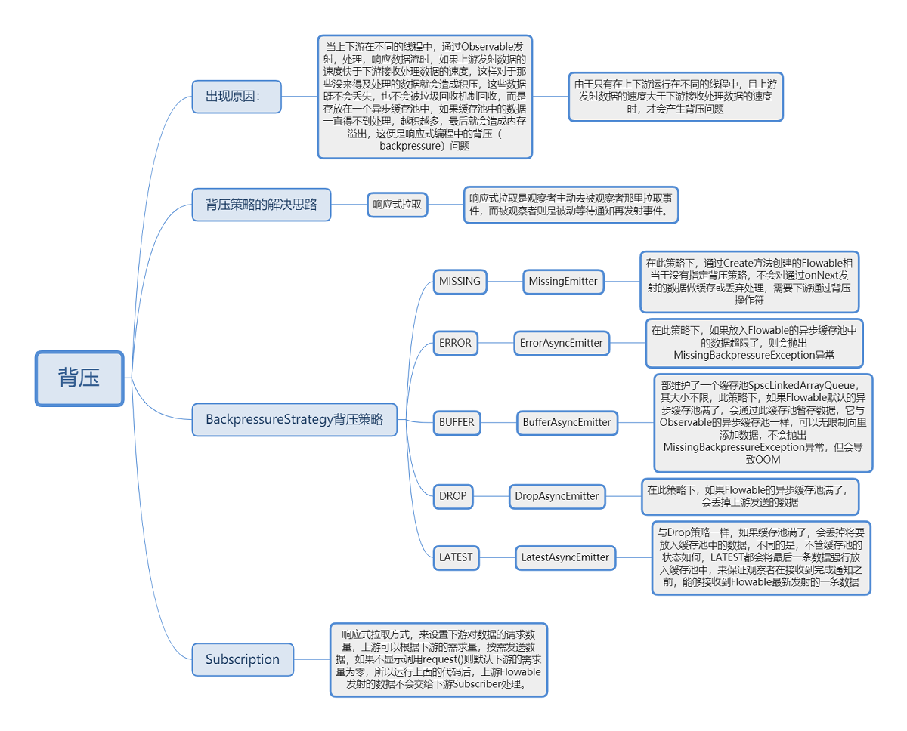

# 1、背压

<div align="center">
    
</div>

# 2、生命周期

RxJava生命周期可以通过<font size=5>[RxLifecycle](https://github.com/trello/RxLifecycle)</font>管理。

- 为什么要管理生命周期
   - 例如在Activity中使用Rxjava开启一个线程一直发送数据让下游处理。理论上在Activity销毁时应该停止发送。实际上是不会的，除非进程杀死。

RxLifecycle常见使用方法

- 您必须从Observable<T>代表生命周期流开始。然后，您RxLifecycle可以将序列绑定到该生命周期。
    - 您可以在生命周期发出任何东西时进行绑定：
        ```
        myObservable
            .compose(RxLifecycle.bind(lifecycle))
            .subscribe();      
        ```
    - 或者，您可以绑定到特定的生命周期事件发生的时间：
        ```
        myObservable
            .compose(RxLifecycle.bindUntilEvent(lifecycle, ActivityEvent.DESTROY))
            .subscribe();      
        ```
    - 或者，您可以让RxLifecycle确定结束序列的适当时间：
        ```
        myObservable
            .compose(RxLifecycleAndroid.bindActivity(lifecycle))
            .subscribe();        
        ```
    - 假设您要在相反的生命周期事件中结束序列-例如，如果在期间订阅START，它将在终止STOP。如果您在之后订阅PAUSE，它将在下一个销毁事件PAUSE终止（例如， 将在终止STOP）。


