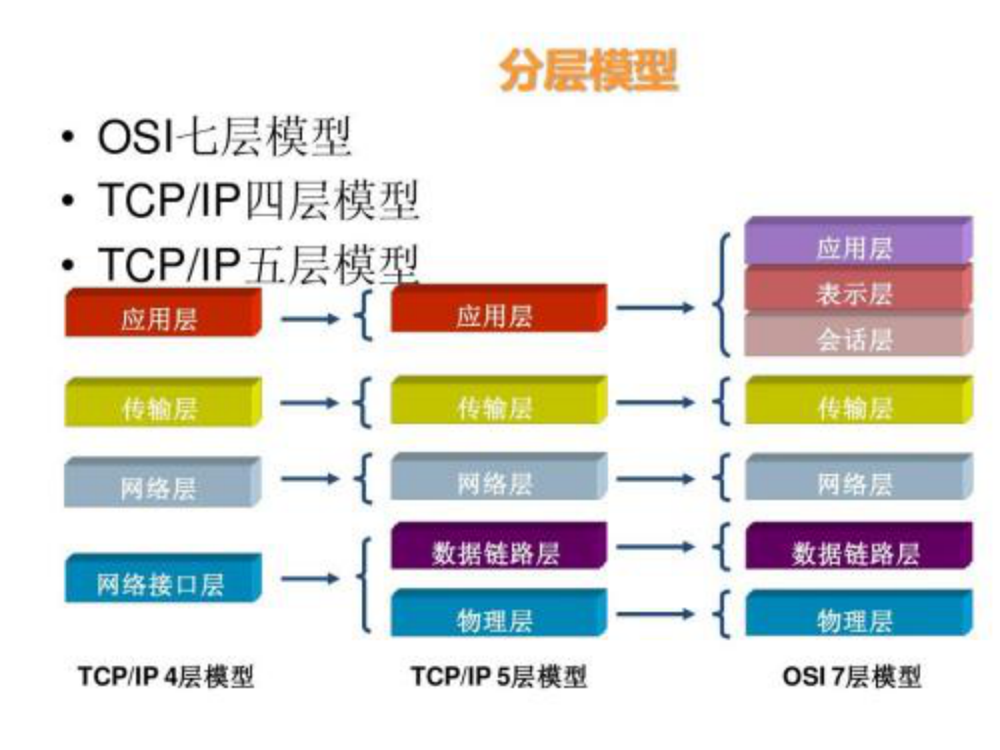
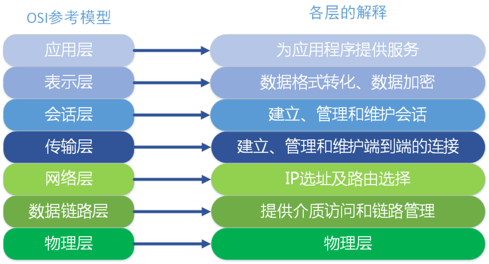
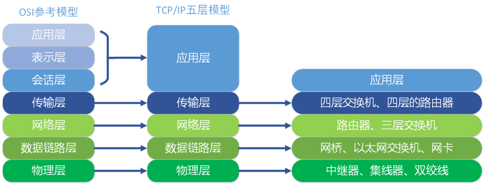
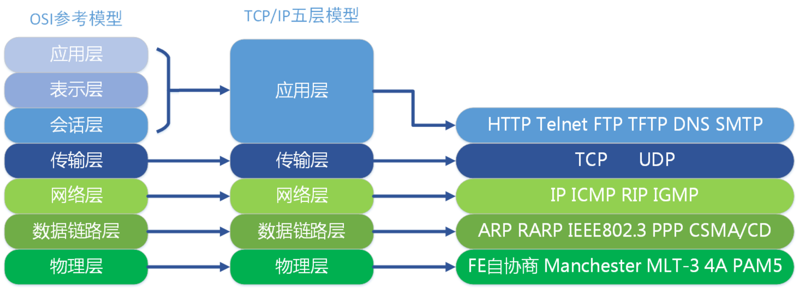
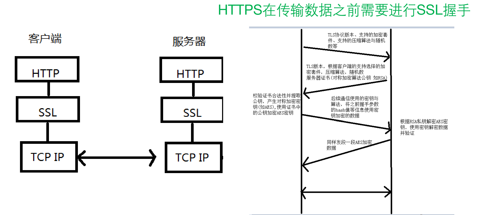

# 1、Rxjava线程切换的手写
详情见代码

# 2、网络分层模型

    

# 3、OSI各层解释

    

# 4、各层对应的设备

    

# 5、各层对应协议

    

# 6、TCP/IP 三次握手、四次挥手

# 7、Http和Https

**Http**:建立在TCP协议之上的”超文本传输协议”(HyperText Transfer Protocol)

HTTP1.x在传输数据时，所有传输的内容都是明文，无法保证数据的安全性。
网景在1994年创建了HTTPS，**HTTPS就是安全版的HTTP**

    

