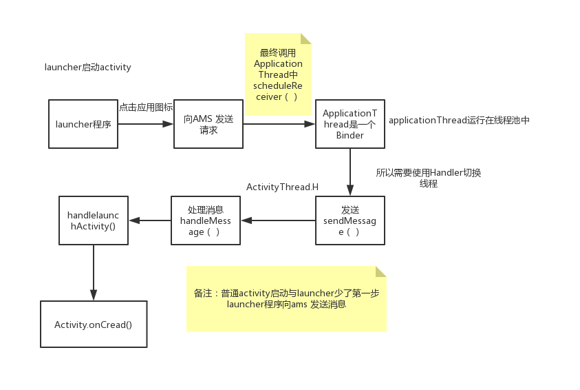
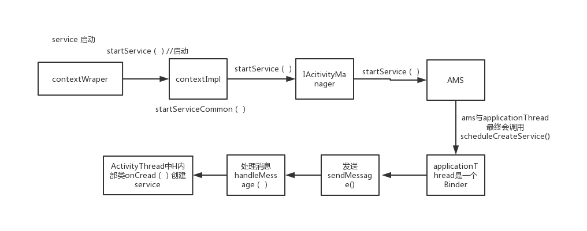
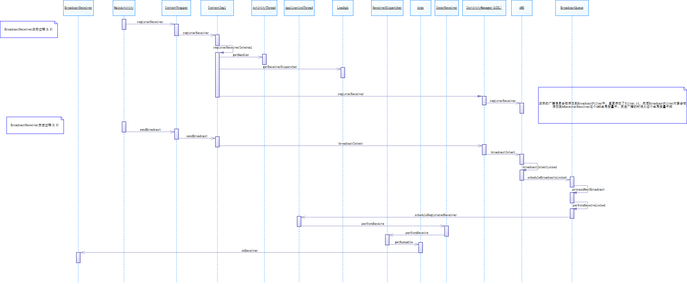

# 1.<font color=red>Android系统启动</font>


init 进程启动：

- 主要工作：初始化和启动属性服务，也是用来启动Zygote进程
- 启动步骤
  1. 启动电源以及系统启动
  2. 引导程序BootLoader启动
  3. Linux内核启动
  4. init进程启动
  5. Zygote 进程启动
  6. SystemServer进程启动（启动ams、pms、wms，全都在SystemServer进程中）
  7. Launcher 启动

ServiceManager启动


# 2.<font color=red>AMS</font>

AMS 如何注册的


## 2.1.<font color=red>应用程序的启动</font>


8.0源码

1. ZygoteInit.java(frameworks\base\core\java\com\android\internal\os)
   ```
   public static void main(String argv[]) {
       ...
       // 创建一个Service端的Socket
       zygoteServer.registerServerSocket(socketName);    
       if (!enableLazyPreload) {
                ...
				// 预加载类和资源
                preload(bootTimingsTraceLog);
                ...
       } else {
                ...
       }
       ...    
       if (startSystemServer) {
			// 启动SystemServer进程
            Runnable r = forkSystemServer(abiList, socketName, zygoteServer);
            ...
       }
       ...
       // 等待AMS 请求 
       caller = zygoteServer.runSelectLoop(abiList);        
   }        
   ```
   - forkSystemServer(...)  // 返回Runable
   - handleSystemServerProcess(...);
   - ZygoteInit.zygoteInit(...);
   - RuntimeInit.applicationInit(...);
2. RuntimeInit.java
   - applicationInit(...)
   - findStaticMain(...)
     ```
      private static Runnable findStaticMain(...) {
          ...
          return new MethodAndArgsCaller(m, argv); // 这是个Runnable,这里会调用到ActivityThread的Main方法
     }                
     ```
   - 
3. ActivityManagerService.java
   - startProcessLocked(...)
   - Process.start(...) // 启动应用程序进程
4. Process.java(frameworks\base\core\java\android\os)
   - start(...)
5. ZygoteProcess.java(frameworks\base\core\java\android\os)
   - start(...)
   - startViaZygote(...)
     ```
     private Process.ProcessStartResult startViaZygote(...)
                                                      throws ZygoteStartFailedEx {
        ArrayList<String> argsForZygote = new ArrayList<String>();
		// 创建单链表argsForZygote并将应用的启动参数保存在其中     
        synchronized(mLock) {
            return zygoteSendArgsAndGetResult(openZygoteSocketIfNeeded(abi), argsForZygote);
        }
     }   
     ```
   - openZygoteSocketIfNeeded(...)
     ```
        private ZygoteState openZygoteSocketIfNeeded(String abi) throws ZygoteStartFailedEx {
            ...    
            if (primaryZygoteState == null || primaryZygoteState.isClosed()) {
                try {
                    // 与Zygote进程建立连接
                    primaryZygoteState = ZygoteState.connect(mSocket);
                } catch (IOException ioe) {
                    throw new ZygoteStartFailedEx("Error connecting to primary zygote", ioe);
                }
            }
            // 连接Zygote主模式返回ZygoteState是否与启动程序进程所需要的abi匹配
            if (primaryZygoteState.matches(abi)) {
                return primaryZygoteState;
            }
        
            // 如果不匹配，则尝试连接Zygote辅模式
            if (secondaryZygoteState == null || secondaryZygoteState.isClosed()) {
                try {
                    secondaryZygoteState = ZygoteState.connect(mSecondarySocket);
                } catch (IOException ioe) {
                    throw new ZygoteStartFailedEx("Error connecting to secondary zygote", ioe);
                }
            }
            // 连接Zygote辅模式返回ZygoteState是否与启动程序进程所需要的abi匹配
            if (secondaryZygoteState.matches(abi)) {
                return secondaryZygoteState;
            }
        
            throw new ZygoteStartFailedEx("Unsupported zygote ABI: " + abi);
        }     
     ```


## 2.2.<font color=red>Activity 启动</font>




1. 启动的起点发生在Launcher活动中，启动一个app说简单点就是启动一个Activity，那么我们说过所有组件的启动，切换，调度都由AMS来负责的，
所以第一步就是Launcher响应了用户的点击事件，然后通知AMS
2. AMS得到Launcher的通知，就需要响应这个通知，主要就是新建一个Task去准备启动Activity，并且告诉Launcher你可以休息了（Paused）；
3. Launcher得到AMS让自己“休息”的消息，那么就直接挂起，并告诉AMS我已经Paused了；
4. AMS知道了Launcher已经挂起之后，就可以放心的为新的Activity准备启动工作了，首先，APP肯定需要一个新的进程去进行运行，
所以需要创建一个新进程，这个过程是需要Zygote参与的，AMS通过Socket去和Zygote协商，如果需要创建进程，那么就会fork自身，创建一个线程，
新的进程会导入ActivityThread类，这就是每一个应用程序都有一个ActivityThread与之对应的原因；
5. 进程创建好了，通过调用上述的ActivityThread的main方法，这是应用程序的入口，在这里开启消息循环队列，这也是主线程默认绑定Looper的原因；
6. 这时候，App还没有启动完，要永远记住，四大组建的启动都需要AMS去启动，将上述的应用进程信息注册到AMS中，AMS再在堆栈顶部取得要启动的
Activity，通过一系列链式调用去完成App启动；

## 2.3.<font color=red>Service 启动</font>



## 2.4.<font color=red>广播的注册，发送和接受过程</font>



## 2.5.<font color=red>Content Provider 启动过程</font>

