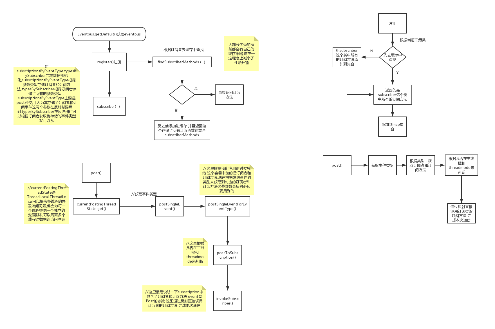

# 1.EventBus介绍及使用

EventBus可以代替Android传统的Intent,Handler,Broadcast或接口函数,在Fragment,Activity,Service线程之间传递数据，执行方法

<font color=red>sticky</font>

- eventbus 原理： 先注册接收事件，才能接收别人发送的 postevent。
- poststicky 作用：`指事件消费者在事件发布之后才注册的也能接收到该事件的特殊类型。`

```
EventBus.getDefault().post(new String("hello"));
EventBus.getDefault().postSticky(new String("hello"));

@Subscribe(threadMode = ThreadMode.MainThread, sticky = true)
public void recevice(String event){
    mTextView.setText(event);
}
```

# 2.源码分析



1. @Subscribe：@Subscribe采用运行时注解,且注解只能用在函数上,默认的threadmode为posting
   - threadMode 默认为posting
     - POSTING： 事件处理和post在同一个线程中,如果是UI线程注意耗时操作。
     - MAIN：事件处理将在Android的主线程(UI线程)中被调用。
     - MAIN_ORDERED：在主线程中处理事件, 事件总是放入队列中通过handle处理, 并且总是按着发布时间先后顺序执行事件的处理
     - BACKGROUND： 如果发布者的线程不是主线程那么就在发布者的线程中执行，否则会单独生成一个子线程来执行操作 （可用来执行文件读写操作）
     - ASYNC：事件始终执行在新的子线程中 类似newThread( ) （建议进行网络请求、数据库查询）
   - sticky：配合 poststicky
     - 指事件消费者在事件发布之后才注册的也能接收到该事件的特殊类型。
2. register
   1. 通过getDefault获取EventBus实例，这是一条默认的事件总线,通过单例模式实现,其构造函数是Public的也可以通过new的形式来创建多条事件总线
   2. 从缓存中获取订阅方法列表,如果缓存中不存在则通过`反射或apt的方式`获取到订阅者所有的函数,遍历再通过权限修饰符.参数长度(只允许一个参数).注解(@Subscribe)来判断是否是具备成为订阅函数的前提,
   具备则构建一个SubscriberMethod(订阅方法，其相当于一个数据实体类,包含方法,threadmode,参数类型,优先级,是否粘性事件这些参数),循环结束订阅函数列表构建完成添加进入缓存
   3. 对subscriptionsByEventType.typesBySubscriber完成数据初始化,subscriptionsByEventType根据参数类型存储订阅者和订阅方法,typesBySubscriber根据订阅者存储了所有的参数类型，
   subscriptionsByEventType主要是post时使用,因为其存储了订阅者和订阅事件这两个参数在反射时要用到,typesBySubscriber在反注册时可以根据订阅者获取到存储的事件类型就可以从subscriptionsByEventType中
   获取到对应的订阅者和订阅方法释放资源,还可以用来判断是否注册,这些最后会分析到
3. post
   - 使用ThreadLocal来存储事件,他可以隔离多个线程对数据的访问冲突
   - 根据事件类型(也就是Post参数的类型)为key从subscriptionsByEventType获取订阅方法和订阅者,这个容器不了解的可以看下注册的总结
   - 根据线程和threadmode来判断
4. unregister
   1. 根据订阅者从typesBySubscriber中获取到所有的事件类型
   2. 有了事件类型列表就可以遍历事件类型从subscriptionsByEventType获取到对应的订阅者包括订阅函数来释放
   3. 根据订阅者删除掉typesBySubscriber中的事件类型 此时订阅者已经被释放不再持有该订阅者引用

# 3. 两种解析方式

## 注解的方式去解析

## 编译时注解 apt的方式去解析

``` java
    List<SubscriberMethod> findSubscriberMethods(Class<?> subscriberClass) {
        // 先从缓存里面读取，订阅者的 Class
        List<SubscriberMethod> subscriberMethods = METHOD_CACHE.get(subscriberClass);
        if (subscriberMethods != null) {
            return subscriberMethods;
        }
        // ignoreGeneratedIndex属性表示是否忽略注解器生成的MyEventBusIndex。
        // ignoreGeneratedIndex的默认值为false，可以通过EventBusBuilder来设置它的值
        if (ignoreGeneratedIndex) {
            // 利用反射来获取订阅类中所有订阅方法信息
            subscriberMethods = findUsingReflection(subscriberClass);
        } else {
            // 从注解器生成的MyEventBusIndex类中获得订阅类的订阅方法信息
            // 这个这里不说，可以去看看之前的编译时注解
            subscriberMethods = findUsingInfo(subscriberClass);
        }
        if (subscriberMethods.isEmpty()) {
            throw new EventBusException("Subscriber " + subscriberClass
                    + " and its super classes have no public methods with the @Subscribe annotation");
        } else {
            METHOD_CACHE.put(subscriberClass, subscriberMethods);
            return subscriberMethods;
        }
    }
```

findUsingInfo

```java
private List<SubscriberMethod> findUsingInfo(Class<?> subscriberClass) {
        FindState findState = prepareFindState();
        findState.initForSubscriber(subscriberClass);
        while (findState.clazz != null) {
        	//这里从编译时注解生成的类去拿
            findState.subscriberInfo = getSubscriberInfo(findState);
            if (findState.subscriberInfo != null) {
                SubscriberMethod[] array = findState.subscriberInfo.getSubscriberMethods();
                for (SubscriberMethod subscriberMethod : array) {
                    if (findState.checkAdd(subscriberMethod.method, subscriberMethod.eventType)) {
                        findState.subscriberMethods.add(subscriberMethod);
                    }
                }
            } else {
                findUsingReflectionInSingleClass(findState);
            }
            findState.moveToSuperclass();
        }
        return getMethodsAndRelease(findState);
    }
```

我们在前面分析的时候，直接分析的 findUsingReflectionInSingleClass(findState)方法，因为getSubscriberInfo()返回null，那什么时候getSubscriberInfo()返回不为null呢 ？ 我们具体看看getSubscriberInfo()。

``` java
private SubscriberInfo getSubscriberInfo(FindState findState) {
       if (findState.subscriberInfo != null && findState.subscriberInfo.getSuperSubscriberInfo() != null) {
           SubscriberInfo superclassInfo = findState.subscriberInfo.getSuperSubscriberInfo();
           if (findState.clazz == superclassInfo.getSubscriberClass()) {
               return superclassInfo;
           }
       }
      //  判断subscriberInfoIndexes 是否为null，默认为null,当我们使用apt插件构建代码 的时候，可以手动的调用EventBusBuilder的addIndex，将subscriberInfoIndexes 进行赋值。
       if (subscriberInfoIndexes != null) {
           for (SubscriberInfoIndex index : subscriberInfoIndexes) {
               SubscriberInfo info = index.getSubscriberInfo(findState.clazz);
               if (info != null) {
                   return info;
               }
           }
       }
       return null;
   }
```

# 4.<font color=red>如何使用新特性SubscriberIndex：</font>
在gradle文件做以下配置：

java

```
android {
    defaultConfig {
        javaCompileOptions {
            annotationProcessorOptions {
                arguments = [ eventBusIndex : 'com.example.myapp.MyEventBusIndex' ]
            }
        }
    }
}

dependencies {
    compile 'org.greenrobot:eventbus:3.2.0'
    annotationProcessor 'org.greenrobot:eventbus-annotation-processor:3.2.0'
}
```

kotlin

```
apply plugin: 'kotlin-kapt' // ensure kapt plugin is applied
 
dependencies {
    def eventbus_version = '3.2.0'
    implementation "org.greenrobot:eventbus:$eventbus_version"
    kapt "org.greenrobot:eventbus-annotation-processor:$eventbus_version"
}
 
kapt {
    arguments {
        arg('eventBusIndex', 'com.example.myapp.MyEventBusIndex')
    }
}
```

使用
```
EventBus.builder().addIndex(new MyEventBusIndex()).installDefaultEventBus();
// Now the default instance uses the given index. Use it like this:
EventBus eventBus = EventBus.getDefault();
```
