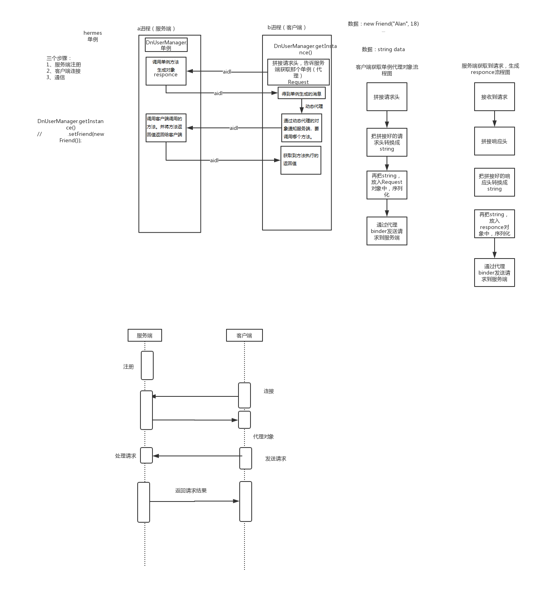

# 1.Hermes介绍
[Hermes](https://github.com/Xiaofei-it/Hermes/blob/master/README-ZH-CN.md)

[HermesEventBus](https://github.com/Xiaofei-it/HermesEventBus/blob/master/README-zh-CN.md)

饿了么开发的跨进程通信架构：原理还是Binder、aidl

# 2.原理

代码解析：

1. MainActivity 为用户端
2. SecondActivity 为客户端
3. sendGetObjRequest(...)方法，`让服务端创建对象，并根据客户端这边的接口生成动态代理对象返回给客户端，动态代理对象里面方法调用还是发送消息到服务端通知服务端调用`
4. sendInvokeMethodRequest(...)方法：`客户端这边动态代理对象调用方法，会传递到服务端让服务端的单例对象调用，并将方法返回值返回给客户端`
5. InstanceResponceMake.java：`创建对象，并保存。`
6. ObjectResponceMake.java：`使用保存的对象，执行客户端传递过来的需要执行的方法信息。`
