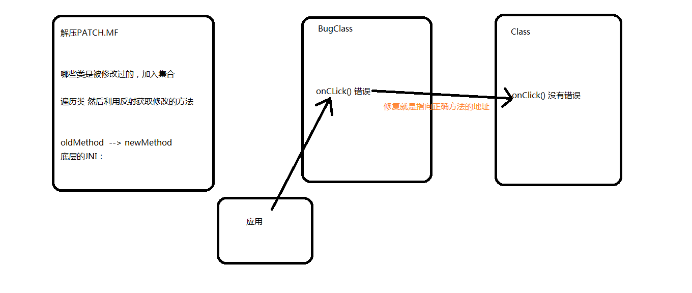
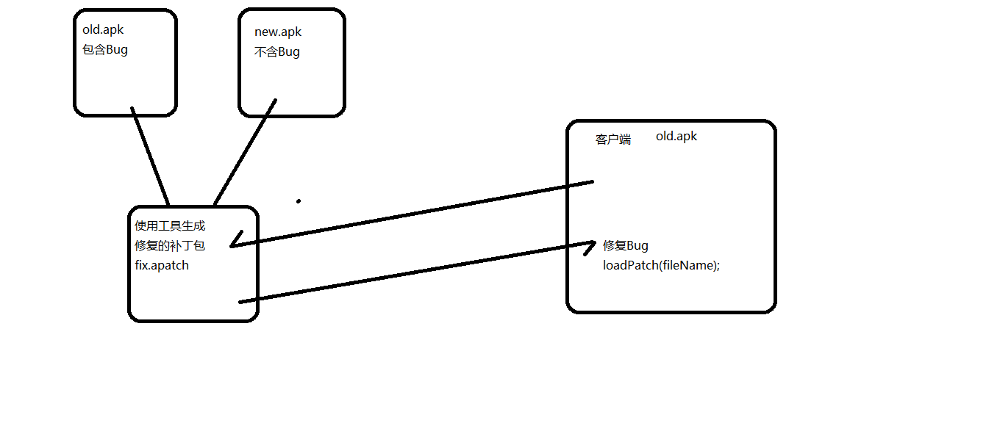

@[TOC](Android热修复-阿里Andfix)


<font color=red>**注意：**</font>  
　　看看源码里，有个Compat的isSupport()方法，0.3.1版本是支持API 8到23，0.5.0支持的是API 8到24.不支持26的

　　<font color = red>0.5.0 只支持到Android 7.0</font>

```
	// from android 2.3 to android 7.0
	private static boolean isSupportSDKVersion() {
		if (android.os.Build.VERSION.SDK_INT >= 8
				&& android.os.Build.VERSION.SDK_INT <= 24) {
			return true;
		}
		return false;
	}

	private static boolean inBlackList() {
		return false;
	}
```

## 添加依赖库：

```
    //阿里的热更新
    api 'com.alipay.euler:andfix:0.5.0@aar'
```

**底层原理:**



**打补丁流程:**



## 生成差分包

```
命令是：apkpatch.bat -f <new> -t <old> -o <output> -k <keystore> -p <*> -a <alias> -e <*>

-f : 没有Bug的新版本apk
-t : 有bug的旧版本apk
-o : 生成的补丁文件所放的文件夹
-k : 签名打包密钥
-p : 签名打包密钥密码
-a : 签名密钥别名
-e : 签名别名密码（这样一般和密钥密码一致）

我的mac ：apkpatch.sh -f new.apk -t old.apk -o out -k jokes.jks -p android -a joke -e android
我的windows ：apkpatch -f new.apk -t old.apk -o out -k jokes.jks -p android -a joke -e android


有时，您的团队成员可能会修复彼此的错误，并且不仅会生成一个.apatch。在这种情况下，您可以.apatch使用此工具合并文件，

usage: apkpatch -m <apatch_path...> -o <output> -k <keystore> -p <***> -a <alias> -e <***>
-a,--alias <alias>     keystore entry alias.
 -e,--epassword <***>   keystore entry password.
 -k,--keystore <loc>    keystore path.
 -m,--merge <loc...>    path of .apatch files.
 -n,--name <name>       patch name.
 -o,--out <dir>         output dir.
 -p,--kpassword <***>   keystore password.
```


## 源码的实现：

　　修复方法：

```
static void replaceMethod(JNIEnv* env, jclass clazz, jobject src,
		jobject dest) {
	if (isArt) {
		art_replaceMethod(env, src, dest);
	} else {
		dalvik_replaceMethod(env, src, dest);
	}
}
```

##  4.4版本以后 isArt art架构   4.4版本前期dalvik架构

```
extern void __attribute__ ((visibility ("hidden"))) dalvik_replaceMethod(
		JNIEnv* env, jobject src, jobject dest) {
	jobject clazz = env->CallObjectMethod(dest, jClassMethod);
	ClassObject* clz = (ClassObject*) dvmDecodeIndirectRef_fnPtr(
			dvmThreadSelf_fnPtr(), clazz);
	clz->status = CLASS_INITIALIZED;

	Method* meth = (Method*) env->FromReflectedMethod(src);
	Method* target = (Method*) env->FromReflectedMethod(dest);
	LOGD("dalvikMethod: %s", meth->name);

//	meth->clazz = target->clazz;
	meth->accessFlags |= ACC_PUBLIC;
	meth->methodIndex = target->methodIndex;
	meth->jniArgInfo = target->jniArgInfo;
	meth->registersSize = target->registersSize;
	meth->outsSize = target->outsSize;
	meth->insSize = target->insSize;

	meth->prototype = target->prototype;
	meth->insns = target->insns;
    // 错误的方法指向正确的方法
	meth->nativeFunc = target->nativeFunc;
}
```


## 正式开发需要注意的地方：

- 每次生成之后一定要测试；
- 尽量的不要分包，不要分多个dex
- 混淆的时候，设计到NDK   AndFix.java 不要混淆
- 生成包之后一般会加固什么的，这个时候生成的差分包，一定要在之前去生成。
- 既然是去修复方法，第一个不能增加成员变量，不能增加方法

2.7 NDK的必要：

压缩图片  BitmapFactory.decodeFile() 去压缩，3M 100K   NDK   libjpeg.so去压缩  100K 
gif 动画  GifView显示   OOM    NDK去处理。


 


      
     
 

