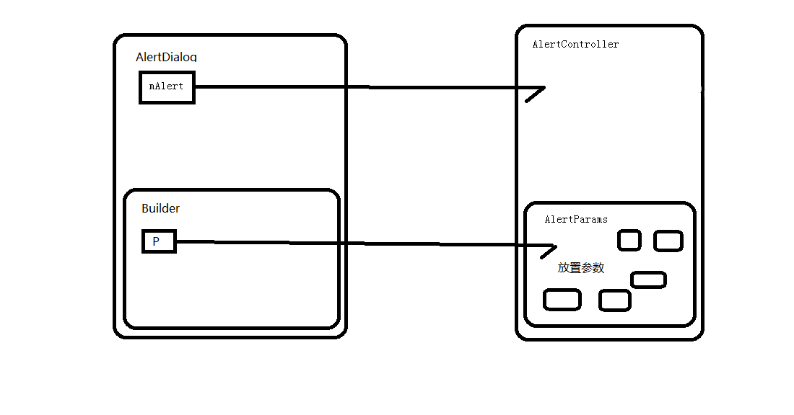

@[TOC](Builder设计模式构建万能Dialog)

万能Dialog主要仿照的是AlertDialog的源码，所以先来看下AlertDialog的源码

## AlertDialg的源码

```
        public AlertDialog create() {
            // Context has already been wrapped with the appropriate theme.
            final AlertDialog dialog = new AlertDialog(P.mContext, 0, false);
            P.apply(dialog.mAlert);
            dialog.setCancelable(P.mCancelable);
            if (P.mCancelable) {
                dialog.setCanceledOnTouchOutside(true);
            }
            dialog.setOnCancelListener(P.mOnCancelListener);
            dialog.setOnDismissListener(P.mOnDismissListener);
            if (P.mOnKeyListener != null) {
                dialog.setOnKeyListener(P.mOnKeyListener);
            }
            return dialog;
        }
```

`P.apply(dialog.mAlert);`

组装Dialog的参数

```
        public void apply(AlertController dialog) {
            if (mCustomTitleView != null) {
                dialog.setCustomTitle(mCustomTitleView);
            } else {
                if (mTitle != null) {
                    dialog.setTitle(mTitle);
                }
                if (mIcon != null) {
                    dialog.setIcon(mIcon);
                }
                if (mIconId != 0) {
                    dialog.setIcon(mIconId);
                }
                if (mIconAttrId != 0) {
                    dialog.setIcon(dialog.getIconAttributeResId(mIconAttrId));
                }
            }
            if (mMessage != null) {
                dialog.setMessage(mMessage);
            }
            if (mPositiveButtonText != null) {
                dialog.setButton(DialogInterface.BUTTON_POSITIVE, mPositiveButtonText,
                        mPositiveButtonListener, null);
            }
            
            ......
        }
```



## 万能Dialog的主要对象

CommonDialog （Dialog对象）
CommonDialog.Builder  规范一系列的组装过程
AlertController 具体的构建器
AlertController.AlertParams 存放参数 ， 一部分设置参数的功能
DialogViewHelper Dialog View的辅助处理类
ClickEntry 点击事件对象（包含了点击事件和对应的是否限制间隔）


 


      
     
 

