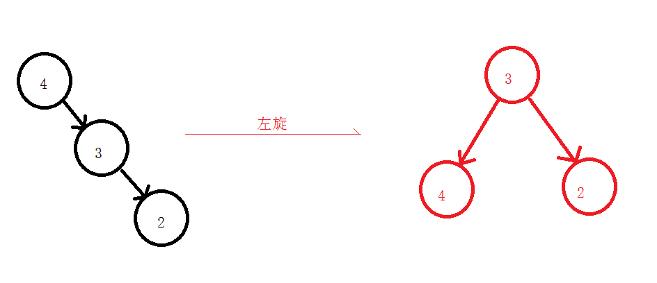
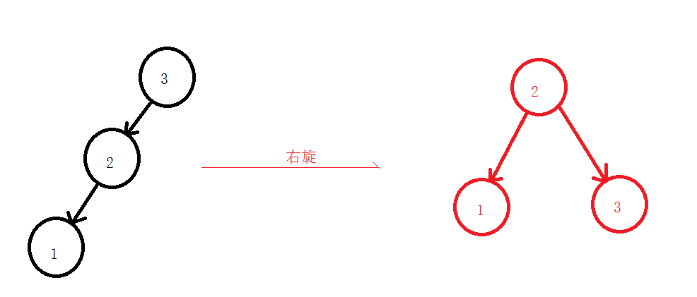

# <center>38. AVL树<center>

具体代码请看：**[NDKPractice项目的datastructure38avl](https://github.com/EastUp/NDKPractice/tree/master/datastructure38avl)**

# 1. AVL树的定义：

定义：`左右两个子树高度不超过1`

也称为`平衡二叉搜索树`,意义：
1. 普通二叉搜索树会出现极度不平衡的情况，复杂度有可能退化成O(n)
2. 平衡二叉搜索树可确保复杂度在O(logn)

# 2.旋转操作

[3,2,1,4,5,6,7,10,9,8]

## 2.1 左旋


## 2.2 右旋


## 2.3 先左旋再右旋


## 2.4 先右旋再左旋


# 3.移除

`比较复杂： 1. 当左右不为空，最大或者最小值会作为后继，要确保在删除最大或者最小值的时候要更新节点的高度`

看项目工程代码的 `removeNode` 方法

# 4. 具体代码

```c++
// c++ map multiMap 红黑树
// java Map 和 c++ Map 比较
template<class K, class V>
struct TreeNode {
public:
    TreeNode<K,V> *left = NULL;
    TreeNode<K,V> *right = NULL;
    K key = NULL;
    V value = NULL;
    int height = 1; //自己算上，所以为1

    TreeNode(TreeNode<K,V> *pNode):height(pNode->height){
        this->left = pNode->left;
        this->right = pNode->right;
        this->key = pNode->key;
        this->value = pNode->value;
    }

    TreeNode(K key, V value):key(key),value(value),height(1){
    }

};


// 二叉搜索树
template<class K, class V>
class AVL {
    int count = 0; // 总个数
    TreeNode<K,V> *root = NULL; // 根节点

public:
    AVL(){}

    ~AVL(){
        deleteAllNode(root);
        root = NULL;
    }

    // 新增
    void put(K key,V value){
        root = addNode(root,key,value);
    }

    // 获取
    V get(K key){
        TreeNode<K,V> *node = root;
        while (node){
            if(node->key == key)
                return node->value;
            else if(node->key > key)
                node = node->left;
            else if(node->key < key)
                node = node->right;
        }
        return NULL;
    }

    int size(){
        return count;
    }

    // 是否包含
    bool contains(K key){
        TreeNode<K,V> *node = root;
        while (node){
            if(node->key == key)
                return true;
            else if(node->key > key)
                node = node->left;
            else if(node->key < key)
                node = node->right;
        }
        return false;
    }


    // 移除
    void remove(K key){
        root = removeNode(root,key);
    }

    // 中序遍历 就是相当于从小到大的升序遍历了
    void infixOrderTraverse(void(*log)(K,V)){
        infixOrderTraverse(root,log);
    }


    // 层序排列
    void levelOrderTraverse(void(*log)(K,V)){
        levelOrderTraverse(root,log);
    }


private:

    int getHeight(TreeNode<K,V> *pNode){
        return pNode ? pNode->height : 0;
    }

    // 右旋
    TreeNode<K,V>* r_rotation(TreeNode<K,V> *pNode){
        TreeNode<K,V> *left = pNode->left;
        TreeNode<K,V> *right = left->right;

        left->right = pNode;
        pNode->left = right;

        // 更新高度
        pNode->height = max(getHeight(pNode->left),getHeight(pNode->right))+1;
        left->height = max(getHeight(left->left),getHeight(left->right))+1;
        return left;
    }

    // 左旋
    TreeNode<K,V>* l_rotation(TreeNode<K,V> *pNode){
        TreeNode<K,V> *right = pNode->right;
        TreeNode<K,V> *left = right->left;

        right->left = pNode;
        pNode->right = left;

        // 更新高度
        pNode->height = max(getHeight(pNode->left),getHeight(pNode->right))+1;
        right->height = max(getHeight(right->left),getHeight(right->right))+1;
        return right;
    }

    // 先左旋再右旋
    TreeNode<K,V>* l_r_rotation(TreeNode<K,V> *pNode){
        pNode->left = l_rotation(pNode->left);
        return r_rotation(pNode);
    }

    // 先右旋再左旋
    TreeNode<K,V>* r_l_rotation(TreeNode<K,V> *pNode){
        pNode->right = r_rotation(pNode->right);
        return l_rotation(pNode);
    }

    // 删除所有的数据
    void deleteAllNode(TreeNode<K,V> *pNode){
        if(pNode->left)
            deleteAllNode(pNode->left);
        if(pNode->right)
            deleteAllNode(pNode->right);
        delete(pNode);
    }

    TreeNode<K,V> *addNode(TreeNode<K,V> *pNode,K key,V value){
        if(!pNode){
            count++;
            return new TreeNode<K,V>(key,value);
        }

        if(pNode->value > key){
            pNode->left = addNode(pNode->left,key,value);
            if(getHeight(pNode->left) - getHeight(pNode->right) == 2){
                // 调整
                if(getHeight(pNode->left->right) > getHeight(pNode->left->left)){
                    // 先左旋再右旋
                    pNode = l_r_rotation(pNode);
                }else{
                    pNode = r_rotation(pNode);
                }
            }
        } else if (pNode->value < key){
            pNode->right = addNode(pNode->right,key,value);
            if(getHeight(pNode->right) - getHeight(pNode->left) == 2){
                // 调整
                if(getHeight(pNode->right->left)>getHeight(pNode->right->right)){
                    // 先右旋再左旋
                    pNode = r_l_rotation(pNode);
                }else{
                    pNode = l_rotation(pNode);
                }
            }
        }else{
            pNode->value = value;
        }

        // 更新二叉树高度
        pNode->height = max(getHeight(pNode->left),getHeight(pNode->right))+1;


        return pNode;
    }

    TreeNode<K,V> *removeNode(TreeNode<K,V> *pNode,K key){

        if(!pNode)
            return NULL;

        if(pNode->key > key){
            pNode->left = removeNode(pNode->left,key);
            if(getHeight(pNode->right) - getHeight(pNode->left) == 2){
                // 调整
                if(getHeight(pNode->right->left)>getHeight(pNode->right->right)){
                    // 先右旋再左旋
                    pNode = r_l_rotation(pNode);
                }else{
                    pNode = l_rotation(pNode);
                }
            }
        }
        else if(pNode->key < key){
            pNode->right = removeNode(pNode->right,key);
            if(getHeight(pNode->left) - getHeight(pNode->right) == 2){
                // 调整
                if(getHeight(pNode->left->right) > getHeight(pNode->left->left)){
                    // 先左旋再右旋
                    pNode = l_r_rotation(pNode);
                }else{
                    pNode = r_rotation(pNode);
                }
            }
        }
        else{ // 相等找到了
            count --;
            if(pNode->left == NULL && pNode->right == NULL){
                delete(pNode);
                return NULL;
            }else if(pNode->left == NULL){
                TreeNode<K, V> *right = pNode->right;
                delete (pNode);
                return right;
            } else if (pNode->right == NULL) {
                TreeNode<K, V> *left = pNode->left;
                delete (pNode);
                return left;
            } else {
                // 左右子树都不为 NULL
                if(getHeight(pNode->left) > getHeight(pNode->right)){
                    // 左右两子树都不为空（把左子树的最大值作为根，或者右子树的最小值作为根），因为下面会删除这个节点所以需要重新赋值创建
                    TreeNode<K, V> *max = maximum(pNode->left);
                    TreeNode<K, V> *successor = new TreeNode<K, V>(max);
                    // 删除左边最大的node，并更新高度
                    successor->left = removeNode(pNode->left,max->key);
                    count++;
                    successor->right = pNode->right;
                    delete (pNode);
                    pNode = successor;
                }else{
                    // 左右两子树都不为空（把左子树的最大值作为根，或者右子树的最小值作为根），因为下面会删除这个节点所以需要重新赋值创建
                    TreeNode<K, V> *min = minimum(pNode->right);
                    TreeNode<K, V> *successor = new TreeNode<K, V>(min);
                    // 删除右边最小的node，并更新高度
                    successor->right = removeNode(pNode->right,min->key);
                    count++;
                    successor->left = pNode->left;
                    delete (pNode);
                    pNode = successor;
                }
            }
        }

        pNode->height = max(getHeight(pNode->left),getHeight(pNode->right))+1;

        return pNode;
    }


    TreeNode<K, V> *deleteMax(TreeNode<K, V> *pNode) {
        if (pNode->right == NULL) {
            TreeNode<K, V> *left = pNode->left;
            delete (pNode);
            count--;
            return left;
        }
        pNode->right = deleteMax(pNode->right);
        return pNode;
    }

    // 查找当前树的左边的最大值 （右边的最小值怎么找？）
    TreeNode<K, V> *maximum(TreeNode<K, V> *pNode) {
        // 不断的往右边找，直到找到右子树为空节点
        if (pNode->right == NULL) {
            return pNode;
        }
        return maximum(pNode->right);
    }

    // 查找当前树的右边的最小值 （右边的最小值怎么找？）
    TreeNode<K, V> *minimum(TreeNode<K, V> *pNode) {
        // 不断的往右边找，直到找到右子树为空节点
        if (pNode->left == NULL) {
            return pNode;
        }
        return maximum(pNode->left);
    }

    void infixOrderTraverse(TreeNode<K,V> *pNode,void(*log)(K,V)){
        // 所有递归都应有递归到底的情况
        if (pNode == NULL) {
            return;
        }

        // 先左孩子
        infixOrderTraverse(pNode->left,log);

        // 再根节点
        log(pNode->key,pNode->value);

        // 再右孩子
        infixOrderTraverse(pNode->right,log);
    }

    void levelOrderTraverse(TreeNode<K,V> *pNode,void(*log)(K,V)){
        queue<TreeNode<K,V> *> que;
        que.push(pNode);
        while (!que.empty()){
            TreeNode<K,V> *node = que.front();
            log(node->key,node->value);
            que.pop(); // 弹出
            if(node->left)
                que.push(node->left);

            if(node->right)
                que.push(node->right);
        }
    }
};

```


