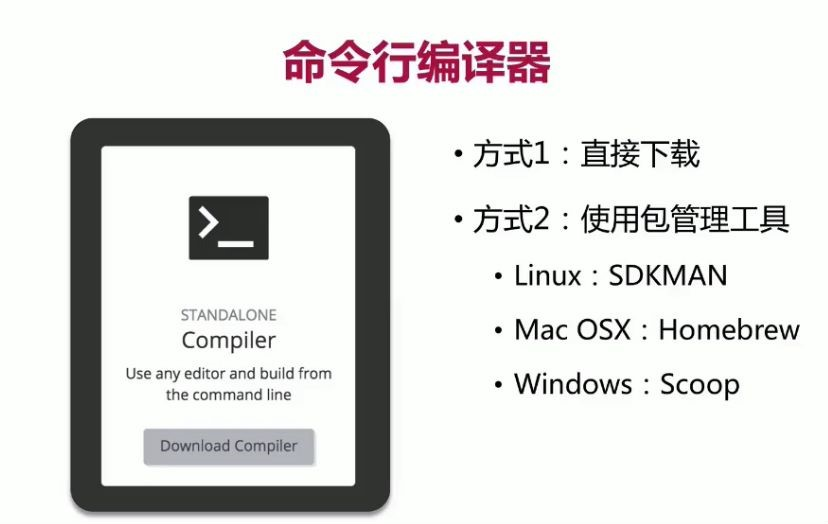

1、Kotlin官网：<https://kotlinlang.org/>

### 1. 命令行编译器方式一：直接下载

1. Kotlin命令行[编译器文档地址](https://kotlinlang.org/docs/command-line.html)：<https://kotlinlang.org/docs/command-line.html>

2. 命令行编译器[下载地址](https://github.com/JetBrains/kotlin/releases/tag/v1.5.31)：<https://github.com/JetBrains/kotlin/releases/tag/v1.5.31>

3. 命令行编译解压后bin目录下有各个平台的kotlinc 和 kotlin的命令

   1. 新建Hello.kt文件，内容为：

      ```
      fun main() {
      	println(\"Hello Word\");
      }
      ```

   2. 使用 `kotlinc Hello.kt` 编译Hello.kt文件，生成HelloKt.class

   3. 使用 `kotlin Hello` 执行Hello类文件

4. 进入交互式的Shell（REPL）
   1. 直接运行 \"kotlinc\"

.jpg)

###  2. 命令行编译器方式二：包处理器



1.  mac 上安装

    a.  安装Homebrew命令：/bin/bash -c \"\$(curl -fsSL https://raw.githubusercontent.com/Homebrew/install/HEAD/install.sh)\"

    b.  通过Homebrew安装kotlin命令：brew install kotlin

2.  Linux上安装

3.  安装SdkMan命令： \$ curl -s \"https://get.sdkman.io\" \| bash

4.  通过SdkMan安装kotlin命令： sdk install kotlin

windows下安装

a.  安装Scoop命令：iwr -useb get.scoop.sh \| iex

b.  通过Scoop安装kotlin命令： scoop install kotlin
