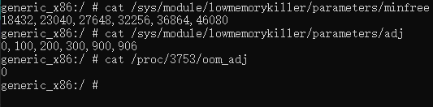

# 1.[进程优先级](https://developer.android.google.cn/guide/components/processes-and-threads.html?hl=zh-cn)

1. 前台进程–关键优先级
2. 可见进程–高优先级
3. 服务进程–高优先级
4. 后台进程–低优先级
5. 空进程 --低优先级

# 2.LMK(LowMemoryKiller)

## 2.1.为什么引入LMK

进程的启动分冷启动和热启动，当用户退出某一个进程的时候，并不会真正的将进程退出，而是将这个进程放到后台，以便下次启动的时候
可以马上启动起来，这个过程名为热启动，这也是Android的设计理念之一。这个机制会带来一个问题，每个进程都有自己独立的内存地址空
间，随着应用打开数量的增多,系统已使用的内存越来越大，就很有可能导致系统内存不足。为了解决这个问题，系统引入
LowmemoryKiller(简称lmk)管理所有进程，根据一定策略来kill某个进程并释放占用的内存，保证系统的正常运行

## 2.2.LMK基本原理

所有应用进程都是从zygote孵化出来的，记录在AMS中mLruProcesses列表中，由AMS进行统一管理，AMS中会根据进程的状态更新进程对应的oom_adj值，
这个值会通过文件传递到kernel中去，kernel有个低内存回收机制，在内存达到一定阀值时会触发清理oom_adj值高的进程腾出更多的内存空间

## 2.3.<font color=red>LMK杀进程标准</font>



1. minfree
   - 存放6个数值，单位内存页面数(一个页面4kb)
   - 最小的18432代表 当前台进程内存小于18432*4 / 1024 = 72 m 的时候会杀死进程
   - 最大的46080 代表当内存小于46080*4/1024 = 180 m 的时候会杀死空进程
   ```
   // 查看
   adb shell
   su
   cat /sys/module/lowmemorykiller/parameters/minfree
   ```
2. adj
   ```
   cat /sys/module/lowmemorykiller/parameters/adj
   ```
3. 查看进程的adj值
   ```
   cat /proc/<pid>/oom_adj
   // 有的厂商修改后，为以下指令
   cat /proc/<pid>/oom_score_adj
   ```
4. 内存阈值在不同的手机上不一样，一旦低于该值,Android便开始按顺序关闭进程. 因此Android开始结束优先级最低的空进程，
   即当可用内存小于180MB(46080)

# 3.<font color=red>Activity提权</font>

1. 原理
   - 监控手机锁屏解锁事件，在屏幕锁屏时启动1个像素透明的 Activity，在用户解锁时将 Activity 销毁掉，从而达到提高进程优先级的作用。
2. 代码实现
   1. 创建1个像素的Activity - KeepActivity
      ```
      Window window = getWindow();
      window.setGravity(Gravity.START | Gravity.TOP);
      WindowManager.LayoutParams attributes = window.getAttributes();
      attributes.width = 1;
      attributes.height = 1;
      attributes.x = 0;
      attributes.y = 0;
      window.setAttributes(attributes);
      ```
      - manifest注册
        ```
        <activity android:name=".activity.KeepActivity"
            android:excludeFromRecents="true"
            android:taskAffinity="com.dongnao.daemon.keep"
            android:theme="@style/KeepTheme"
            />
        ```
      - styles添加主题样式
        ```
        <style name="KeepTheme">
            <item name="android:windowBackground">@null</item>
            <item name="android:windowIsTranslucent">true</item>
        </style>
        ```
   2. 创建广播接收者 KeepReceiver
      ```
        if (TextUtils.equals(action, Intent.ACTION_SCREEN_OFF)) {
            //灭屏 开启1px activity
            KeepManager.getInstance().startKeep(context);
        } else if (TextUtils.equals(action, Intent.ACTION_SCREEN_ON)) {
            //亮屏 关闭
            KeepManager.getInstance().finishKeep();
        }      
      ```
   3. 创建广播注册管理单例类 KeepManager
      - 注册/反注册广播
      - 启动/关闭keepActivity
      - 设置keepActivity弱引用

# 4.<font color=red>Service提权</font>

- 创建一个前台服务用于提高app在按下home键之后的进程优先级
- [Service限制](https://developer.android.google.cn/about/versions/oreo/background#services)
- startForeground(ID,Notification)：使Service成为前台Service。 前台服务需要在通知栏显示一条通知

```
public class ForegroundService extends Service {
    @Nullable
    @Override
    public IBinder onBind(Intent intent) {
        return null;
    }

    @Override
    public void onCreate() {
        super.onCreate();
        if (Build.VERSION.SDK_INT >= Build.VERSION_CODES.O) {
            NotificationChannel channel = new NotificationChannel("deamon", "deamon",
                    NotificationManager.IMPORTANCE_LOW);
            NotificationManager manager = (NotificationManager) getSystemService(Context.NOTIFICATION_SERVICE);
            if (manager == null)
                return;
            manager.createNotificationChannel(channel);

            Notification notification = new NotificationCompat.Builder(this, "deamon")
                    .setAutoCancel(true)
                    .setCategory(Notification.CATEGORY_SERVICE)
                    .setOngoing(true)
                    .setPriority(NotificationManager.IMPORTANCE_LOW)
                    .build();
            startForeground(10, notification);
        } else if (Build.VERSION.SDK_INT >= Build.VERSION_CODES.JELLY_BEAN_MR2) {
            //如果 18 以上的设备 启动一个Service startForeground给相同的id
            //然后结束那个Service
            startForeground(10, new Notification());
            startService(new Intent(this, InnnerService.class));
        } else {
            startForeground(10, new Notification());
        }
    }

    public static class InnnerService extends Service {

        @Override
        public void onCreate() {
            super.onCreate();
            startForeground(10, new Notification());
            stopSelf();
        }

        @Nullable
        @Override
        public IBinder onBind(Intent intent) {
            return null;
        }
    }
}
```

# 5.广播拉活

在发生特定系统事件时，系统会发出广播，通过在 AndroidManifest 中静态注册对应的广播监听器，即可在发生响应事件时拉活。  
[但是从android 7.0开始，对广播进行了限制，而且在8.0更加严格](https://developer.android.google.cn/about/versions/oreo/background.html#broadcasts)

[可静态注册广播列表](https://developer.android.google.cn/guide/components/broadcast-exceptions.html)

# 6.“全家桶”拉活

有多个app在用户设备上安装，只要开启其中一个就可以将其他的app也拉活。比如手机里装了手Q、QQ空间、兴趣部落等等，那么打开任意一个app后，
其他的app也都会被唤醒。

# 7.Service机制(Sticky)拉活

1. 将 Service 设置为 START_STICKY，利用系统机制在 Service 挂掉后自动拉活
   1. START_STICKY
       - “粘性”。如果service进程被kill掉，保留service的状态为开始状态，但不保留递送的intent对象。随后系统会尝试重新创建service，
          由于服务状态为开始状态，所以创建服务后一定会调用onStartCommand(Intent,int,int)方法。如果在此期间没有任何启动命令被传递到service，那么参数Intent将为null。
   2. START_NOT_STICKY
       - “非粘性的”。使用这个返回值时，如果在执行完onStartCommand后，服务被异常kill掉，系统不会自动重启该服务。
   3. START_REDELIVER_INTENT
       - 重传Intent。使用这个返回值时，如果在执行完onStartCommand后，服务被异常kill掉，系统会自动重启该服务，并将Intent的值传入。
   4. START_STICKY_COMPATIBILITY
       - START_STICKY的兼容版本，但不保证服务被kill后一定能重启。
2. 只要 targetSdkVersion 不小于5，就默认是 START_STICKY。
   - 但是某些ROM 系统不会拉活。并且经过测试，Service 第一次被异常杀死后很快被重启，第二次会比第一次慢，第三次又会比前一次慢，一旦在短时间内 Service 被杀死4-5次，则系统不再拉起。

# 8. 账户同步拉活(成功率低)

1. [手机系统设置里会有“帐户”一项功能，任何第三方APP都可以通过此功能将数据在一定时间内同步到服务器中去。
系统在将APP帐户同步时，会将未启动的APP进程拉活](https://github.com/googlesamples/android-BasicSyncAdapter)
2. 账户服务
   1. 在AuthenticationService的onBind需要返回AbstractAccountAuthenticator的getIBinder
   2. 在manifest中配置service
      ```
      <service android:name=".account.AuthenticationService">
            <intent-filter>
                <action android:name="android.accounts.AccountAuthenticator" />
            </intent-filter>
            <meta-data
                android:name="android.accounts.AccountAuthenticator"
                android:resource="@xml/authenticator" />
        </service>
      ```
   3. 在xml中添加authenticator.xml
      ```
        <?xml version="1.0" encoding="utf-8"?>
        <account-authenticator xmlns:android="http://schemas.android.com/apk/res/android"
            android:accountType="com.dn.daemon.account"
            android:icon="@mipmap/ic_launcher"
            android:label="@string/app_name" />
        
        <!--accountType表示账户类型，必须唯一-->      
      ```
3. 添加账户
   ```
    //与authenticator.xml中accountType一致
    private static final String ACCOUNT_TYPE = "com.dn.daemon.account";

    public static void addAccount(Context context) {
        AccountManager accountManager = (AccountManager) context.getSystemService(
                Context.ACCOUNT_SERVICE);
        Account[] accounts = accountManager.getAccountsByType(ACCOUNT_TYPE);
        if (accounts.length > 0) {
            //账户已存在
            return;
        }
        Account dongnao = new Account("dongnao", ACCOUNT_TYPE);
        accountManager.addAccountExplicitly(dongnao, "dn123", new Bundle());//直接添加账户
    }   
   ```
4. 同步服务
   1. 创建一个Service作为同步Service，并且在onBind返回AbstractThreadedSyncAdapter的getSyncAdapterBinder
   2. 在manifest中配置service
      ```
       <service android:name=".account.SyncService">
            <intent-filter>
                <action android:name="android.content.SyncAdapter" />
            </intent-filter>
            <meta-data
                android:name="android.content.SyncAdapter"
                android:resource="@xml/syncadapter" />
        </service>
      ```
   3. 在xml中添加syncadapter.xml
      ```
        <?xml version="1.0" encoding="utf-8"?>
        <sync-adapter xmlns:android="http://schemas.android.com/apk/res/android"
            android:contentAuthority="com.dn.daemon.provider"
            android:accountType="com.dn.daemon.account"
            android:userVisible="false"
            android:supportsUploading="false"
            android:allowParallelSyncs="false"
            android:isAlwaysSyncable="true"
            />
            <!--contentAuthority 系统在进行账户同步的时候会查找 此auth的ContentProvider-->
            <!--accountType表示账户类型，与authenticator.xml里要一致-->
            <!-- userVisible 是否在“设置”中显示-->
            <!-- supportsUploading 是否必须notifyChange通知才能同步-->
            <!-- allowParallelSyncs 允许多个账户同时同步-->
            <!--isAlwaysSyncable 设置所有账号的isSyncable为1-->    
      ```
   4. 在manifest中配置ContentProvider
      ```
      <provider
        android:authorities="com.dn.daemon.provider"
        android:name=".account.SyncProvider"
        android:exported="false"
      />      
      ```
5. 开启同步
   - 为了达到进程保活的效果，可以开启自动同步。
     时间间隔虽然设置了1s，但是Android本身为了考虑同步所带来的消耗和减少唤醒设备的次数，1s只是一个参考时间
     ```
        //与syncadapter.xml中contentAuthority一致
        private static final String CONTENT_AUTHORITY = "com.dn.daemon.provider";
        
        public static void autoSync() {
                Account dongnao = new Account("dongnao", ACCOUNT_TYPE);
                //设置同步
                ContentResolver.setIsSyncable(dongnao, CONTENT_AUTHORITY, 1);
                //设置自动同步
                ContentResolver.setSyncAutomatically(dongnao, CONTENT_AUTHORITY, true);
                //设置同步周期
                ContentResolver.addPeriodicSync(dongnao, CONTENT_AUTHORITY, new Bundle(), 1);
            }     
     ```
# 9.<font color=red>JobScheduler拉活</font>

JobScheduler允许在特定状态与特定时间间隔周期执行任务。可以利用它的这个特点完成保活的功能,效果即开启一个定时器，
与普通定时器不同的是其调度由系统完成。

创建一个JobService

注意`setPeriodic`方法
在7.0以上如果设置小于15min不起作用，可以使用`setMinimumLatency`设置延时启动，并且轮询

# 10.推送拉活

根据终端不同，在小米手机（包括 MIUI）接入小米推送、华为手机接入华为推送。

# 11.Native拉活

Native fork子进程用于观察当前app主进程的存亡状态。对于5.0以上成功率极低。

# <font color=red>12.双进程守护</font>

两个进程共同运行，如果有其中一个进程被杀，那么另外一个进程就会将被杀的进程重新拉起


