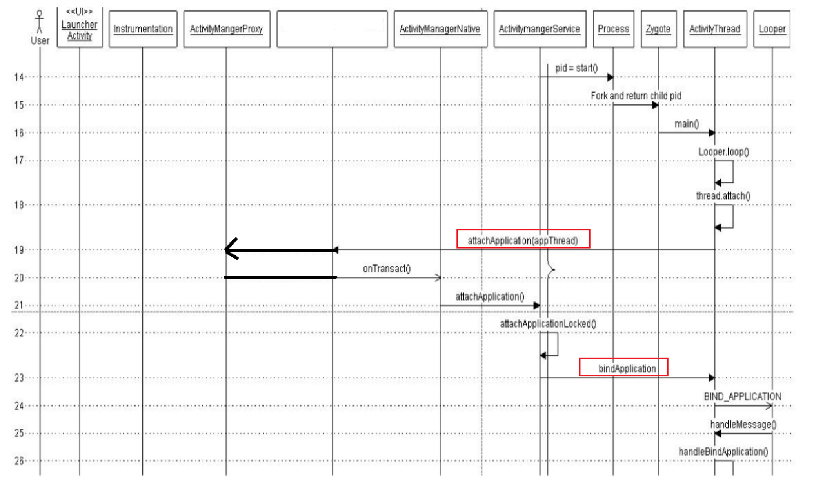

linux 和 windows 代码中执行cmd命令的区别

1. windows 需要加 `cmd /c`
2. linux 需要加 `/bin/sh -c`

减少加固的入侵性

# 1.Application的绑定过程

# 2.Manifest.xml中如何解析出application（源码）

1. ActivityThread.java
   1. `main()` -->  `thread.attach()`  --> `attachApplication()`
   2. `bindApplication()` --> 接收AMS发过来的参数之后sendMessage(`BIND_APPLICATION`)
   3. handleMessage（）处理 BIND_APPLICATION  -->  `handleBindApplication(data)` 在这里准备好application --> Application app=data.info.`makeAplication()`
2. LoadedApk.java
   1. 这个类就是APK在内存中的表示，可以得到如代码，资料，功能清单等信息
   2. makeApplication()
      1. 通过`mApplicationInfo.className`得到我们注册的全类名
      2. `app=mActivityThread.mInstrumentation.newApplication()`创建applicationInstrumentation类有点像一个工具类 --> 在这个方法中`反射生成app对象`
      3. 接下来会使用`appContext.setOuterContext(app);`来设置上下文
      4. `mActivityThread.mAllApplications.add(app)`
      5. ` mApplication=app`
3. ActivityThread.java
   - make之后 `mInitialApplication=app;(5842)`

总结需要替换的内容：

1. `ContextImpl->mOuterContext(app)` --> 通过`Application`的`attachBaseContext`回调参数获取
2. `ActivityThread->mAllApplications(ArrayList)` --> 通过`ContextImpl`的`mMainThread`属性获取
3. `LoadedApk->mApplication` --> 通过`ContextImpl`的`mPackageInfo`属性获取
4. `ActivityThread->mInitialApplication`

# 3.application与四大组件的关系

1. Acitivty
   - getApplication中调用了attach()
   - getApplicationInfo().className()
      1. `ContextImpl.getApplicationInfo()`
      2. `mPackageInfo.getApplicationInfo();` --> `LoadedApk.getApplicationInfo();`
      3. `LoadedApk.mApplicationInfo`
   1. 在ActivityThread中会接收消息`LAUNCH_ACTIVITY`
   2. `handleLaunchActivity()`
      1. `Activity a=performLaunchActivity();`
      2. `mInstrumentation.newActivity()`
      3. 调用了`activity.attach()`
      4. `Application app=r.packageInfo.makApplicatio()`
2. Service
   - 在ActivityThread中会接收消息`CREATE_SERVICE`（源码和Acitivty类同）
3. BroadCastReciver
   1. 在ActivityThread中会接收消息`RECEIVER`
   2. `handlerReceiver()`
      - `receiver.onReceive(context.getReceiverRestrictedContext(),data.intent);`
   3. 把上下文件封装了一层，以防止用户在接收者中进行注册广播和绑定服务
4. ContentProvider
   1. 在`ActivityThread`中会接收消息`BIND_APPLICATION`
   2. `handleBindApplication()`
      1. AcitivityThread中的`if(!data.restrictedBackupMode){}`
      2. `installContentProviders()`
      3. installProvider()
         1. 同样是通过newInstance反射创建
         2. `localProvider.attachInfo(c);` --> mContext=context;
         3. 让`if(context.getPackageName不等于ai.packagename)`我们就可以切换application成功
         4. 执行第三个if段 --> `c=context.createPackageContext();`
         5. 重写`application`的`getPackageName()`和`createPackageContext()`方法
