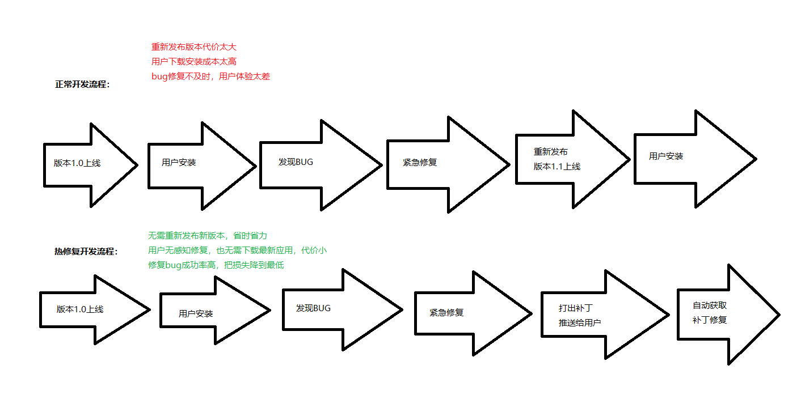
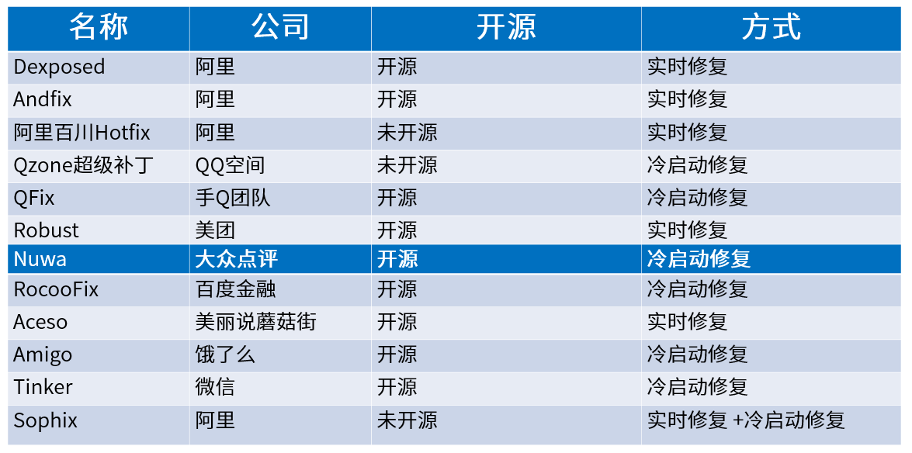
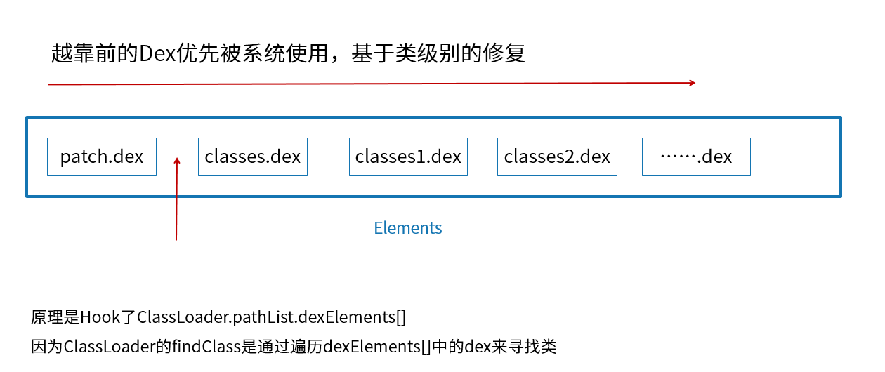
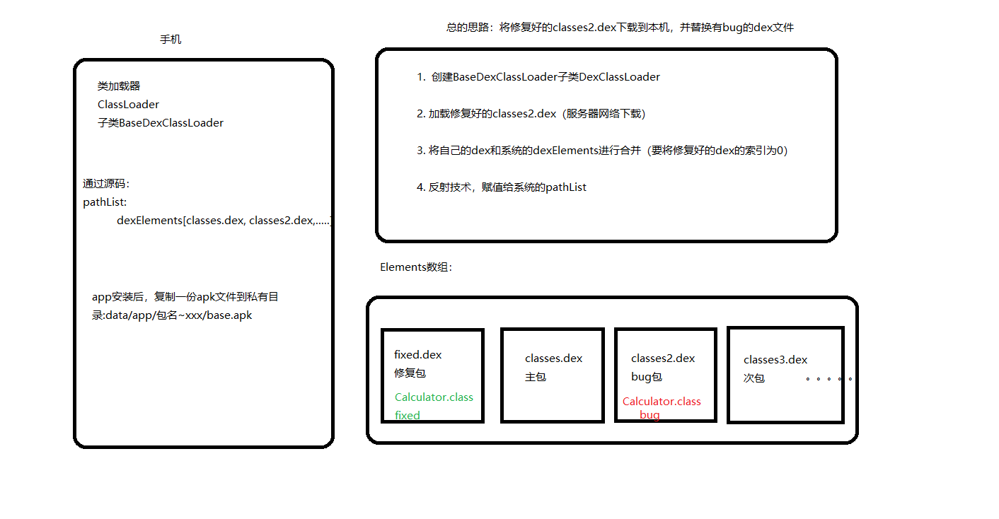

# 1.热修复背景

1. 刚发布的版本出现了严重的Bug，这就需要去解决Bug、测试打包重新发布，这会耗费大量的人力和物力，代价比较大
2. 已经更正了此前发布版本的Bug，如果下个版本是大版本，那么两个版本之间间隔时间会很长，这样要等到下个大版本发布再修复Bug，而之前版本的Bug会长期的影响用户
3. 版本升级率不高，并且需要长时间来完成版本迭代，前版本的Bug就会一直影响不升级的用户
4. 有一些小但是很重要的功能需要在短时间内完成版本迭代，比如节日活动

# 2. 正常开发流程与热修复开发流程对比



# 3.热修复框架分类与对比

分类：
1. 阿里系：AndFix、Dexposed、阿里百川、Sophix
2. 腾讯系：微信的Tinker、QQ空间的超级补丁、手Q的QFix
3. 知名公司：美团的Robust、饿了么的Amigo、美丽说蘑菇街的Aceso
4. 其它：RocooFix、Nuwa、AnoleFix

对比：

# 4.代码修复

1. 底层替换方案
   - 在已加载的类中直接替换原有方法，是在原有类的基础上进行修改，无法实现对原有类进行方法和字段的增减，这样会破坏原有类的结构
   - 最大问题是不稳定性，直接修改虚拟机方法实体的具体字段来实现的。Android是开源的，不同的手机厂商开源对代码进行修改，
     所以像Andfix就会出现在部分机型上的热修复失效的现象
2. `类加载方案`
   - APP重新启动后，让ClassLoader去加载新的类。

# 5.热修复优势

1. 无需重新发布新版本，省时省力
2. 用户无感知修复，也无需下载最新应用，代价小
3. 修复成功率高，把损失降到最低

# 6.<font color=red>插桩原理</font>



源码：

1. PathClassLoader.java
2. BaseDexClassLoader.java
   - `findClass()` --> pathList.findClass(name, suppressedExceptions);
3. DexPathList.java
   - `findClass()` --> `dexElements` --> Class clazz = dex.loadClassBinaryName(name, definingContext, suppressed);
   - `this.dexElements = makeDexElements(splitDexPath(dexPath), optimizedDirectory, suppressedExceptions, definingContext);`

- `DexClassLoader`：加载apk外的.dex文件需要使用
- `PathClassLoader`：加载apk内部的.dex文件

# 6.Dex分包

## 6.1.分包原因

1. [65536(64K)限制](https://developer.android.google.cn/studio/build/multidex?hl=zh_cn)
   - 报错：`com.android.dex.DexIndexOverflowException: method ID not in [0, 0xffff]: 65536`
   - 原因：应用的方法数超过了最大数65536个(64K)。因为DVM Bytecode的限制，DVM指令集的方法调用指令invoke-kind索引为16bits，最多能引用65535个方法
2. LinearAlloc限制
   - 报错：`INSTALL_FAILED_DEXOPT`
   - 在安装应用时可能会提示INSTALL_FAILED_DEXOPT，产生的原因就是LinearAlloc限制，DVM中的LinearAlloc是一个固定的缓存区，当方法数超出缓存区的大小时会报错。

为了解决65536限制和LinearAlloc限制，从而产生了Dex分包机制。
Dex分包方案主要做的时在打包时将应用代码分成多个Dex，将应用启动时必须用到的类和这些类的直接引用类放到主Dex中，其它代码放到次Dex中。
当应用启动时先加载主Dex，等到应用启动后再动态地加载次Dex，从而缓解了主Dex的65536限制和LinearAlloc限制

## 6.2.<font color=red>配置</font>

1. gradle配置
   ```
    android {
        compileSdkVersion 28
        defaultConfig {
            ...
             // 开启分包
            multiDexEnabled true
            // 设置分包配置文件
            multiDexKeepFile file('multidex.keep')
        }
        ...
        dexOptions {
            javaMaxHeapSize "4g"
            preDexLibraries = false
            additionalParameters = [ // 配置multidex参数
                                     '--multi-dex', // 多dex分包
                                     '--set-max-idx-number=50000', // 每个包内方法数上限
                                     '--main-dex-list=' + '/multidex.keep', // 打包到主classes.dex的文件列表
                                     '--minimal-main-dex'
            ]
        }
    }
    dependencies {
        ...
        implementation 'com.android.support:multidex:1.0.3'
    }   
   ```
2. 配置文件multidex.keep（multidex.keep 与 build.gradle 在同一目录下有效）
   ```
    com/dn/lsn16_demo/BaseActivity.class
    com/dn/lsn16_demo/BaseApplication.class
    com/dn/lsn16_demo/MainActivity.class    
   ```
3. Application重写attachiBaseContext
   ```
    @Override
    protected void attachBaseContext(Context base) {
        super.attachBaseContext(base);
        MultiDex.install(this);
    }    
   ```

## 7. 手写实现



1. 从服务器下载dex文件
2. 如果修复包存在先删除
3. 拷贝到私有目录
4. 开始修复
   1. 创建自己的类加载器
      ```
        private static void createDexClassLoader(Context context, File fileDir) {
            String optimizedDirectory = fileDir.getAbsolutePath() + File.separator + "opt_dex";
            File fOpt = new File(optimizedDirectory);
            if (!fOpt.exists()) {
                fOpt.mkdirs();
            }
            DexClassLoader classLoader;
            for (File dex : loadedDex) {
                //初始化类加载器
                classLoader = new DexClassLoader(dex.getAbsolutePath(), optimizedDirectory, null,
                        context.getClassLoader());
                //热修复
                hotFix(classLoader, context);
            }
        }        
      ```
   2. 获取系统的PathClassLoader
   3. 获取自己的dexElements
   4. 获取系统的dexElements
   5. 将系统的dexElements和自己的合并成新的dexElements
   6. 重新赋值给系统的pathList
      ```
        private static void hotFix(DexClassLoader myClassLoader, Context context) {
            //系统的类加载器
            PathClassLoader pathClassLoader = (PathClassLoader) context.getClassLoader();
            try {
                //重要的来了
                // 获取自己的DexElements数组对象
                Object myDexElements = ReflectUtils.getDexElements(
                        ReflectUtils.getPathList(myClassLoader));
                // 获取系统的DexElements数组对象
                Object sysDexElements = ReflectUtils.getDexElements(
                        ReflectUtils.getPathList(pathClassLoader));
                // 合并
                Object dexElements = ArrayUtils.combineArray(myDexElements, sysDexElements);
                // 获取系统的 pathList
                Object sysPathList = ReflectUtils.getPathList(pathClassLoader);
                // 重新赋值给系统的 pathList
                ReflectUtils.setField(sysPathList, sysPathList.getClass(), dexElements);
            } catch (Exception e) {
                e.printStackTrace();
            }
        }      
      ```
