# 1.webp应用

WebP 压缩使用的图像编码方式与 `VP8` 视频编码对关键帧压缩方式相同

1. 优势  
   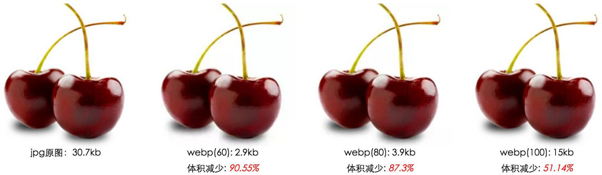
   2. `webp编码`对于哈夫曼压缩性能更`优异些`。
   3. 哈夫曼与webp本质上都是`从编码来解决图像压缩`
   4. 哈夫曼是对`rgb的元数据`进行变频压缩
   5. webp编码是通过`预测技术`对图片压缩
2. WebP编码流程
   1. WebP 会将图片划分为两个 8x8 色度像素宏块和一个 16x16 亮度像素宏块。在每个宏块内，编码器基于之前处理的宏块来预测冗余动作和颜色信息。
   2. 通过图像关键帧运算，使用宏块中已解码的像素来绘制图像中未知部分通过`预测模式` 去除冗余数据，实现更高效的压缩。

很多厂商已经支持了webp的解码，可以说webp就像png 一样普遍。但`Android4.3`之前并不支持

## 1.1.webp兼容Android4.3之前

1. 去[官网地址](http://www.linuxfromscratch.org/blfs/view/systemd/general/libwebp.html)下载`libwebp`
2. 新建`libwebp-1.1.0`文件夹，拷贝压缩包到里面，并解压到当前文件夹，将解压后的文件夹重命名为`jni`  
   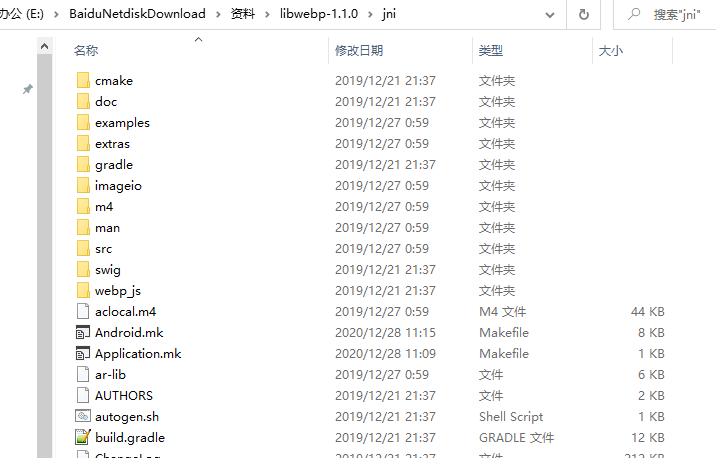
3. `Android.mk`增加：`ENABLE_SHARED := 1`,添加(jar包调用需要 用到jni接口) `swig/libwebp_java_wrap.c \`  
   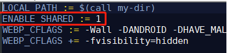　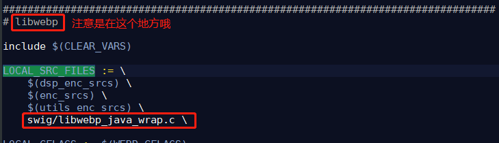
4. 创建Application.mk  
   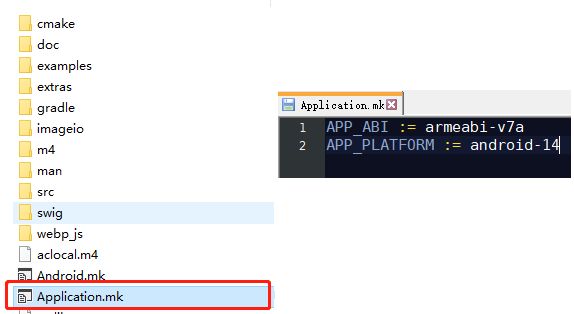
5. 最后执行`ndk-build`(ndk目录下自带有的)


# 2.APk瘦身

## 1.图片转webp
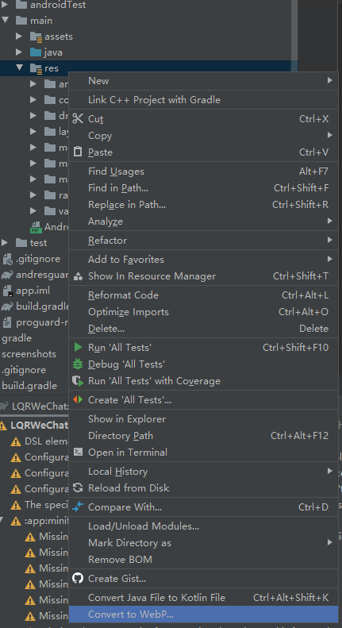

## 2.据情况通过配置删除国际化资源

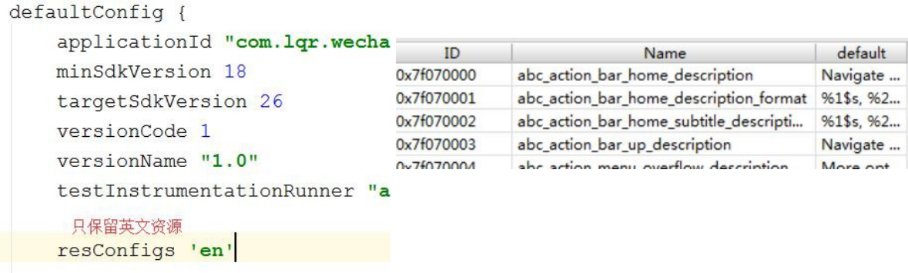

## 3.只需要保留一个armeabi-v7a架构

如果项目中包含第三方SDK或者自己使用了ndk，如果不进行配置会打包全cpu架构的动态库进入apk。
对于真机，只需要保留一个armeabi(armeabi-v7a)就可以了。

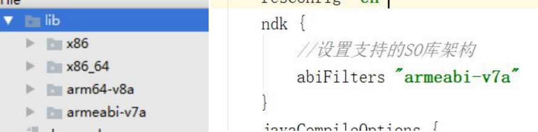

## 4.一键移除,如果出现使用动态id使用资源会出现问题(<font color=red>不建议</font>)

动态获取资源id,未直接使用R.xx.xx ，则这个id代表的资源会被认为`没有使用过`(类似不能混淆反射类)

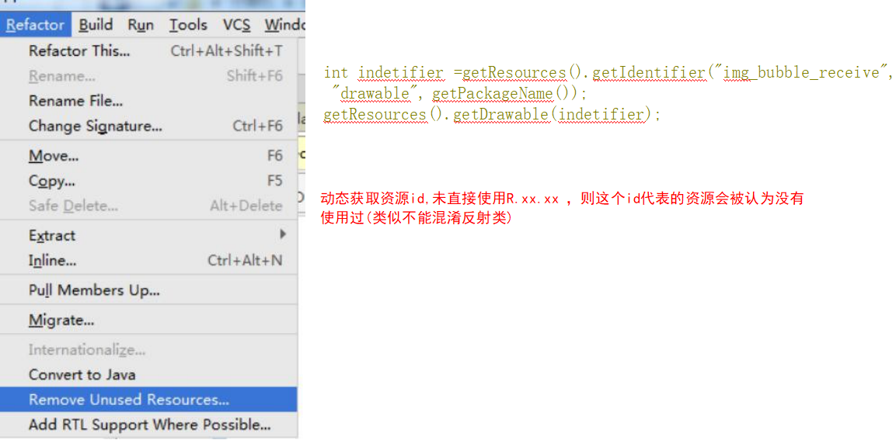

## 5.移除无用资源(lint检查)

动态获取资源id,未直接使用R.xx.xx ，则这个id代表的资源会被认为`有使用过`

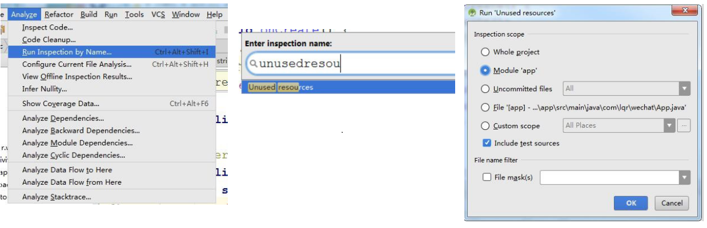

## 6.开启代码混淆（删除无用代码）

```
    buildTypes {
        release {
            minifyEnabled false
            proguardFiles getDefaultProguardFile('proguard-android.txt'), 'proguard-rules.pro'
        }
        debug {
            shrinkResources true // 删除无用资源 配合代码混淆一起
            minifyEnabled true // 开启代码混淆（删除无用代码）
            proguardFiles getDefaultProguardFile('proguard-android.txt'), 'proguard-rules.pro'
        }
    }
```

## 7.开启删除无用资源(与Lint不同)
   -  shrinkResources = true
      - 需要配合混淆`minifyEnabled true`才有用
      - shrinkResources 用来开启压缩无用资源，也就是没有被引用的文件（经过实测是
         drawable,layout，实际并不是彻底删除，而是保留文件名，但是没有内容，等等），但是因为需
        要知道是否被引用所以需要配合mififyEnable使用，只有当两者都为true的时候才会起到真正的删
        除无效代码和无引用资源的目的
      - 与去除无用资源不同的是，`比如 某个java类没有用到，被混淆时删除了，而该类引入了layout资
        源 。此时会将这个资源也压缩掉`
   - 开启删除无用资源（严格模式与普通模式）
      - 新建 keep.xml 保存在 `res/raw/keep.xml`
      - 如何开启严格模式<font color=red>一般用这种</font>
        ```
        <?xml version="1.0" encoding="utf-8"?>
        <resources  xmlns:tools ="http://schemas.android.com/tools"
        tools:shrinkMode                
        ```
      - 普通模式
        ```
        <?xml version="1.0" encoding="utf-8"?>
        <resources  xmlns:tools ="http://schemas.android.com/tools"
            tools:keep ="@layout/base_* *" " // 保留
            tools:discard ="@layout/unused2"/>   // 废弃 
        ```
## 8.`AndResGuard`微信资源压缩方案

减少资源名占用的字节数减少apk体积，混淆资源名称有利于增加阅读的难度

AndResGuard的配置：
1. 项目根目录下build.gradle中，添加插件的依赖：
   ```
    buildscript {
        repositories {
            jcenter()
            google()
        }
        dependencies {
            classpath 'com.android.tools.build:gradle:4.1.1'
            classpath 'com.tencent.mm:AndResGuard-gradle-plugin:1.2.20'
            // NOTE: Do not place your application dependencies here; they belong
            // in the individual module build.gradle files
        }
    }   
   ```
2. 在app目录下，创建`andresguard.gradle`文件
   ```
    apply plugin: 'AndResGuard'
    
    andResGuard {
        // mappingFile = file("./resource_mapping.txt")
        mappingFile = null
        use7zip = true
        useSign = true
        // 打开这个开关，会keep住所有资源的原始路径，只混淆资源的名字
        keepRoot = false
        // 设置这个值，会把arsc name列混淆成相同的名字，减少string常量池的大小
        fixedResName = "arg"
        // 打开这个开关会合并所有哈希值相同的资源，但请不要过度依赖这个功能去除去冗余资源
        mergeDuplicatedRes = true
        whiteList = [
                // for your icon
                "R.drawable.icon",
                // for fabric
                "R.string.com.crashlytics.*",
                // for google-services
                "R.string.google_app_id",
                "R.string.gcm_defaultSenderId",
                "R.string.default_web_client_id",
                "R.string.ga_trackingId",
                "R.string.firebase_database_url",
                "R.string.google_api_key",
                "R.string.google_crash_reporting_api_key",
                //友盟
                "R.string.umeng*",
                "R.string.UM*",
                "R.layout.umeng*",
                "R.drawable.umeng*",
                "R.id.umeng*",
                "R.anim.umeng*",
                "R.color.umeng*",
                "R.style.*UM*",
                "R.style.umeng*",
    
                //融云
                "R.drawable.u*",
                "R.drawable.rc_*",
                "R.string.rc_*",
                "R.layout.rc_*",
                "R.color.rc_*",
                "R.id.rc_*",
                "R.style.rc_*",
                "R.dimen.rc_*",
                "R.array.rc_*"
        ]
        compressFilePattern = [
                "*.png",
                "*.jpg",
                "*.jpeg",
                "*.gif",
        ]
        sevenzip {
            artifact = 'com.tencent.mm:SevenZip:1.2.20'
            //path = "/usr/local/bin/7za"
        }
    
        /**
         * 可选： 如果不设置则会默认覆盖assemble输出的apk
         **/
        // finalApkBackupPath = "${project.rootDir}/final.apk"
    
        /**
         * 可选: 指定v1签名时生成jar文件的摘要算法
         * 默认值为“SHA-1”
         **/
        // digestalg = "SHA-256"
    }   
   ```
   - 其中whiteList（白名单）中指定不需要进行混淆的资源路径规则，主要是一些第三方SDK，因为有些SDK的代码中引用到对应的资源文件，
   如果对其进行混淆，会导致找不到对应资源文件，出现crash，所以不能对其资源文件进行混淆。由于公司的项目中使用到了友盟和融云，所以将这两个SDK加入白名单，更多的白名单可以查看：  
   [AndResGuard白名单](https://github.com/shwenzhang/AndResGuard/blob/master/doc/white_list.md)

AndResGuard的使用：

1. 集成完AndResGuard后，在app的gradle的tasks中，多了一个叫做andresguard的task,如图：  
   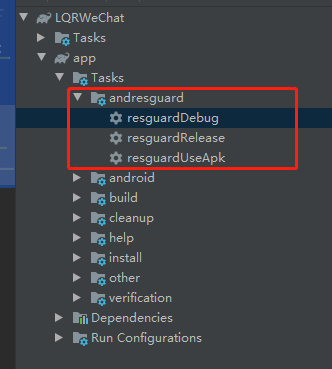
2. 一般使用签名对齐后的apk  
   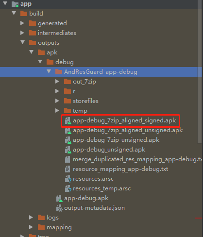

生成后的apk的资源路径为：  
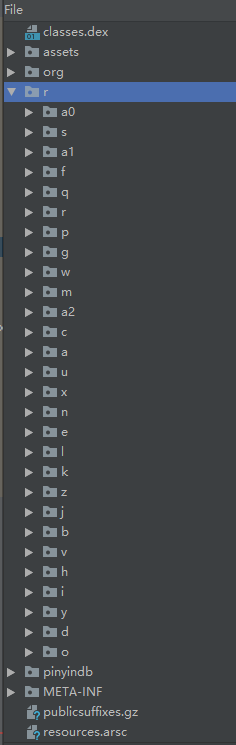

