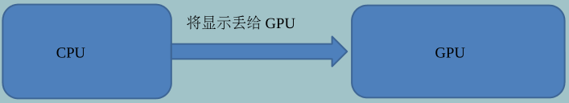
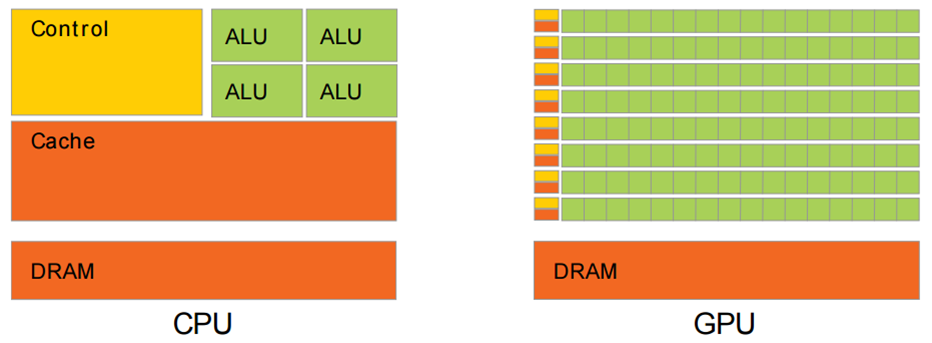
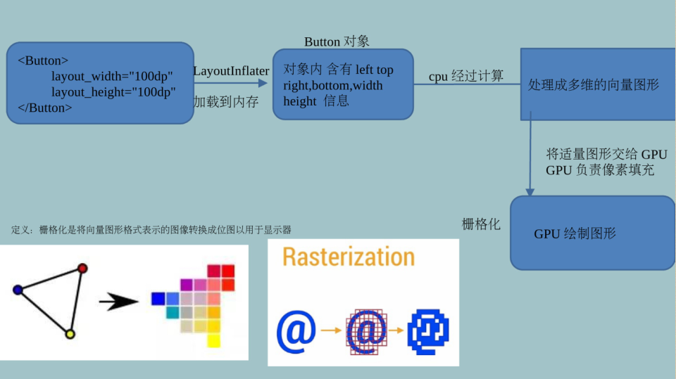
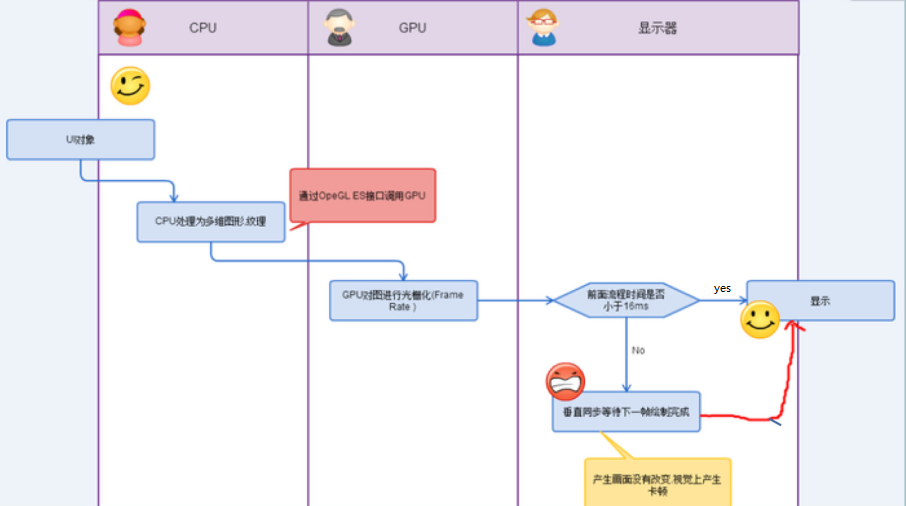
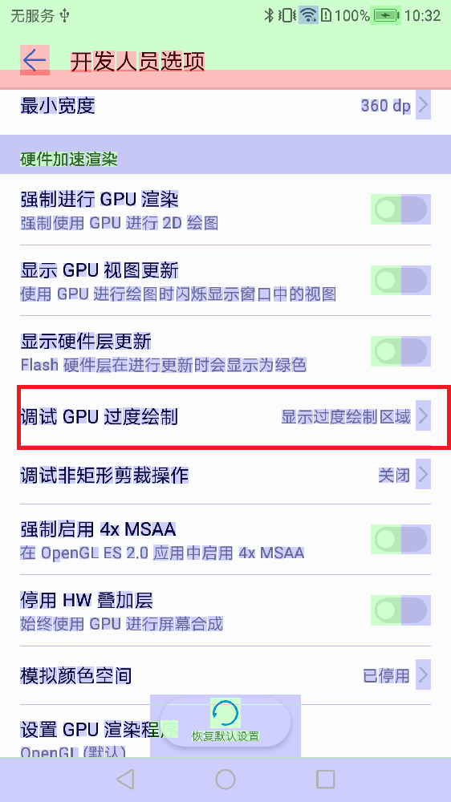
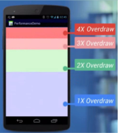
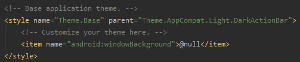
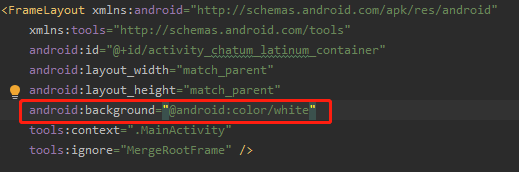
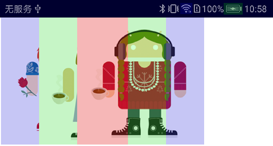
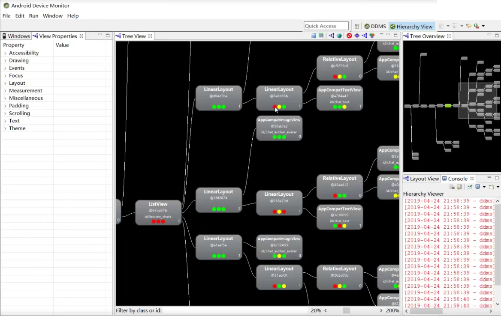

# 1.CPU与GPU工作流程

CPU 的任务繁多，做逻辑计算外，还要做内存管理、显示操作，因此在实际运算的时候性能会大打折扣，在没有 GPU 的时代，不能显示复
杂的图形，其运算速度远跟不上今天复杂三维游戏的要求。即使 CPU的工作频率超过 2GHz 或更高，对它绘制图形提高也不大。这时 GPU
的设计就出来了。





- 黄色的 Control 为控制器，用于协调控制整个 CPU 的运行，包括取出指令、控制其他模块的运行等；
- 绿色的 ALU （ Arithmetic Logic Unit ）是算术逻辑单元，用于进行数学、逻辑运算；
- 橙色的 Cache 和 DRAM 分别为缓存和 RAM ，用于存储信息。

从结构图可以看出， CPU 的控制器较为复杂，而 ALU 数量较少。因此 CPU 擅长各种复杂的逻辑运算，但不擅长数学尤其是浮点运算。





# 2.60Hz 刷新频率由来

- 12 fps ：由于人类眼睛的特殊生理结构，如果所看画面之帧率高于每秒约 10-12 帧的时候，就会认为是连贯的
- 24 fps ：有声电影的拍摄及播放帧率均为每秒 24 帧，对一般人而言已算可接受
- 30 fps ：早期的高动态电子游戏，帧率少于每秒 30 帧的话就会显得不连贯，这是因为没有动态模糊使流畅度降低
- `60 fps` `在与手机交互过程中`，如触摸和反馈 60 帧以下人是能感觉出来的。 60 帧以上不能察觉变化当帧率
低于 60 fps 时感觉的画面的卡顿和迟滞现象

Android 系统每隔 `16ms` 发出 `VSYNC(垂直同步信号)` 信号 (1000ms/60=16.66ms) ，触发对 UI 进行渲染， 如果每次渲染都成
功这样就能够达到流畅的画面所需要的 60fps ，为了能够实现 60fps ，这意味着计算渲染的大多数操作都必须在 16ms 内完成。

# 3.卡顿原理分析和解决方案

当这一帧画面渲染时间超过16ms的时候,垂直同步机制会让显示器硬件 等待GPU完成栅格化渲染操作
这样会让湿一帧画面，多停留了 16ms,甚至更多.这样就这造成了用户看起来画面停顿.

`16 毫秒的时间主要被两件事情所占用`
- 第一件：将 UI 对象转换为一系列多边形和纹理
- 第二件： CPU 传递处理数据到 GPU 。

所以很明显，我们要缩短这两部分的时间，也就是说需要尽量减少对象转换的次数，以及Cpu传递到GPU数据的次数。

`如何减少这两部分的时间以至于在16ms完成呢`
- CPU减少xml转换成对象的时间(`布局优化`)
- GPU减少重复绘制的时间（`减少过度绘制`）

# `4.减少过度绘制(减少GPU工作量)`

## 4.1.过度绘制定义

GPU的绘制过程，就跟刷墙一样,一层层的进行,16ms刷一次.这样就会造成图层覆盖的现象，即无用的图层还被绘制在底层,造成不必要的浪费.

## 4.2.GPU过度绘制几种情况
1. 自定义控件中onDraw方法做了过多重复绘制(可以使用裁剪，只绘制用户看的到的地方)
2. 布局层次太深，重叠性太强。用户看不到的区域GPU也会渲染，导致耗时增加.

## 4.3.过度绘制査看工具

手机端的开发者选项--->`调试GPU过度绘制`---->显示过度绘制区域





- 蓝色过度绘制一次无过度绘制
- 淡绿过度绘制两次
- 淡红过度绘制三次
- 深红过度绘制四次

代表了4种不同程度Overdraw情况 我们的目标就是尽量减少红色Overdraw ,看到更多的蓝色区域。

## `4.4.优化方案`

### 4.4.1. 减少背景重复

去掉默认背景


去掉二层容器背景


```
1.去掉所有activity主题设置中的属性
直接在styles.xml中设置<item name="android:windowBackground">@null</item>

2.去掉单个activity的主题设置的属性
可以在setContentView之前getWindow().setBackgroundDrawable(null); 

3.非业务需要，不要去设置背景 
```
### 4.4.2. 使用裁减减少控件之间的重合部分

Android7.0之后系统做出的优化,`invalidate()`不再执行测量和布局动作




```
    private void drawDroidCard(Canvas canvas,List<DroidCard> mDroidCards,int i) {
        DroidCard c = mDroidCards.get(i);
        canvas.save();
        canvas.clipRect((float)c.x,0f,(float)(mDroidCards.get(i+1).x),(float)c.height);
        canvas.drawBitmap(c.bitmap,c.x,0f,paint);
        canvas.restore();
    }
```

# `5.布局优化(减少CPU工作量)`

# 5.1.布局查看常用工具

1. Tool--->`Layout Inspector`,`AndroidStudio自带`
2. sdk目录/tools/bin/uiautomatorviewer.bat
3. sdk目录tools\monitor.bat打开`Device Monitor`中Hierarchy view，`AndroidStudio3.1过后已经遗弃，但是真的好用`
```
    三个点也是代表着View的Measure, Layout和Draw。
    绿: 表示该View的此项性能比该View Tree中超过50%的View都要快；例如,代表Measure的是绿点,意味着这个视图的测量时间快于树中的视图对象的50%。
    黄: 表示该View的此项性能比该View Tree中超过50%的View都要慢； 
    红: 表示该View的此项性能是View Tree中最慢的；。
```




# `5.2.优化方案`

1. 能在一个平面显示的内容，尽量只用一个容器。
2. 尽可能把相同的容器合并merge。
3. 能复用的代码，用include处理，可以减少GPU重复工。


