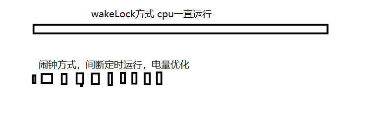

下面以高德地图的Demo为例子：

需求：`每隔5秒获取一次定位，把定位数据上传到服务器，统计每天的数据。`

# 1.优化前

## 1.1. 使用WakeLock只唤醒CPU

```
        //使用WeakLock
        PowerManager pm = (PowerManager) getSystemService(POWER_SERVICE);
        //判断是否支持
        pm.isWakeLockLevelSupported(PowerManager.PARTIAL_WAKE_LOCK);
        //只唤醒cpu
        locationLock = pm.newWakeLock(PowerManager.PARTIAL_WAKE_LOCK,
                "location_lock");
        locationLock.acquire();
```

1. `WakeLock级别`
   - `PARTIAL_WAKE_LOCK`：保证CPU保持高性能运行，而屏幕和键盘背光（也可能是触摸按键的背光）关闭。`一般情况下都会使用这个WakeLock。`
   - ACQUIRE_CAUSES_WAKEUP：这个WakeLock除了会使CPU高性能运行外还会导致屏幕亮起，即使屏幕原先处于关闭的状态下。
   - ON_AFTER_RELEASE：如果释放WakeLock的时候屏幕处于亮着的状态，则在释放WakeLock之后让屏幕再保持亮一小会。如果释放WakeLock的时候屏幕本身就没亮，则不会有动作。
   - API17被弃用的WakeLock：保持屏幕长亮
     - SCREEN_DIM_WAKE_LOCK：保证屏幕亮起，但是亮度可能比较低。同时键盘背光也可以不亮。
     - SCREEN_BRIGHT_WAKE_LOCK ：保证屏幕全亮，同时键盘背光也亮。
     - FULL_WAKE_LOCK：表现和SCREEN_BRIGHT_WAKE_LOCK 类似，但是区别在于这个等级的WakeLock使用的是最高亮度
       - 推荐是用WindowFlagWindowManager.LayoutParams.FLAG_KEEP_SCREEN_ON。使用方法是：
         在Activity中： getWindow().addFlags(WindowManager.LayoutParams.FLAG_KEEP_SCREEN_ON);
         在布局中添加这个属性：android:keepScreenOn="true"

## 1.2.获取到了位置信息都立即上传

每次获取到了位置信息都在UpLoadService中立即上传了位置信息

```
public class UploadService extends IntentService {


    public UploadService() {
        super("upload Location");
    }

    public static void UploadLocation(Context context, String location) {
        Intent intent = new Intent(context, UploadService.class);
        intent.putExtra("DATA", location);
        context.startService(intent);
    }

    @Override
    protected void onHandleIntent(@Nullable Intent intent) {
        String location = intent.getStringExtra("DATA");
        Log.i("dongnao", "IntentService 获得了位置信息:" + location);
        HttpURLConnection conn = null;
        OutputStream os = null;
        try {
            conn = (HttpURLConnection) new URL("https://www.baidu.com/")
                    .openConnection();
            conn.setRequestMethod("POST");
            conn.setDoOutput(true);
            os = conn.getOutputStream();
            os.write(location.getBytes());
            os.flush();
            Log.i("dongnao", "IntentService 上传位置信息");
        } catch (IOException e) {
            e.printStackTrace();
        } finally {
            Utils.safeColose(os);
            if (null != conn) {
                conn.disconnect();
            }
        }
    }
}
```

# `2.优化`

## 2.1.`alarm`让CPU间断式的工作



```
    @Override
    public void onDestroy() {
        super.onDestroy();
        //释放
        LocationManager.getInstance().destoryLocation();
        //注销广播接收者
        unregisterReceiver(alarmReceiver);
    }
    
    private void alarmKeep() {
        alarmIntent = new Intent();
        alarmIntent.setAction("LOCATION");
        //创建延迟意图
        PendingIntent broadcast = PendingIntent.getBroadcast(this, 0, alarmIntent, 0);
        //获得闹钟管理器
        AlarmManager alarmManager = (AlarmManager) getSystemService(ALARM_SERVICE);
        //动态注册广播接受者
        IntentFilter filter = new IntentFilter();
        filter.addAction("LOCATION");
        registerReceiver(alarmReceiver,filter);
        //设置一个 每隔 5s 发送一个广播
        alarmManager.setRepeating(AlarmManager.ELAPSED_REALTIME,SystemClock.elapsedRealtime(),
                5_000,broadcast);
    }

    BroadcastReceiver alarmReceiver = new BroadcastReceiver() {
        @Override
        public void onReceive(Context context, Intent intent) {
            if (TextUtils.equals(intent.getAction(),"LOCATION")){
                LocationManager.getInstance().startLocation(LocationService.this);
            }
        }
    };
```

## 2.2.jobScheduler

1. 把工作任务放到合适的时间再去执行，比如充电时间，wifi连接后
2. 也可以把多个任务合并到一起，再选择时间去执行

JobManager.java
```
public class JobManager {

    static JobManager instance;
    //把一些不是特别紧急(实时)的任务放到更合适的时机批量处理
    // 1、避免频繁的唤醒硬件模块
    // 2、避免在不合适的时候执行一些耗电的任务
    private JobScheduler jobScheduler;
    private Context context;

    private static final int jobId=0;

    public static JobManager getInstance() {
        if (null == instance)
            instance = new JobManager();
        return instance;
    }

    public void init(Context context) {
        this.context = context.getApplicationContext();
        jobScheduler = (JobScheduler)
                context.getSystemService(Context.JOB_SCHEDULER_SERVICE);

    }

    /**
     * 添加一个任务
     * @param location
     */
    public void addJob(String location) {
        if (null == jobScheduler) {
            return;
        }
        JobInfo pendingJob = null;
        //整合多个job
        if (Build.VERSION.SDK_INT >= Build.VERSION_CODES.N) {
            //查找id是0的job
            pendingJob = jobScheduler.getPendingJob(jobId);
        } else {
            List<JobInfo> allPendingJobs = jobScheduler.getAllPendingJobs();
            for (JobInfo info : allPendingJobs) {
                if (info.getId() == jobId) {
                    pendingJob = info;
                    break;
                }
            }
        }
        //找到待执行的job
        if (null != pendingJob) {
            //多个坐标信息拼到一起 上传
            if (Build.VERSION.SDK_INT >= Build.VERSION_CODES.LOLLIPOP) {
                //数据 与Intent 一样
                PersistableBundle extras = pendingJob.getExtras();
                //获得上一次设置的location数据
                String data = extras.getString("DATA");
                //比如 多条坐标数据用@隔开
                location = data + "@" + location;
                jobScheduler.cancel(jobId);
            }
        }
        // jobid ：0
        PersistableBundle extras = new PersistableBundle();
        extras.putString("DATA",location);
        //创建一个job
        JobInfo jobInfo = new
                JobInfo.Builder(jobId,
                new ComponentName(context, MyJobService.class))
                //只在充电的时候
                .setRequiresCharging(true)
                //不是蜂窝网络
                .setRequiredNetworkType(JobInfo.NETWORK_TYPE_UNMETERED)
                .setExtras(extras).build();

        //提交任务
        jobScheduler.schedule(jobInfo);
    }

}
```

MyJobService.java

```
    <service
        android:name=".MyJobService"
        android:permission="android.permission.BIND_JOB_SERVICE"
        android:process=":location" />
            
public class MyJobService extends JobService {

    public static final String TAG = "MyJobService";

    @Override
    public boolean onStartJob(JobParameters params) {
        //如果返回值是false,这个方法返回时任务已经执行完毕。
        //如果返回值是true,那么这个任务正要被执行，我们就需要开始执行任务。
        //当任务执行完毕时你需要调用jobFinished(JobParameters params, boolean needsRescheduled)来通知系统
        new MyAsyncTask().execute(params);
        return true;
    }

    //当系统接收到一个取消请求时
    @Override
    public boolean onStopJob(JobParameters params) {
        //如果onStartJob返回false,那么onStopJob不会被调用
        // 返回 true 则会重新计划这个job
        return false;
    }


    /**
     * Params:启动任务时输入的参数类型.
     * <p>
     * Progress:后台任务执行中返回进度值的类型.
     * <p>
     * Result:后台任务执行完成后返回结果的类型.
     */
    class MyAsyncTask extends AsyncTask<JobParameters, Void, Void> {
        JobParameters jobParameters;

        @Override
        protected Void doInBackground(JobParameters[] objects) {
            jobParameters = objects[0];
            Log.i(TAG, jobParameters.getJobId() + " 任务开始执行......");
            PersistableBundle extras = jobParameters.getExtras();
            String location = extras.getString("DATA");
            Log.i(TAG, jobParameters.getJobId() + " 上传:" + location);
            HttpURLConnection conn = null;
            OutputStream os = null;
            try {
                conn = (HttpURLConnection) new URL("https://www.baidu.com/")
                        .openConnection();
                conn.setRequestMethod("POST");
                conn.setDoOutput(true);
                os = conn.getOutputStream();
                os.write(location.getBytes());
                os.flush();
            } catch (IOException e) {
                e.printStackTrace();
            } finally {
                Utils.safeColose(os);
                if (null != conn) {
                    conn.disconnect();
                }
            }
            return null;
        }

        /**
         * doInBackground:必须重写,异步执行后台线程要完成的任务,耗时操作将在此方法中完成.
         * <p>
         * onPreExecute:执行后台耗时操作前被调用,通常用于进行初始化操作.
         * <p>
         * onPostExecute:当doInBackground方法完成后,系统将自动调用此方法,并将doInBackground方法返回的值传入此方法.通过此方法进行UI的更新.
         * <p>
         * onProgressUpdate:当在doInBackground方法中调用publishProgress方法更新任务执行进度后,将调用此方法.通过此方法我们可以知晓任务的完成进度.
         */
        @Override
        protected void onPostExecute(Void s) {
            //当任务执行完毕之后，需要调用jobFinished来让系统知道这个任务已经结束，
            //系统可以将下一个任务添加到队列中
            //true表示需要重复执行
            //false反之
            jobFinished(jobParameters, false);
            Log.i(TAG, jobParameters.getJobId() + "任务执行完成......");
        }
    }
}       
```

源码简化流程：
1. 通过IPC通信执行JobSchedulerStub中的schedule() ---> JobSchedulerService.this.schedule(job, uid);
2. --> startTrackingJob(jobStatus);
   - 在这里完成job的添加
   - StateController controller = mControllers.get(i);会在构造方法中初始化
   - --> controller.maybeStartTrackingJob(jobStatus);
     - ConnectivityController中的mTrackedJobs.add(jobStatus);
3. ConnectivityController构造方法，创建了一个广播，在onRevice中进行updateTrackedJobs(int userId)
开始回调StateChangedListener.onControllerStateChanged();
4. 在JobSchedulerService实现的onControllerStateChanged方法中发送一个消息，开始把满足执行条件的job找出来maybeQueueReadyJobsForExecutionLockedH
5. 通过maybeRunPendingJobsH()方法中vailableContext.executeRunnableJob(nextPending)执行任务
6. new Intent().setComponent(job.getServiceComponent());绑定我们自己写的jobservice进行执行


## 3.Doze(低电耗模式)和App Standby模式

[Doze低电耗模式](https://developer.android.google.cn/training/monitoring-device-state/doze-standby.html?hl-zl-zh-cn#understand_doze)

如果用户未插接设备的电源，在屏幕关闭的情况下，让设备在一段时间内保持不活动状态，那么设备就会进入低电耗模式。在低电耗模式下，系统会尝试通过限制应用访问占用大量网络和 CPU 资源的服务来节省电量。它还会阻止应用访问网络，并延迟其作业、同步和标准闹钟。

系统会定期退出低电耗模式一小段时间，让应用完成其延迟的活动。在此维护期内，系统会运行所有待处理的同步、作业和闹钟，并允许应用访问网络。

低电耗模式尤其可能会影响 `AlarmManager` 闹钟和定时器管理的活动，因为当系统处于低电耗模式时，不会触发 Android 5.1（API 级别 22）或更低版本中的闹钟。

为了帮助安排闹钟，`Android 6.0（API 级别 23）`引入了两种新的 `AlarmManager` 方法：`setAndAllowWhileIdle()` 和 `setExactAndAllowWhileIdle()。` 通过这些方法，您可以设置即使设备处于低电耗模式也会触发的闹钟。

注意：`setAndAllowWhileIdle()` 及 `setExactAndAllowWhileIdle()` 为每个应用触发闹钟的频率都不能超过每 `9` 分钟一次。(`我们这里是5秒不满足要求`)


解决：`关闭该应用的低电耗模式。加入白名单`

```
    <uses-permission-sdk-23 android:name="android.permission.REQUEST_IGNORE_BATTERY_OPTIMIZATIONS"/>

    public static void addWhite(Activity activity){
        PowerManager packageManager = (PowerManager) activity.getSystemService(Context.POWER_SERVICE);
        //应用是否在 白名单中
        if (Build.VERSION.SDK_INT >= Build.VERSION_CODES.M) {
            if (!packageManager.isIgnoringBatteryOptimizations(activity.getPackageName())){
                //方法1、启动一个  ACTION_IGNORE_BATTERY_OPTIMIZATION_SETTINGS Intent
//                Intent intent = new Intent(Settings.ACTION_IGNORE_BATTERY_OPTIMIZATION_SETTINGS);
//                activity.startActivity(intent);
                //方法2、触发系统对话框
                Intent intent = new Intent(Settings.ACTION_REQUEST_IGNORE_BATTERY_OPTIMIZATIONS);
                intent.setData(Uri.parse("package:"+activity.getPackageName()));
                activity.startActivity(intent);
            }
        }
    }
```

