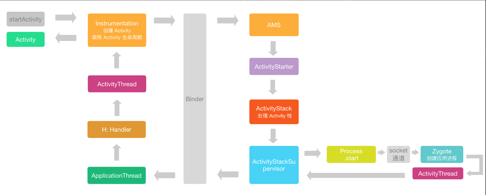

# [Activity的启动流程](https://blog.csdn.net/jdsjlzx/article/details/98449795)

## 相关类简介

- Instrumentation  

用于实现应用程序测试代码的基类。当在打开仪器的情况下运行时，这个类将在任何应用程序代码之前为您实例化，允许您监视系统与应用程序的所有交互。可以通过AndroidManifest.xml的标签描述该类的实现。

- ActivityManager

该类提供与Activity、Service和Process相关的信息以及交互方法， 可以被看作是ActivityManagerService的辅助类。

- ActivityManagerService

Android中最核心的服务，主要负责系统中四大组件的启动、切换、调度及应用程序的管理和调度等工作。

- ActivityThread

管理应用程序进程中主线程的执行，根据Activity管理者的请求调度和执行activities、broadcasts及其相关的操作。

- ActivityStack

负责单个Activity栈的状态和管理。

- ActivityStackSupervisor

负责所有Activity栈的管理。内部管理了mHomeStack、mFocusedStack和mLastFocusedStack三个Activity栈。其中，mHomeStack管理的是Launcher相关的Activity栈；mFocusedStack管理的是当前显示在前台Activity的Activity栈；mLastFocusedStack管理的是上一次显示在前台Activity的Activity栈。

- ClientLifecycleManager

用来管理多个客户端生命周期执行请求的管理类。

## 启动流程




Activity.startActivity(Intent intent)  
-> Activity.startActivity(Intent intent, @Nullable Bundle options)   
-> Activity.startActivityForResult(@RequiresPermission Intent intent, int requestCode,
            @Nullable Bundle options)  
            
```kotlin

    public void startActivityForResult(@RequiresPermission Intent intent, int requestCode,
            @Nullable Bundle options) {
        if (mParent == null) {
            options = transferSpringboardActivityOptions(options);
            Instrumentation.ActivityResult ar =
                mInstrumentation.execStartActivity(
                    this, mMainThread.getApplicationThread(), mToken, this,
                    intent, requestCode, options);
            if (ar != null) {
                mMainThread.sendActivityResult(
                    mToken, mEmbeddedID, requestCode, ar.getResultCode(),
                    ar.getResultData());
            }
            if (requestCode >= 0) {
                mStartedActivity = true;
            }
 
            cancelInputsAndStartExitTransition(options);
            // TODO Consider clearing/flushing other event sources and events for child windows.
        } else {
            if (options != null) {
                mParent.startActivityFromChild(this, intent, requestCode, options);
            } else {
                // Note we want to go through this method for compatibility with
                // existing applications that may have overridden it.
                mParent.startActivityFromChild(this, intent, requestCode);
            }
        }

```
            
之后Activity的startActivity方法会调用startActivityForResult方法来传递启动请求，在startActivityForResult方法中如果是第一次启动，mParent为空则会去调用Instrumentation.execStartActivity方法，否则调动Activity.startActivityFromChild方法。最终都会调用Instrumentation.execStartActivity


Instrumentation.execStartActivity(Context who, IBinder contextThread, IBinder token, Activity target, Intent intent, int requestCode, Bundle options)   
-> ActivityManagerService.startActivity(..)   
-> ActivityManagerService.startActivityAsUser(...)   
-> ActivityManagerService.startActivityAsUser(...)  
-> ActivityStarter.execute()  
-> ActivityStarter.startActivityMayWait(..)      
-> ActivityStarter.startActivity(...)  
-> ActivityStarter.startActivity(...)  
-> ActivityStarter.startActivity(...)  
-> ActivityStarter.startActivityUnchecked(...)  
-> ActivityStackSupervisor.resumeFocusedStackTopActivityLocked(...)  
-> ActivityStack.resumeTopActivityUncheckedLocked(...)    
-> ActivityStack.resumeTopActivityInnerLocked() // 这里个方法后面分成两段（1、有Activity处于Resume状态，先让这个Activity执行Pausing过程。2、然后再执行startSpecificActivityLocked方法启动要启动Activity）

```kotlin
    private boolean resumeTopActivityInnerLocked(ActivityRecord prev, ActivityOptions options) {
        ...
        boolean pausing = mStackSupervisor.pauseBackStacks(userLeaving, next, false);
        if (mResumedActivity != null) {
            pausing |= startPausingLocked(userLeaving, false, next, false);
        }
        ...
        mStackSupervisor.startSpecificActivityLocked(next, true, true);
        ...
        return true;
    }
```

<font size = 5>**1. Pausing过程**</font>

-> ActivityStack.startPausingLocked(...)

``` kotlin

    frameworks/base/services/core/java/com/android/server/am/ActivityStack.java
    final boolean startPausingLocked(boolean userLeaving, boolean uiSleeping,
            ActivityRecord resuming, boolean pauseImmediately) {
        ...
        if (prev.app != null && prev.app.thread != null) {
            try {
                EventLogTags.writeAmPauseActivity(prev.userId, System.identityHashCode(prev),
                        prev.shortComponentName, "userLeaving=" + userLeaving);
                mService.updateUsageStats(prev, false);
                // Android 9.0在这里引入了ClientLifecycleManager和
                // ClientTransactionHandler来辅助管理Activity生命周期，
                // 他会发送EXECUTE_TRANSACTION消息到ActivityThread.H里面继续处理。
                mService.getLifecycleManager().scheduleTransaction(prev.app.thread, prev.appToken,
                        PauseActivityItem.obtain(prev.finishing, userLeaving,
                                prev.configChangeFlags, pauseImmediately));
            } catch (Exception e) {
                // Ignore exception, if process died other code will cleanup.
                Slog.w(TAG, "Exception thrown during pause", e);
                mPausingActivity = null;
                mLastPausedActivity = null;
                mLastNoHistoryActivity = null;
            }
        } else {
            mPausingActivity = null;
            mLastPausedActivity = null;
            mLastNoHistoryActivity = null;
        }
        ...
```

-> ClientLifecycleManager.scheduleTransaction(...)  
-> ClientLifecycleManager.scheduleTransaction(...)  
-> ClientTransaction.schedule(...)  
-> ActivityThread. ApplicationThread. scheduleTransaction(..)   
-> ClientTransactionHandler.scheduleTransaction(...) //ActivityThread类中并没有定义scheduleTransaction方法，所以调用的是他父类ClientTransactionHandler的scheduleTransaction方法。  
-> ClientTransactionHandler.sendMessage(ActivityThread.H.EXECUTE_TRANSACTION, transaction)  
-> ActivityThread.sendMessage(ActivityThread.H.EXECUTE_TRANSACTION, transaction)  
-> ActivityThread.sendMessage方法会把消息发送给内部名字叫H的Handler  
-> TransactionExecutor.execute(ClientTransaction transaction)//此处由于没有Callback所以直接跳转executeLifecycleState方法。  
-> TransactionExecutor.executeLifecycleState(ClientTransaction transaction)

会先去调用TransactionExecutor.cycleToPath执行当前生命周期状态之前的状态，然后执行ActivityLifecycleItem.execute方法。由于是从ON_RESUME状态到ON_PAUSE状态切换，中间没有其他状态，cycleToPath这个情况下没有做什么实质性的事情，直接执行execute方法。

-> PauseActivityItem. execute(...)  
-> ClientTransactionHandler(ActivityThread).handlePauseActivity(..)  
-> ActivityThread.performPauseActivity(..)  
-> ActivityThread.performPauseActivityIfNeeded(..)  
-> Instrumentation.callActivityOnPause(...)  
-> Activity.performPause();   
-> Activity.onPause(); 

<font size = 5>**2. Activity所在的应用进程启动过程**</font>

-> ActivityStackSupervisor.startSpecificActivityLocked(..)

上面分析到ActivityStackSupervisor.startSpecificActivityLocked方法，在这个方法中会去根据进程和线程是否存在判断App是否已经启动，如果已经启动，就会调用realStartActivityLocked方法继续处理。如果没有启动则调用ActivityManagerService.startProcessLocked方法创建新的进程处理。接下来跟踪一下一个新的Activity是如何一步步启动的。

```kotlin
 frameworks/base/services/core/java/com/android/server/am/ActivityStackSupervisor.java
    void startSpecificActivityLocked(ActivityRecord r,
            boolean andResume, boolean checkConfig) {
        // Is this activity's application already running?
        ProcessRecord app = mService.getProcessRecordLocked(r.processName,
                r.info.applicationInfo.uid, true);
            ...
            if (app != null && app.thread != null) {
                ...
                realStartActivityLocked(r, app, andResume, checkConfig);
                return;
            } catch (RemoteException e) {
                Slog.w(TAG, "Exception when starting activity "
                        + r.intent.getComponent().flattenToShortString(), e);
            }
        }
 
        mService.startProcessLocked(r.processName, r.info.applicationInfo, true, 0,
                "activity", r.intent.getComponent(), false, false, true);

```

-> ActivityManagerService.startProcessLocked(...)  
-> ActivityManagerService.startProcessLocked(...)  
-> ActivityManagerService.startProcessLocked(...)  
-> ActivityManagerService.startProcessLocked(...)   
-> ActivityManagerService.startProcess(...)  
-> Process.start(...)  
-> ZygoteProcess.start(...)    
-> ZygoteProcess.startViaZygote(...)
-> ZygoteProcess.zygoteSendArgsAndGetResult(...)

经过一步步调用，可以发现其最终调用了Zygote并通过socket通信的方式让Zygote进程fork出一个新的进程，并根据传递的”android.app.ActivityThread”字符串，反射出该对象并执行ActivityThread的main方法对其进行初始化。

-> ActivityThread.main()    
-> ActivityThread.attach(...)  
-> ActivityManagerService.attachApplication(...)  
-> ActivityManagerService.attachApplicationLocked(...)  
-> ActivityStackSupervisor.attachApplicationLocked(...)  
-> ActivityStackSupervisor.realStartActivityLocked(...)

```kotlin
final boolean realStartActivityLocked(ActivityRecord r, ProcessRecord app,
            boolean andResume, boolean checkConfig) throws RemoteException {
                ...
                // Create activity launch transaction.
                final ClientTransaction clientTransaction = ClientTransaction.obtain(app.thread,
                        r.appToken);
                clientTransaction.addCallback(LaunchActivityItem.obtain(new Intent(r.intent),
                        System.identityHashCode(r), r.info,
                        // TODO: Have this take the merged configuration instead of separate global
                        // and override configs.
                        mergedConfiguration.getGlobalConfiguration(),
                        mergedConfiguration.getOverrideConfiguration(), r.compat,
                        r.launchedFromPackage, task.voiceInteractor, app.repProcState, r.icicle,
                        r.persistentState, results, newIntents, mService.isNextTransitionForward(),
                        profilerInfo));
 
                // Set desired final state.
                final ActivityLifecycleItem lifecycleItem;
                if (andResume) {
                    lifecycleItem = ResumeActivityItem.obtain(mService.isNextTransitionForward());
                } else {
                    lifecycleItem = PauseActivityItem.obtain();
                }
                clientTransaction.setLifecycleStateRequest(lifecycleItem);
 
                // Schedule transaction.
                mService.getLifecycleManager().scheduleTransaction(clientTransaction);
                ...
 
        return true;
    }
```

-> LaunchActivityItem.execute(..)  
-> ActivityThread. handleLaunchActivity(...)  
-> ActivityThread.performLaunchActivity(...)  
-> Instrumentation.callActivityOnCreate(...)  
-> Activity.performCreate(...)  
-> Activity.onCreate(....)

至此executeCallbacks执行完毕，开始执行executeLifecycleState方法。先执行cycleToPath方法，生命周期状态是从ON_CREATE状态到ON_RESUME状态，中间有一个ON_START状态，所以会执行ActivityThread.handleStartActivity方法。

-> TransactionExecutor.executeLifecycleState(ClientTransaction transaction)  
-> TransactionExecutor.cycleToPath(...)  
-> ActivityThread.handleStartActivity(....)  
-> Activity.onStart(...)  
-> ResumeActivityItem. execute(...)  
-> ActivityThread.handleResumeActivity(...)    
-> ActivityThread.performResumeActivity(...)  
-> Activity.performResume(...)  

<font size = 5>**3. 栈顶ActivityStop过程**</font>

-> ActivityThread.handleResumeActivity  

```kotlin
    frameworks/base/core/java/android/app/ActivityThread.java
    @Override
    public void handleResumeActivity(IBinder token, boolean finalStateRequest, boolean isForward,
            String reason) {
        ...
        Looper.myQueue().addIdleHandler(new Idler());
        ...
    }
```

接下来看一下Idler都做了什么。当MessageQueue空闲的时候就会回调Idler.queueIdle方法，经过层层调用跳转到ActivityStack.stopActivityLocked方法。

-> ActivityManagerService.activityIdle(...)    
-> ActivityStackSupervisor.activityIdleInternalLocked(...)  
-> ActivityStack.stopActivityLocked(...)  

```kotlin
final void stopActivityLocked(ActivityRecord r) {
	...
	mService.getLifecycleManager().scheduleTransaction(r.app.thread, r.appToken,
                        StopActivityItem.obtain(r.visible, r.configChangeFlags));
	...
}
```

在ActivityStack.stopActivityLocked方法中，又见到了ClientLifecycleManager.scheduleTransaction方法，前面已经分析过多次，会去执行StopActivityItem.execute方法，然后经过多次跳转，最终执行了Activity.onStop方法。至此，栈顶Activity的onStop过程分析完毕。

## 总结

总结
Activity的工作原理相对复杂，分析起来很有难度，往往一行不起眼的代码都大有深意，在阅读源码过程中多次遇到分析不下去的情况，只能结合对Activity生命周期已有的认知重头来过查看漏了哪一处细节，由结果反推过程也是一个很好的办法。
 

Activity启动流程： 


1. 应用通过startActivity或是startActivityForResult方法向ActivityManagerService发出启动请求。 
2. ActivityManagerService接收到启动请求后会进行必要的初始化以及状态的刷新，然后解析Activity的启动模式，为启动Activity做一系列的准备工作。 
3. 做完上述准备工作后，会去判断栈顶是否为空，如果不为空即当前有Activity显示在前台，则会先进行栈顶Activity的onPause流程退出。 
4. 栈顶Activity执行完onPause流程退出后开始启动Activity。如果Activity被启动过则直接执行onRestart->onStart->onResume过程直接启动Activity（热启动过程）。否则执行Activity所在应用的冷启动过程。 
5. 冷启动过程首先会通过Zygote进程fork出一个新的进程，然后根据传递的”android.app.ActivityThread”字符串，反射出该对象并执行ActivityThread的main方法进行主线程的初始化。 
6. Activity所在应用的进程和主线程完成初始化之后开始启动Activity，首先对Activity的ComponentName、ContextImpl、Activity以及Application对象进行了初始化并相互关联，然后设置Activity主题，最后执行onCreate->onStart->onResume方法完成Activity的启动。 
7. 上述流程都执行完毕后，会去执行栈顶Activity的onStop过程。

至此，完整的Activity启动流程全部执行完毕。


 


      
     
 

