将以微信支付为例

[官网链接](https://pay.weixin.qq.com/wiki/doc/api/app/app.php?chapter=8_3)

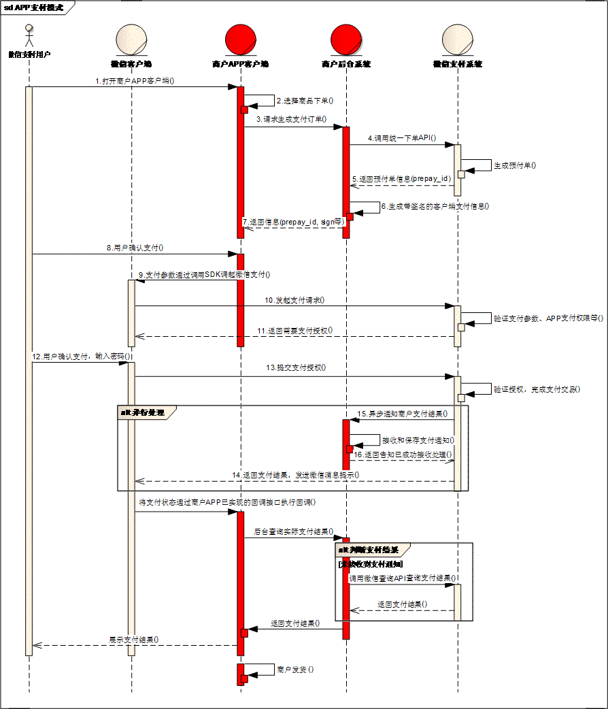

# 1.UML绘图工具

1. Win版本
   - [PowerDesigner](http://soft.onlinedown.net/soft/577763.htm)
2. Mac版本
   - [argouml](http://argouml.tigris.org/)
   - [violet](http://alexdp.free.fr/violetumleditor/page.php?id=en:download)
3. 在线工具
   - [Processon](https://www.processon.com/)

# 2. 思维导图工具

[MindMaster](https://www.edrawsoft.cn/download/mindmaster/)

# 3.面向对象模型（OOM）

## 3.1.用例图

1. 用例图（The Use Case Diagram）
   - 用例图是指由参与者（Actor）、用例（Use Case），边界以及它们之间的关系构成的用于描述系统功能的视图。用例图（User Case）是外部用户（被称为参与者）所能观察到的系统功能的模型图。用例图是系统的蓝图。
用例图呈现了一些参与者，一些用例，以及它们之间的关系，主要用于对系统、子系统或类的功能行为进行建模。
   - 参与者（Actor）
   - 用例（UseCase）
   - 关联关系（Association）
   - 包含关系（Include）
   - 扩展关系（Extend）
   - 泛化关系（Generalization）
   - 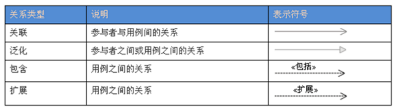
   - 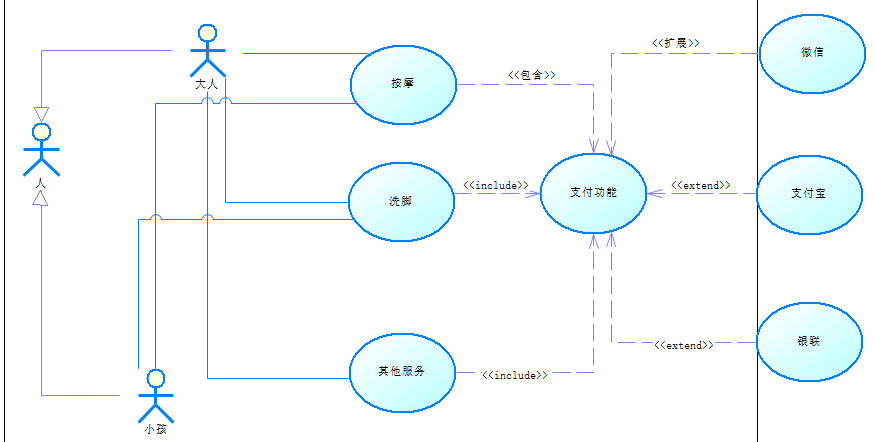

## 3.2.结构图

1. 类图（The Class Diagram）
   - 类图(Class diagram)是显示了模型的静态结构，特别是模型中存在的类、类的内部结构以及它们与其他类的关系等。
类图不显示暂时性的信息。类图是面向对象建模的主要组成部分。
它既用于应用程序的系统分类的一般概念建模，也用于详细建模，将模型转换成编程代码。类图也可用于数据建模。
   - 泛化（Generalization）
     - 是一种`继承关系`, 表示一般与特殊的关系, 它指定了子类如何特化父类的所有特征和行为. 例如：老虎是动物的一种, 即有老虎的特性也有动物的共性.
   - 实现（Realization）
     - 是一种`类与接口`的关系, 表示类是接口所有特征和行为的实现.
   - 关联（Association）
     - 是一种`拥有的关系`, 它使一个类知道另一个类的属性和方法；如：老师与学生，丈夫与妻子
     - 关联可以是双向的，也可以是单向的。双向的关联可以有两个箭头或者没有箭头，单向的关联有一个箭头。
   - 依赖（Dependency）
     - 是一种`使用的关系`,  即一个类的实现需要另一个类的协助, 所以要尽量不使用双向的互相依赖.
   - 聚合（Aggregation）
     - 是整体与部分的关系, 且`部分可以离开整体而单独存在`. 如车和轮胎是整体和部分的关系, 轮胎离开车仍然可以存在.
   - 组合（Composition）
     - 是整体与部分的关系, 但`部分不能离开整体而单独存在`. 如公司和部门是整体和部分的关系, 没有公司就不存在部门.
   - `正向工程`是通过从特定实现语言的映射而把`模型转换为代码的过程`
   - `逆向工程`是通过从特定实现语言的映射而把`代码转换为模型的过程`。
   - 
2. 组合结构图（Composite Structure Diagram）
   - 主要用于描述类中的内部构造，和类与类之间的关系
   - 比类图更抽象的表示，一般来说先画组合结构图，再画类图
   - 注意事项：侧重类的整体特性，就使用类图；侧重类的内部结构，就使用组合结构图。
   - 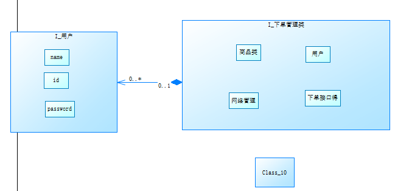
3. 对象图（Object Diagram）
   - 显示某时刻对象和对象之间的关系  
   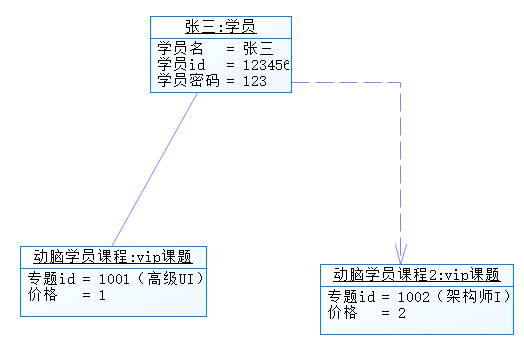
4. 包图（Package Diagram）
   - 包与包之间关系
   - 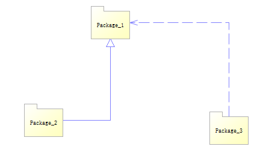

## 3.3.动态图

1. 时序图（Sequence diagram）
   - 时序图（Sequence Diagram），又名序列图、循序图、顺序图，是一种UML交互图。
它通过描述对象之间发送消息的时间顺序显示多个对象之间的动态协作。
它可以表示用例的行为顺序，当执行一个用例行为时，其中的每条消息对应一个类操作或状态机中引起转换的触发事件。
   - 角色（Actor）
   - 对象（Object）
   - 生命线（Lifeline）
   - 控制焦点（Focus of Control）
   - 消息（Message）：同步用实心，异步用开放
   - 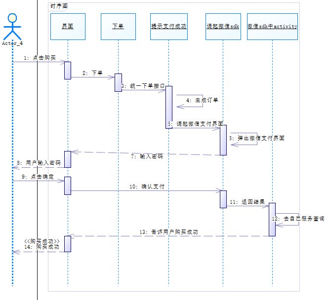
2. 通信图（Communication diagram）
   - 和时序图相同，只是表示形式不同，可直接转换
   - 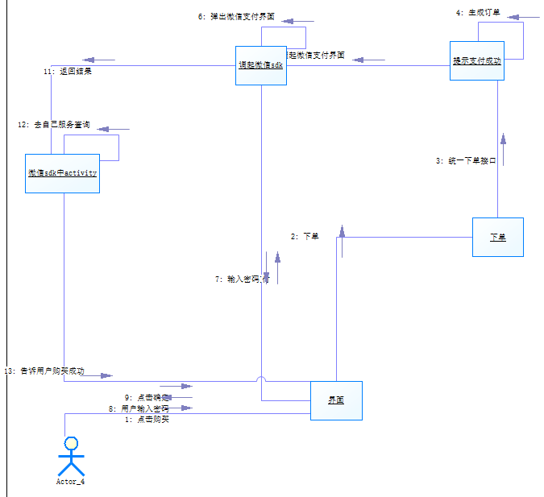
3. 活动图（Activity diagram）
   - 表示一个过程，有点像流程图
   - 组织单元泳道图（organization unit swimlane）
   - 同步图：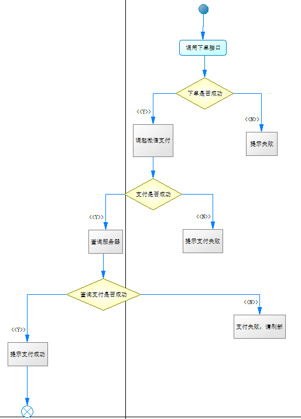
   - 异步图：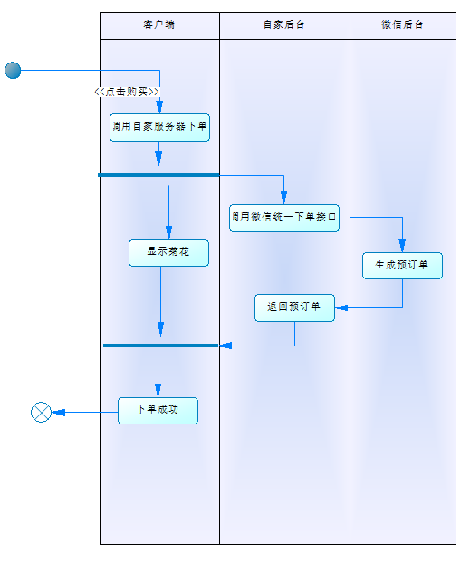
4. 状态图（Statechart diagram）
   - 表示过程中的状态情况
   - 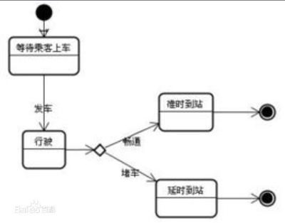
5. 交互纵横图（Interaction overview diagram）
   - 用来表示多张图之间的关联
   - 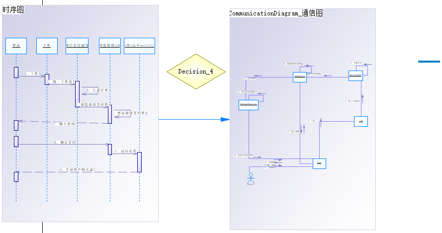

## 3.4. 交互图

1. 组件图（Component Diagram）
   - 主要目的是显示系统组件间的结构关系
   - 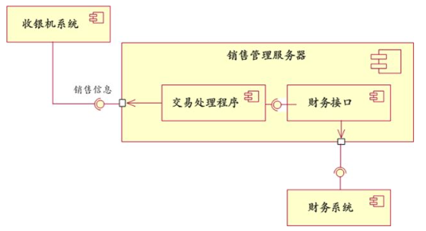
   - 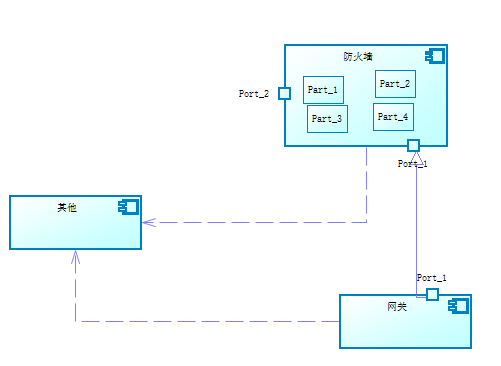
2. 部署图（Deployment Diagram）
   - 多数用于表示硬件结构，做系统集成很方便
   - 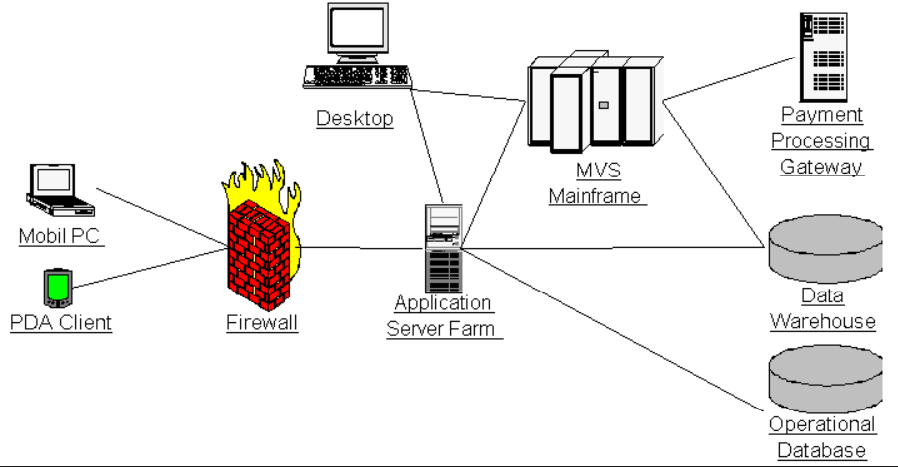
   - 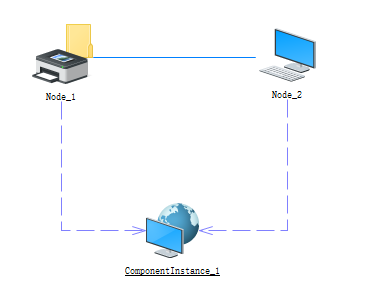

