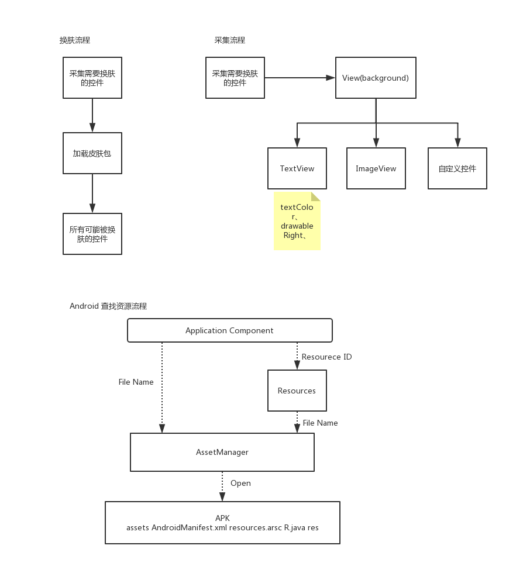
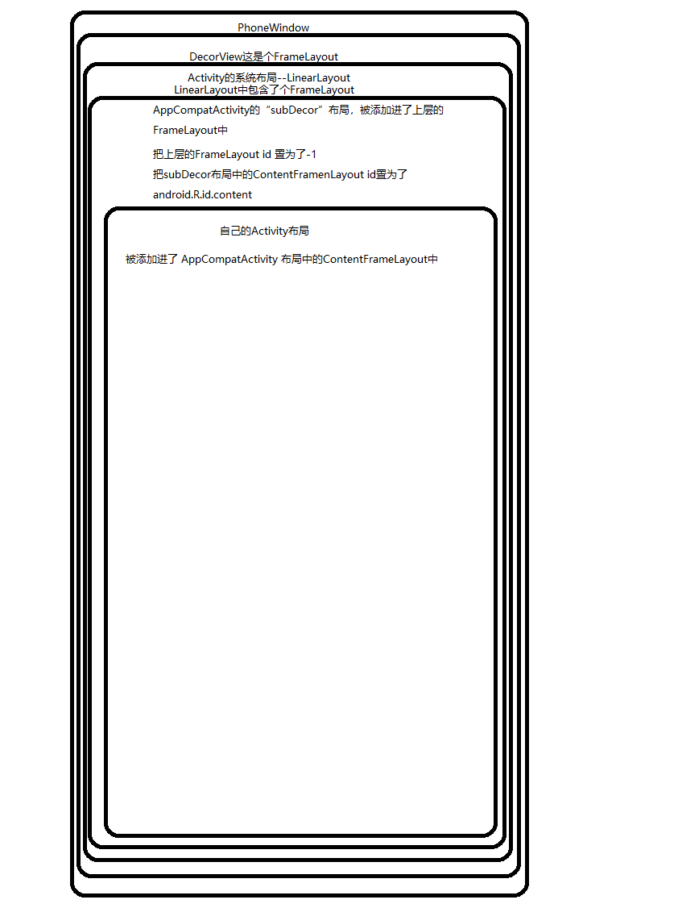
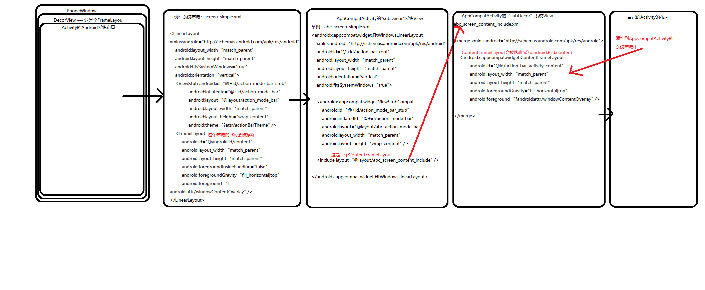

# 1.步骤



# 2.AppCompatActivity的setContentView源码阅读
先看两张图：





中间有什么不懂的请看 Activity.setContentView源码.md

```
    `androidx.appcompat.app.AppCompatActivity`.setContentView(@LayoutRes int layoutResID) {
        getDelegate().setContentView(layoutResID);
    }
    -> `androidx.appcompat.app.AppCompatDelegateImpl`.setContentView(int resId) {
        //大致流程跟 Activity.setContentView一样，只不过，多了一层
        //确保AppCompatActivity的子Decor存在
        ensureSubDecor(); 
        //这个contentParent已经是AppCompatActivity中布局的FrameLayout了，不是Activity中布局的FrameLayout
        ViewGroup contentParent = mSubDecor.findViewById(android.R.id.content);
        contentParent.removeAllViews();
        //自己的布局文件添加进AppCompatActivity的FrameLayout中
        LayoutInflater.from(mContext).inflate(resId, contentParent);
        mAppCompatWindowCallback.getWrapped().onContentChanged();
    }
    
    -> `androidx.appcompat.app.AppCompatDelegateImpl`.createSubDecor() {
        ...
        //确保window存在
        ensureWindow();
        //确保创建好了DecorView以及里面的系统布局：LinearLayout
        mWindow.getDecorView();
        
        ViewGroup subDecor = null;
        
        ... //一系列的判断（是否有标题等等）
        subDecor = (ViewGroup) //子Decor  
        inflater.inflate(R.layout.abc_screen_simple, null);
        
        final ContentFrameLayout contentView = (ContentFrameLayout) subDecor.findViewById(
                    R.id.action_bar_activity_content);
        final ViewGroup windowContentView = (ViewGroup) mWindow.findViewById(android.R.id.content);
        if (windowContentView != null) {
            //如果以前id为android.R.id.content的ContentParent中有子View就把移除出去添加到AppCompat自己创建的系统布局subDecorView中
            while (windowContentView.getChildCount() > 0) {
                final View child = windowContentView.getChildAt(0);
                windowContentView.removeViewAt(0);
                contentView.addView(child);
            }

            // 把之前的mContentParent的id置为 -1
            windowContentView.setId(View.NO_ID);
            //把AppAppCompat自己创建的系统布局中的FrameLayoutId修改为android.R.id.content
            contentView.setId(android.R.id.content);

            ...
        }
        
        //前面的mWindow.getDecorView();已经创建好了DecorView以及它的子View系统布局View
        mWindow.setContentView(subDecor);
         return subDecor;
    }
    
    -> `com.android.internal.policy.PhoneWindow`.getDecorView() {
        if (mDecor == null || mForceDecorInstall) {
            installDecor();
        }
        return mDecor;
    }
    
     -> `com.android.internal.policy.PhoneWindow`.installDecor(){
         ...
        if (mDecor == null) {
            // 创建DecotrView
            mDecor = generateDecor(-1);
           ...
        } else {
            mDecor.setWindow(this);
        }
        if (mContentParent == null) {
            //创建mContentView
            mContentParent = generateLayout(mDecor);
            ...
         }
    }
    
        //先看创建DecotrView的方法
    
    -> `com.android.internal.policy.PhoneWindow`.generateDecor(int featureId) {
        ....
         return new DecorView(context, featureId, this, getAttributes());
    }
    
    public class DecorView extends FrameLayout
    
    DecorView是个FrameLayout
    
    //再看创建mContentParent的方法
    
     -> `com.android.internal.policy.PhoneWindow`.generateLayout(DecorView decor) {
        ...
        int layoutResource; //系统的布局
        ...
        //根据theme或者其它要求设置系统布局id
        } else if ((features & (1 << FEATURE_ACTION_MODE_OVERLAY)) != 0) {
            layoutResource = R.layout.screen_simple_overlay_action_mode;
        } else {
            layoutResource = R.layout.screen_simple;
        }
        
        ...
        //把系统的layoutResource 实例化的 View添加进DecorView中
        mDecor.onResourcesLoaded(mLayoutInflater, layoutResource);
        
        //找到在`DecorView`中,这时系统布局已经加入到了`DecorView`中所以相当于在系统布局中找到 `android.R.id.content` 也就是一个frameLayout
        ViewGroup contentParent = (ViewGroup)findViewById(ID_ANDROID_CONTENT);
        
        return contentParent
     }
     
     -> `com.android.internal.policy.DecorView`.onResourcesLoaded(LayoutInflater inflater, int layoutResource){
        ...
        final View root = inflater.inflate(layoutResource, null); //系统的布局是个LinearLayout
        ...
        //把系统的layoutResource 实例化的 View添加进DecorView中
        addView(root, 0, new ViewGroup.LayoutParams(MATCH_PARENT, MATCH_PARENT));
        ...
     }
    
```

至此`AppCompatActivity`的`setContentView`源码我们已经分析清楚了。

# 3.extends Activity和AppCompateActivity的View的区别

```
// extends Activity mImageIv is ImageView        
// extends AppCompatActivity mImageView is AppCompatImageView  tint        
Log.e("TAG", "" + mImageIv);
```

为什么`继承Activity`的ImageView 是`ImageView`，而`继承AppCompatActivity`的ImageView就变成了
`AppCompatImageView`呢！！

这里就涉及到了LayoutInflate的源码了

# 4.LayoutInfalate的源码

1. 先来看下AppCompatActivity中重要的代码
   ```
    `androidx.appcompat.app.AppCompatDelegateImpl`.installViewFactory() {
            LayoutInflater layoutInflater = LayoutInflater.from(mContext);
            if (layoutInflater.getFactory() == null) {
                //注意着行代码为LayoutInflate设置View创建工厂：代表着所有的View创建都会走到这个工厂的onCreateView方法中
                LayoutInflaterCompat.setFactory2(layoutInflater, this);
            } else {
                if (!(layoutInflater.getFactory2() instanceof AppCompatDelegateImpl)) {
                    Log.i(TAG, "The Activity's LayoutInflater already has a Factory installed"
                            + " so we can not install AppCompat's");
                }
            }
        }
    
    //AppCompatDelegateImpl 实现了 LayotInflater.Factory2,重写了两个方法：
    
    //View onCreateView(View parent, String name, Context context, AttributeSet attrs);
    //View onCreateView(String name, Context context, AttributeSet attrs);

    -> `androidx.appcompat.app.AppCompatDelegateImpl`.onCreateView(View parent, String name, Context context, AttributeSet attrs) {
            return createView(parent, name, context, attrs);
        }
    
    -> `androidx.appcompat.app.AppCompatDelegateImpl`.onCreateView(String name, Context context, AttributeSet attrs) {
        return onCreateView(null, name, context, attrs);
    }
    
    -> `androidx.appcompat.app.AppCompatDelegateImpl`.createView(View parent, final String name, 
    @NonNull Context context,@NonNull AttributeSet attrs){
        if (mAppCompatViewInflater == null) {
            ...
            mAppCompatViewInflater = new AppCompatViewInflater();
        }
        
        // 通过AppCompatViewInflater.createView来创建的View
         return mAppCompatViewInflater(parent, name, context, attrs, inheritContext,
                IS_PRE_LOLLIPOP, /* Only read android:theme pre-L (L+ handles this anyway) */
                true, /* Read read app:theme as a fallback at all times for legacy reasons */
                VectorEnabledTintResources.shouldBeUsed() /* Only tint wrap the context if enabled */
        );
    }
   ```
2. 来看下LayoutInflater的源码：
   - LayoutInflater.from(this)获取的源码：
     ```
        `android.view.LayoutInflater`.from(Context context) {
            LayoutInflater LayoutInflater =
                    (LayoutInflater) context.getSystemService(Context.LAYOUT_INFLATER_SERVICE);
        }
        
        -> `android.app.ContextImpl`.getSystemService(String name) {
            return SystemServiceRegistry.getSystemService(this, name);
        }
        
        -> `android.app.SystemServiceRegistry`.getSystemService(ContextImpl ctx, String name) {
            // 从一个静态的Map集合,取到单例的LayoutInflater
            ServiceFetcher<?> fetcher = SYSTEM_SERVICE_FETCHERS.get(name);
            return fetcher != null ? fetcher.getService(ctx) : null;
        }
        
        -> `android.app.SystemServiceRegistry`.registerService(String serviceName, Class<T> serviceClass,
                ServiceFetcher<T> serviceFetcher) {
            ...
            SYSTEM_SERVICE_FETCHERS.put(serviceName, serviceFetcher);
        }
        
        -> `android.app.SystemServiceRegistry`的静态代码块
        单例模式：
        static {
            ...
            registerService(Context.LAYOUT_INFLATER_SERVICE, LayoutInflater.class,
                    new CachedServiceFetcher<LayoutInflater>() {
                @Override
                public LayoutInflater createService(ContextImpl ctx) {
                    return new PhoneLayoutInflater(ctx.getOuterContext());
                }});
            ...
        }
     ```
     - <font color=red size=5>**总结**</font>：`LayoutInflater.from(Context context)` 拿到的是全局注册过的单例的`PhoneLayoutInflater`
3. LayoutInflater.inflate(...)源码
   - 这里我们将通过源码来总结下inflate中3个参数不同的影响
   ```
    `android.view.LayoutInflater`.inflate(@LayoutRes int resource, @Nullable ViewGroup root, boolean attachToRoot) {
        ...
        return inflate(parser, root, attachToRoot);
    }
    ->`android.view.LayoutInflater`.inflate(XmlPullParser parser, @Nullable ViewGroup root, boolean attachToRoot) {
        ...
        View result = root;
        ...
        // 这里就是创建View,在3.3中我们再分析它的源码
        final View temp = createViewFromTag(root, name, inflaterContext, attrs);
    
        ViewGroup.LayoutParams params = null;
    
        if (root != null) {
            if (DEBUG) {
                System.out.println("Creating params from root: " +
                        root);
            }
            // Create layout params that match root, if supplied
            params = root.generateLayoutParams(attrs);
            
            if (!attachToRoot) {
                // Set the layout params for temp if we are not
                // attaching. (If we are, we use addView, below)
                //如果attachToRoot为false且root不为null，
                //这样会为View设置了root的布局参数， 所以控件的layout_width和layout_height也就有了意义
                temp.setLayoutParams(params);
            }
        }
        ...
        if (root != null && attachToRoot) {
            root.addView(temp, params);
        }        
        if (root == null || !attachToRoot) {
            result = temp;
        }      
        ...
        return result
    }   
   ```
   - <font color=red size=5>**总结**</font>：我们在开发的过程中给控件所指定的`layout_width`和`layout_height`到底是什么意思？该属性的表示`一个控件在容器中的大小`，就是说这个`控件必须在容器中`，这个属性才有意义，否则无意义。这就意味着如果我直接将linearlayout加载进来而不给它指定一个父布局，则inflate布局的根节点的layout_width和layout_height属性将会失效（因为这个时候linearlayout将不处于任何容器中，那么它的根节点的宽高自然会失效）。如果我想让linearlayout的根节点有效，又不想让其处于某一个容器中，那我就可以设置root不为null，而attachToRoot为false。这样，指定root的目的也就很明确了，即root会协助linearlayout的根节点生成布局参数，只有这一个作用。
     - 若root = null，则attachToRoot无所谓true/false，并不能获得任何效果，那么xml中最外层的布局的layout_width和layout_height设置将失效。
     - 若root != null && attachToRoot = false，不加载到root中，使得Layout文件中(最常用的例子就是adapter中的layout)最外层的布局的layout_width和layout_height设置将有效。
     - 若root != null && attachToRoot = true，加载到root中，并将root返回。
4. LayoutInfalte.createViewFromTag(...)源码
   - 这个方法是创建View的方法
   ```
   `android.view.LayoutInflater`.createViewFromTag(...){
        ...
        View view = tryCreateView(parent, name, context, attrs);
        if(view == null){
            ...
            //如果没为LayoutInflate设置工厂创建View,那么它会自己通过反射创建View
            if (-1 == name.indexOf('.')) { //如果没有.证明是Android自身的View,名字会加上前缀：android.view.
                view = onCreateView(context, parent, name, attrs);
            } else { 
                view = createView(context, name, null, attrs);
            }
            ...
        }
        ...
    }
    -> `android.view.LayoutInflater`.tryCreateView(@Nullable View parent, @NonNull String name,
        @NonNull Context context,
        @NonNull AttributeSet attrs) {
        
            View view;
            //在AppCompatActivity中设置了Factory所以会走这个方法
            if (mFactory2 != null) {
                view = mFactory2.onCreateView(parent, name, context, attrs);
            } else if (mFactory != null) {
                view = mFactory.onCreateView(name, context, attrs);
            } else {
                view = null;
            }
    
            if (view == null && mPrivateFactory != null) {
                view = mPrivateFactory.onCreateView(parent, name, context, attrs);
            }
    
            return view;
        }
   ```
   - <font color=red size=5>**总结**</font>：  如果想要拦截View，需要为LayoutInflate设置工厂，因为LayoutInflater是单例的所以存在多次设置工厂覆盖的问题，所以可以克隆。
     ```
        //这个layoutInflater是单例如果为它设置了工厂，则AppCompatActivity设置的工厂就无效了。
        val layoutInflater = LayoutInflater.from(this)
        //如果是在fragment中的View可以先克隆下,因为fragment中的View创建需要先设置LayoutInflate
        //        override fun onCreateView(
        //            inflater: LayoutInflater,
        //            container: ViewGroup?,
        //            savedInstanceState: Bundle?
        //        ): View? {
        //            // 获取布局的id
        //            val layoutId = arguments!!.getInt(LAYOUT_ID_KEY)
        //            // 2.2.2 把所有需要移动的属性解析出来，内涵端子插件式换肤
        //            // View创建的时候 我们去解析属性  这里传 inflater 有没有问题？(报错) 单例设计模式 代表着所有的View的创建都会是该 Fragment 去创建的
        //            var inflaterClone = inflater.cloneInContext(context)//克隆一个出来
        //            LayoutInflaterCompat.setFactory2(inflaterClone, this)
        //            return inflaterClone.inflate(layoutId, container, false)
        //        }
        LayoutInflaterCompat.setFactory2(layoutInflater,object :LayoutInflater.Factory2{
            override fun onCreateView(
                parent: View?,
                name: String,
                context: Context,
                attrs: AttributeSet
            ): View? {
                Log.e("TAG","拦截View创建")
                if(name == "Button"){
                    val textView = TextView(this@BaseSkinActivity)
                    textView.text = "拦截了Button替换成了TextView"
                    return textView
                }
                //这里返回null layoutInflater又会去找Factory1,如果Factory1返回null，又会调用LayoutInflater自身的
                // createView方法也就是通过反射去创建的
                return null
            }

            override fun onCreateView(name: String, context: Context, attrs: AttributeSet): View? {
                return onCreateView(null,name,context,attrs);
            }

        })     
     ```