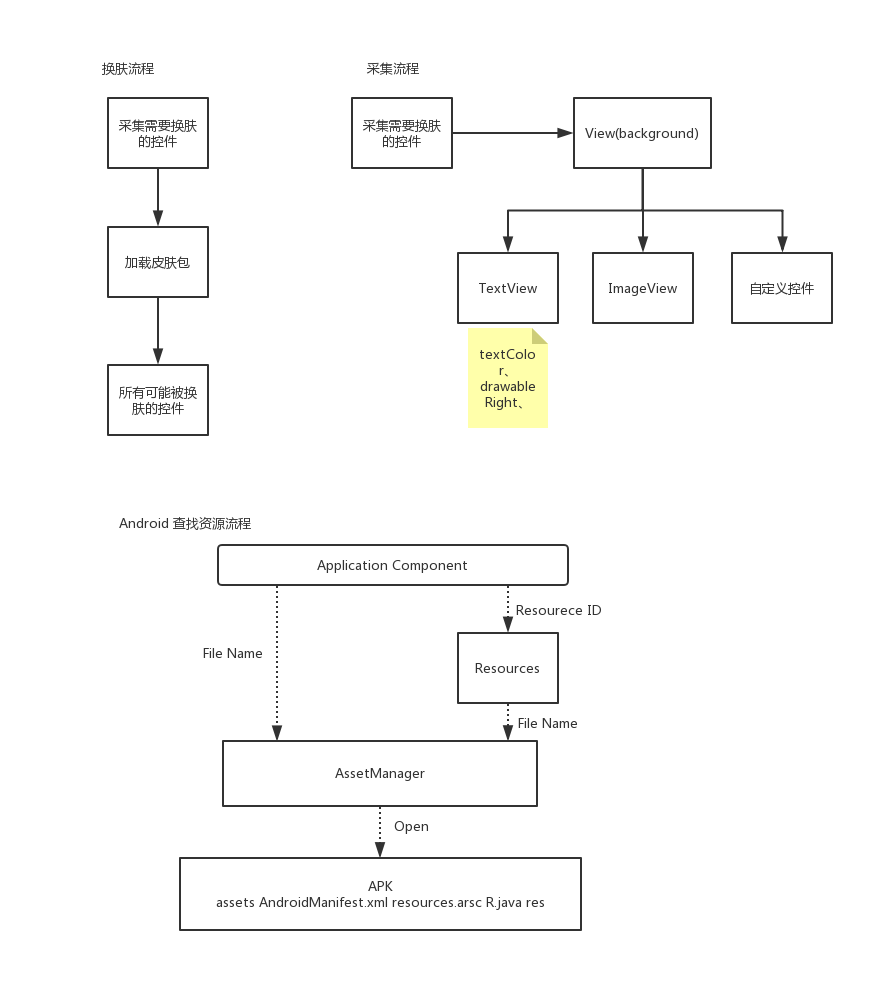

# 1.步骤流程图



# 2.手写关键代码分析
1. <font color=red size=5>**拦截过滤xml中View的属性**</font>
   1. MyApplication.java
      ```
        @Override
        public void onCreate() {
            super.onCreate();
            SkinManager.init(this);
        }      
      ```
   2. SkinManager.java
      - SkinManager.init(this);
      - instance = new SkinManager(application);
      ```
      private SkinManager(Application application) {
        this.application = application;
        /**
         * 提供了一个应用生命周期回调的注册方法，
         *          * 用来对应用的生命周期进行集中管理，
         *  这个接口叫registerActivityLifecycleCallbacks，可以通过它注册
         *          * 自己的ActivityLifeCycleCallback，每一个Activity的生命周期都会回调到这里的对应方法。
         */
        application.registerActivityLifecycleCallbacks(new SkinActivityLifecycle());
      }
      ```
   3. SkinActivityLifecycle.java：为每个Activity的LayoutInflater设置自定义的`LayoutInlater.Factory2`
      ```
        HashMap<Activity,SkinLayoutFactory> factoryHashMap = new HashMap<>();
        @Override
        public void onActivityCreated(Activity activity, Bundle savedInstanceState) {
            /**
             *  更新状态栏
             */
            SkinThemeUtils.updateStatusBarColor(activity);
            
            LayoutInflater layoutInflater = LayoutInflater.from(activity);
            try {
                // 避免重复设置Factory报错      
                Field mFactorySet = LayoutInflater.class.getDeclaredField("mFactorySet");
                mFactorySet.setAccessible(true);
                mFactorySet.setBoolean(layoutInflater, false);
            } catch (Exception e) {
                e.printStackTrace();
            }
    
            //添加自定义创建View 工厂
            SkinLayoutFactory factory = new SkinLayoutFactory(activity);
            layoutInflater.setFactory2(factory);
            
            SkinManager.getInstance().addObserver(factory);
                
            factoryHashMap.put(activity,factory);
        }
        
        @Override
        public void onActivityDestroyed(Activity activity) {
            SkinLayoutFactory factory = factoryHashMap.remove(activity);
            SkinManager.getInstance().deleteObserver(factory);
        }        
      ```
   4. **SkinLayoutFactory.java：view创建工厂**
      ```
        @Override
        public View onCreateView(View parent, String name, Context context, AttributeSet attrs) {
            // 反射 classLoader
            View view = createViewFromTag(name, context, attrs);
            // 自定义View
            if(null ==  view){
                view = createView(name, context, attrs);
            }
    
            //筛选符合属性View
            skinAttribute.load(view, attrs);
    
            return view;
        }
      ```
   5. **SkinAttribute.java：筛选View需要换肤的属性**
      1. skinAttribute.load(view, attrs);
         ```
            public void load(View view, AttributeSet attrs) {
                List<SkinPain> skinPains = new ArrayList<>();
                for (int i = 0; i < attrs.getAttributeCount(); i++) {
                    //获取属性名字
                    String attributeName = attrs.getAttributeName(i);
                    if (mAttributes.contains(attributeName)) {
                        //获取属性对应的值
                        String attributeValue = attrs.getAttributeValue(i);
                        if (attributeValue.startsWith("#")) {
                            continue;
                        }
        
                        int resId;
                        if (attributeValue.startsWith("?")) { // 系统级的?colorPrimary
                            int attrId = Integer.parseInt(attributeValue.substring(1));
                            // 获取真实的id <item name="colorPrimary">@color/colorPrimary</item>                  
                            resId = SkinThemeUtils.getResId(view.getContext(), new int[]{attrId})[0];
                        } else {
                            //@1234564
                            resId = Integer.parseInt(attributeValue.substring(1));
                        }
                        if (resId != 0) {
                            SkinPain skinPain = new SkinPain(attributeName, resId);
                            skinPains.add(skinPain);
                        }
                    }
                }
                if (!skinPains.isEmpty()) {
                    SkinView skinView = new SkinView(view, skinPains);
                    skinView.applySkin();
                    skinViews.add(skinView);
                }
            }         
         ```
         ```
            // <item name="colorPrimary">@color/colorPrimary</item>    
            public static int[] getResId(Context context, int[] attrs){
                int[] ints = new int[attrs.length];
                TypedArray typedArray = context.obtainStyledAttributes(attrs);
                for (int i = 0; i < typedArray.length(); i++) {
                    ints[i] =  typedArray.getResourceId(i, 0);
                }
                typedArray.recycle();
                return ints;
            }         
         ```
2. <font color=red size=5>**加载皮肤包，并修改皮肤**</font>
   1. SkinManager.java extends `Observable`
      ```
        private SkinManager(Application application) {
            this.application = application;
            // 共享首选项，用于记录当前使用的皮肤
            SkinPreference.init(application);
            // 资源管理类，用于从app/皮肤 中加载资源
            SkinResources.init(application);
            /**
             * 提供了一个应用生命周期回调的注册方法，
             *          * 用来对应用的生命周期进行集中管理，
             *  这个接口叫registerActivityLifecycleCallbacks，可以通过它注册
             *          * 自己的ActivityLifeCycleCallback，每一个Activity的生命周期都会回调到这里的对应方法。
             */
             application.registerActivityLifecycleCallbacks(new SkinActivityLifecycle());
             
             // 加载资源包       
             loadSkin(SkinPreference.getInstance().getSkin());
        }      
      ```
      ```
        public void loadSkin(String path) {
            if(TextUtils.isEmpty(path)){
                // 记录使用默认皮肤
                SkinPreference.getInstance().setSkin("");
                // 清空资源管理器，皮肤资源属性等
                SkinResources.getInstance().reset();
            }else{
                try {
                    AssetManager assetManager = AssetManager.class.newInstance();
                    Method addAssetPath = AssetManager.class.getDeclaredMethod("addAssetPath", String.class);
                    addAssetPath.invoke(assetManager,path);
    
                    Resources appResources = application.getResources();
                    Resources skinResources = new Resources(assetManager,appResources.getDisplayMetrics(),appResources.getConfiguration());
    
                    // 记录
                    SkinPreference.getInstance().setSkin(path);
                    // 获取皮肤包的包名
                    String packageName = application.getPackageManager().getPackageArchiveInfo(path, PackageManager.GET_ACTIVITIES).packageName;
    
                    // 将皮肤的Resources和包名存储到SkinResources中
                    SkinResources.getInstance().applySkin(skinResources,packageName);
                } catch (Exception e) {
                    e.printStackTrace();
                }
            }
            // 通知观察者
            setChanged();
    
            notifyObservers();
        }      
      ```
   2. SkinLayoutFactory.java implements LayoutInflater.Factory2,`Observer`
      ```
        @Override
        public void update(Observable o, Object arg) {
            // 更状态栏和导航栏颜色
            SkinThemeUtils.updateStatusBarColor(activity);
            skinAttribute.applySkin();
        }      
      ```
   3. **SkinAttribute.java：筛选View需要换肤的属性**
      ```
        /**
         * 换皮肤
         */
        public void applySkin() {
            for (SkinView mSkinView : skinViews) {
                mSkinView.applySkin();
            }
        }      
      ```
      - SkinView.java
        ```
        public void applySkin() {
            for (SkinPain skinPair : skinPains) {
                Drawable left = null, top = null, right = null, bottom = null;
                switch (skinPair.attributeName) {
                    case "background":
                        Object background = SkinResources.getInstance().getBackground(
                                skinPair.resId);
                        //Color
                        if (background instanceof Integer) {
                            view.setBackgroundColor((Integer) background);
                        } else {
                            ViewCompat.setBackground(view, (Drawable) background);
                        }
                        //摸摸唱
                        break;
                    case "src":
                        background = SkinResources.getInstance().getBackground(skinPair
                                .resId);
                        if (background instanceof Integer) {
                            ((ImageView) view).setImageDrawable(new ColorDrawable((Integer)
                                    background));
                        } else {
                            ((ImageView) view).setImageDrawable((Drawable) background);
                        }
                        break;
                    case "textColor":
                        ((TextView) view).setTextColor(SkinResources.getInstance().getColorStateList
                                (skinPair.resId));
                        break;
                    case "drawableLeft":
                        left = SkinResources.getInstance().getDrawable(skinPair.resId);
                        break;
                    case "drawableTop":
                        top = SkinResources.getInstance().getDrawable(skinPair.resId);
                        break;
                    case "drawableRight":
                        right = SkinResources.getInstance().getDrawable(skinPair.resId);
                        break;
                    case "drawableBottom":
                        bottom = SkinResources.getInstance().getDrawable(skinPair.resId);
                        break;
                    default:
                        break;
                }
                if (null != left || null != right || null != top || null != bottom) {
                    ((TextView) view).setCompoundDrawablesWithIntrinsicBounds(left, top, right,
                            bottom);
                }
            }
        }        
        ```
   4. **SkinThemeUtils.java：替换状态栏**
      ```
        //替换状态栏
        public static void updateStatusBarColor(Activity activity) {
            // 5.0以上才能修改
            if (Build.VERSION.SDK_INT < Build.VERSION_CODES.LOLLIPOP)
                return;
    
            // 获取statusBarColor与navigationBarColor  颜色值
            int[] statusBarId = getResId(activity, STATUSBAR_COLOR_ATTRS);
    
            // 如果statusBarColor 配置颜色值，就换肤
            if (statusBarId[0] != 0) {
                activity.getWindow().setStatusBarColor(SkinResources.getInstance().getColor(statusBarId[0]));
            }else{
                // 获取colorPrimaryDark
                int resId = getResId(activity,APPCOMPAT_COLOR_PRIMARY_DARK_ATTRS)[0];
                if(resId!= 0)
                    activity.getWindow().setStatusBarColor(SkinResources.getInstance().getColor(resId));
            }
            if(statusBarId[1] != 0)
                activity.getWindow().setNavigationBarColor(SkinResources.getInstance().getColor(statusBarId[1]));
        }
      ```
