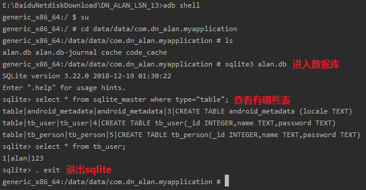
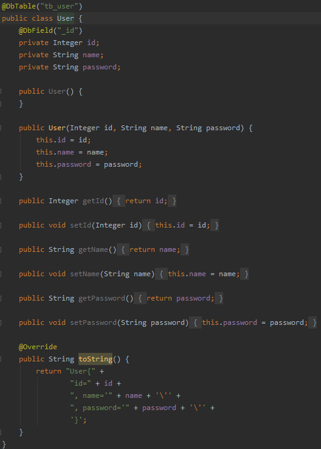
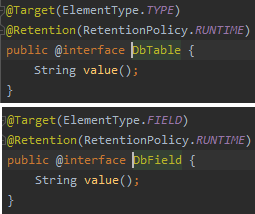
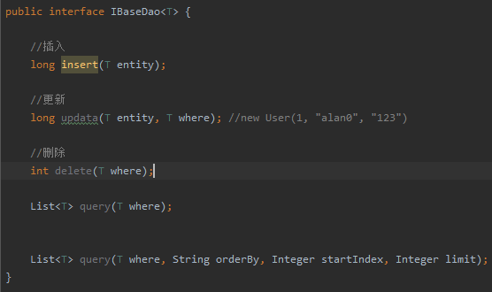
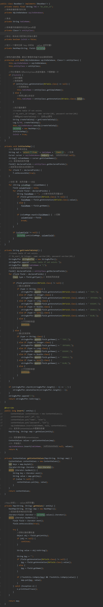

greenDao的使用请看资料。

# 1.Android中shell中查询数据库

- `sqlite3 alan.db`：进入数据库
- `select * from sqlite_master where type="table";`：查看有哪些表。
- `. exit`：退出sqlite.

# 2.步骤
1. 新建实体类`User`（对应表名 tb_user）
   - 
2. 新建注解`DbTable`、`DbField`,对应表名和字段名
   - 
3. 新建接口`IBaseDao`：所有实体类对应表的基本操作(增、删、改、查)
   - 
4. 新建类`BaseDao`实现IBaseDao，每个BaseDao操作对应实体类的数据库表的工具类。
   - 
5. 新建类`BaseDaoFactory`：创建数据库，获取BaseDao。
   - 
