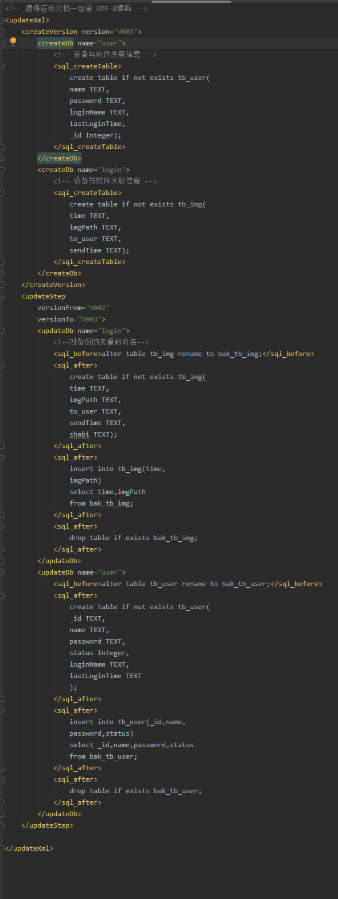

# 1.仿QQ实现数据库分库（多用户）
每个用户对应一个数据库，方便管理

1. User.java
   - `status`：`1`表示当前用户，`0`：表示登录过的用户（非当前）
   - 
2. UserDao.java
   - 继承自`BaseDao<User>`,重写 `insert` 方法(`数据库中其他用户的 status 设置为 0，插入的当前用户设置为 1`)。
   再写一个`getCurrentUser()`方法，用于获取当前用户。
   - 
3. BaseDaoSubFactory.java
   - 创建当前用户对应的数据库，以及获取数据库中对应的操作表的Dao类
   - 

# 2.xml脚本打造数据库版本全量升级架构

1. 从服务器下载xml文件
   - 
2. 解析xml文件
   - 
3. 执行xml文件中的sql语句
   - 
