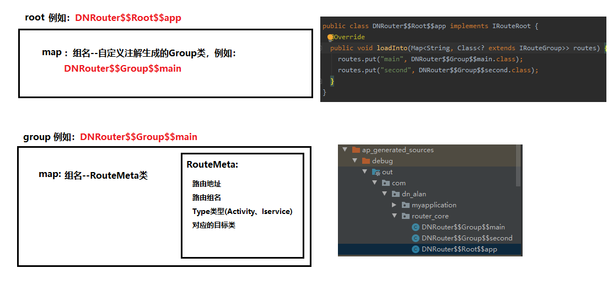

[<font size=6>**Arouter的官网使用说明**</font>](https://github.com/alibaba/ARouter/blob/master/README_CN.md)

[<font size=6>**Arouter的使用踩坑**</font>](../../arouterpractice/README.md)

# 1.<font color=red>路由原理</font>


# 2.<font color=red>路由表设计</font>

1. 
2. <font color=red size=5>**分组的原因**</font>
   - 初始化只加载分组表。使用的时候，如果使用A 分组就去加载A分组下所有的路由信息，而不会去加载B分组。  
   比如A组 有 100个 路由信息，B有200个。如果不分组，你Map中就需要加载300个路由信息，当用户可能根本就不需要进入B分组的页面，
   加载B分组的路由信息只会浪费内存。

# 3.<font color=red>项目结构</font>


# 4. <font color=red>javapoet使用</font>

- [javapoet官网详细使用说明](https://github.com/square/javapoet)
- 常用类
  - `TypeSpec`————用于生成类、接口、枚举对象的类
  - `MethodSpec`————用于生成方法对象的类
  - `ParameterSpec`————用于生成参数对象的类
  - `AnnotationSpec`————用于生成注解对象的类
  - `FieldSpec`————用于配置生成成员变量的类
  - `ClassName`————通过包名和类名生成的对象，在JavaPoet中相当于为其指定Class
  - `ParameterizedTypeName`————通过MainClass和IncludeClass生成包含泛型的Class
  - `JavaFile`————控制生成的Java文件的输出的类
  - `Element`————类、函数、属性都是节点
- 占位符
  - `$T`：在JavaPoet代指的是TypeName，该模板主要将Class抽象出来，用传入的TypeName指向的Class来代替。
  - `$N`：在JavaPoet中代指的是一个名称，例如调用的方法名称，变量名称，这一类存在意思的名称
  - `$S`：在JavaPoet中就和String.format中%s一样,字符串的模板,将指定的字符串替换到$S的地方
  - `$L`：在JavaPoet中表示的是你当前输入的是什么就是什么

# 5. <font color=red>自定义注解处理器</font>
1. AnnotationProcessor
   - Annotation Processor是javac的一个工具，它用来在编译时扫描和处理注解。通过Annotation Processor可以获取到注解和被注解对
   象的相关信息，然后根据注解自动生成Java代码，省去了手动编写，提高了编码效率。
   - 
   - 刚接触Annotation Processor的同学可能会遇到找不到AbstractProcessor类的问题，大概率是因为直接在Android项目里边引用了
   AbstractProcessor，然而由于Android平台是基于OpenJDK的，而OpenJDK中不包含Annotation Processor的相关代码。因此，**在使用
   Annotation Processor时，必须在新建Module时选择`Java Library`**，处理注解相关的代码都需要在Java Library模块下完成。我们
   需要看一下整个项目的结构
   - 
2. <font color=red size = 5>**步骤**</font>
   1. app级的 build.gradle 文件
      - java
        ```
        apply plugin: 'com.android.application'
        
        android {
            ....
            defaultConfig {
            ....
                // 在gradle文件中配置选项参数值（用于APT传参接收）
                // 切记：必须写在defaultConfig节点下
                javaCompileOptions {
                    annotationProcessorOptions {
                        arguments = [ moduleName : project.getName() ]
                    }
                }
            }
        ....
        }
        
        dependencies {
            ....
            annotationProcessor project(':router_compiler')
            implementation project(':base')
        }        
        ```
      - kotlin
        ```
        apply plugin: 'com.android.application'
        apply plugin: 'kotlin-kapt' // ensure kapt plugin is applied
         
        dependencies {
            kapt project(':router_compiler')
            implementation project(':base')
        }
         
        kapt {
            arguments {
                arg('eventBusIndex', 'com.example.myapp.MyEventBusIndex')
            }
        }        
        ```
   2. 新建`Java Library：router_annotation` 用于存放所有的注解
   3. 新建`Java Library：router_compiler` 注解处理类
      1. 看下router_compiler的build.gradle文件
         - 依赖`router_annotation`
         - 添加`auto-service`依赖：注册注解处理器，指定的注解都会在`RouteProcessor`中处理
         - 添加[javapoet](https://github.com/square/javapoet)依赖：用于生成代码
         ```
            apply plugin: 'java-library'
            
            dependencies {
                implementation fileTree(dir: 'libs', include: ['*.jar'])
            
                annotationProcessor 'com.google.auto.service:auto-service:1.0-rc4'
                compileOnly 'com.google.auto.service:auto-service:1.0-rc4'
            
                implementation 'com.squareup:javapoet:1.11.1'
            
                implementation project(':router_annotation')
            }
            
            // java控制台输出中文乱码
            tasks.withType(JavaCompile) {
                options.encoding = "UTF-8"
            }
            
            sourceCompatibility = "7"
            targetCompatibility = "7"          
         ```
      2. 新建`RouteProcessor.java`继承自AbstractProcessor
         - Log中封装了`Messager`打印日志，<font color=red size=5>在构建的**build**中看，不是在logcat中看</font>
         ```
            /**
             * 在这个类上添加了@AutoService注解，它的作用是用来生成
             * META-INF/services/javax.annotation.processing.Processor文件的，
             * 也就是我们在使用注解处理器的时候需要手动添加
             * META-INF/services/javax.annotation.processing.Processor，
             * 而有了@AutoService后它会自动帮我们生成。
             * AutoService是Google开发的一个库，使用时需要在
             * factory-compiler中添加依赖
             */
            @AutoService(Processor.class)   //注册注解处理器
            /**
             * 处理器接收的参数 替代 {@link AbstractProcessor#getSupportedOptions()} 函数
             */
            @SupportedOptions(Consts.ARGUMENTS_NAME)
            /**
             * 指定使用的Java版本 替代 {@link AbstractProcessor#getSupportedSourceVersion()} 函数
             * 声明我们注解支持的JDK的版本
             */
            @SupportedSourceVersion(SourceVersion.RELEASE_7)
            /**
             * 注册给哪些注解的  替代 {@link AbstractProcessor#getSupportedAnnotationTypes()} 函数
             * 声明我们要处理哪一些注解 该方法返回字符串的集合表示该处理器用于处理哪些注解
             */
            @SupportedAnnotationTypes({Consts.ANN_TYPE_ROUTE})
            public class RouteProcessor extends AbstractProcessor {
            
            
                /**
                 * key:组名 value:类名
                 */
                private Map<String, String> rootMap = new TreeMap<>();
                /**
                 * 分组 key:组名 value:对应组的路由信息
                 */
                private Map<String, List<RouteMeta>> groupMap = new HashMap<>();
                /**
                 * 节点工具类 (类、函数、属性都是节点)
                 */
                private Elements elementUtils;
            
                /**
                 * type(类信息)工具类
                 */
                private Types typeUtils;
                /**
                 * 文件生成器 类/资源
                 */
                private Filer filerUtils;
                /**
                 * 参数
                 */
                private String moduleName;
            
                private Log log;
            
                /**
                 * 初始化 从 {@link ProcessingEnvironment} 中获得一系列处理器工具
                 *
                 * @param processingEnvironment
                 */
                @Override
                public synchronized void init(ProcessingEnvironment processingEnvironment) {
                    super.init(processingEnvironment);
                    //获得apt的日志输出
                    log = Log.newLog(processingEnvironment.getMessager());
                    log.i("init()");
                    elementUtils = processingEnv.getElementUtils();
                    typeUtils = processingEnvironment.getTypeUtils();
                    filerUtils = processingEnv.getFiler();
                    //参数是模块名 为了防止多模块/组件化开发的时候 生成相同的 xx$$ROOT$$文件
                    Map<String, String> options = processingEnv.getOptions();
                    if (!Utils.isEmpty(options)) {
                        moduleName = options.get(Consts.ARGUMENTS_NAME);
                    }
                    log.i("RouteProcessor Parmaters:" + moduleName);
                    if (Utils.isEmpty(moduleName)) {
                        throw new RuntimeException("Not set Processor Parmaters.");
                    }
                }
            
                /**
                 * 相当于main函数，正式处理注解
                 *
                 * @param set 使用了支持处理注解  的节点集合
                 * @param roundEnvironment 表示当前或是之前的运行环境,可以通过该对象查找找到的注解。
                 * @return true 表示后续处理器不会再处理(已经处理)
                 */
                @Override
                public boolean process(Set<? extends TypeElement> set, RoundEnvironment roundEnvironment) {
            
                    //使用了需要处理的注解
                    if (!Utils.isEmpty(set)) {
                        //获取所有被 Route 注解的元素集合
                        Set<? extends Element> routeElements = roundEnvironment.getElementsAnnotatedWith
                                (Route.class);
                        //处理 Route 注解
                        if (!Utils.isEmpty(routeElements)) {
                            try {
                                log.i("Route Class: ===" + routeElements.size());
                                parseRoutes(routeElements);
                            } catch (IOException e) {
                                e.printStackTrace();
                            }
                        }
                        return true;
                    }
                    return false;
                }
            
                private void parseRoutes(Set<? extends Element> routeElements) throws IOException {
                    //支持配置路由类的类型
                    TypeElement activity = elementUtils.getTypeElement(Consts.ACTIVITY);
                    //节点自描述 Mirror
                    TypeMirror type_Activity = activity.asType();
                    log.i("Route Class: ===" + type_Activity);
                    TypeElement iService = elementUtils.getTypeElement(Consts.ISERVICE);
                    TypeMirror type_IService = iService.asType();
            
            
                    /**
                     * groupMap(组名:路由信息)集合
                     */
                    //声明 Route 注解的节点 (需要处理的节点 Activity/IService)
                    for (Element element : routeElements) {
                        //路由信息
                        RouteMeta routeMeta;
                        // 使用Route注解的类信息
                        TypeMirror tm = element.asType();
                        log.i("Route Class: " + tm.toString());
                        Route route = element.getAnnotation(Route.class);
                        //是否是 Activity 使用了Route注解
                        if (typeUtils.isSubtype(tm, type_Activity)) {
                            routeMeta = new RouteMeta(RouteMeta.Type.ACTIVITY, route, element);
                        } else if (typeUtils.isSubtype(tm, type_IService)) {
                            routeMeta = new RouteMeta(RouteMeta.Type.ISERVICE, route, element);
                        } else {
                            throw new RuntimeException("[Just Support Activity/IService Route] :" + element);
                        }
                        //分组信息记录  groupMap <Group分组,RouteMeta路由信息> 集合
                        categories(routeMeta);
                    }
            
                   //生成类需要实现的接口
                    TypeElement iRouteGroup = elementUtils.getTypeElement(Consts.IROUTE_GROUP);
                    log.i("---------" + iRouteGroup.getSimpleName());
                    TypeElement iRouteRoot = elementUtils.getTypeElement(Consts.IROUTE_ROOT);
            
                    /**
                     *  生成Group类 作用:记录 <地址,RouteMeta路由信息(Class文件等信息)>
                     */
                    generatedGroup(iRouteGroup);
                    /**
                     * 生成Root类 作用:记录 <分组，对应的Group类>
                     */
                    generatedRoot(iRouteRoot, iRouteGroup);
            
            
                }
            
                private void generatedGroup(TypeElement iRouteGroup) throws IOException {
                    //参数  Map<String,RouteMeta>
                    ParameterizedTypeName atlas = ParameterizedTypeName.get(
                            ClassName.get(Map.class),
                            ClassName.get(String.class),
                            ClassName.get(RouteMeta.class)
                    );
                    //参数 Map<String,RouteMeta> atlas
                    ParameterSpec groupParamSpec = ParameterSpec.builder(atlas, "atlas")
                            .build();
            
                    //遍历分组,每一个分组创建一个 $$Group$$ 类
                    for (Map.Entry<String, List<RouteMeta>> entry : groupMap.entrySet()) {
                        /**
                         * 类成员函数loadInfo声明构建
                         */
                        //函数 public void loadInfo(Map<String,RouteMeta> atlas)
                        MethodSpec.Builder loadIntoMethodOfGroupBuilder = MethodSpec.methodBuilder
                                (Consts.METHOD_LOAD_INTO)
                                .addAnnotation(Override.class)
                                .addModifiers(PUBLIC)
                                .addParameter(groupParamSpec);
            
                        //分组名 与 对应分组中的信息
                        String groupName = entry.getKey();
                        List<RouteMeta> groupData = entry.getValue();
                        //遍历分组中的条目 数据
                        for (RouteMeta routeMeta : groupData) {
                            // 组装函数体:
                            // atlas.put(地址,RouteMeta.build(Class,path,group))
                            // $S https://github.com/square/javapoet#s-for-strings
                            // $T https://github.com/square/javapoet#t-for-types
                            loadIntoMethodOfGroupBuilder.addStatement(
                                    "atlas.put($S, $T.build($T.$L,$T.class, $S, $S))",
                                    routeMeta.getPath(),
                                    ClassName.get(RouteMeta.class),
                                    ClassName.get(RouteMeta.Type.class),
                                    routeMeta.getType(),
                                    ClassName.get((TypeElement) routeMeta.getElement()),
                                    routeMeta.getPath().toLowerCase(),
                                    routeMeta.getGroup().toLowerCase());
                        }
                        // 创建java文件($$Group$$)  组
                        String groupClassName = Consts.NAME_OF_GROUP + groupName;
                        JavaFile.builder(Consts.PACKAGE_OF_GENERATE_FILE,
                                TypeSpec.classBuilder(groupClassName)
                                        .addSuperinterface(ClassName.get(iRouteGroup))
                                        .addModifiers(PUBLIC)
                                        .addMethod(loadIntoMethodOfGroupBuilder.build())
                                        .build()
                        ).build().writeTo(filerUtils);
                        log.i("Generated RouteGroup: " + Consts.PACKAGE_OF_GENERATE_FILE + "." +
                                groupClassName);
                        //分组名和生成的对应的Group类类名
                        rootMap.put(groupName, groupClassName);
                    }
                }
            
                private void generatedRoot(TypeElement iRouteRoot, TypeElement iRouteGroup) throws IOException {
                    //类型 Map<String,Class<? extends IRouteGroup>> routes>
                    //Wildcard 通配符
                    ParameterizedTypeName routes = ParameterizedTypeName.get(
                            ClassName.get(Map.class),
                            ClassName.get(String.class),
                            ParameterizedTypeName.get(
                                    ClassName.get(Class.class),
                                    WildcardTypeName.subtypeOf(ClassName.get(iRouteGroup))
                            )
                    );
            
                    //参数 Map<String,Class<? extends IRouteGroup>> routes> routes
                    ParameterSpec rootParamSpec = ParameterSpec.builder(routes, "routes")
                            .build();
                    //函数 public void loadInfo(Map<String,Class<? extends IRouteGroup>> routes> routes)
                    MethodSpec.Builder loadIntoMethodOfRootBuilder = MethodSpec.methodBuilder
                            (Consts.METHOD_LOAD_INTO)
                            .addAnnotation(Override.class)
                            .addModifiers(PUBLIC)
                            .addParameter(rootParamSpec);
            
                    //函数体
                    for (Map.Entry<String, String> entry : rootMap.entrySet()) {
                        loadIntoMethodOfRootBuilder.addStatement("routes.put($S, $T.class)", entry
                                .getKey(), ClassName.get(Consts.PACKAGE_OF_GENERATE_FILE, entry.getValue
                                ()));
                    }
                    //生成 $Root$类
                    String rootClassName = Consts.NAME_OF_ROOT + moduleName;
                    JavaFile.builder(Consts.PACKAGE_OF_GENERATE_FILE,
                            TypeSpec.classBuilder(rootClassName)
                                    .addSuperinterface(ClassName.get(iRouteRoot))
                                    .addModifiers(PUBLIC)
                                    .addMethod(loadIntoMethodOfRootBuilder.build())
                                    .build()
                    ).build().writeTo(filerUtils);
            
                    log.i("Generated RouteRoot: " + Consts.PACKAGE_OF_GENERATE_FILE + "." + rootClassName);
                }
            
                private void categories(RouteMeta routeMeta) {
                    if (routeVerify(routeMeta)) {
                        log.i("Group Info, Group Name = " + routeMeta.getGroup() + ", Path = " +
                                routeMeta.getPath());
                        List<RouteMeta> routeMetas = groupMap.get(routeMeta.getGroup());
                        //如果未记录分组则创建
                        if (Utils.isEmpty(routeMetas)) {
                            List<RouteMeta> routeMetaSet = new ArrayList<>();
                            routeMetaSet.add(routeMeta);
                            groupMap.put(routeMeta.getGroup(), routeMetaSet);
                        } else {
                            routeMetas.add(routeMeta);
                        }
                    } else {
                        log.i("Group Info Error: " + routeMeta.getPath());
                    }
                }
            
                /**
                 * 验证路由信息必须存在path(并且设置分组)
                 *
                 * @param meta raw meta
                 */
                private boolean routeVerify(RouteMeta meta) {
                    String path = meta.getPath();
                    String group = meta.getGroup();
                    //路由地址必须以 / 开头
                    if (Utils.isEmpty(path) || !path.startsWith("/")) {
                        return false;
                    }
                    //如果没有设置分组,以第一个 / 后的节点为分组(所以必须path两个/)
                    if (Utils.isEmpty(group)) {
                        String defaultGroup = path.substring(1, path.indexOf("/", 1));
                        if (Utils.isEmpty(defaultGroup)) {
                            return false;
                        }
                        meta.setGroup(defaultGroup);
                        return true;
                    }
                    return true;
                }
            
            }         
         ```
   4. 新建一个 Moudle为`com.android.library` 工具类 `router_core`
      - gradle文件
        ```
        ....
        dependencies {
            ....
            //引入注解库
            api project(':router_annotation')
        }        
        ```
      - 使用注解生成器生成的类和对应的工具类联合使用。

