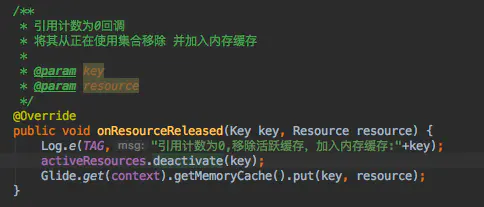
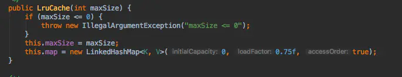
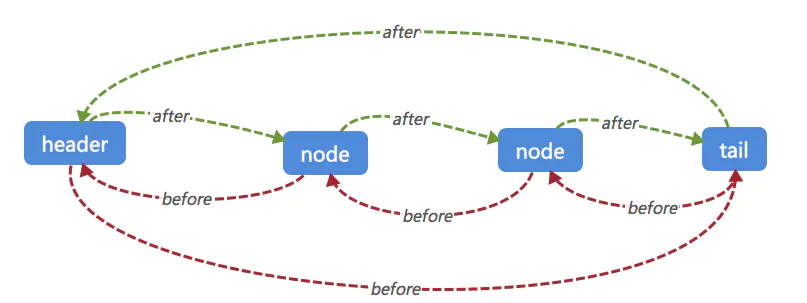

# 1. Glide的多级缓存

相较于常见的内存+磁盘缓存，Glide将其缓存分成了4层。

1. `活动资源 (Active Resources)`
   - 如果当前对应的图片资源正在使用，则这个图片会被Glide放入活动缓存。
2. `内存缓存 (Memory Cache)`
   - 如果图片最近被加载过，并且当前没有使用这个图片，则会被放入内存中
3. `资源类型（Resource Disk Cache）`
   - 被解码后的图片写入磁盘文件中，解码的过程可能修改了图片的参数(如:inSampleSize、inPreferredConfig)
4. `原始数据 (Data Disk Cache)`
   - 图片原始数据在磁盘中的缓存(从网络、文件中直接获得的原始数据)

# 2. 第一层 活动资源

当需要加载某张图片能够从内存缓存中获得的时候，在图片加载时主动将对应图片从内存缓存中移除，加入到活动资源中。
这样也可以避免因为达到内存缓存最大值或者系统内存压力导致的内存缓存清理，从而释放掉活动资源中的图片(recycle)。
活动资源中是一个”引用计数"的图片资源的弱引用集合。

因为同一张图片可能在多个地方被同时使用，每一次使用都会将引用计数+1,而当引用计数为0时候，则表示这个图片没有被使用也就是没有强引用了。这样则会将图片从活动资源中移除，并加入内存缓存。

# 3. 第二层 内存缓存
内存缓存默认使用LRU(缓存淘汰算法/最近最少使用算法),当资源从活动资源移除的时候，会加入此缓存。使用图片的时候会主动从此缓存
移除，加入活动资源。

LRU在 Android 中提供了LruCache工具类。

构造LinkedHashMap的accessOrder设置为true。在使用的此map的时候，自动进行排序(每次get/put,会将使用的value放入链表header头部)
。LruCache会在每次get/put的时候判断数据如果达到了maxSize,则会优先删除tail尾端的数据。

磁盘缓存同样使用LRU算法。

# 4. 第三、四层 磁盘缓存

Resource 缓存的是经过解码后的图片，如果再使用就不需要再去进行解码配置(BitmapFactory.Options),加快获得图片速度。比如原图是
一个100x100的ARGB_8888图片，在首次使用的时候需要的是50x50的RGB_565图片，那么Resource将50x50 RGB_565缓存下来，再次使用此图
片的时候就可以从 Resource 获得。不需要去计算inSampleSize(缩放因子)。  
Data 缓存的则是图像原始数据。