# 1.Android消息机制

Android  的消息机制主要是指Handler得运行机制

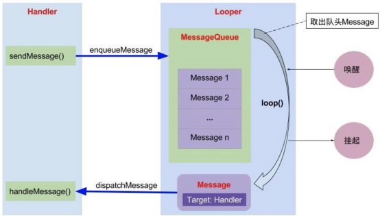

以上模型的解释：
1. 以Handler的sendMessage方法为例，当发送一个消息后，会将此消息加入消息队列MessageQueue中。
2. Looper负责去遍历消息队列并且将队列中的消息分发给对应的Handler进行处理。
3. 在Handler的handleMessage方法中处理该消息，这就完成了一个消息的发送和处理过程。

这里从图中可以看到参与消息处理有四个对象，它们分别是 `Handler`, `Message`, `MessageQueue`，`Looper`。

# 2.ThreadLocal 的工作原理

ThreadLocal 是一个线程内部的数据存储类，通过它可以在指定的线程中存储数据，数据存储以后，只有在指定线程中才可以获取到存储的数据，对于其他线程来说则无法获取到数据。

# 3.Android消息机制源码分析

1. 创建全局唯一Looper对象和全局唯一MessageQueue消息对象
   - 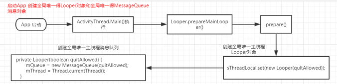
2. Activity中创建Handler
   - 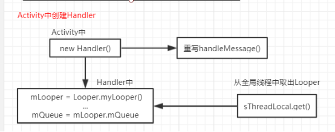
3. 消息发送
   - 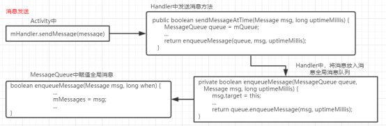
4. 消息处理
   - 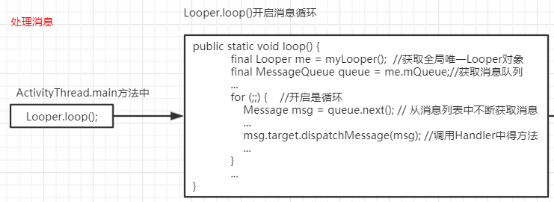

# 4.消息阻塞和延时

Looper 的阻塞主要是靠 MessageQueue 来实现的，在next()@MessageQuese 进行阻塞，在 enqueueMessage()@MessageQueue 进行唤醒。主要依赖
native 层的 Looper 依靠 epoll 机制进行的。

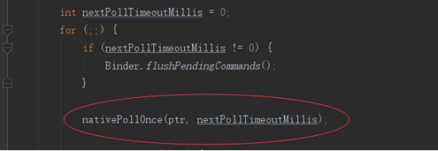

阻塞和延时，主要是next()中`nativePollOnce(ptr, nextPollTimeoutMillis)`调用naive方法操作管道，由nextPollTimeoutMillis决定是否需要阻塞
nextPollTimeoutMillis为0的时候表示不阻塞，为-1的时候表示一直阻塞直到被唤醒，其他时间表示延时。

# 5.唤醒

主要是指enqueueMessage()@MessageQueue 进行唤醒

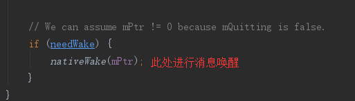

# 6.阻塞和唤醒总结
简单理解阻塞和唤醒：  
　　就是在主线程的MessageQueue没有消息时，便阻塞在loop的queue.next()中的nativePollOnce()方法里，此时主线程会释放CPU资源进入休眠状态，
直到下个消息到达或者有事务发生，通过往pipe管道写端写入数据来唤醒主线程工作。
　　  
　　这里采用的epoll机制，是一种IO多路复用机制，可以同时监控多个描述符，当某个描述符就绪(读或写就绪)，则立刻通知相应程序进行读或写操作，
本质同步I/O，即读写是阻塞的。 所以说，主线程大多数时候都是处于休眠状态，并不会消耗大量CPU资源。

从阻塞到唤醒，消息切换

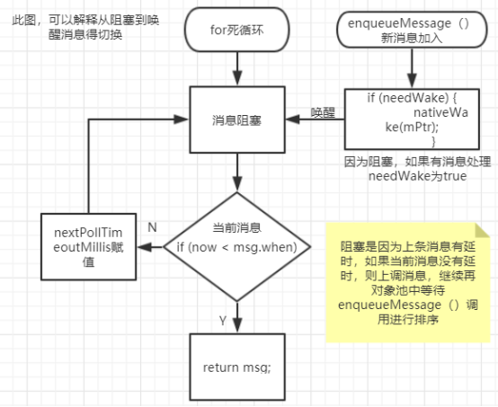

# 7.延时入队

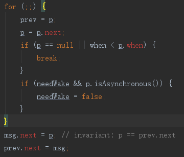

主要指enqueueMessage()消息入队列，上图代码对message对象池得重新排序，遵循规则（when从小到大）。

此处for死循环推出情况分两种
- 第一种：p==null表示对象池中已经运行到了最后一个，无需再循环。
- 第二种：碰到下一个消息when小于前一个，立马退出循环（不管对象池中所有message是否遍历完），进行从新排序。

# 8.Native消息机制

具体详见 [参考文档](https://blog.csdn.net/chewbee/article/details/78108201#nativewake%E6%96%B9%E6%B3%95)

# 9.常见问题分析（面试）

## 9.1.为什么不能在子线程中更新UI,根本原因是什么?

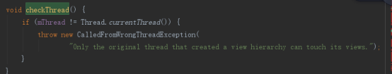

mThread 是UI线程，这里会检查当前线程是不是UI线程。那么为什么 onCreate 里面没有进行这个检查呢。这个问题原因出现在Activity的生命周期中，
在 onCreate 方法中，UI处于创建过程，对用户来说界面还不可视，直到 onStart 方法后界面可视了，再到 onResume 方法后界面可以交互。从某种程度来讲，
`在 onCreate 方法中不能算是更新UI，只能说是配置UI，或者是设置UI的属性。这个时候不会调用到 ViewRootImpl.checkThread()，因为 ViewRootImpl 没被创建。
而在 onResume 方法后，ViewRootImpl才被创建`。这个时候去交互界面才算是更新UI。

setContentView 只是建立了View树，并没有进行渲染工作（其实真正的渲染工作是在 onResume 之后）。也正是建立了View树，因此我们可以通过 findViewById()
来获取到View对象，但是由于并没有进行渲染视图的工作，也就是没有执行 ViewRootImpl.performTransversal。同样 View 中也不会执行 onMeasure() ，
如果在 onResume() 方法里直接获取 View.getHeight()/View.getWidth() 得到的结果总是0。

## 9.2.为什么主线程用Looper死循环不会引发ANR异常?

简单说就是在主线程的MessageQueue没有消息时，便阻塞在 loop 的 queue.next() 中的 `nativePollOnce()` 方法里，
此时主线程会释放CPU资源进入休眠状态，直到下个消息到达或者有事务发生，
通过`往pipe管道写端写入数据来唤醒主线程工作`。这里`采用的epoll机制，是一种IO多路复用机制。`

## 9.3.为什么Handler构造方法里面的Looper不是直接new？

如果在Handler构造方法里面new Looper，怕是无法保证保证Looper唯一，只有用Looper.prepare()才能保证唯一性，具体去看prepare方法。

## 9.4. MessageQueue为什么要放在Looper私有构造方法初始化？

因为一个线程只绑定一个Looper，所以在Looper构造方法里面初始化就可以保证mQueue也是唯一的Thread对应一个Looper 对应一个 mQueue。

## 9.5.Handler.post的逻辑在哪个线程执行的，是由Looper所在线程还是Handler所在线程决定的？

由Looper所在线程决定的。逻辑是在Looper.loop()方法中，从MsgQueue中拿出msg，并且执行其逻辑，这是在Looper中执行的，因此有Looper所在线程决定。

## 9.6.MessageQueue.next()会因为发现了延迟消息，而进行阻塞。那么为什么后面加入的非延迟消息没有被阻塞呢？

见唤醒

## 9.7.Handler的dispatchMessage()分发消息的处理流程？

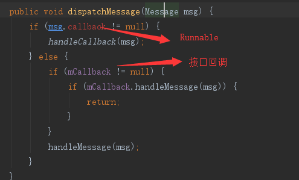

- msg.callback 在 mHandler1.post() 中使用
- mCallback在new Handler是通过接口回调
  - 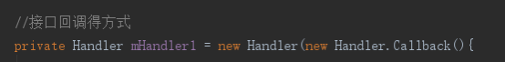

Post() 和 sendMessage() 都是发送消息，加入消息队列得方式也是一样，区别在于处理消息得方式。通过跟踪源码，容易区分。

