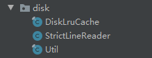
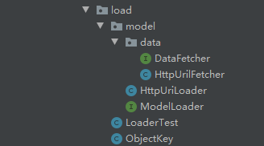

[<font size=5>**Glide预习资料 注册ModelLoader**</font>](https://www.jianshu.com/p/2645f9e69cde)

# 1.复用池

采用的也是`LruCache`，内存缓存中`被动移除(内存紧张、达到maxSize)`的加入到复用池(BitmapPool)中，复用池(BitmapPool)中`被动移除(内存紧张、达到maxSize)`的Bitmap进行recycle

<font color=red size=5>Bitmap复用的条件<font>：
- Bitmap的inMutable需要为true。
- **Android 4.4及以上只需要被复用的Bitmap的内存必须大于等于需要新获得Bitmap的内存，则允许复用此Bitmap。**
- **4.4以下(3.0以上)则被复用的Bitmap与使用复用的Bitmap必须宽、高相等并且使用复用的Bitmap解码时设置的inSampleSize为1，才允许复用。**

1. 内存缓存
   - `LruMemoryCache.java`
     ```
        @Override
        protected void entryRemoved(boolean evicted, @NonNull Key key, @NonNull Resource oldValue, @Nullable Resource newValue) {
            if (null != listener && null != oldValue && !isRemoved) {
                this.listener.onResourceRemoved(oldValue);
            }
        }     
     ```
   - `CacheTest.java`
     ```
        /**
         * 从内存缓存被动移除   回调放入 复用池
         * @param resource
         */
        @Override
        public void onResourceRemoved(Resource resource) {
            bitmapPool.put(resource.getBitmap());
        }
     ```
2. 复用池
   - `LruBitmapPool.java`
     - **NavigableMap<Integer, Integer> map = new TreeMap<>();** // 找寻跟需要加载的Bitmap内存最接近的那块内存。
     ```
        ...
        @Override
        protected void entryRemoved(boolean evicted, @NonNull Integer key, @NonNull Bitmap oldValue, @Nullable Bitmap newValue) {
            super.entryRemoved(evicted, key, oldValue, newValue);
            map.remove(key);
            if(!isRemoved){
                oldValue.recycle();
            }
        }
        /**
         * 将Bitmap放入复用池
         *
         * @param bitmap
         */
        @Override
        public void put(Bitmap bitmap) {
            //isMutable 必须是true
            if (!bitmap.isMutable()) {
                bitmap.recycle();
                return;
            }
    
            int size = bitmap.getAllocationByteCount();
            if (size >= maxSize()) {
                bitmap.recycle();
                return;
            }
    
            put(size, bitmap);
            map.put(size, 0);
        }
    
        @Override
        public Bitmap get(int width, int height, Bitmap.Config config) {
            //新Bitmap一个内存大小
            int size = width * height * (config == Bitmap.Config.ARGB_8888 ? 4 : 2);
            //获取等于size或者大于size 的key
            Integer key = map.ceilingKey(size);
            if (null != key && key <= size * MAX_OVER_SIZE) {
                isRemoved = true;
                Bitmap remove = remove(key);
                isRemoved = false;
                return remove;
            }
            return null;
        }        
     ```
# 2. 磁盘缓存`DiskLruCache`

采用的还是LinkedHashMap（双向链表）实现缓存算法的

[Release版本下载](https://github.com/JakeWharton/DiskLruCache/releases),复制源码内容到项目中

<div align="center">

</div>

## 2.1打开缓存
```
// open()方法接收四个参数，
// 第一个参数指定的是数据的缓存地址
// 第二个参数指定当前应用程序的版本号
// 第三个参数指定同一个key可以对应多少个缓存文件，基本都是传1
// 第四个参数指定最多可以缓存多少字节的数据。一般10*1024*1024就够了
public static DiskLruCache open(File directory, int appVersion, int valueCount, long maxSize)

// 缓存地址通常都会存放在 /sdcard/Android/data/<application package>/cache 这个路径下面，
// 但同时我们又需要考虑如果这个手机没有SD卡，或者SD正好被移除了的情况，因此比较优秀的程序都会专门写一个方法来获取缓存地址，如下所示：
public File getDiskCacheDir(Context context, String uniqueName) {
	String cachePath;
	if (Environment.MEDIA_MOUNTED.equals(Environment.getExternalStorageState())
			|| !Environment.isExternalStorageRemovable()) {
		cachePath = context.getExternalCacheDir().getPath();
	} else {
		cachePath = context.getCacheDir().getPath();
	}
	return new File(cachePath + File.separator + uniqueName);
}
```

## 2.2.写入缓存

```

String imageUrl = "https://img-my.csdn.net/uploads/201309/01/1378037235_7476.jpg";
String key = hashKeyForDisk(imageUrl);
DiskLruCache.Editor editor = mDiskLruCache.edit(key);
OutputStream outputStream = editor.newOutputStream(0);//通过这个outputStream写入缓存。

// 怎样才能让key和图片的URL能够一一对应.其实最简单的做法就是将图片的URL进行MD5编码，编码后的字符串肯定是唯一的，
// 并且只会包含0-F这样的字符，完全符合文件的命名规则。
public String hashKeyForDisk(String key) {
	String cacheKey;
	try {
		final MessageDigest mDigest = MessageDigest.getInstance("MD5");
		mDigest.update(key.getBytes());
		cacheKey = bytesToHexString(mDigest.digest());
	} catch (NoSuchAlgorithmException e) {
		cacheKey = String.valueOf(key.hashCode());
	}
	return cacheKey;
}
 
private String bytesToHexString(byte[] bytes) {
	StringBuilder sb = new StringBuilder();
	for (int i = 0; i < bytes.length; i++) {
		String hex = Integer.toHexString(0xFF & bytes[i]);
		if (hex.length() == 1) {
			sb.append('0');
		}
		sb.append(hex);
	}
	return sb.toString();
}
```

## 2.3.读取缓存

```
try {
	String imageUrl = "https://img-my.csdn.net/uploads/201309/01/1378037235_7476.jpg";
	String key = hashKeyForDisk(imageUrl);
	DiskLruCache.Snapshot snapShot = mDiskLruCache.get(key);
	if (snapShot != null) {
		InputStream is = snapShot.getInputStream(0);
		Bitmap bitmap = BitmapFactory.decodeStream(is);
		mImage.setImageBitmap(bitmap);
	}
} catch (IOException e) {
	e.printStackTrace();
}
```

## 2.4.移除缓存

这个方法我们并不应该经常去调用它。因为你完全不需要担心缓存的数据过多从而占用SD卡太多空间的问题，DiskLruCache会根据我们在调用open()
方法时设定的缓存最大值来自动删除多余的缓存。只有你确定某个key对应的缓存内容已经过期，需要从网络获取最新数据的时候才应该调用remove()
方法来移除缓存。

```
try {
	String imageUrl = "https://img-my.csdn.net/uploads/201309/01/1378037235_7476.jpg";  
	String key = hashKeyForDisk(imageUrl);  
	mDiskLruCache.remove(key);
} catch (IOException e) {
	e.printStackTrace();
}
```
# 3.ModelLoader模型加载器
loader方法加载`本地图片`，`网络图片`等等的原理

<div align="center">

</div>