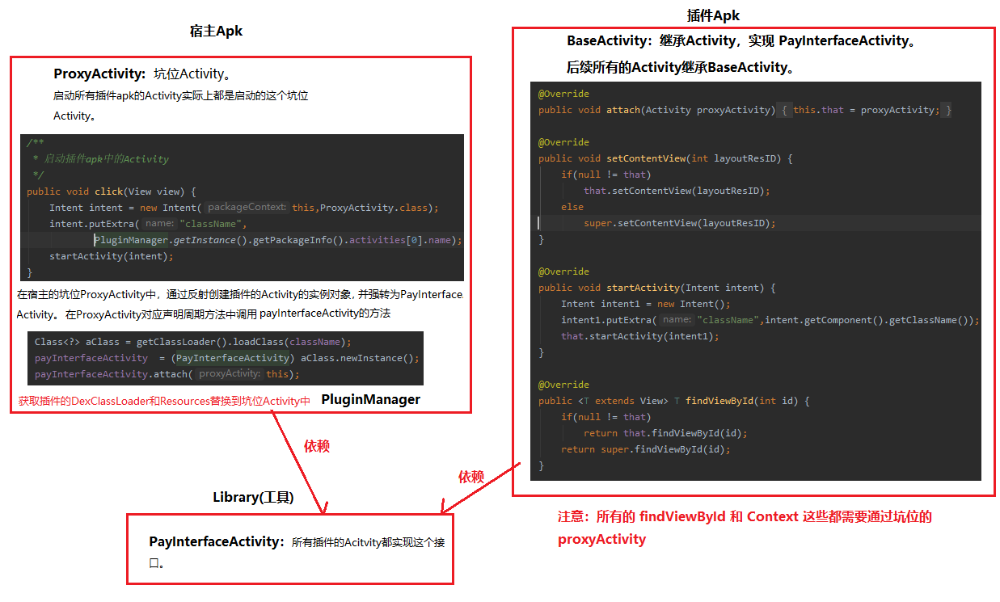

# 1、插件化介绍

## 1.1、动态加载技术
原理：在应用程序运行时，动态加载一些程序中原本不存在的可执行文件并运行这些文件里的代码逻辑。可执行文件总的来说分为两个，一种是动态链接库so，另一种是dex相关文件（dex文件包含jar/apk文件）。

插件化技术和热修复技术都属于动态加载技术

区别：
- 插件化：`主要用于解决应用越来越庞大的以及功能模块的解耦,所以小项目中一般用的不多`
- 热修复：`主要用来修复bug`

## 1.2、插件化出现的作用

- 解决复杂业务，模块解耦
- 方便应用间的接入
- 解决65536限制，内存占用大

## 1.3、实现插件化的方法

- 插桩式（接口回调）
- Hook技术
- 反射

# 2、插桩式（入侵性比较强）

1. 宿主apk模块
   - ProxyActivity：占坑的Activity。
2. library接口
   - PayInterfaceActivity
     - 插件Activity需要实现的接口
     - ProxyActivity中反射创建插件Activity时，强转为的对象
3. 插件apk模块
   - startActivity：重新最终还是跳转到ProxyActivity去显示。

