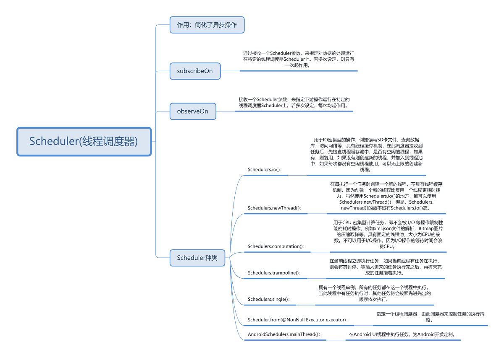
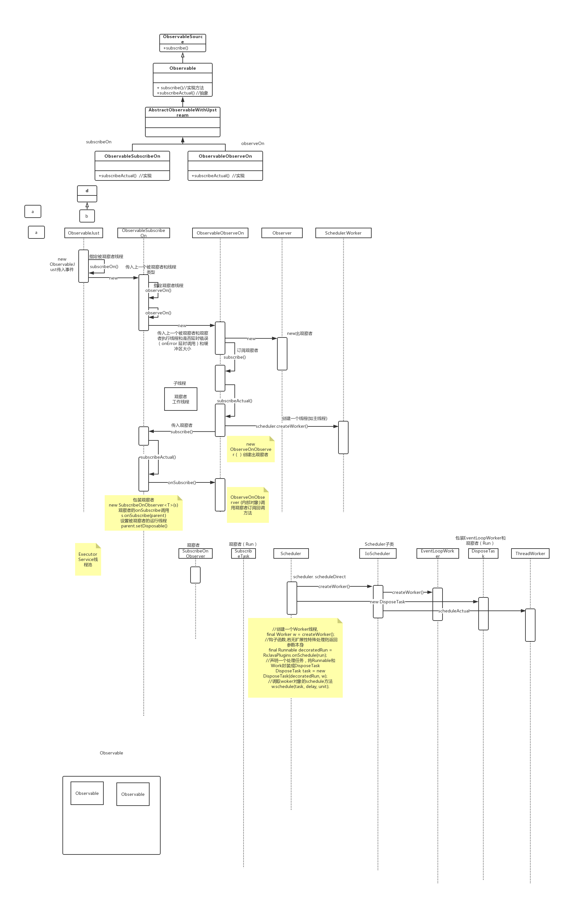

# 1、Scheduler(线程调度器)


<div align="center">
    
</div>

# 2、源码时序图


<div align="center">
    
</div>

```
      Observable.just(1)  // ObservableJust
                .subscribeOn(Schedulers.io()) // ObservableSunbscribeOn  IoScheduler
                .observeOn(AndroidSchedulers.mainThread()) // ObservableObserveOn  HandlerScheduler
                .subscribe(new Observer<Integer>() {  
                    @Override
                    public void onSubscribe(Disposable d) {
                        System.out.println("onSubscribe()");
                    }

                    @Override
                    public void onNext(Integer integer) {
                        System.out.println(integer);
                    }

                    @Override
                    public void onError(Throwable e) {

                    }

                    @Override
                    public void onComplete() {

                    }
                });
```

- ObservableObserveOn.`subscribeActual(Observer observer)`
    ```
    @Override
    protected void subscribeActual(Observer<? super T> observer) {
        if (scheduler instanceof TrampolineScheduler) {
            source.subscribe(observer);
        } else {
            Scheduler.Worker w = scheduler.createWorker();  // HandlerWorker
            // 实际调用的是ObservableSunbscribeOn.subscribe
            source.subscribe(new ObserveOnObserver<T>(observer, w, delayError, bufferSize)); 
        }
    }      
    ```
- ObservableSunbscribeOn.`subscribeActual(Observer observer)`
    ```
    @Override
    public void subscribeActual(final Observer<? super T> s) {
        final SubscribeOnObserver<T> parent = new SubscribeOnObserver<T>(s);

        s.onSubscribe(parent);
        // scheduler.scheduleDirect(new SubscribeTask(parent)) IoSchedule在子线程执行。SubscribeTask的run方法中又会执行 ObservableJust的subscribeActual方法
        // SubscribeOnObserver.setDisposable() 如果在Observer的OnSubscribe方法中可以停止    
        parent.setDisposable(scheduler.scheduleDirect(new SubscribeTask(parent)));
    }      
    ```
- ObservableJust.`subscribeActual(Observer observer)`
    ```
    @Override
    protected void subscribeActual(Observer<? super T> s) {
        ScalarDisposable<T> sd = new ScalarDisposable<T>(s, value);
        s.onSubscribe(sd);
        sd.run();
    }    
    ```
- ScalarDisposable.`run()`
    ```
    @Override
    public void run() {
        if (get() == START && compareAndSet(START, ON_NEXT)) {
            observer.onNext(value);
            if (get() == ON_NEXT) {
                lazySet(ON_COMPLETE);
                observer.onComplete();
            }
        }
    }  
    ```
- SubscribeOnObserver
    ```
    @Override
    public void onSubscribe(Disposable s) {
        DisposableHelper.setOnce(this.s, s);
    }

    @Override
    public void onNext(T t) {
        actual.onNext(t);
    }

    @Override
    public void onError(Throwable t) {
        actual.onError(t);
    }

    @Override
    public void onComplete() {
        actual.onComplete();
    }

    @Override
    public void dispose() {
        DisposableHelper.dispose(s);
        // 关闭自己的Io线程执行的任务      
        DisposableHelper.dispose(this);
    }    
    ```
- ObserveOnObserver
    ```
    @Override
    public void onSubscribe(Disposable s) {
        if (DisposableHelper.validate(this.s, s)) {
            this.s = s;
            if (s instanceof QueueDisposable) {
                @SuppressWarnings("unchecked")
                QueueDisposable<T> qd = (QueueDisposable<T>) s;

                int m = qd.requestFusion(QueueDisposable.ANY | QueueDisposable.BOUNDARY);

                if (m == QueueDisposable.SYNC) {
                    sourceMode = m;
                    queue = qd;
                    done = true;
                    actual.onSubscribe(this);
                    schedule();
                    return;
                }
                if (m == QueueDisposable.ASYNC) {
                    sourceMode = m;
                    queue = qd;
                    actual.onSubscribe(this);
                    return;
                }
            }

            queue = new SpscLinkedArrayQueue<T>(bufferSize);

            actual.onSubscribe(this);
        }
    }

    @Override
    public void onNext(T t) {
        if (done) {
            return;
        }

        if (sourceMode != QueueDisposable.ASYNC) {
            queue.offer(t);
        }
        // 在HandlerWorker中执行这个 Runnable      
        schedule();
    }

    @Override
    public void onError(Throwable t) {
        if (done) {
            RxJavaPlugins.onError(t);
            return;
        }
        error = t;
        done = true;
        schedule();
    }

    @Override
    public void onComplete() {
        if (done) {
            return;
        }
        done = true;
        schedule();
    }

    @Override
    public void dispose() {
        if (!cancelled) {
            cancelled = true;
            // 关闭ObserveOnObserver中的执行任务          
            s.dispose();
            // 关闭自己的worker执行任务          
            worker.dispose();
            if (getAndIncrement() == 0) {
                queue.clear();
            }
        }
    }
    void schedule() {
        if (getAndIncrement() == 0) {
            worker.schedule(this);
        }
    }      
    ```
