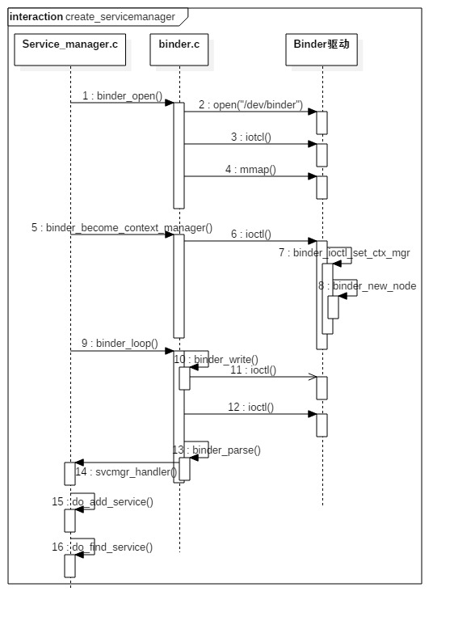

# 1.Binder是什么？

1. 从IPC角度来说
   - 定义：Binder是Android中的一种跨进程通信方式，该通信方式在linux中没有，是Android独有
   - 作用：在Android中实现跨进程通信
2. 从Android Driver层
   - 定义：Binder还可以理解为一种虚拟的物理设备，它的设备驱动是/dev/binder
   - 备注：驱动层位于Linux内核中，它提供了最底层的数据传递，对象标识，线程管理，调用过程控制等功能。驱动层是整个Binder机制的核心
3. 从Android Native层
   - 定义：Binder是创建Service Manager以及BpBinder/BBinder模型，搭建与binder驱动的桥梁
4. 从Android Framework层
   - 定义：Binder是各种Manager（ActivityManager、WindowManager等）和相应xxxManagerService的桥梁
5. 从Android APP层
   - 定义：Binder是客户端和服务端进行通信的媒介，当bindService的时候，服务端会返回一个包含了服务端业务调用的 Binder对象，
   通过这个Binder对象，客户端就可以获取服务端提供的服务或者数据，这里的服务包括普通服务和基于AIDL的服务

# 2.Binder驱动

- 源文件地址：/drivers/staging/android/binder.c
- `binder_init()`：主要是驱动设备的初始化
- `binder_open()`：打开binder驱动设备
- `binder_mmap()`：首先在内核虚拟地址空间，申请一块与用户虚拟内存相同大小的内存；然后再申请1个page大小的物理内存，
再将同一块物理内存分别映射到内核虚拟地址空间和用户虚拟内存空间，从而实现了用户空间的Buffer和内核空间的Buffer同步操作的功能。
- `binder_ioctl()`：数据操作

Binder在进程间数据通信的流程图：

当Client端与Server端发送数据时，Client（作为数据发送端）先从自己的进程空间把IPC通信数据copy_from_user拷贝到内核空间，
而Server端（作为数据接收端）与内核共享数据，不再需要拷贝数据，而是通过内存地址空间的偏移量，即可获悉内存地址，整个过程只发生一次内存拷贝

# 3.ServiceManager

1. 启动(/frameworks/native/cmds/servicemanager/service_manager.c)
   1. binder_open()打开binder驱动
      - open("/dev/binder) 通过系统调用陷入内核，打开Binder设备驱动
      - ioctl() 通过系统调用，ioctl获取binder版本信息
      - mmap() 通过系统调用，mmap内存映射
   2. binder_become_context_manager() 注册成为binder服务的大管家
      - ioctl() 成为上下文的管理者，整个系统中只有一个这样的管理者。 通过ioctl()方法经过系统调用，对应于Binder驱动层的binder_ioctl()
      方法.
   3. binder_loop() 进入无限循环，处理client端发来的请求
   4. 
2. 获取
   - 概述: 获取Service Manager是通过/frameworks/native/libs/binder/IServiceManager.cpp的defaultServiceManager()方法来完成，
   当进程注册服务(addService)或 获取服务(getService)的过程之前，都需要先调用defaultServiceManager()方法来获取gDefaultServiceManager
   对象。对于gDefaultServiceManager对象，如果存在则直接返回；如果不存在则创建该对象，创建过程包括调用open()打开binder驱动设备，利用mmap()
   映射内核的地址空间
   - defaultServiceManager
     1. `ProcessState::self()`：用于获取ProcessState对象(也是单例模式)，每个进程有且只有一个ProcessState对象，存在则直接返回，不存在则创建
     2. `getContextObject()`：用于获取BpBinder对象，对于handle=0的BpBinder对象，存在则直接返回，不存在才创建
     3. `interface_cast<IServiceManager>()`：用于获取BpServiceManager对象
   - 
3. do_add_service（） 注册服务
   1. svc_can_register() 检查权限，检查selinux权限是否满足
   2. find_svc() 服务检索，根据服务名来查询匹配的服务
   3. svcinfo_death() 释放服务，当查询到已存在同名的服务，则先清理该服务信息，再将当前的服务加入到服务列表svclist
   4. 
4. do_find_service() 查询服务
   - find_svc() 从svclist服务列表中，根据服务名遍历查找是否已经注册。当服务已存在svclist，则返回相应的服务名，否则返回NULL

# 4.framework层分析

1. 初始化(/frameworks/base/core/jni/AndroidRuntime.cpp)
   1. `startReg`：在Android系统开机过程中，Zygote启动时会有一个虚拟机注册过程，该过程调用AndroidRuntime::startReg方法来完成jni方法的注册。
   2. `register_android_os_Binder`
      1. 注册Binder：建立了Binder类在Native层与framework层之间的相互调用的桥梁
      2. 注册BinderInternal：建立了BinderInternal类在Native层与framework层之间的相互调用的桥梁
      3. 注册BinderProxy：建立了BinderProxy类在Native层与framework层之间的相互调用的桥梁

# 5.面试

## 5.1.浅谈Binder机制

1. 一个进程使用BINDER_SET_CONTEXT_MGR命令通过Binder驱动将自己注册成ServiceManager。
2. Server 向 ServiceManager 中注册 Binder（Server 中的 Binder 实体），表明可以对外提供服务。驱动为这个 Binder
创建位于内核中的实体节点以及 ServiceManager 对实体的引用，将名字以及新建的引用打包传给 ServiceManager，ServiceManger 将其填入查找表。
3. Client 通过名字，在 Binder 驱动的帮助下从 ServiceManager 中获取到对 Binder 实体的引用，通过这个引用就能实现和 Server 进程的通信。

## 5.2.为什么要使用Binder？

1. 性能方面
   - 在移动设备上（性能受限制的设备，比如要省电），广泛地使用跨进程通信对通信机制的性能有严格的要求，Binder相对出传统的Socket方式，
更加高效。Binder数据拷贝只需要一次，而管道、消息队列、Socket都需要2次，共享内存方式一次内存拷贝都不需要，但实现方式又比较复杂。
2. 安全方面
   - 传统的进程通信方式对于通信双方的身份并没有做出严格的验证，比如Socket通信ip地址是客户端手动填入，很容易进行伪造，而Binder机制从协
议本身就支持对通信双方做身份校检，因而大大提升了安全性。
