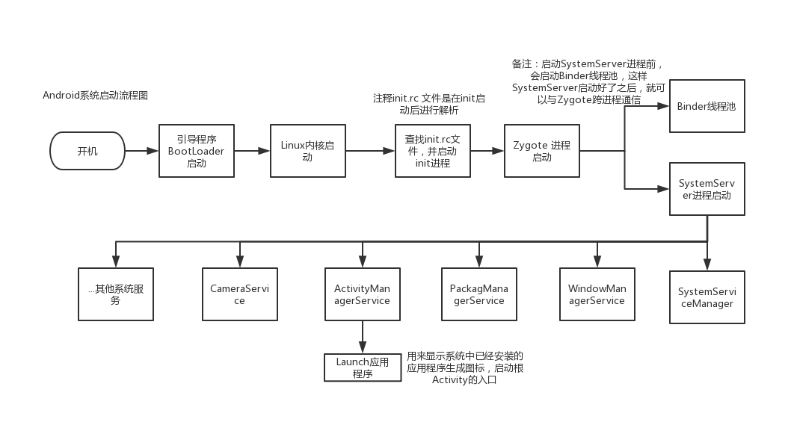
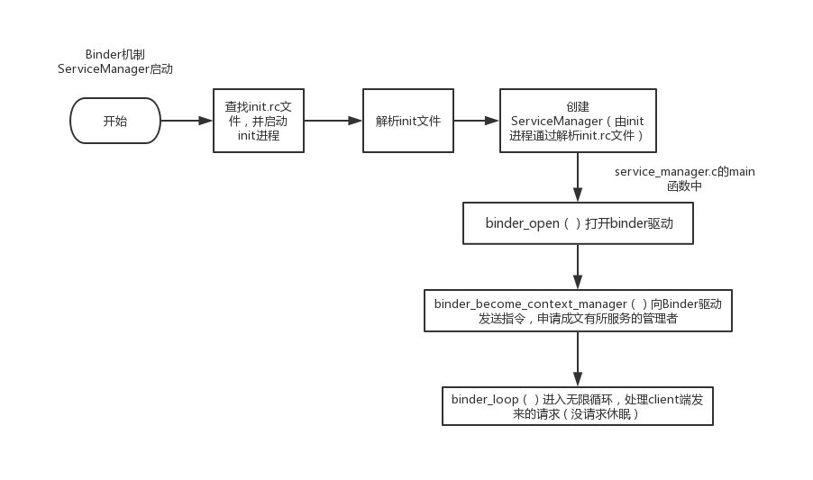
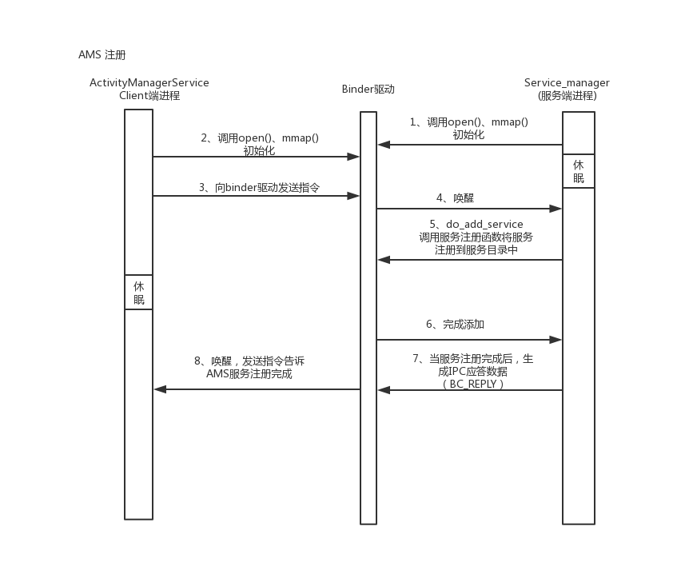
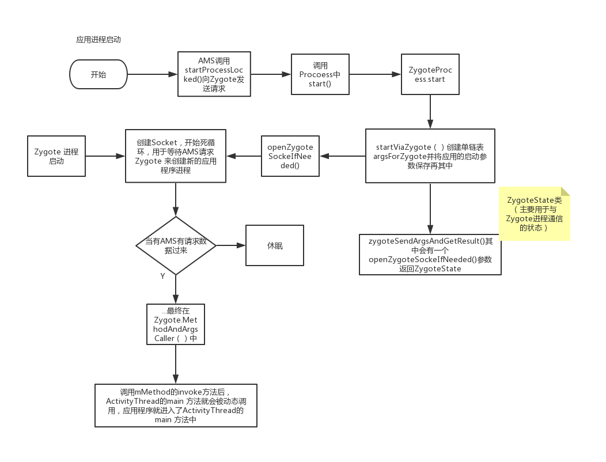
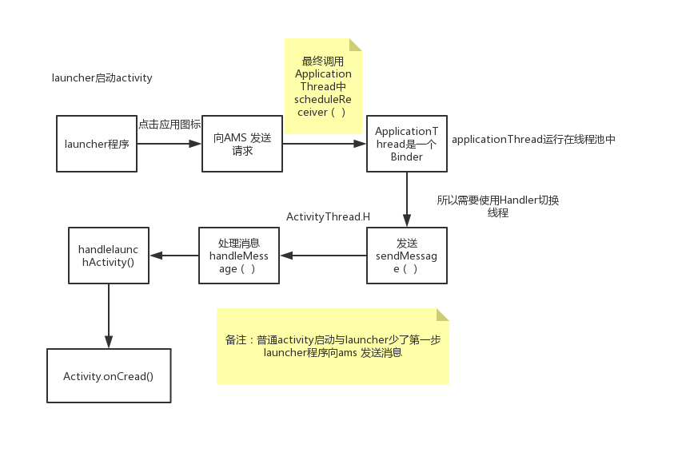
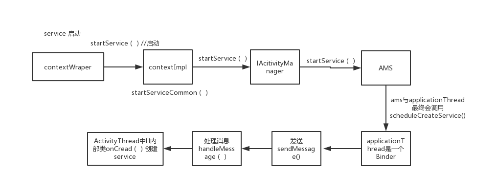
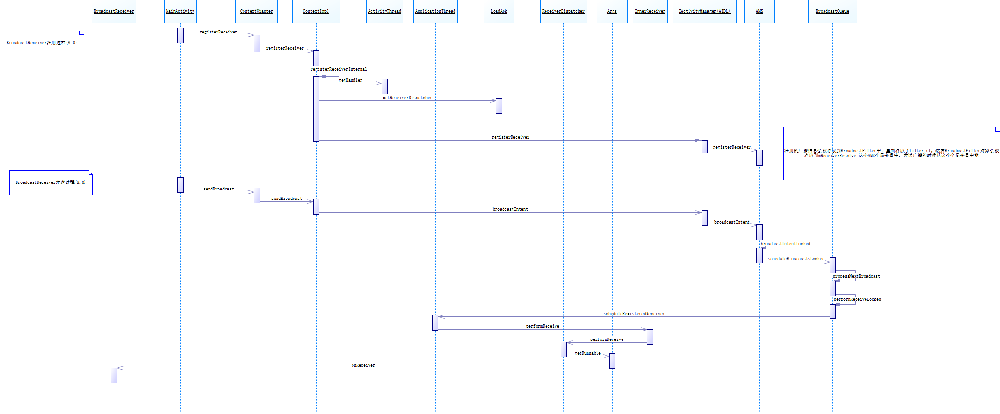
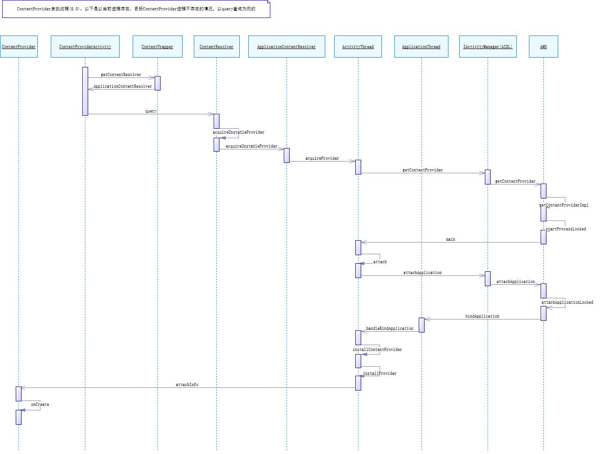

# 1.Android系统启动

init 进程启动：

- 主要工作：初始化和启动属性服务，也是用来启动Zygote进程
- 启动步骤
  1. 启动电源以及系统启动
  2. 引导程序BootLoader启动
  3. Linux内核启动
  4. init进程启动
  5. Zygote 进程启动
  6. SystemServer进程启动
  7. Launcher 启动

ServiceManager启动

# 2.AMS

AMS 如何注册的

## 2.1.应用程序的启动

## 2.2.Activity 启动

## 2.3.Service 启动

## 2.4.广播的注册，发送和接受过程

## 2.5.Content Provider 启动过程

