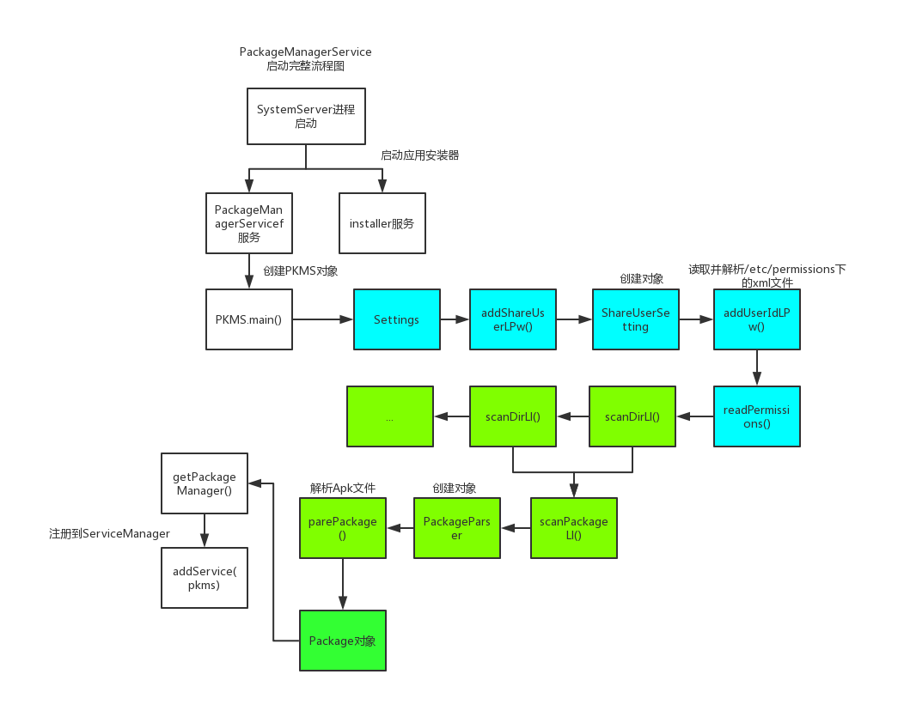

# 1.<font color=red>PKMS(PackageManagerService)作用</font>

管理着所有跟 package 相关的工作，常见的比如`安装`、`卸载`应用。

# 2.<font color=red>PKMS启动流程</font>



1. SystemServer.java(frameworks/base/services/java/com/android/server/SystemServer.java)
   - main(String[] args)
   - run()
     ```
     ...
     // 启动引导服务(installl服务、ams、pms)
     startBootstrapServices(t);
     // 启动核心服务
     startCoreServices(t);
     // 启动其它服务（wms）
     startOtherServices(t);   
     ...  
     ```
   - startBootstrapServices(...)
     ```
     ...
     // 开启Install服务
     Installer installer = mSystemServiceManager.startService(Installer.class);
     // 创建ams对象
     ActivityTaskManagerService atm = mSystemServiceManager.startService(
                ActivityTaskManagerService.Lifecycle.class).getService();
     mActivityManagerService = ActivityManagerService.Lifecycle.startService(
                mSystemServiceManager, atm);
     // 创建PKMS对象           
     mPackageManagerService = PackageManagerService.main(mSystemContext, installer,
                    mFactoryTestMode != FactoryTest.FACTORY_TEST_OFF, mOnlyCore);
     // 坚持是否第一次启动               
     mFirstBoot = mPackageManagerService.isFirstBoot();
     // 获取PackageManager
     mPackageManager = mSystemContext.getPackageManager();               
     ...                          
     ```
2. PackageManagerService.java(frameworks/base/services/core/java/com/android/server/pm/PackageManagerService.java)
   - main(...)
     ```
     ...
     // 初始化 PKMS 对象
     PackageManagerService m = new PackageManagerService(context, installer,
                factoryTest, onlyCore);
     // 将 package 服务注册到 ServiceManager中。
     ServiceManager.addService("package", m);
     ```
   - PackageManagerService(Context context, Installer installer,
            boolean factoryTest, boolean onlyCore)
     ```
     // 阶段一开始阶段
     EventLog.writeEvent(EventLogTags.BOOT_PROGRESS_PMS_START, 
                SystemClock.uptimeMillis());
     ...
     // 存储系统运行过程中的设置信息
     mSettings = new Settings(mPackages);       
     ...    
     // 将install 服务赋值到局部变量
     mInstaller = installer;
     ...
     synchronized (mPackages) {
        // 创建 Handler 线程和 handler 用于发送消息
        mHandlerThread = new ServiceThread(TAG,
            Process.THREAD_PRIORITY_BACKGROUND, true /*allowIo*/);
        mHandlerThread.start();
        mHandler = new PackageHandler(mHandlerThread.getLooper());
        ...
        // 创建各种目录，用于存放app的文件      
        File dataDir = Environment.getDataDirectory();
        mAppInstallDir = new File(dataDir, "app");
        mAppLib32InstallDir = new File(dataDir, "app-lib");
        mAsecInternalPath = new File(dataDir, "app-asec").getPath();
        mDrmAppPrivateInstallDir = new File(dataDir, "app-private");    
        // 创建用户管理服务   
        sUserManager = new UserManagerService(context, this,
                    new UserDataPreparer(mInstaller, mInstallLock, mContext, mOnlyCore), mPackages);      
        ...
        // 获取共享库   
        ArrayMap<String, String> libConfig = systemConfig.getSharedLibraries();
        ...
        if (TextUtils.isEmpty(customResolverActivity)) {   
            customResolverActivity = null;
        } else {
            mCustomResolverComponentName = ComponentName.unflattenFromString(
                        customResolverActivity);
        }
        // 总结：构造函数在第一阶段的工作，主要是扫描并解析 ，
        // XML 文件，将其中的信息保存到特定的数据结构中。    
        
        // 第二阶段 扫描系统阶段  
        long startTime = SystemClock.uptimeMillis();           
        ...
        // 在/system 中创建 framework 目录   
        File frameworkDir = new File(Environment.getRootDirectory(), "framework");
        ...
        // 扫描 /vendor/overlay 目录下的文件
        scanDirTracedLI(new File(VENDOR_OVERLAY_DIR), mDefParseFlags
                    | PackageParser.PARSE_IS_SYSTEM
                    | PackageParser.PARSE_IS_SYSTEM_DIR
                    | PackageParser.PARSE_TRUSTED_OVERLAY, scanFlags | SCAN_TRUSTED_OVERLAY, 0);
        // 扫描 /system/framework 目录下的文件              
        scanDirTracedLI(frameworkDir, mDefParseFlags
                    | PackageParser.PARSE_IS_SYSTEM
                    | PackageParser.PARSE_IS_SYSTEM_DIR
                    | PackageParser.PARSE_IS_PRIVILEGED,
                    scanFlags | SCAN_NO_DEX, 0);
        // 扫描 /system/priv-app 目录下的文件                                                                                 
        // 扫描 /system/app 目录下的文件                                                                                 
        // 扫描 /vendor/app 目录下的文件                                                                                 
        // 扫描 /oem/app 目录下的文件
        ...
        // 总结：创建/system的子目录，比如/system/framework、system/priv-app和/system/app等等
        // 扫描系统文件，比如/vendor/overlay、/system/framework、/system/app等等目录下的文件，对扫描到的系统文件做后续处理。   
           
        // 阶段三 扫描Data分区阶段 
        if (!mOnlyCore) {
            ...   
        }
        ...
        mCompilerStats.read();
        // 总结：Data分区阶段主要做了以下几件事情
        // 1. 扫描/data/app和/data/app-private目录下的文件
        // 2. 遍历possiblyDeletedUpdatedSystemApps列表，
            如果这个系统App的包信息不在PMS的变量mPackages中，
            说明是残留的App信息，后续会删除它的数据。
            说明是存在于Data分区，不属于系统App，那么移除其系统权限。
        // 3. 遍历mExpectingBetter列表，根据系统App所在的
                目录设置扫描的解析参数，内部会将
                 packageName对应的包设置数据（PackageSetting）添加到
                mSettings的mPackages中。扫描系统App的升级包，
                 最后清除mExpectingBetter列表。
     
        // 阶段四 扫描结束阶段   
        EventLog.writeEvent(EventLogTags.BOOT_PROGRESS_PMS_SCAN_END,
                SystemClock.uptimeMillis());
        ...              
        mSettings.writeLPr();
        Trace.traceEnd(TRACE_TAG_PACKAGE_MANAGER);
        // 总结：扫描结束后主要做了以下几件事情
        // 1. 如果当前平台SDK版本和上次启动时的SDK版本不同，重新更新APK的授权
        // 2. 如果是第一次启动或者是Android M升级后的第一次启动，需要初始化所有用户定义的默认首选App。
        // 3. OTA升级后的第一次启动，会清除代码缓存目录。
        // 4. 把Settings的内容保存到packages.xml中，这样此后PMS再次创建时会读到此前保存的Settings的内容。             
        
        // 阶段五：准备阶段      
        EventLog.writeEvent(EventLogTags.BOOT_PROGRESS_PMS_READY,
                SystemClock.uptimeMillis()); 
        ...
        // 创建 PackageInstallerService 用于管理安装会话的服务 
        mInstallerService = new PackageInstallerService(context, this);                                                                                                                
     }   
     ```

具体分析下构造方法...

1. 第一阶段：主要是扫描并解析 ，XML 文件，将其中的信息保存到特定的数据结构中。
2. 第二阶段：扫描系统文件
   - 创建/system的子目录，比如/system/framework、system/priv-app和/system/app等等
     - scanDirTracedLI(...) --> scanDirLI() --> scanPackageLI() --> PackageParser --> parsePackage() --> Package对象
   - 扫描系统文件，比如/vendor/overlay、/system/framework、/system/app等等目录下的文件，对扫描到的系统文件做后续处理。
   - /system/frameworks：该目录中的文件都是系统库，例如：framework.jar、services.jar、framework-res.apk。不过 scanDirLI 只扫描APK文件，所以 framework-res.apk 是该目录中唯一“受宠”的文件。
    该目录下全是默认的系统应用，例如：Browser.apk、SettingsProvider.apk 等。
    /vendor/app：该目录中的文件由厂商提供，即厂商特定的 APK 文件，不过目前市面上的厂商都把自己的应用放在 /system/app 目录下。
3. 第三阶段：扫描Data分区阶段
   - 扫描/data/app和/data/app-private目录下的文件
   - 遍历possiblyDeletedUpdatedSystemApps列表，
    如果这个系统App的包信息不在PMS的变量mPackages中，
    说明是残留的App信息，后续会删除它的数据。
    说明是存在于Data分区，不属于系统App，那么移除其系统权限。
   - 遍历mExpectingBetter列表，根据系统App所在的
    目录设置扫描的解析参数，内部会将
     packageName对应的包设置数据（PackageSetting）添加到
    mSettings的mPackages中。扫描系统App的升级包，
     最后清除mExpectingBetter列表。
4. 第四阶段：扫描结束阶段
   - 如果当前平台SDK版本和上次启动时的SDK版本不同，重新更新APK的授权
   - 如果是第一次启动或者是Android M升级后的第一次启动，需要初始化所有用户定义的默认首选App。
   - OTA升级后的第一次启动，会清除代码缓存目录。
   - 把Settings的内容保存到packages.xml中，这样此后PMS再次创建时会读到此前保存的Settings的内容。
5. 第五阶段：准备阶段
   - 创建 PackageInstallerService 用于管理安装会话的服务

