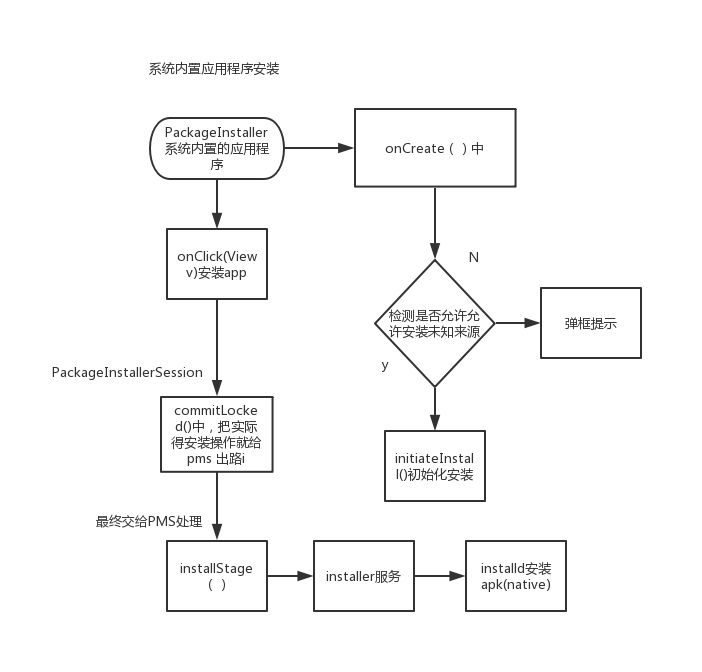
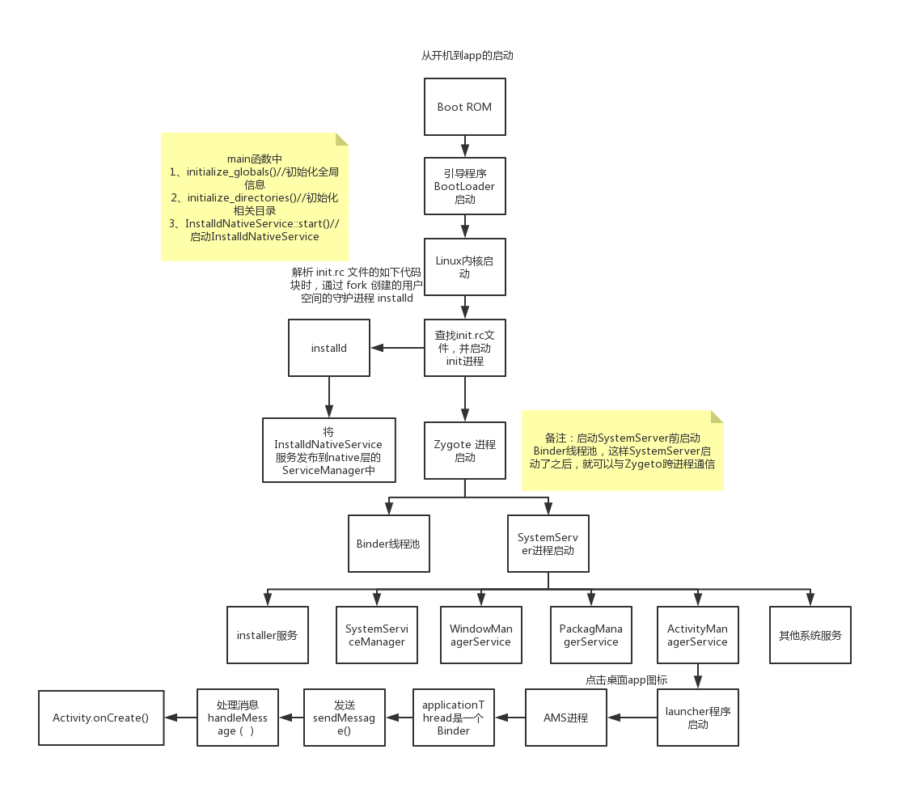

# 1.<font color=red>PKMS(PackageManagerService)作用</font>

管理着所有跟 package 相关的工作，常见的比如`安装`、`卸载`应用。

# 2.<font color=red>PKMS启动流程</font>


1. SystemServer.java(frameworks/base/services/java/com/android/server/SystemServer.java)
   - main(String[] args)
   - run()
     ```
     ...
     // 启动引导服务(installl服务、ams、pms)
     startBootstrapServices(t);
     // 启动核心服务
     startCoreServices(t);
     // 启动其它服务（wms）
     startOtherServices(t);   
     ...  
     ```
   - startBootstrapServices(...)
     ```
     ...
     // 开启Install服务
     Installer installer = mSystemServiceManager.startService(Installer.class);
     // 创建ams对象
     ActivityTaskManagerService atm = mSystemServiceManager.startService(
                ActivityTaskManagerService.Lifecycle.class).getService();
     mActivityManagerService = ActivityManagerService.Lifecycle.startService(
                mSystemServiceManager, atm);
     // 创建PKMS对象           
     mPackageManagerService = PackageManagerService.main(mSystemContext, installer,
                    mFactoryTestMode != FactoryTest.FACTORY_TEST_OFF, mOnlyCore);
     // 检测是否第一次启动               
     mFirstBoot = mPackageManagerService.isFirstBoot();
     // 获取PackageManager
     mPackageManager = mSystemContext.getPackageManager();               
     ...                          
     ```
2. PackageManagerService.java(frameworks/base/services/core/java/com/android/server/pm/PackageManagerService.java)
   - main(...)
     ```
     ...
     // 初始化 PKMS 对象
     PackageManagerService m = new PackageManagerService(context, installer,
                factoryTest, onlyCore);
     // 将 package 服务注册到 ServiceManager中。
     ServiceManager.addService("package", m);
     ```
   - PackageManagerService(Context context, Installer installer,
            boolean factoryTest, boolean onlyCore)
     ```
     // 阶段一开始阶段
     EventLog.writeEvent(EventLogTags.BOOT_PROGRESS_PMS_START, 
                SystemClock.uptimeMillis());
     ...
     // 存储系统运行过程中的设置信息
     mSettings = new Settings(mPackages);       
     ...    
     // 将install 服务赋值到局部变量
     mInstaller = installer;
     ...
     synchronized (mPackages) {
        // 创建 Handler 线程和 handler 用于发送消息
        mHandlerThread = new ServiceThread(TAG,
            Process.THREAD_PRIORITY_BACKGROUND, true /*allowIo*/);
        mHandlerThread.start();
        mHandler = new PackageHandler(mHandlerThread.getLooper());
        ...
        // 创建各种目录，用于存放app的文件      
        File dataDir = Environment.getDataDirectory();
        mAppInstallDir = new File(dataDir, "app");
        mAppLib32InstallDir = new File(dataDir, "app-lib");
        mAsecInternalPath = new File(dataDir, "app-asec").getPath();
        mDrmAppPrivateInstallDir = new File(dataDir, "app-private");    
        // 创建用户管理服务   
        sUserManager = new UserManagerService(context, this,
                    new UserDataPreparer(mInstaller, mInstallLock, mContext, mOnlyCore), mPackages);      
        ...
        // 获取共享库   
        ArrayMap<String, String> libConfig = systemConfig.getSharedLibraries();
        ...
        if (TextUtils.isEmpty(customResolverActivity)) {   
            customResolverActivity = null;
        } else {
            mCustomResolverComponentName = ComponentName.unflattenFromString(
                        customResolverActivity);
        }
        // 总结：构造函数在第一阶段的工作，主要是扫描并解析 ，
        // XML 文件，将其中的信息保存到特定的数据结构中。    
        
        // 第二阶段 扫描系统阶段  
        long startTime = SystemClock.uptimeMillis();           
        ...
        // 在/system 中创建 framework 目录   
        File frameworkDir = new File(Environment.getRootDirectory(), "framework");
        ...
        // 扫描 /vendor/overlay 目录下的文件
        scanDirTracedLI(new File(VENDOR_OVERLAY_DIR), mDefParseFlags
                    | PackageParser.PARSE_IS_SYSTEM
                    | PackageParser.PARSE_IS_SYSTEM_DIR
                    | PackageParser.PARSE_TRUSTED_OVERLAY, scanFlags | SCAN_TRUSTED_OVERLAY, 0);
        // 扫描 /system/framework 目录下的文件              
        scanDirTracedLI(frameworkDir, mDefParseFlags
                    | PackageParser.PARSE_IS_SYSTEM
                    | PackageParser.PARSE_IS_SYSTEM_DIR
                    | PackageParser.PARSE_IS_PRIVILEGED,
                    scanFlags | SCAN_NO_DEX, 0);
        // 扫描 /system/priv-app 目录下的文件                                                                                 
        // 扫描 /system/app 目录下的文件                                                                                 
        // 扫描 /vendor/app 目录下的文件                                                                                 
        // 扫描 /oem/app 目录下的文件
        ...
        // 总结：创建/system的子目录，比如/system/framework、system/priv-app和/system/app等等
        // 扫描系统文件，比如/vendor/overlay、/system/framework、/system/app等等目录下的文件，对扫描到的系统文件做后续处理。   
           
        // 阶段三 扫描Data分区阶段 
        if (!mOnlyCore) {
            ...   
        }
        ...
        mCompilerStats.read();
        // 总结：Data分区阶段主要做了以下几件事情
        // 1. 扫描/data/app和/data/app-private目录下的文件
        // 2. 遍历possiblyDeletedUpdatedSystemApps列表，
            如果这个系统App的包信息不在PMS的变量mPackages中，
            说明是残留的App信息，后续会删除它的数据。
            说明是存在于Data分区，不属于系统App，那么移除其系统权限。
        // 3. 遍历mExpectingBetter列表，根据系统App所在的
                目录设置扫描的解析参数，内部会将
                 packageName对应的包设置数据（PackageSetting）添加到
                mSettings的mPackages中。扫描系统App的升级包，
                 最后清除mExpectingBetter列表。
     
        // 阶段四 扫描结束阶段   
        EventLog.writeEvent(EventLogTags.BOOT_PROGRESS_PMS_SCAN_END,
                SystemClock.uptimeMillis());
        ...              
        mSettings.writeLPr();
        Trace.traceEnd(TRACE_TAG_PACKAGE_MANAGER);
        // 总结：扫描结束后主要做了以下几件事情
        // 1. 如果当前平台SDK版本和上次启动时的SDK版本不同，重新更新APK的授权
        // 2. 如果是第一次启动或者是Android M升级后的第一次启动，需要初始化所有用户定义的默认首选App。
        // 3. OTA升级后的第一次启动，会清除代码缓存目录。
        // 4. 把Settings的内容保存到packages.xml中，这样此后PMS再次创建时会读到此前保存的Settings的内容。             
        
        // 阶段五：准备阶段      
        EventLog.writeEvent(EventLogTags.BOOT_PROGRESS_PMS_READY,
                SystemClock.uptimeMillis()); 
        ...
        // 创建 PackageInstallerService 用于管理安装会话的服务 
        mInstallerService = new PackageInstallerService(context, this);                                                                                                                
     }   
     ```

具体分析下构造方法...

1. 第一阶段：主要是扫描并解析 packages.xml 文件，将其中的信息保存到特定的数据结构中mSetting。
2. 第二阶段：扫描系统文件
   - 创建/system的子目录，比如/system/framework、system/priv-app和/system/app等等
     - scanDirTracedLI(...) --> scanDirLI() --> scanPackageLI() --> PackageParser --> parsePackage() --> Package对象
   - 扫描系统文件，比如/vendor/overlay、/system/framework、/system/app等等目录下的文件，对扫描到的系统文件做后续处理。
   - /system/frameworks：该目录中的文件都是系统库，例如：framework.jar、services.jar、framework-res.apk。不过 scanDirLI 只扫描APK文件，所以 framework-res.apk 是该目录中唯一“受宠”的文件。
    该目录下全是默认的系统应用，例如：Browser.apk、SettingsProvider.apk 等。
    /vendor/app：该目录中的文件由厂商提供，即厂商特定的 APK 文件，不过目前市面上的厂商都把自己的应用放在 /system/app 目录下。
3. 第三阶段：扫描Data分区阶段
   - 扫描/data/app和/data/app-private目录下的文件
   - 遍历possiblyDeletedUpdatedSystemApps列表，
    如果这个系统App的包信息不在PMS的变量mPackages中，
    说明是残留的App信息，后续会删除它的数据。
    说明是存在于Data分区，不属于系统App，那么移除其系统权限。
   - 遍历mExpectingBetter列表，根据系统App所在的
    目录设置扫描的解析参数，内部会将
     packageName对应的包设置数据（PackageSetting）添加到
    mSettings的mPackages中。扫描系统App的升级包，
     最后清除mExpectingBetter列表。
4. 第四阶段：扫描结束阶段
   - 如果当前平台SDK版本和上次启动时的SDK版本不同，重新更新APK的授权
   - 如果是第一次启动或者是Android M升级后的第一次启动，需要初始化所有用户定义的默认首选App。
   - OTA升级后的第一次启动，会清除代码缓存目录。
   - 把Settings的内容保存到packages.xml中，这样此后PMS再次创建时会读到此前保存的Settings的内容。
5. 第五阶段：准备阶段
   - 创建 PackageInstallerService 用于管理安装会话的服务

# 3.installer服务

在systemserver中installer服务作为一个重要服务在：startBootstrapServices中启动

# 4.installd进程

- 创建
   - installd 是由 Android 系统的 init 进程(pid=1)，在解析 init.rc 文件的如下代码块时，通过 fork 创建的用户空间的守护进程 installd
- 启动
   - installd 是随着系统启动过程中 installd.cpp main class 而启动的，并且会。并启动InstalldNativeService服务发布到native层的ServiceManager中，通过IPC机制跟上层的 installer服务进行交互。

1. installd.cpp(\frameworks\native\cmds\installd)

   - main(..)
     ```
     int main(const int argc, char *argv[]) {
         return android::installd::installd_main(argc, argv);
     }
     ```
   - installd_main(...)
     ```
     ...
     // 初始化全局信息
     if (!initialize_globals()) {
         SLOGE("Could not initialize globals; exiting.\n");
         exit(1);
     }
     // 初始化相关目录
     if (initialize_directories() < 0) {
         SLOGE("Could not create directories; exiting.\n");
         exit(1);
     }

     ...
     // 启动 InstalldNativeService
     if ((ret = InstalldNativeService::start()) != android::OK) {
         SLOGE("Unable to start InstalldNativeService: %d", ret);
         exit(1);
     }

     ```
2. InstalldNativeService.cpp(\frameworks\native\cmds\installd)
   - start()
     ```
        status_t InstalldNativeService::start() {
            IPCThreadState::self()->disableBackgroundScheduling(true);
            // 将 InstalldNativeService 服务发布到 native 层的 ServiceManager 中       
            status_t ret = BinderService<InstalldNativeService>::publish();
            if (ret != android::OK) {
                return ret;
            }
            sp<ProcessState> ps(ProcessState::self());
            ps->startThreadPool();
            ps->giveThreadPoolName();
            return android::OK;
        }     
     ```


# 5.<font color=red>系统内置应用程序安装app</font>
从应用平台下下载的apk文件安装。



1. PackageInstallerActivity(\package\apps\PackageInstaller\src\com\android\packageinstaller)
   - onCreate(...)
     ```
     ...
     // 检查是否允许安装未知来源应用
     checkIfAllowedAndInitiateInstall();
     ```
   - checkIfAllowedAndInitiateInstall()
     ```
     ...
     // 如果运行安装未知来源 或者 不是来自未知来源的应用
     if (mAllowUnknownSources || !isInstallRequestFromUnknownSource(getIntent())) {
         // 初始化安装
         initiateInstall();
     } else {
        // 弹窗
         ...
     }   
     ```
   - initiateInstall()
   - startInstallConfirm()
   - onClick() // 不和上面的有联系，只是安装的时候是从OnClick进入的
   - startInstall()
2. InstallInstalling.class(\package\apps\PackageInstaller\src\com\android\packageinstaller)
   - onResume()
     ```
     mInstallingTask = new InstallingAsyncTask();
     mInstallingTask.execute();
     ```
3. InstallInstalling$InstallingAsyncTask.class
   - onPostExecute()
     ```
     session.commit(pendingIntent.getIntentSender());
     ```
4. PackageInstaller$Session.class
   ```
   mSession.commit(statusReceiver, true);
   ```
5. PackageInstallerSession.java
   - commit()
   - commitLocked()
     ```
     ...
     // mPm就是PackageManagerService，也是说最终还是通过pms进行安装的
     mPm.installStage(mPackageName, stageDir, stageCid, localObserver, params,
                mInstallerPackageName, mInstallerUid, user, mCertificates);
     ```
6. PackageManagerService.java(frameworks/base/services/core/java/com/android/server/pm/PackageManagerService.java)
   - installStage()安装

# 6.APP 启动流程



