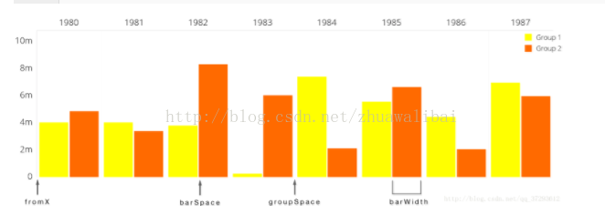

#<center>MPAndroidChart-BarChart(柱状图)<center>

```
	MPAndroidChart:Android上强大图表工具
```
[官方文档说明](https://weeklycoding.com/mpandroidchart-documentation/)

## Barchart(柱状图)

`barChart.groupBars(1f, groupSpace, barSpace);//最关键，分组柱状图一定要增加这个配置，且要在setData之后调用否则会程序崩溃`


`//关键： (barWidth + barSpace) * 2 + groupSpace = 1.00 -> interval per "group" 一定要等于1,乘以2是表示每组有两个数据`

<font color=red size = 4>barChart.groupBars后，所有的说一句的X值无效  
xAxis.setAxisMinimum(1);// 最小值最好从 1f 开始，否则会崩溃  
xAxis.setAxisMaximum(6);//关键：差值为x轴数据个数，也是y轴数据的组数  </font>


### 常用方法说明:
``` kotlin
        barChart.animateXY(800,1000) //动画
        barChart.setExtraOffsets(0f,0f,0f,10f) //设置图表的偏移量
        barChart.minOffset = 0f //为BarChart左右设置填充 默认是15f
        barChart.setNoDataText("好像没有数据")
        barChart.description.isEnabled = false //禁用描述
        barChart.setTouchEnabled(false) //不允许用户触摸
        //设置左边Y轴
        val axisLeft = barChart.axisLeft
        axisLeft.isEnabled = true
        barChart.axisRight.isEnabled = false
        axisLeft.setDrawAxisLine(false)//不画左边Y轴的坐标轴
        axisLeft.setDrawLabels(false)//不画左边Y周的lables
        axisLeft.setDrawGridLines(true) // 画垂直于Y轴的线
        axisLeft.gridColor = Color.parseColor("#e3e3e3")//设置Y轴的网格线颜色
        axisLeft.spaceTop = 30f  //设置图表中的最高值的顶部间距占最高值的值的百分比（设置的百分比 = 最高柱顶部间距/最高柱的值）。默认值是10f，即10% 。

        //设置X轴
        val xAxis = barChart.xAxis
        xAxis.axisLineColor = Color.parseColor("#e3e3e3")//x轴颜色
        xAxis.textColor = Color.parseColor("#484848")//x轴lable的颜色
        xAxis.textSize = 8f//x轴lable的字体大小  单位dp。
        xAxis.valueFormatter = barChartValueFormatter//x轴的lable自定义f
        xAxis.setCenterAxisLabels(true)//x轴lable居中
        xAxis.setDrawGridLines(false) //不画锤子x轴的网格线
        xAxis.position = XAxis.XAxisPosition.BOTTOM //设置X轴的位置及lable的在x轴的里外
        xAxis.setAvoidFirstLastClipping(false)//避免“剪掉”在x轴上的图表或屏幕边缘的第一个和最后一个坐标轴标签项。
        xAxis.axisMaximum = 13f //设置该轴的最大值。 如果设置了，这个值将不会是根据提供的数据计算出来的。
        xAxis.axisMinimum = 1f  //设置该轴的自定义最小值。 如果设置了，这个值将不会是根据提供的数据计算出来的。
        xAxis.isGranularityEnabled = true
        xAxis.granularity = 1f  //x轴最小密度是1f
        xAxis.setCenterAxisLabels(true) //lable 居中
//        xAxis.labelRotationAngle = 90f //设置画x坐标lable时的方向
//        xAxis.xOffset = 3f
        xAxis.setLabelCount(13,false) // 设置y轴的标签数量。 请注意，这个数字是不固定 if(force == false)，只能是近似的。 如果 if(force == true)，
                                            // 则确切绘制指定数量的标签，但这样可能导致轴线分布不均匀。

        //设置legend 图例
        val legend = barChart.legend
        legend.horizontalAlignment = Legend.LegendHorizontalAlignment.RIGHT //在最右边
        legend.verticalAlignment = Legend.LegendVerticalAlignment.TOP //在最顶部
        legend.orientation = Legend.LegendOrientation.HORIZONTAL //图例 水平摆放
        legend.textColor = Color.parseColor("#7e7e7e") //设置图例标签的颜色。
        legend.textSize = 9f //设置图例标签的大小 单位dp
        legend.formToTextSpace = 5f //设置 legend-form 和 legend-label 之间的空间。单位dp。
        legend.formSize = 3f //设置 legend-forms 的大小，单位dp。
        legend.setDrawInside(false) //图例会知道chart的外面
``` 
### BarData设置说明: 
``` kotlin
        //设置数据(如果分组的话会覆盖掉x值)
        val groupSpace = 0.64f
        val barSpace = 0.03f // x4 DataSet
        val barWidth = 0.2f // x4 DataSet
        var barEntity = BarEntry(1f, 20.3f)   //bardata.groupBars分组的第一组
        var barEntity1 = BarEntry(2f, 40.3f)
        var barEntity2 = BarEntry(3f, 60.3f)
        var barEntity3 = BarEntry(4f, 10.3f)
        var barEntity31 = BarEntry(12f, 10.3f)

        var barEntity4 = BarEntry(5f, 10.3f) //bardata.groupBars分组的第一组
        var barEntity5 = BarEntry(4f, 80.3f)
        var barEntity6 = BarEntry(3f, 50.3f)
        var barEntity61 = BarEntry(12f, 50.3f)

        var barEntity7 = BarEntry(4f, 40.3f)  //bardata.groupBars分组的第一组
        var barEntity8 = BarEntry(3f, 10.3f)
        var barEntity9 = BarEntry(2f, 100.3f)
        var barEntity91 = BarEntry(12f, 100.3f)

//        var barEntity = BarEntry(changeX(1f,0), 20.3f)
//        var barEntity1 = BarEntry(changeX(2f,0), 40.3f)
//        var barEntity2 = BarEntry(changeX(3f,0), 60.3f)
//        var barEntity3 = BarEntry(changeX(4f,0), 10.3f)
//        var barEntity31 = BarEntry(changeX(5f,0), 10.3f)
//
//        var barEntity4 = BarEntry(changeX(5f,1), 10.3f)
//        var barEntity5 = BarEntry(changeX(4f,1), 80.3f)
//        var barEntity6 = BarEntry(changeX(3f,1), 50.3f)
//        var barEntity61 = BarEntry(changeX(12f,1), 50.3f)
//
//        var barEntity7 = BarEntry(changeX(4f,2), 40.3f)
//        var barEntity8 = BarEntry(changeX(3f,2), 10.3f)
//        var barEntity9 = BarEntry(changeX(2f,2), 100.3f)
//        var barEntity91 = BarEntry(changeX(12f,2), 100.3f)
        var bardata = BarData()
        var barDataSet1 = BarDataSet(listOf(barEntity, barEntity1, barEntity2, barEntity3,barEntity31), "空调")
        barDataSet1.color = Color.parseColor("#1d6359")
        var barDataSet2 = BarDataSet(listOf(barEntity4, barEntity5, barEntity6,barEntity61), "灯光")
        barDataSet2.color = Color.parseColor("#42b39a")
        var barDataSet3 = BarDataSet(listOf(barEntity7, barEntity8, barEntity9,barEntity91), "其它")
        barDataSet3.color = Color.parseColor("#73c382")
        bardata.addDataSet(barDataSet1)
        bardata.addDataSet(barDataSet2)
        bardata.addDataSet(barDataSet3)
        bardata.barWidth = 0.1f //设置bar的宽度
        bardata.groupBars(1f, groupSpace, barSpace) //设置开头,每组的间距,每组内bar的间距(请仔细算算这个间距),组所处的x坐标位置已经被重写
```

```
    private fun setBarChartSetting(chart: BarChart, list: MutableList<AnalyzeBarChartBean>?) {
        var listLabel = courseList.toMutableList()
        if (!list.isNullOrEmpty()) {
            listLabel.clear()
            list.forEach {
                listLabel.add(it.label)
            }
        }

        chart.isScaleYEnabled = false
        chart.setDrawBarShadow(false)
        chart.setDrawValueAboveBar(true)

        chart.description.isEnabled = false

        // if more than 60 entries are displayed in the chart, no values will be
        // drawn

        // if more than 60 entries are displayed in the chart, no values will be
        // drawn
        chart.setMaxVisibleValueCount(60)

        // scaling can now only be done on x- and y-axis separately

        // scaling can now only be done on x- and y-axis separately
        chart.setPinchZoom(false)

        chart.setDrawGridBackground(false)
        // chart.setDrawYLabels(false);

        // chart.setDrawYLabels(false);
//        val xAxisFormatter: ValueFormatter =
//            DayAxisValueFormatter(chart)

        val xAxis = chart.xAxis
        xAxis.position = XAxisPosition.BOTTOM
        xAxis.setDrawGridLines(false)
        xAxis.granularity = 1f // only intervals of 1 day
        xAxis.setCenterAxisLabels(true)// 保证标签在小组中间

//        if (list.isNullOrEmpty())
//            xAxis.labelCount = courseList.size + 1
//        else
//            xAxis.labelCount = list.size + 1
        xAxis.valueFormatter = object : ValueFormatter() {
            override fun getFormattedValue(value: Float): String {
                // 这一步很重要 一定要减一 不然 x轴标签不对
                return listLabel[(if(value.toInt()-1 < 0) 0 else value.toInt()-1) % listLabel.size]
            }
        }

        xAxis.axisMinimum = 1f
        xAxis.axisMaximum = listLabel.size.toFloat()+1  // 和最小值相减 差值为 x轴数据的个数
//        xAxis.valueFormatter = xAxisFormatter
//
//        val custom: ValueFormatter = object : ValueFormatter() {}("$")

        val leftAxis = chart.axisLeft
        leftAxis.setLabelCount(8, false)
        //  leftAxis.valueFormatter = custom
        leftAxis.gridColor = Color.parseColor("#CDCDCD")
        leftAxis.setPosition(YAxisLabelPosition.OUTSIDE_CHART)
        leftAxis.spaceTop = 15f
        leftAxis.axisMinimum = 0f // this replaces setStartAtZero(true)


        val rightAxis = chart.axisRight
        rightAxis.setDrawGridLines(false)
        rightAxis.setLabelCount(8, false)
        //  rightAxis.valueFormatter = custom
        rightAxis.spaceTop = 15f
        rightAxis.axisMinimum = 0f // this replaces setStartAtZero(true)
        rightAxis.isEnabled = false

        val l = chart.legend
        l.verticalAlignment = Legend.LegendVerticalAlignment.BOTTOM
        l.horizontalAlignment = Legend.LegendHorizontalAlignment.LEFT
        l.orientation = Legend.LegendOrientation.HORIZONTAL
        l.setDrawInside(false)
        l.form = LegendForm.SQUARE
        l.formSize = 9f
        l.textSize = 11f
        l.xEntrySpace = 4f
        l.isEnabled = false
    }

    private fun setData(chart: BarChart, list: MutableList<AnalyzeBarChartBean>?) {
    
        float groupSpace = 0.2f;
        float barSpace = 0.08f; // x4 DataSet
        float barWidth = 0.32f; // x4 DataSet
        if(list.isNullOrEmpty())
            return

        val listEntry1 = ArrayList<BarEntry>()
        val listEntry2 = ArrayList<BarEntry>()
        for((i,it) in list.withIndex()){
            listEntry1.add(BarEntry(i+1.toFloat(),if(it.workSubmitNum == null)0f else it.workSubmitNum.toFloat()))
            listEntry2.add(BarEntry(i+1.toFloat(),if(it.workTotalNum == null)0f else it.workTotalNum.toFloat()))
        }
        val set1: BarDataSet = BarDataSet(listEntry1, "T提交数")
        val set2: BarDataSet = BarDataSet(listEntry2, "作业数")
        set1.color = mContext.resources.getColor(R.color.green1)
        set2.color = mContext.resources.getColor(R.color.color_collection_of_classes)
        val data = BarData(set1, set2)
//        data.setValueTextSize(10f)
//        data.barWidth = 0.9f
        data.barWidth = barWidth
        chart.data = data
        chart.groupBars(1f, groupSpace, barSpace)
        chart.invalidate()
    }
```

