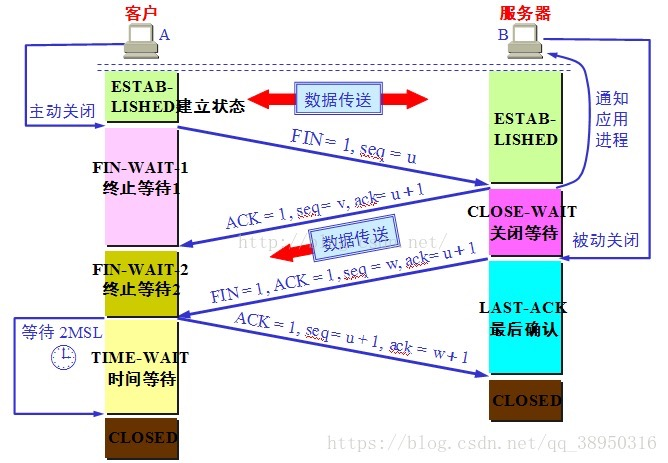

@[TOC]（Java网络编程基础)

## TCP/IP协议家族  
《图解Http》《Http权威指南》《Java网络编程基础》  
HTTP，FTP，DNS，TCP，UDP，IP等等  
OSI七层协议：应用层，表示层，会话层，传输层，网络层，数据链路层，物理层  
TCP三次握手（建立连接）和四次挥手（断开连接）  

通俗点：  

1.  你能听到吗？  
2. 我能听到，你能听到吗？  
3. 我能听到，bilibili  

为什么要三次握手：为了防止已失效的连接请求报文段突然又传送到了服务端，因而产生错误。

通俗点：  

1. 我想挂了  
2. 好，我还有一句话没说完  
3. 挂了  
4. 挂了  

## Http请求：他们之间通信是以报文的形式  
客户端请求（Request）：请求报文 = 请求头 + 空行 + 请求数据  
Accept: 客户端可以处理的数据格式  
Cookie：服务端的之前给我们的Cookie  

服务端响应（Response）：响应报文 = 响应头 + 空行 + 响应数据  
Status Code 响应状态码  
Content-Type: 响应返回的类型 （文本，utf-8）图片等等  
Set-Cookie：服务端给我们的Cookie，要保存起来，下次带过去  

## Cookie 、Session、Token
1. 都是用来做持久化处理的，目的就是让客户端和服务端相互认识。Http请求默认是不持久的没有状态的，谁也不认识谁
2. Cookie: 是存放在客户端的信息，这个信息是来自于服务器返回的信息，
下次请求带过去，如果用户离开网站后，如果Cookie已过期一般是会被清楚的。如果Cookie没过期下次访问网站还是会带过去。（相对危险）
3. Session: 是存放在服务器上面的客户端临时信息，用户离开网站是会被清除的。（相对安全，耗资源）

4. Token（App）"令牌"：用户身份的验证，有点类似于 Cookie ，相对来说更安全，一般流程  
           4.1.客户端像服务端申请 Token  
      4.2. 服务端收到请求，会去验证用户信息,签发一个 Token 给客户端，自己保存 Token  
      4.3. 客户端收到 Token 会保存起来，每次请求带上 Token   
      4.4. 服务器收到其他请求，会去验证客户端的 Token , 如果成功返回数据，不成功啥都不给  

## Http缓存
Cache-Control（缓存策略）：Public、private、no-cache、max-age 、no-store（不缓存）
  
Expires（缓存的过期策略）：指名了缓存数据有效的绝对时间，告诉客户端到了这个时间点（比照客户端时间点）后本地缓存就作废了，

在这个时间点内客户端可以认为缓存数据有效，可直接从缓存中加载展示。
https://mp.weixin.qq.com/s/qOMO0LIdA47j3RjhbCWUEQ

如果有缓存并且过期了那么发起请求，那么服务端会给我们数据？（不一定会给）服务器的数据没有变动就不会给，状态码会变为 304 ，自己拿之前过期的缓存

 

      
     
 

