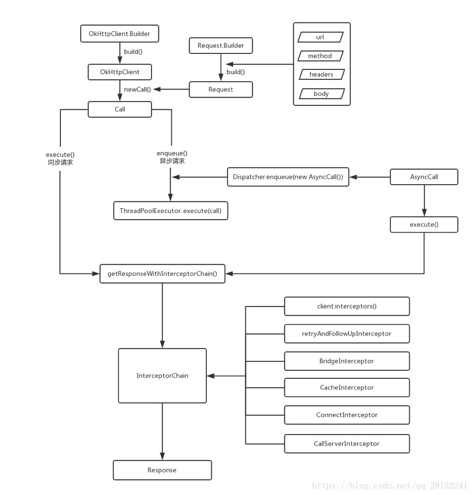

@[TOC]（上传进度监听和自定义缓存)

getResponseWithInterceptorChain() 请求Request -> Response

## RetryAndFollowUpInterceptor
处理重试的一个拦截器，会去处理一些异常，只要不是致命的异常就会重新发起一次请求（把Request给下级），如果是致命的异常就会抛给上一级；
会处理一些重定向等等，比如 3XX 307、407 就会从头部中获取新的路径，生成一个新的请求交给下一级（重新发起一次请求）

## BridgeInterceptor
做一个简单的处理，设置一些通用的请求头，Content-Type Connection Content-Length Cookie
做一些返回的处理，如果返回的数据被压缩了采用 ZipSource , 保存 Cookie 

## CacheInterceptor
在缓存可用的情况下，读取本地的缓存的数据，如果没有直接去服务器，如果有首先判断有没有缓存策略，然后判断有没有过期，如果没有过期直接拿缓存，如果过期了需要添加一些之前头部信息如：If-Modified-Since ，这个时候后台有可能会给你返回 304 代表你还是可以拿本地缓存，每次读取到新的响应后做一次缓存。

## ConnectInterceptor
findHealthyConnection() 找一个连接，首先判断有没有健康的，没有就创建（建立Scoket,握手连接），连接缓存
得到一条结论：OkHttp 是基于原生的 Socket + okio（原生IO的封装）
封装 HttpCodec 里面封装了 okio 的 Source（输入） 和 Sink (输出)，我们通过 HttpCodec 
就可以操作 Socket的输入输出，我们就可以像服务器写数据和读取返回数据

## CallServerInterceptor
写数据和读取数据
写头部信息，写body表单信息等等

## 连接三个核心类（连接复用）
RealConnection、ConnectionPool、StreamAllocation

- RealConnection: 建立连接的一个对象的封装
- ConnectionPool：保存了连接
- StreamAllocation: 找一些连接，做一下封装

 

      
     
 

