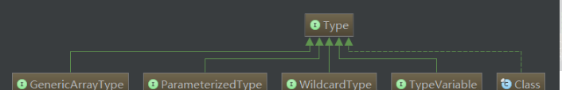

@[TOC]（反射、注解和泛型) 

# 反射

作用：能够做一般做不到的事情。使用场景：插件式换肤 ，插件式开发  apk(没有安装插件) 
所有的反射功能都是基于我们字节码（class），一个类的 class 在内存中应该只有一份，而且 class 其实也是一个对象 Class

1. 获取构造函数
class.getDeclaredConstructor()
2. 获取方法
class.getDeclaredMethod()
3. 获取属性
class.getDeclaredFiled()

#注解

注解只是一个标识（标记），没有具体的功能逻辑代码。
butterknife 用了反射没有？ 用了 1 （new 对象的时候），没有 2  Class.fromName().newInstance();

通过反射和注解去 findViewById 

# 泛型

[你真的了解泛型吗](https://blog.csdn.net/f641385712/article/details/88789847)

&emsp;&emsp;（从左到右）依次是：GenericArrayType（数组类型）、ParameterizedType（参数化类型）、WildcardType（ 泛型表达式类型）、TypeVariable（类型变量）、Class（原始/基本类型）

- Class（原始/基本类型，也叫raw type）：不仅仅包含我们平常所指的类、枚举、数组、注解，还包括基本类型int、float等等
- TypeVariable（类型变量）：比如List<T>中的T等
- WildcardType（ 泛型表达式类型）：例如List< ? extends Number>这种
- ParameterizedType（参数化类型）：就是我们平常所用到的泛型List、Map（注意和TypeVariable的区别）
- GenericArrayType（数组类型）：并不是我们工作中所使用的数组String[] 、byte[]（这种都属于Class），而是带有泛型的数组，即T[] 泛型数组

List<T ? entends>[]：这里的List就是ParameterizedType，T就是TypeVariable，T ? entends就是WildcardType（注意，WildcardType不是Java类型，而是一个表达式），整个List<T ? entends>[]就是GenericArrayType

类泛型 在任何地方出现的，代表的是统一类型 

方法泛型

泛型的上限

泛型的下限

// 05. 编译时注解 - ButterKnife使用和源码分析

 

      
     
 

