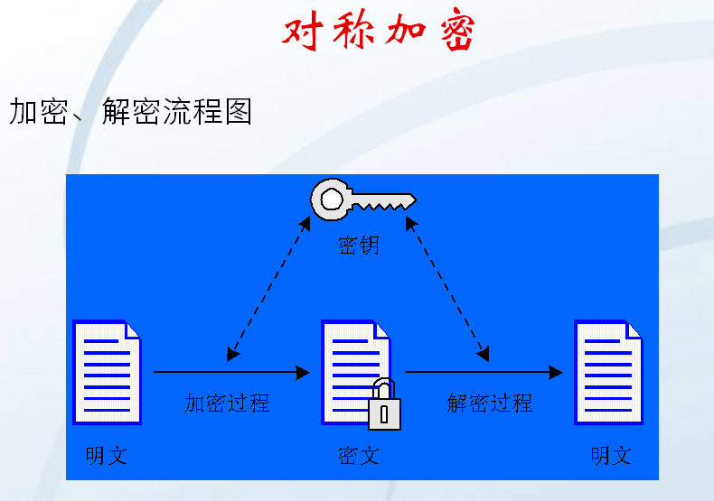
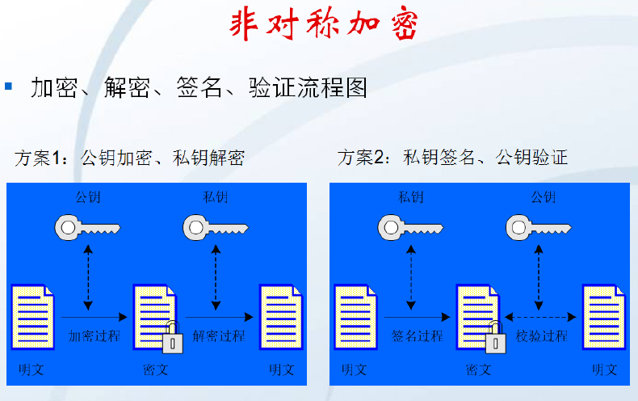
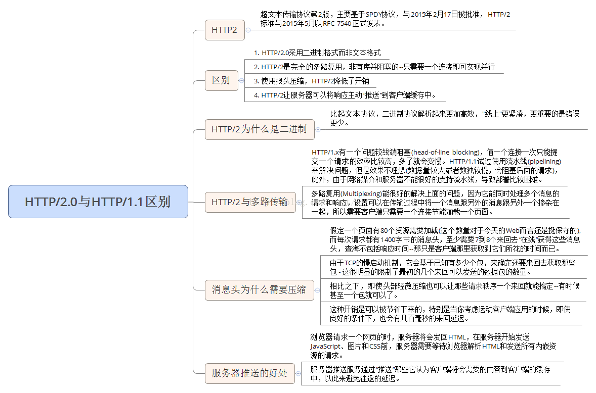

@[TOC]（整体架构和源码分析)

## HTTP状态码：

- 1xx:  Infomational (信息状态码) ，接收的请求正在处理
- 2xx:  Succeed(成功)，请求正常处理完毕,如 200
- 3xx:  Redirection(重定向)，需要进行附加操作，一般是没有响应数据返回的，如 304（Not,modified）307 
- 4xx: Client Error (客户端的错误)，服务器无法处理请求，如 404
- 5xx: Server Error (服务端的错误)，服务器处理请求出错，如 500

## Http 和 Https 的区别：
Https = Http + 加密 + 验证 + 完整

端口：Http (80)  Https (443)

Http 的缺点：  

1. 数据是没有加密传输，可能遭遇窃听
2. 不验证通信方的身份，可能会遭遇伪装
3. 无法验证报文的完整性，可能会遭遇篡改

TLS/SSL 协议：  
加密：对称加密（AES，DES） + 非对称加密 (RSA，DSA)  

证书：要钱（便宜），建立连接的速度会拖慢，TCP  3 次握手，8 次握手

## Http 1.x 和 Http 2.0 的区别
1. Http 2.0 采用二进制格式而非文本格式
2. Http 2.0 支持完全的多路复用
3. Http 2.0 使用报头压缩，降低开销
4. Http 2.0 让服务器将响应主动推送给客户端，（带内容推送，不带内容推送的通知）


## 异步和同步
跟线程没什么关系，打电话
同步：打电话 -> 处理（没挂断） -> 反馈
异步：打电话 -> 处理（挂断）-> 打回来

## 整体架构和源码分析
### 自己如果要写一个框架你要怎么处理

1. 网络是耗时，开线程，new Thread() ?  线程池
2. 处理网络，HttpUrlConnection(简单) 或者  输入流+Socket(麻烦)
3. 网络请求头信息处理，缓存的处理，文件格式上次的方式（表单提交，拼格式）
4. 路由的一些操作，Http 2.0 复用 等等

### OkHttp 大致内容 Okio，Socket
okio：原生的JavaIO + 自定义封装 ，其实就是对于 io 的封装 
Socket 连接 
拦截器

### 走一下大致流程
原版：官方介绍文档 （基础）+ 项目实践验证 + 自己阅读源码   
`RealCall` 里面的 `enqueue`    
`AsyncCall` 是 `RealCall` 的内部类，给了 OKhttp 的 Dispatcher  

``` java
1.synchronized void enqueue(AsyncCall call) {  
2.    // 判断当前正在执行的任务数量，最大是 64 ，正在执行的任务中的 host , 最大是 5   
3.    if (runningAsyncCalls.size() < maxRequests && runningCallsForHost(call) <   maxRequestsPerHost) {  
4.      // 加入到正在执行  
5.      runningAsyncCalls.add(call);  
6.      // 线程池，  
7.      executorService().execute(call);  
8.    } else {  
9.      // 加入准备执行的集合，等待执行  
10.      readyAsyncCalls.add(call);  
11.    }  
12.  }
```  

executorService().execute(call); 最终去了哪里？来了 AsyncCall.execute()方法，
执行 getResponseWithInterceptorChain 返回 Response


 


      
     
 

